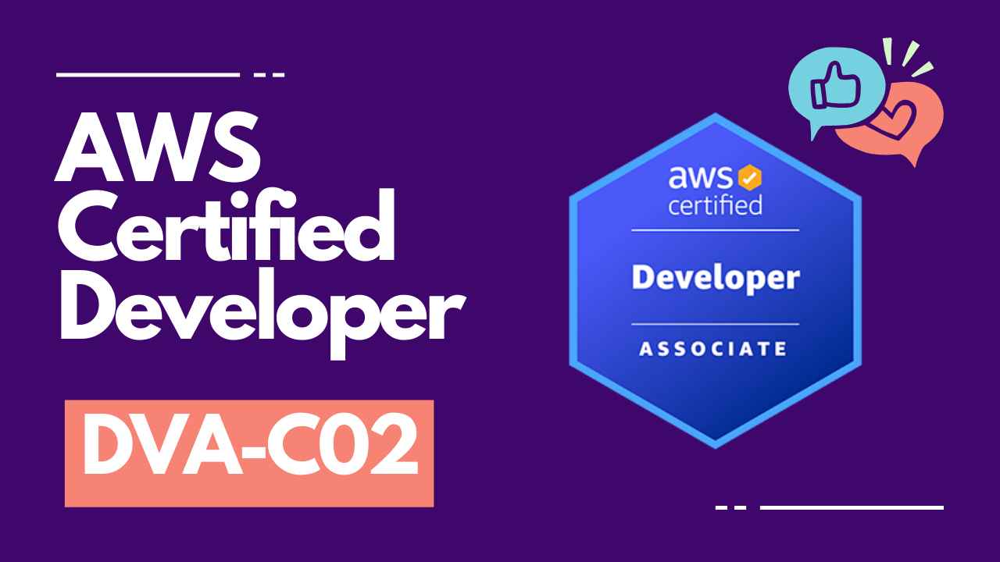

# AWS Certified Developer - Associate Exam Preparation

Merhaba! AWS Certified Developer - Associate sertifika sınavına hazırlanmanıza ve bu sınavı geçmenize yardımcı olacak bu GitHub reposuna hoş geldiniz.

Ben Fatih Es, 2023 yılından bu yana AWS Certified Solutions Architect – Associate sertifikasyonuna sahip Full Stack Softwate Engineer'ım. Bu repo kapsamında AWS Certified Developer - Associate sınavına hazırlanırken aldığım notlar yer almaktadır. Umarım bu sınavlara hazırlanan veya bulut dünyasına girmek isteyen kişilere yol gösterici bir kaynak olur.

AWS Certified Developer - Associate sertifikası, AWS hizmetlerini kullanarak uygulamalar geliştirme, test etme, dağıtma ve hata ayıklama konusunda bilgi ve aynı zamanda deneyime sahip bir geliştirici rolündeki bireyler için tasarlanmıştır. AWS, bu sınava girecek adayların AWS hizmetlerini kullanarak uygulama geliştirme ve bakım yapma konusunda en az 1 yıllık gerçek hayat deneyime sahip olmasını önermektedir. Bu repo, Şubat 2023'te yayımlanan AWS Certified Developer - Associate sertifikasyon sınavının (DVA-C02) en son sürümüne hazırlanırken ihtiyaç duyacağınız bilgileri size sağlamayı hedeflemektedir.

# İçerik

- 🗂️ DVA-C02 Kurs Tanıtımı
     - 📁 [Giriş](./intro.md)
     - 📁 [Sıvav Yapısı](./exam-logistics.md)
- 🗂️ [Compute](./compute.md)
    - 📁 [AWS'de (compute) hesaplama nedir?](./compute.md#awsde-compute-hesaplama-nedir)
    - 📁 [Amazon EC2: Elastic Compute Cloud](./compute.md#amazon-ec2-elastic-compute-cloud)
        - 📄 [AMI : Amazon Machine Images](./compute.md#ami--amazon-machine-images)
        - 📄 [Instance Türleri (Instance Types)](./compute.md#instance-türleri-instance-types)
        - 📄 [Instance Satın Alma Seçenekleri (Instance Purchasing Options)](./compute.md#instance-satın-alma-seçenekleri-instance-purchasing-options)
        - 📄 [Kiralama (Tenancy)](./compute.md#kullanıcı-verileri-user-data)
        - 📄 [Kullanıcı Verileri (User Data)](./compute.md#kullanıcı-verileri-user-data)
        - 📄 [Depolama seçenekleri (Storage Options)](./compute.md#depolama-seçenekleri-storage-options)
    - 📁 [EC2 Otomatik Ölçeklendirme (Auto Scaling)](./compute.md#ec2-otomatik-ölçeklendirme-auto-scaling)
        - 📄 [EC2 Auto Scaling Bileşenleri](./compute.md#ec2-auto-scaling-bileşenleri)
        - 📄 [Auto Scaling Policies (Otomatik Ölçeklendirme Poliçeleri)](./compute.md#auto-scaling-policies-otomatik-ölçeklendirme-poliçeleri)
    - 📁 [AWS Elastik Beanstalk Nedir?](./compute.md#aws-elastik-beanstalk-nedir)
    - 📁 [AWS Lambda'ya Genel Bakış](./compute.md#aws-lambdaya-genel-bakış)
    - 📁 [AWS Serverless Application (AWS SAM) Nedir?](./compute.md#aws-serverless-application-aws-sam-nedir)
    -  📁 [Ölçme Testi: Compute (DVA-C02)](./knowledge-check-compute.md)
- 🗂️ [Storage](./storage.md)
    -  📁 [Amazon S3'e Genel Bakış (Overview of Amazon S3)](./storage.md#amazon-s3e-genel-bakış-overview-of-amazon-s3)
        - 📄 [S3 Depolama Sınıfları (S3 Storage Classes)](./storage.md#s3-depolama-sınıfları-s3-storage-classes)
        - 📄 [Versiyonlama - Sürüm Oluşturma (Versioning)](./storage.md#versiyonlama---sürüm-oluşturma-versioning)
        - 📄 [Sunucu Erişimi Log Kayıtları (Server-Access Logging)](./storage.md#sunucu-erişimi-log-kayıtları-server-access-logging)
        - 📄 [Nesne Düzeyinde Log Kaydı (Object-Level Logging)](./storage.md#nesne-düzeyinde-log-kaydı-object-level-logging)
        - 📄 [Transfer Hızlandırma (Transfer Acceleration)](./storage.md#transfer-hızlandırma-transfer-acceleration)
        - 📄 [Erişimi Denetlemek İçin Poliçeleri Kullanma (Using Policies to Control Access)](./storage.md#erişimi-denetlemek-i̇çin-poliçeleri-kullanma-using-policies-to-control-access)
        - 📄 [S3 ile Çapraz Kaynak Kaynak Paylaşımı (CORS: Cross Origin Resource Sharing with S3)](./storage.md#s3-ile-çapraz-kaynak-kaynak-paylaşımı-cors-cross-origin-resource-sharing-with-s3)
    -  📁 [Sunucu Tarafı Şifreleme Mekanizmalarına Genel Bakış (Overview of Server-Side Encryption Mechanisms)](./storage.md#sunucu-tarafı-şifreleme-mekanizmalarına-genel-bakış-overview-of-server-side-encryption-mechanisms)
        - 📄 [SSE-S3](./storage.md#sse-s3)
        - 📄 [SSE-KMS](./storage.md#sse-kms)
        - 📄 [SSE-C](./storage.md#sse-c)
    -  📁 [İstemci Tarafı Şifrelemeye Genel Bakış (Overview of Client-Side Encryption)](./storage.md#i̇stemci-tarafı-şifrelemeye-genel-bakış-overview-of-client-side-encryption)
    - 📁 [Yaşam Döngüsü Yapılandırmaları (Lifecycle Configurations)](./storage.md#yaşam-döngüsü-yapılandırmaları-lifecycle-configurations)
        - 📄 [Yaşam Döngüsü Bileşenleri (Components of a Lifecycle Configuration)](./storage.md#yaşam-döngüsü-bileşenleri-components-of-a-lifecycle-configuration)
    - 📁 [Amazon Elastic Block Store (EBS)](./storage.md#amazon-elastic-block-store-ebs)
    - 📁 [Amazon Elastic File System (EFS)](./storage.md#amazon-elastic-file-system-efs)
    - 📁 [Blok, Nesne ve Dosya Depolama Karşılaştırması (Block vs. Object vs. File Storage)](./storage.md#blok-nesne-ve-dosya-depolama-karşılaştırması-block-vs-object-vs-file-storage)
        - 📄 [Blok Depolama (Block Storage)](./storage.md#blok-depolama-block-storage)
        - 📄 [Nesne Depolama (Object Storage)](./storage.md#nesne-depolama-object-storage)
        - 📄 [Dosya Depolama (File Storage)](./storage.md#dosya-depolama-file-storage)
    - 📁 [Ölçme Testi: Storage (DVA-C02)](./knowledge-check-storage.md)
- 🗂️ [Database](./database.md)
    - 📁 [Amazon DynamoDB Nedir (What Is Amazon DynamoDB) ?](./database.md#amazon-dynamodb-nedir-what-is-amazon-dynamodb-)
        - 📄 [DynamoDB Temel Özellikleri (DynamoDB Key Features)](./database.md#dynamodb-temel-özellikleri-dynamodb-key-features)
        - 📄 [DynamoDB Terminolojisi (DynamoDB Terminology)](./database.md#dynamodb-terminolojisi-dynamodb-terminology)
        - 📄 [DynamoDB'yi Diğer Veritabanlarıyla Karşılaştırma (Comparing DynamoDB to Other Databases)](./database.md#dynamodbyi-diğer-veritabanlarıyla-karşılaştırma-comparing-dynamodb-to-other-databases)
        - 📄 [DynamoDB ile Etkileşim Kurma (Interacting with DynamoDB)](./database.md#dynamodb-ile-etkileşim-kurma-interacting-with-dynamodb)
        - 📄 [DynamoDB Performansı (DynamoDB Performance)](./database.md#dynamodb-performansı-dynamodb-performance)
        - 📄 [Bölümlemeye Giriş (Introduction to Partitioning)](./database.md#bölümlemeye-giriş-introduction-to-partitioning)
    - 📁 [Amazon İlişkisel Veritabanı Hizmeti (Amazon Relational Database Service)](./database.md#amazon-i̇lişkisel-veritabanı-hizmeti-amazon-relational-database-service)
        - 📄 [Amazon RDS Proxy Nedir (What is Amazon RDS Proxy) ?](./database.md#amazon-rds-proxy-nedir-what-is-amazon-rds-proxy-)
        - 📄 [Amazon Aurora Yüksek Kullanılabilirlik Seçenekleri (Amazon Aurora High Availability Options)](./database.md#amazon-aurora-yüksek-kullanılabilirlik-seçenekleri-amazon-aurora-high-availability-options)
        - 📄 [Performansın Önemi (The Importance of Performance)](./database.md#performansın-önemi-the-importance-of-performance)
        - 📄 [Performansın Önemi (The Importance of Performance)](./database.md#performansın-önemi-the-importance-of-performance)
    - 📁 [Önbelleğe Alma Nedir (What is Caching) ?](./database.md#önbelleğe-alma-nedir-what-is-caching-)
        - 📄 [ElastiCache Genel Bakış (ElastiCache Overview)](./database.md#elasticache-genel-bakış-elasticache-overview)
        - 📄 [Amazon MemoryDB for Redis](./database.md#amazon-memorydb-for-redis)
    - 📁 [AWS'de İlişkisel Veritabanı Seçme (Choosing a Relational Database on AWS)](./database.md#awsde-i̇lişkisel-veritabanı-seçme-choosing-a-relational-database-on-aws)
    - 📁 [AWS'de İlişkisel Olmayan Veritabanı Seçme (Choosing a Non-Relational Database on AWS)](./database.md#awsde-i̇lişkisel-olmayan-veritabanı-seçme-choosing-a-non-relational-database-on-aws)
    - 📁 [Ölçme Testi: Database (DVA-C02)](./knowledge-check-database.md)
- 🗂️ [Networking and Content Delivery](./networking-and-content-delivery.md)
    - 📁 [VPC nedir (What is a VPC) ?](./networking-and-content-delivery.md#vpc-nedir-what-is-a-vpc-)
        - 📄 [Ağ Erişim Kontrol Listeleri (NACLs: Network Access Control Lists)](./networking-and-content-delivery.md#ağ-erişim-kontrol-listeleri-nacls-network-access-control-lists)
        - 📄 [Güvenlik Grupları (Security Groups)](./networking-and-content-delivery.md#güvenlik-grupları-security-groups)
        - 📄 [NAT Gateway](./networking-and-content-delivery.md#nat-gateway)
    - 📁 [Amazon CloudFront](./networking-and-content-delivery.md#amazon-cloudfront)
    - 📁 [Amazon Route 53](./networking-and-content-delivery.md#amazon-route-53)
        - 📄 [Amazon Route 53 ve DNS Kayıtları (DNS Records)](./networking-and-content-delivery.md#amazon-route-53-ve-dns-kayıtları-dns-records)
        - 📄 [Amazon Route 53 Sağlık Kontrolleri (Health Checks)](./networking-and-content-delivery.md#amazon-route-53-sağlık-kontrolleri-health-checks)
        - 📄 [Amazon Route 53 Yönlendirme Politikaları (Routing Policies)](./networking-and-content-delivery.md#amazon-route-53-yönlendirme-politikaları-routing-policies)
        - 📄 [Amazon Route 53 Trafik Akışı (Traffic Flow)](./networking-and-content-delivery.md#amazon-route-53-trafik-akışı-traffic-flow)
        - 📄 [Amazon Route 53 Resolver (Çözümleyici)](./networking-and-content-delivery.md#amazon-route-53-resolver-çözümleyici)
        - 📄 [Uygulama Kurtarma Denetleyicisi (Application Recovery Controller)](./networking-and-content-delivery.md#uygulama-kurtarma-denetleyicisi-application-recovery-controller)
    - 📁 [API Nedir (What is an API)?](./networking-and-content-delivery.md#api-nedir-what-is-an-api)
        - 📄 [HTTP ve İnternet İletişimine Hızlı Bir Bakış (A Quick Overview of HTTP and Internet Communication)](./networking-and-content-delivery.md#http-ve-i̇nternet-i̇letişimine-hızlı-bir-bakış-a-quick-overview-of-http-and-internet-communication)
        - 📄 [HTTP ve REST Arasındaki Fark (The Difference Between HTTP and REST)](./networking-and-content-delivery.md#http-ve-rest-arasındaki-fark-the-difference-between-http-and-rest)
    - 📁 [API Gateway](./networking-and-content-delivery.md#api-gateway)
        - 📄 [Desteklenen Protokoller (Supported Protocols)](./networking-and-content-delivery.md#desteklenen-protokoller-supported-protocols)
        - 📄 [API Ağ Geçidi Yetkilendiricisi (API Gateway Authorizer)](./networking-and-content-delivery.md#api-ağ-geçidi-yetkilendiricisi-api-gateway-authorizer)
        - 📄 [API Gateway Güvenliği (API Gateway Secuirty)](./networking-and-content-delivery.md#api-gateway-güvenliği-api-gateway-secuirty)
        - 📄 [API Yönetimi ve Kullanımı (API Management and Usage)](./networking-and-content-delivery.md#api-yönetimi-ve-kullanımı-api-management-and-usage)
        - 📄 [Yanıtlarınızı Önbelleğe Alma (Caching Your Responses)](./networking-and-content-delivery.md#yanıtlarınızı-önbelleğe-alma-caching-your-responses)
        - 📄 [Metrikler ve İzleme (Metrics and Monitoring)](./networking-and-content-delivery.md#metrikler-ve-i̇zleme-metrics-and-monitoring)
        - 📄 [HTTP vs REST API](./networking-and-content-delivery.md#http-vs-rest-api)
    - 📁 [Elastic Load Balancer (ELB)](./networking-and-content-delivery.md#elastic-load-balancer-elb)
    - 📁 [SSL Sunucu Sertifikaları (SSL Server Certificates)](./networking-and-content-delivery.md#ssl-sunucu-sertifikaları-ssl-server-certificates)
    - 📁 [Application Load Balancers (ALB)](./networking-and-content-delivery.md#application-load-balancers-alb)
    - 📁 [Network Load Balancers](./networking-and-content-delivery.md#network-load-balancers)
    - 📁 [Gateway Load Balancer](./networking-and-content-delivery.md#gateway-load-balancer)
    - 📁 [Ölçme Testi: Networking and Content Delivery (DVA-C02))](./knowledge-check-networking-and-content-delivery.md)
- 🗂️ [Analytics](./analytics.md)
    - 📁 [Amazon Kinesis](./analytics.md#amazon-kinesis)
        - 📄 [Akış İşlemenin Temelleri (Fundamentals of Stream Processing)](./analytics.md#akış-i̇şlemenin-temelleri-fundamentals-of-stream-processing)
        - 📄 [Streaming Framework](./analytics.md#streaming-framework)
        - 📄 [Kinesis Veri Akışının Öğeleri (The Elements of a Kinesis Data Stream)](analytics.md#kinesis-veri-akışının-öğeleri-the-elements-of-a-kinesis-data-stream)
        - 📄 [Shard Kapasitesi ve Ölçeklendirme (Shard Capacity and Scaling)](analytics.md#shard-kapasitesi-ve-ölçeklendirme-shard-capacity-and-scaling)
        - 📄 [Kinesis Veri Akışındaki Veriler (Data in a Kinesis Data Stream)](analytics.md#kinesis-veri-akışındaki-veriler-data-in-a-kinesis-data-stream)
        - 📄 [Kinesis Veri Akışı Güvenliği (Kinesis Data Streams Security)](analytics.md#kinesis-veri-akışı-güvenliği-kinesis-data-streams-security)
        - 📄 [Gerçek Zamanlı Mesajlaşma ve Kinesis Veri Akışları (Real-Time Messaging and Kinesis Data Streams)](analytics.md#gerçek-zamanlı-mesajlaşma-ve-kinesis-veri-akışları-real-time-messaging-and-kinesis-data-streams)
    - 📁 [Kinesis Data Firehose](./analytics.md#kinesis-data-firehose)
    - 📁 [Amazon OpenSearch Service](./analytics.md#amazon-opensearch-service)
    - 📁 [Amazon Athena](./analytics.md#amazon-athena)
    - 📁 [Ölçme Testi: Analytics (DVA-C02)](./knowledge-check-analytics.md)
- 🗂️ [Management and Governance](./management_and_governance.md)
    - 📁 [CloudWatch](./management_and_governance.md#cloudwatch)
        - 📄 [CloudWatch Kontrol Paneli (CloudWatch Dashboard)](./management_and_governance.md#cloudwatch-kontrol-paneli-cloudwatch-dashboard)
        -  📄 [Anormallik Tespiti (Anomaly Detection)](./management_and_governance.md#anormallik-tespiti-anomaly-detection)
        - 📄 [CloudWatch Abonelikleri (CloudWatch Subscriptions)](./management_and_governance.md#cloudwatch-abonelikleri-cloudwatch-subscriptions)
    - 📁 [CloudTrail](./management_and_governance.md#cloudtrail)
        - 📄 [CloudTrail Kullanmanın Faydaları (The Benefits of Using CloudTrail)](./management_and_governance.md#cloudtrail-kullanmanın-faydaları-the-benefits-of-using-cloudtrail)
        - 📄 [CloudTrail İzinlerini Yönetme (Managing CloudTrail Permissions)](./management_and_governance.md#cloudtrail-i̇zinlerini-yönetme-managing-cloudtrail-permissions)
        - 📄 [CloudTrail Olay Log Dosyaları (CloudTrail Event Log Files)](./management_and_governance.md#cloudtrail-olay-log-dosyaları-cloudtrail-event-log-files)
        - 📄 [AWS CloudTrail Log Dosyalarını İzlemek için Amazon CloudWatch'tan Yararlanma (Leveraging Amazon CloudWatch to Monitor AWS CloudTrail Log Files)](./management_and_governance.md#aws-cloudtrail-log-dosyalarını-i̇zlemek-için-amazon-cloudwatchtan-yararlanma-leveraging-amazon-cloudwatch-to-monitor-aws-cloudtrail-log-files)
    - 📁 [AWS CloudFormation](./management_and_governance.md#aws-cloudformation)
        - 📄 [CloudFormation Şablonunun Anatomisi (The Anatomy of a CloudFormation Template)](./management_and_governance.md#cloudformation-şablonunun-anatomisi-the-anatomy-of-a-cloudformation-template)
    - 📁 [Logging Faydaları (The Benefits of Logging)](./management_and_governance.md#logging-faydaları-the-benefits-of-logging)
        - 📄 [CloudWatch Logging Agent](./management_and_governance.md#cloudwatch-logging-agent)
        - 📄 [VPC Akış Log Kayıtları (VPC Flow Logs)](./management_and_governance.md#vpc-akış-log-kayıtları-vpc-flow-logs)
    - 📁 [AWS ile Program Tabanlı Çalışma (Operating Programmatically with AWS)](./management_and_governance.md#aws-ile-program-tabanlı-çalışma-operating-programmatically-with-aws)
    - 📁 [AWS Systems Manager](./management_and_governance.md#aws-systems-manager)
        - 📄 [Kaynak Gruplarını Yönetme (Managing Resource Groups)](./management_and_governance.md#kaynak-gruplarını-yönetme-managing-resource-groups)
        - 📄 [AWS Systems Manager Gereksinimleri ve Yapı Taşları (AWS Systems Manager Requirements and Building Blocks)](./management_and_governance.md#aws-systems-manager-gereksinimleri-ve-yapı-taşları-aws-systems-manager-requirements-and-building-blocks)
        - 📄 [AWS Systems Manager Operations](./management_and_governance.md#aws-systems-manager-operations)
        - 📄 [AWS Systems Manager Run Command](./management_and_governance.md#aws-systems-manager-run-command)
        - 📄 [AWS Systems Manager Parameter Store](./management_and_governance.md#aws-systems-manager-parameter-store)
        - 📄 [Maintenance Windows](./management_and_governance.md#maintenance-windows)
        - 📄 [AWS Systems Manager Document](./management_and_governance.md#aws-systems-manager-document)
        - 📄 [AWS System Manager Feature Özet](./management_and_governance.md#aws-system-manager-feature-özet)
    - 📁 [AWS AppConfig](./management_and_governance.md#aws-appconfig)
    - 📁 [AWS Cloud Development Kit (CDK)](./management_and_governance.md#aws-cloud-development-kit-cdk)
- 🗂️ [Developer Tools](./developer-tools.md)
    - 📁 [CI Nedir? (What is CI?)](./developer-tools.md#ci-nedir-what-is-ci)
        - 📄 [Geliştirme Ortamı Yaratmak (Creating a Development Environment)](./developer-tools.md#geliştirme-ortamı-yaratmak-creating-a-development-environment)
        - 📄 [Sürüm Kontrolü (Version Control)](./developer-tools.md#sürüm-kontrolü-version-control)
        - 📄 [Test (Testing)](./developer-tools.md#test-testing)
        - 📄 [Veritabanı Şeması Değişiklikleri (Database Schema Changes)](./developer-tools.md#veritabanı-şeması-değişiklikleri-database-schema-changes)
        - 📄 [Jenkins ile Sürekli Entegrasyon (Continuous Integration with Jenkins)](./developer-tools.md#jenkins-ile-sürekli-entegrasyon-continuous-integration-with-jenkins)
        - 📄 [Sürekli Entegrasyon Özet (Summary of Continuous Integration)](./developer-tools.md#sürekli-entegrasyon-özet-summary-of-continuous-integration)
    - 📁 [Sürekli Teslimat Nedir? (What is Continuous Delivery?)](./developer-tools.md#sürekli-teslimat-nedir-what-is-continuous-delivery)
        - 📄 [Test (Testing)](./developer-tools.md#sürekli-teslimat-için-kodlama-coding-for-continuous-delivery)
        - 📄 [Sürekli Teslimat için Mimari (Architecting for Continuous Delivery)](./developer-tools.md#sürekli-teslimat-için-mimari-architecting-for-continuous-delivery)
        - 📄 [Değiştirilebilir ve Değiştirilemez Sunucular (Mutable vs. Immutable Servers)](./developer-tools.md#değiştirilebilir-ve-değiştirilemez-sunucular-mutable-vs-immutable-servers)
        - 📄 [Dağıtım Yöntemleri (Deployment Methods)](./developer-tools.md#dağıtım-yöntemleri-deployment-methods)
        - 📄 [Sürekli Teslimat Araçları (Continuous Delivery Tools)](./developer-tools.md#sürekli-teslimat-araçları-continuous-delivery-tools)
    - 📁 [AWS Amplify](./developer-tools.md#aws-amplify)
    - 📁 [AWS Cloud9](./developer-tools.md#aws-aws-cloud9)
    - 📁 [AWS CloudShell](./developer-tools.md#aws-cloudshell)
    - 📁 [AWS CodeCommit](./developer-tools.md#aws-codecommit)
    - 📁 [AWS CodeBuild](./developer-tools.md#aws-codebuild)
        - 📄 [Buildspec File](./developer-tools.md#buildspec-file)
    - 📁 [AWS CodeDeploy](./developer-tools.md#aws-codedeploy)
        - 📄 [EC2 için AppSpec Dosyası (AppSpec File for the EC2)](./developer-tools.md#ec2-için-appspec-dosyası-appspec-file-for-the-ec2)
        - 📄 [Lambda için AppSpec Dosyası (AppSpec File for the Lambda)](./developer-tools.md#lambda-için-appspec-dosyası-appspec-file-for-the-lambda)
    - 📁 [AWS CodePipeline](./developer-tools.md#aws-codepipeline)
    - 📁 [AWS CodeStart](./developer-tools.md#aws-codestart)
    - 📁 [AWS X-Ray](./developer-tools.md#aws-x-ray)
    - 📁 [Ölçme Testi I: Developer Tools (DVA-C02)](./knowledge-check-develop-tools-I.md)
    - 📁 [Ölçme Testi II: Developer Tools (DVA-C02)](./knowledge-check-develop-tools-II.md)
- 🗂️ [Containers](./containers.md)
    - 📁 [Mikro Hizmetlere, Konteynerlere ve ECS'ye Giriş (Introduction to Microservices, Containers, and ECS)](./containers.md#mikro-hizmetlere-konteynerlere-ve-ecsye-giriş-introduction-to-microservices-containers-and-ecs)
        - 📄 [Monolitik uygulamanın sorunları](./containers.md#monolitik-uygulamanın-sorunları)
        - 📄 [Container nedir?](./containers.md#container-nedir)
        - 📄 [AWS içinde container'ları nasıl kullanırız?](./containers.md#aws-içinde-containerları-nasıl-kullanırız)
        - 📄 [Amazon Elastic Container Registry](./containers.md#amazon-elastic-container-registry)
        - 📄 [Task Definition](./containers.md#task-definition)
        - 📄 [ECS Services](./containers.md#ecs-services)
        - 📄 [Severed ve serverless containerları ne zaman kullanmalıyız?](./containers.md#severed-ve-serverless-containerları-ne-zaman-kullanmalıyız)
        - 📄 [ECS: Elastic Container Service](./containers.md#ecs-elastic-container-service)
        - 📄 [ECR: Elastic Container Registry](./containers.md#ecr-elastic-container-registry)
        - 📄 [EKS: Elastic Kubernetes Service](./containers.md#eks-elastic-kubernetes-service)
        - 📄 [AWS Copilot](./containers.md#aws-copilot)
- 🗂️ [Security, Identity and Compliance](./security-identity-and-compliance.md)
    - 📁 [IAM: Identity and Access Management](./security-identity-and-compliance.md#iam-identity-and-access-management)
        - 📄 [IAM Özellikleri (IAM Features)](./security-identity-and-compliance.md#iam-özellikleri-iam-features)
        - 📄 [IAM Kullanarak Hesaplar Arası Erişim (Cross-Account Access Using IAM)](./security-identity-and-compliance.md#iam-kullanarak-hesaplar-arası-erişim-cross-account-access-using-iam)
        - 📄 [IAM AWS Politika Türleri (IAM AWS Policy Types)](./security-identity-and-compliance.md#iam-aws-politika-türleri-iam-aws-policy-types)
        - 📄 [JSON Politika Yapısı (JSON Policy Structure)](./security-identity-and-compliance.md#json-politika-yapısı-json-policy-structure)
        - 📄 [Politika Değerlendirme Mantığı (Policy Evaluation Logic)](./security-identity-and-compliance.md#politika-değerlendirme-mantığı-policy-evaluation-logic)
    - 📁 [AWS Identity Federation](./security-identity-and-compliance.md#aws-identity-federation)
    - 📁 [AWS Cognito](./security-identity-and-compliance.md#aws-cognito)
        - 📄 [User Pools](./security-identity-and-compliance.md#user-pools)
        - 📄 [Identity Pools](./security-identity-and-compliance.md#identity-pools)
        - 📄 [Amazon Cognito Sync](./security-identity-and-compliance.md#amazon-cognito-sync)
    - 📁 [Şifreleme Nedir? (What is Encryption?)](./security-identity-and-compliance.md#şifreleme-nedir-what-is-encryption)
    - 📁 [AWS KMS](./security-identity-and-compliance.md#aws-kms)
        - 📄 [KMS Servisinin Bileşenleri (Component of the KMS Service)](./security-identity-and-compliance.md#kms-servisinin-bileşenleri-component-of-the-kms-service)
        - 📄 [KMS Erişimi: Politika Değerlendirme Mantığı (KMS Access: Policy Evaluation Logic)](./security-identity-and-compliance.md#kms-erişimi-politika-değerlendirme-mantığı-kms-access-policy-evaluation-logic)
    - 📁 [Dijital Sertifikalar ve AWS Sertifika Yöneticisi (Digital Certificates and AWS Certificate Manager)](./security-identity-and-compliance.md#dijital-sertifikalar-ve-aws-sertifika-yöneticisi-digital-certificates-and-aws-certificate-manager)
    - 📁 [AWS WAF](./security-identity-and-compliance.md#aws-waf)
    - 📁 [AWS Security Token Service (STS)](./security-identity-and-compliance.md#aws-security-token-service-sts)
    - 📁 [Ölçme Testi: Security, Identity and Compliance](./knowledge-check-security-identity-and-compliance.md)
- 🗂️ [Application Integration](./application-integration.md)
    - 📁 [EventBridge](./application-integration.md#eventbridge)
        - 📄 [Amazon EventBridge Temel Kavramları](./application-integration.md#amazon-eventbridge-temel-kavramları)
        - 📄 [EventBridge Detaylandırılması (Deeper Dive to the EventBridge)](./application-integration.md#eventbridge-detaylandırılması-deeper-dive-to-the-eventbridge)
    - 📁 [AWS Step Functions](./application-integration.md#aws-step-functions)
    - 📁 [Kuyruk Hizmetleri ile Decoupling Uygulamaları (Decoupling Applications with Queuing Services)](./application-integration.md#kuyruk-hizmetleri-ile-decoupling-uygulamaları-decoupling-applications-with-queuing-services)
    - 📁 [SNS: Simple Notification Service](./application-integration.md#sns-simple-notification-service)
        - 📄 [FIFO SNS Topics](./application-integration.md#fifo-sns-topics)
        - 📄 [Kuyruk Yapınızı ve Topic'lerini AWS'e Taşıma (Migrating Existing Queues and Topics To The AWS)](./application-integration.md#kuyruk-yapınızı-ve-topiclerini-awse-taşıma-migrating-existing-queues-and-topics-to-the-aws)
    - 📁 [AWS AppSync](./application-integration.md#aws-appsync)

    
    
Bu repo hakkında geri bildirim, hem beni hem de gelecekte bu repoyu takip edecek kişiler için önem arz etmektedir. Herhangi bir geri bildiriminiz, olumlu veya olumsuz değerlendirmelerinizi fatihesdev@gmail.com adresi üzerinden e-posta ile göndermeniz beni çok memnun edecektir.

Repo tanıtımın sonuna geldiğimize göre, şimdi başlayalım! Sertifikasyon yolculuğunuzda bol şans dilerim!
