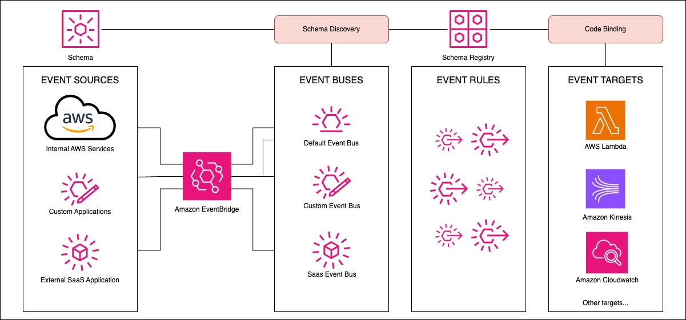
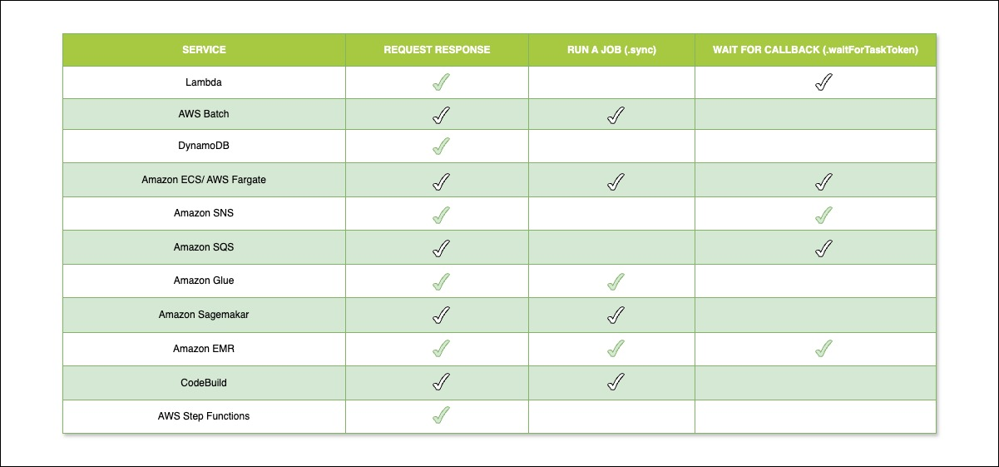
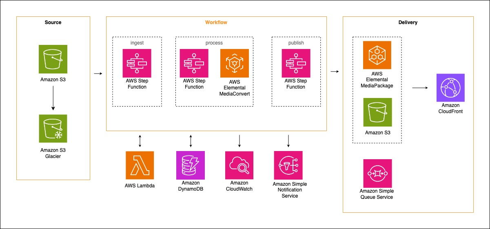
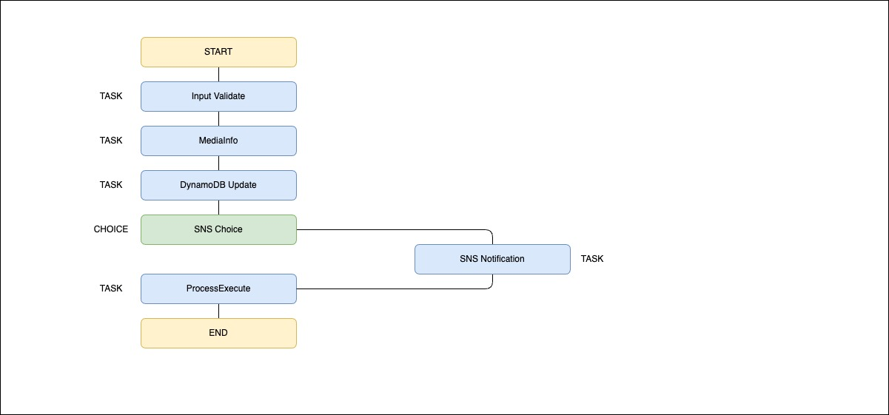
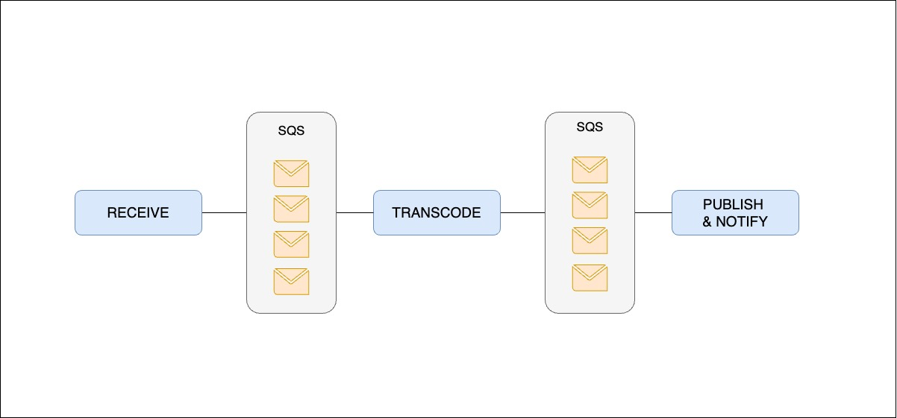
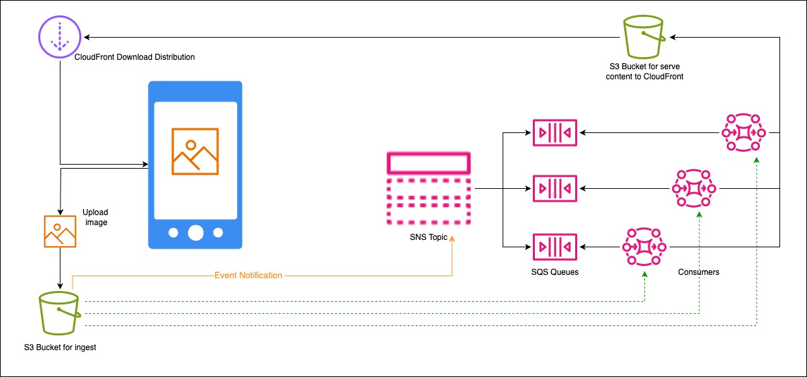

# Application Integration (DVA-C02)

Bu başlık altında, geliştiriciler için AWS'deki uygulama entegrasyon hizmetlerine giriş yapacağız. Bu hizmetler aşağıda listelenmiştir:

-   AWS AppSync,
-   Amazon EventBridge (Amazon CloudWatch Events),
-   Amazon Simple Notification Service (Amazon SNS),
-   Amazon Simple Queue Service (Amazon SQS),
-   AWS Step Functions.

## EventBridge

Zaman içinde sistemlerinizi ve mimarilerinizi inşa etmenin birçok yolu olmuştur. AWS eğitiminiz boyunca öğrendikçe ve geliştikçe, birkaç farklı metodoloji ile karşılaşacaksınız. Yolculuğunuza ilk başladığınızda, amacınız sadece çalışan bir şey inşa etmek olan çok katı monolitik sistemlerle başlayabilirsiniz. Bu sistemlerin özünde, birbirine çok sıkı bağlı olma sorunu vardır ve bir parçası başarısız olursa, belki de tümü başarısız olabilir. Ayrıca, bu sistemleri uygun şekilde ölçeklendirmek son derece zordur çünkü hepsi birbirine kilitlenmiştir. Sistemin bir parçası çok fazla yük alıyorsa, ne yazık ki tüm sistem birlikte ölçeklendirilmek zorundadır ve bu israf yaratabilir.

Sonra, birbirinden bağımsız mikroservisler şeklinde daha ayrık bir yaklaşıma geçilmiş olabilir. Bu mikroservislerin kendi geliştirme ekipleri ve kendi kaynakları olacaktır. Diğer servislerin onları çağırmasına ve verileri RESTful bir şekilde talep etmesine izin veren genel API'lerle çalışacaklardır. Bu çok daha iyi bir yaklaşım olsa da, yine de bu diğer servislerin, gruba katılan her ek servisin farkında olmasını gerektirir. Örneğin, bir sipariş servisi, fatura servisi, kargo servisi ve bir ürünü dünya çapında taşımak için gereken diğer her şey hakkında bilgi sahibi olmalıdır. Bu, oldukça basit bir programa sadece başka bir kod satırı eklemek olsa bile, yine de iki ekibin iletişime geçmesini ve birlikte çalışmasını gerektiren ek bir temas noktasıdır.

Dinamik ve hızlı tempolu ortamlarda bazen öncelikleri uyumlu hale getirmek zordur. Bir ekip için bu kritik görevler üzerinde çalışmak açık bir seçim gibi görünebilirken, diğeri bunu o kadar endişe verici bulmayabilir.

Bu bizi bir sonraki sistemimiz olan olay tabanlı mimariye (event-based architecture) götürür. Olay tabanlı bir mimari, servislerinizi daha da fazla ayrıştırmanıza olanak tanır. Bu sistem, servislerinizin esasen bir üst akış servisinden gönderilen bayrakları beklemesine izin verir. Bu bayrağa olay yani event denir ve mikroservisimizin bu olaya dayalı olarak harekete geçmesini sağlayabiliriz.

Örneğin bir olay, sipariş işleme servisinin "Hey, az önce bir siparişi tamamladım ve işte ayrıntıları" demesi olabilir. Bu olay daha sonra onu dinleyen herkes tarafından (fatura servisi veya bir kargo servisi vb.) duyulur ve buna dayalı bir karar verilebilir. Bu sürecin güzel yanı, sipariş servisine herhangi bir şey bağlamanıza gerek olmamasıdır, sadece çevrimiçi olan yeni servislerinizi o belirli olayı dinleyecek şekilde ayarlamanız gerekir. Olaylar, dinleyen servislerin kendi mantıkları için kullanabileceği sipariş numarası veya müşteri kimliği gibi bahsettikleri şey hakkında bilgiler içerebilir.

Amazon EventBridge bir olay koordinatörüdür. Hem harici SAAS sağlayıcılarından hem de dahili AWS servislerinden ve hatta kendi özel uygulamalarınızdan bilgi almanıza olanak tanır. Bu bilgilerden, diğer sistemlerin dinleyebileceği ve kararlar verebileceği olaylar çıkarabilir. Amazon EventBridge, olaylarınızın nereye gönderileceğini belirleyebilen yönlendirme kuralları ayarlamanıza ve sisteminizin gerçek zamanlı olarak tepki vermesine olanak tanır.

### Amazon EventBridge Temel Kavramları

Amazon EventBridge hakkında gerçekten konuşmaya başlamak için, bir olayın aslında nelerden oluştuğunu incelememiz gerekir. Olaylar, tüm AWS türü olaylar arasında paylaşılan ortak bir dizi değişkene sahip JSON biçimli dizelerdir.

```json
{
  "version": "0",
  "id": "01234567-0123-0123-0123-012345678901",
  "detail-type": "EBS Snapshot Notification",
  "source": "aws.ec2",
  "account": "012345678901",
  "time": "yyyy-mm-ddThh:mm:ssZ",
  "region": "us-east-1",
  "resources": [
    "arn:aws:ec2:us-west-2::snapshot/snap-01234567"
  ],
  "detail": {
    "event": "createSnapshot",
    "result": "succeeded",
    "cause": "",
    "request-id": "",
    "snapshot_id": "arn:aws:ec2:us-west-2::snapshot/snap-01234567",
    "source": "arn:aws:ec2:us-west-2::volume/vol-01234567",
    "startTime": "yyyy-mm-ddThh:mm:ssZ",
    "endTime": "yyyy-mm-ddThh:mm:ssZ"
  }
}
```

Bu değişkenlerin neyi temsil ettiğini açıklarken, yukarıdaki örnek JSON'a atıfta bulunarak yapacağız. Bu JSON dosyası, bir EBS Snapshot bildirim olayıdır. Tüm AWS olayları arasında ortak olan değişkenler şunlardır:

**Version:** Bu değişken varsayılan olarak tüm olaylar için 0 olarak ayarlanmıştır. Belki gelecekte Amazon bu olayların başka bir versiyonunu çıkaracak ve bu sayı değişebilir.

**ID:** Bu değer sadece her olayla birlikte gelen benzersiz bir tanımlayıcıdır. AWS içinde her gün gerçekleşen milyonlarca olay arasında ayrım yapmaya yardımcı olur.

**Detailed type:**  Bu değişken, olayın ne üzerinde hareket ettiğine dair ilk gerçek tanımlamamız. EBS Snapshot bildirimi örneğimizde bu basitçe: "EBS Snapshot Notification"dır.

**Source:** Kaynak değişkeni, bu olayı aslında kimin oluşturduğunu söyleyecektir. Bu faydalıdır çünkü yukarıdaki detailed type değişkenine baktığımızda, bu Olayı mutlaka EBS oluşturmadı, asıl kaynak EC2 olacaktır.

**Account:** Oldukça basit bir şekilde bu olayı oluşturan AWS hesabı.

**Time:** Olayın oluşturulduğu zaman damgası. Bu olay uzun bir süre boyunca gerçekleştiyse, bu zaman damgası ile olayın event bridge tarafından gerçekten alındığı zaman arasında büyük bir fark olabilir.

**Region:** bu olayın kaynaklandığı AWS bölgesi.

**Resources:** Bu olayla ilgili kaynakların ARN'lerini içeren basit bir JSON dizisi.

Bu olayın önemli kısmına yani, Details bölümüne geliyoruz.

**Details** Details, olayın içeriğini içeren basit bir JSON nesnesidir. Burada snapshot'ın başarıyla oluşturulduğunu, ilişkili ID'sini ve işlemin ne kadar sürdüğünü görebiliriz. Şu anda, bu olayları oluşturabilen 90'dan fazla AWS servisi var. Bu servisler arasında Lambda, Amazon Kinesis, AWS Fargate ve daha birçoğu bulunuyor. Ek olarak, Eventbridge, diğer üçüncü taraf yazılım hizmet sağlayıcılarıyla doğrudan entegre olan tek olay tabanlı servistir.

Bu sağlayıcılar arasında Zendesk - bir müşteri hizmeti ve bilet yönetim sistemi, Auth0 - kimlik doğrulama ve güvenlik hizmetleri sağlar ve Segment, bir pazarlama veri analizi ve depolama hizmeti yer alır.  Genel olarak, olayları doğrudan sistemlerinize göndermeye yardımcı olabilecek Amazon event bridge için toplam 30 farklı yazılım hizmet sağlayıcı entegrasyonu mevcuttur.

#### Olay Veri Yolları (Event Buses)

Artık olayların ne olduğunu, içlerinde neler olduğunu ve 90'dan fazla AWS servisinin bunları çıkarabileceğini bildiğimize göre, Event Bus hakkında konuşabiliriz! Event bus, tüm olaylarımızın tetiklendikten sonra ineceği yerdir. Servislerinizin oluşturduğu tüm verileri yakalayan huniddir. Hesabınız otomatik olarak varsayılan olarak önceden oluşturulmuş bir taneyle birlikte gelir, varsayılan event bus adı verilen ve yalnızca AWS servislerinden olaylar alan bir bus'tır.

Kendi uygulamalarınız gibi özel servisler için daha fazla event bus oluşturabilirsiniz. Ve ortak kaynaklardan olaylar görmek isterseniz, bunları sadece bir ortak event bus'ı ile ilişkilendirmeniz gerekir.

Event bus'ın harika bir yönü, onlarla kurallar ilişkilendirebilmenizdir. Hesabınızdaki her event bus'ı ile en fazla 100 kural ilişkilendirilebilir ve çözümünüz çok sayıda kural gerektiriyorsa, daha fazla özel bus oluşturmanız gerekebilir.


#### Kurallar

Kurallar, Amazon event bridge'in önemli bir parçasıdır çünkü herhangi bir zamanda event bus'ınızdaki çok sayıda olayı filtrelemenize olanak tanır. Kuralları kullanarak, bir S3 put olayı gibi ilgilendiğiniz belirli olayları tanımlayabilir ve bu bilginin mimaride nereye gitmesini istediğinizi ayarlayabilirsiniz. Tek bir kural bile bilgiyi paralel olarak hareket edebilecek birden çok hedefe iletebilir. Ancak kuralların belirli bir sırayla işlenmediğini bilmek önemlidir.

Kurallarınız ayrıca, onları sadece zaman zaman çalıştırmak istiyorsanız, bir programa göre de tetiklenebilir. Konsolda günler, haftalar, aylar olarak açıkça ayarlama seçeneği ve ayrıca bir cron işi olarak yapılandırma seçeneği vardır. Kurallarınızı oluştururken, olayın iletileceği bir hedef belirtmeniz gerekir.

#### Hedefler

Hedefler, Amazon event sisteminin önemli bir parçasıdır çünkü olayların üzerinde çalışan nesnelerdir. Hedefler arasında Amazon EC2 instance'ları, Lambda fonksiyonları, Kinesis stream'leri, Amazon ECS görevleri ve daha birçoğu bulunabilir. Şu anda servis 15 hedefi destekliyor.

Ancak bu küçük bir sayı gibi görünüyorsa cesaretiniz kırılmasın çünkü burada mevcut olan hedefler, step functions gibi, inanılmaz şeyler yapmanıza izin verir ve neredeyse tek başlarına tüm mimarileri oluşturabilir.

Başka bir not olarak, kurallarınızın olayları başka bir hesaba göndermesini bile sağlayabilirsiniz. Bunlara çapraz hesap olayları denir ve ya varsayılan bus'a ya da o hesaptaki başka bir özel bus'a gönderilebilir.

#### Amazon EventBridge vs CloudWatch events

Bahsettiğimiz fikirlerin bazıları size tanıdık gelmeye başladıysa, sanki onları başka bir yerde duymuş gibiyseniz. Amazon Eventbridge aslında CloudWatch events'in yeniden markalanmış ve daha fazla işlevsellikle yeniden oluşturulmuş haliydi.

Zaten tartıştığımız gibi büyük fark, event bridge'in hem AWS servisleriyle hem de yazılım hizmet sağlayıcılarıyla entegre olmanıza izin vermesidir. Ayrıca tamamen geriye dönük uyumludur ve genel olarak zaten cloud watch events kullanıyorsanız, cloud formation şablonlarınızda veya API çağrılarınızda gerçekten herhangi bir değişiklik yapmanız gerekmez.

#### Özet

Öyleyse olaylarla ilgili az önce konuştuklarımızı özetlemek gerekirse, bir olay bir servis tarafından oluşturulur ve tetiklenir, sonra event bus'a konur, bu olaylar daha sonra onları filtrelemeye yardımcı olmak için kurduğumuz çeşitli kurallar tarafından incelenir ve sonra bu kurallar bilgileri hedeflere gönderir ve hedefler o olaya dayalı olarak bir tür iş yapar.

### EventBridge Detaylandırılması (Deeper Dive to the EventBridge)

Eventbridge'in en etkileyici özelliklerinden biri muhtemelen Eventbridge arşivlerine erişimdir. Arşiv, olayları arşivleyebileceğiniz ve daha sonra kolayca yeniden oynatabilceğiniz bir yer oluşturmanıza olanak tanır.

Bu olaylar, belirlediğiniz saklama süresi boyunca arşivde kalır ve bu süre sonunda atılır. Elbette olaylarınızı arşivde süresiz olarak saklayabilirsiniz. Olayları saklayabileceğiniz süre konusunda bir sınır yoktur ve metin tabanlı oldukları için depolama açısından çok fazla yer kaplamaz.

Tüm olaylarınızı arşivlemenin en belirgin faydalarından biri, felaket kurtarma senaryoları içindir. Diyelim ki veritabanınız bozuldu veya bir şekilde silindi, eğer gerçekleşen tüm olayların kaydına sahipseniz, veritabanınızın felaket öncesindeki durumunu tam olarak yeniden oluşturabilirsiniz.

Felaket kurtarma, arşivleme istemenizin tek nedeni değildir. Bir uygulamayı yeni bir özellikle veya yeni bir altyapı sistemiyle güncellemek gibi basit bir şey bile olayları yeniden oynatmak için harika bir neden olabilir. Bu, daha önce elde etme yeteneğinizin olmadığı eski verilerden yeni bilgiler almanıza olanak sağlayabilir.

Amazon, bu arşivlenmiş olayları yeniden oynatmayı çok kolaylaştırdı. İşlevsellik zaten hizmetin içine yerleştirilmiş durumda ve tek yapmanız gereken yeni bir yeniden oynatma oluşturmak, olaylarınızı çekmek istediğiniz arşivi seçmek ve gitmesini istediğiniz hedefi belirlemektir. Şu anda, bunları yalnızca orijinal olarak oluşturuldukları event bus'a geri gönderebilirsiniz, ama bu sorun değil. Bu özelliğe, birçok farklı hedefe yeniden oynatmaya izin vermek için daha fazla güncelleme geleceğini tahmin ediliyor; ve elbette, bu olayların arşivden geri akışını durdurmak isterseniz, bir yanıtı istediğiniz zaman durdurabilirsiniz.

#### Schema Registry

Olaylarla ilgilenen ve event bridge'den bilgi alan uygulamalar yazarken, kullanacağınız olayların şemasını bilmek önemlidir. Bir şema, bir olayın yapısını açıklar ve olay içinde nitelikler ve veri tipleri açısından ne bekleyebileceğinizi anlamanıza yardımcı olur.

Örneğin, bir müşteri inceleme olayı her zaman iki string içerebilir: biri müşteri adı için, diğeri incelemenin kendisi için.



Eventbridge, hizmetin içine yerleştirilmiş bir şema kaydına sahiptir;  event bus'ınızda mevcut olan tüm olası şemaları görebilirsiniz. Geliştirmenizi kolaylaştırmak için, event bridge'de kullanılabilen her AWS hizmetinin bu kayıtta arayabileceğiniz önceden oluşturulmuş bir şeması vardır.

Bu kayıt, tüm olası şemalar arasında başlık veya içeriğe göre göz atmanıza olanak tanır. Bu arama, şemaların içindeki değişken adlarının yanı sıra hizmetlerin başlığını da içerebilir.

Şu anda, SAAS olaylarının her bir olay türü için önceden oluşturulmuş bir kataloğu yoktur, ancak bu olaylara dayalı şemaları kolayca keşfedebiliriz. Bu, SAAS olaylarınızdan birini seçmek (örneğin: bir Zendesk yeni bilet olayı) ve şema keşfet düğmesine basmak kadar basittir.

Şema kaydı ise, kendinizin oluşturduğunuz veya özel hizmetiniz/uygulamanız tarafından sağlanan bir JSON dizesinden kendi özel olay şemalarınızı oluşturmanıza olanak tanır.

#### Code Bindings

Olaylar ve Eventbridge için geliştirme yaparken, Visual Studio içinde kullanılabilen kod bağlamaları oluşturma seçeneğiniz vardır.

Bir kod bağlaması, basitçe görsel editöre şemayı getiren ve Visual Studio'nun değişkenlerinizin doğru türde olup olmadığını kolayca kontrol etmesine ve programlamayı çok daha kolay hale getiren nitelikleri ortaya çıkarmasına olanak tanıyan bir uzantıdır.

Kod bağlamaları geliştirme hızını büyük ölçüde artırabilir ve Java, Python ve Typescript için mevcuttur. Bağlamalar, EventBridge içinde zaten desteklenen herhangi bir AWS hizmeti için oluşturulabilir ve ayrıca kendi özel ve keşfedilen şemalarınız için de oluşturulabilir.

#### Event bridge vs SNS

Olayları birçok aboneye gönderebilen EventBridge ile Amazon simple notification service arasında bazı benzerlikler fark etmiş olabilirsiniz. %100 doğru olduğunuzu söyleyebilirim, bu iki hizmet arasında birçok kesişme bulunur.

Hangi çözümün sizin için en iyisi olduğuna karar vermenizi sağlayan birkaç temel fark var. Simple notification service, adından da anlaşılacağı gibi çok basittir, sınırlı bir parametre setiyle çalışır, ancak milyonlarca aboneye kadar ölçeklenmenize olanak tanır. Bununla birlikte, software as a service sağlayıcısına doğrudan bağlantısı yoktur ve Amazon event bridge kadar fazla yönlendirme yeteneği sağlamaz.

Örneğin, SNS'nin bir step functions state machine'i tetiklemesi, Amazon event bridge'e kıyasla son derece zordur. Ayrıca SNS neredeyse sonsuz ölçeklense de, filtreleme yalnızca niteliklerle sınırlıdır, bir olay içindeki içeriği içermez.

Dolayısıyla, pub sub mimarisini ele alabilecek ölü basit bir hizmet arıyorsanız SNS'yi tercih edin, ancak daha karmaşık ve sofistike bir yaklaşıma ihtiyacınız varsa, EventBridge'e bir göz atın.

#### Event bridge vs Kinesis

Kinesis aslında EventBridge'in yaptığı işi oldukça iyi yapıyor; olayları yönlendirebiliyor ve aynı zamanda büyük ölçeklerde gerçek zamanlı veri işlemek için ideal olan olay depolama olarak da çalışabiliyor.

Ancak sorunlardan biri, tek bir akışa bağlanabilen consumer sayısında bir sınır olmasıdır. Ayrıca, her producer, kendisi için neyin önemli olduğunu belirlemek için Kinesis üzerinden gelen mesajları filtrelemekten sorumlu olacaktır.

Çok yakın bir karşılaştırma olmalarına rağmen, EventBridge gerçekten de SaaS sağlayıcılarınızla ilgilenirken size harika bir esneklik sağlıyor, bu yüzden eğer bu daha çok ilgi alanınızsa, çözümünüz için EventBridge hakkında daha fazla okuma yapın.

## AWS Step Functions

Amazon Web Services ve serverless iş yükleri düşünüldüğünde akla gelen ilk seçenek AWS Lambda'dır. Lambda, altta yatan hesaplama altyapısının yüküyle uğraşmak zorunda kalmadan serverless hesaplama yapmanıza olanak tanıyan harika bir kaynaktır.

Ne yazık ki, Lambda esnekliği ve uzun süreli karmaşık işlemleri gerçekleştirme yeteneği ile pek tanınmaz. Örneğin, Lambda uzun süre kodunuzun yürütme süresini 5 dakika ile sınırlandırmıştı ve bu süre yakın zamanda 15 dakikaya çıkarılmıştır.

Bu, bir script çalıştırmayı veya basit hesaplamalar yapmayı düşündüğünüzde oldukça uzun bir süre gibi görünebilir, ancak daha karmaşık işlemler için yeterli olmayabilir.

Örneğin; Lambda ile basit uygulamalar oluştururken bir bağlantıyı yeniden denemeyi, bir sonraki eyleme geçmeden önce bir şeyin kullanılabilir hale gelmesini beklemeyi veya basitçe bir şeyi paralel olarak çalıştırma yeteneğine sahip olmayı istemiş olabilirsiniz. Bunlar, birçok kişinin istediği ve beklediği yaygın iş akışlarıdır. Ne yazık ki, bu özellikler Lambda'ya doğal olarak dahil değildir.

Ancak bu sizi Lambda'yı tamamen kullanmaktan vazgeçirmesin, çünkü **AWS Step Functions** burada öncü bir rol üstlenebilir.

AWS Step Functions, bu etkileşimleri yönlendirmenize ve şekillendirmenize yardımcı olabilir ve az önce bahsettiğimiz tüm bu özellikleri ve daha fazlasını kullanan etkileşimli ve karmaşık sistemler oluşturmanıza olanak tanır, hem de tam bir orkestrasyon ve şeffaflık kolaylığı ile bu işlemi yapar. 

AWS Step Functions en iyi şekilde bir durum makinesi hizmeti olarak tanımlanabilir. Durum makinesinin ne olduğunu bilmeyenler için, standart bir otomat makinesini düşünebilirsiniz.

Bir otomat makinesi, bir müşterinin gelip para girmesini bekleyerek orada durur (bu onun boşta kalma durumudur). Makineye para eklendikten sonra, bir sonraki duruma geçer ki bu da ürün seçimidir. Kullanıcı seçimini girer ve makine ürünü verme son durumuna geçer. İş akışı tamamlandıktan sonra, başka bir müşteriyi bekleyerek boşta kalma durumuna geri döner.

AWS Step Functions, tıpkı otomat makinesi gibi iş akışları oluşturmanıza olanak tanır; burada sisteminizin girdi beklemesini, kararlar almasını ve giriş değişkenlerine göre bilgi işlemesini sağlayabilirsiniz.

Bu tür bir orkestrasyon ile, Lambda fonksiyonlarını hizmetin kendisi tarafından doğal olarak desteklenmeyen şekillerde çalıştırabiliriz.

Örneğin, Step Functions'ı kodumuzu aşağıdaki şekillerde çalıştırmak için kullanabiliriz:

- Paralel olarak, aynı anda işlemek istediğiniz birden fazla öğe veya görev olduğunda.
- Sıralı olarak, sıranın önemli olduğu durumlarda.
- Yeniden deneme ile, belki kodunuzun başarılı olana kadar veya bir tür zaman aşımına ulaşana kadar çalışmaya devam etmesini istiyorsunuz.
- If then, karar verme için dallanma ve mantıksal ağaçlara izin verir.

Lambda fonksiyonlarınız için bu seçenekler mevcut olduğunda, serverless ve Lambda'nın muhtemelen en büyük engeli olan 15 dakikalık kod yürütme sınırını aşabiliyoruz.

Bu yetenek, çok güçlüdür. Tamamen serverless uygulamalar ve iş akışları oluşturmanıza olanak tanır.

AWS Step Functions, iş akışınızı bir Amazon State Language dosyasından okuyarak çalışır. Bu, durum makinenizi ve çeşitli bileşenlerini tanımlamak için kullanılan JSON tabanlı yapılandırılmış bir dildir.

Amazon State Language, bir dizi durumdan oluşan özel bir dildir. Bu durumlar sırayla bir tür iş yapabilir ve buradan makine bir sonraki duruma geçme kararı verebilir.

Amazon State Language'in neye benzediğine dair bir örnek aşağıda verilmiştir.

```json
{
	"Comment": "A Hello world Example of the Amazon State Language using Pass state",
	"StartAt": "HelloWorld",
	"States": {
		"HelloWorld": {
			"Type": "Pass",
			"Result": "Hello World!",
			"End": true
		}
	}
}
```

Gördüğünüz gibi, bu oldukça JSON benzeri bir dildir ve bu durum faydalıdır çünkü birçok geliştiricinin zaten yazmaya alışkın olduğu tanıdık bir sözdizimidir.

İyi haber şu ki, AWS Step Functions konsolda durum makinenizin görsel bir temsilini sunar. Bu görsel grafik, kodunuzu düzenledikçe gerçek zamanlı olarak güncellenir ve makinelerinizin oluşturulması sırasında değerli geri bildirimler sağlar.

Ek olarak, bu görsel akış grafiği çalışma zamanı sırasında ve tamamlandıktan sonra incelenebilir. Bu özellik, perde arkasında neler olup bittiğini daha derinlemesine anlamanızı sağlar. Her eleman, girdileri ve çıktıları göstermek için incelenebilir.

Durum makinenizin herhangi bir zamanda olabileceği sekiz durum vardır. Bunları tek tek gözden geçirelim.

**Pass State:** Temel olarak bir hata ayıklama durumu veya makinenizi ilk kez oluştururken kullanılacak bir durumdur. Giriş değerini doğrudan çıkışına geçirmenize ve sabit bir sonuç eklemenize olanak tanır.

**Task State:** İşin gerçekten gerçekleştiği yer burasıdır. Bir görevle, Step Functions'ın çalıştırmasını istediğiniz bir kaynağı ve bir zaman aşımı süresini tanımlarsınız. Örneğin, burada bazı kodları çalıştırmak için Lambda fonksiyonunuzu ekleyebilirsiniz. Bu durum genellikle diğer durumlar içinde bir alt durum (veya eylem) olarak kullanılır.

**Choice State:** Verilen bir girdiye göre, durum makinesi doğru çıktıyı seçer. Temel olarak, daha fazla uygulama mantığı çalıştırabileceğiniz bir if-then işlemidir.

**Wait:** Durum makinesi duraklar ve belirli bir zamana kadar veya belirli bir süre geçene kadar bekleyebilir. Bu, örneğin her gün saat 8'de bir e-posta göndermek istiyorsanız kullanışlı olabilir.

**Succeed:** Basitçe durum makinesinin başarılı bir şekilde sonlandırılması. Örneğin, durum makinesini sonlandırmak için bir choice state'in parçası olabilir.

**Fail:** Ayrıca durum makinesi için bir sonlandırma durumudur, ancak başarısız bir şekilde. Fail durumlarının bir hata mesajı ve bir nedeni olmalıdır.

**Parallel State:** Bir grup durumu mümkün olduğunca eşzamanlı olarak yürütür ve devam etmeden önce her dalın sonlanmasını bekler. Her paralel dalın sonuçları dizi benzeri bir formatta bir araya getirilir ve bir sonraki duruma geçilir.

**Map State:** Bir öğe listesi üzerinde yineleme yapmanıza ve bunlar üzerinde görevler gerçekleştirmenize olanak tanır. Aynı zamanda bir kerede üzerinde çalışılan eşzamanlı öğe sayısını da tanımlayabilirsiniz. Bunu veri işlemek için bir for döngüsü gibi düşünün.

Belirli durum makinelerinizi oluşturmak için bu durumların kombinasyonlarını kullanmak son derece iyi ölçeklenebilen serverless çözümler oluşturmanıza olanak tanır.

Diyelim ki png görüntüleri için görüntü etiketleme sağlayan ve küçük resimler oluşturan basit bir uygulama oluşturmak istiyoruz. Bir giriş (input) görüntüsü alındığında, ilk adım mümkünse görüntü hakkındaki herhangi bir metaveriyi çıkarmak olacaktır. Bu bir task state olacaktır.

Bu görevin çıktısı, görüntü formatının desteklenip desteklenmediğini kontrol edecek olan bir sonraki duruma gönderilebilir. Bu durum bir choice state'dir.

Bu aşamada ya görüntünün desteklenmediğini ve işlemin başarısız olduğunu buluruz ya da bu metaveriyi depolamaya geçeriz. Depolama başka bir görev olacaktır.

Daha sonra etiketlerimizi oluşturmak ve paralel olarak bir küçük resim oluşturmak için görüntüyü Amazon Rekognition'a gönderebiliriz. Bu bir parallel state olacaktır.

Son olarak, rekotag'ları görüntünün kendisine veya bir veritabanına ekler ve daha sonra ilişkilendiririz. Bu aşamadan sonra sonra durum makinesi sona erer.



Şimdiye kadar Step Functions ile görevler gerçekleştirirken etkileşim ortamınız olarak Lambda'yı kullanmaktan çok bahsettik, ancak aslında Step Functions'ın doğrudan etkileşimde bulunabileceği oldukça fazla hizmet bulunur. Yukarıdaki tabloya bakarsanız, Step Functions'ın kullanmanız için oldukça geniş bir hizmet yelpazesine sahip olduğunu görebilirsiniz.

Örneğin, DynamoDB içindeki bir tabloya bir öğe eklemek için Lambda'yı kullanmak zorunda değilsiniz, bunu doğrudan DynamoDB içindeki o fonksiyonu özellikle çağırarak yapabilirsiniz.

Yapabilecekleriniz sadece bununla kısıtlı değildir, Step Functions içinde doğal olarak yapabileceğiniz diğer birkaç örnek aşağıda listelenmiştir:

- Bir Amazon Elastic Container Service veya AWS Fargate görevi çalıştırabilirsiniz
- Bir AWS Batch işi gönderebilir ve tamamlanmasını bekleyebilirsiniz
- Bir Amazon SNS konusuna mesaj yayınlayabilirsiniz
- Bir Amazon SQS kuyruğuna mesaj gönderebilirsiniz
- Bir AWS Glue iş çalıştırması başlatabilirsiniz
- Bir makine öğrenimi modeli eğitmek veya bir veri setini toplu dönüştürmek için bir Amazon SageMaker işi oluşturabilirsiniz

AWS Step Functions'ın en etkileyici özelliklerinden biri, asenkron geri çağrılar için kapasitesidir. Bu, bir yönetim otoritesi tarafından onaylanması gereken bir iş akışınız varsa veya belki tamamlanması saatler, günler veya haftalar süren bir hizmet sağlayan üçüncü taraf bir API kullanıyorsanız, Step Functions bu yeteneği sağlar. Bu durum da iş akışlarınıza dinamiklik ve esneklik katabilir.

Ayrıca, alt durum makinelerini üst durum makineleri içine yerleştirme yeteneğine sahibiz. Bu yetenek, Step Functions ile daha uzun süre çalıştıkça daha büyük faydalar sağlar, çünkü iş akışlarınızda oldukça sık tekrarlanan desenler bulacaksınız. Örneğin, diğer teğetsel hizmetler tarafından referans alınması gereken bir core step fonksiyonunuz olabilir. Fonksiyonlarınızı iç içe yerleştirme kapasitesine sahip olmak, ileride size çok zaman kazandıracak ve o temel iş mantığının kapsüllenmesine yardımcı olacaktır.

Artık AWS Step Functions'ın ne olduğu ve onu oluşturan parçalar hakkında temel bir anlayışa sahip olduğumuza göre, bu hizmetle neler oluşturabileceğinize dair tam bir örnek görmek iyi olacaktır.

Bu muhtemelen en sevilen örnek ve AWS Step Functions, AWS Elemental MediaConvert ve AWS Elemental MediaPackage'ı kullanan eksiksiz bir isteğe bağlı video iş akışıdır. Repo'ya şu linten ulaşılabilir. [https://github.com/awslabs/video-on-demand-on-aws](https://github.com/awslabs/video-on-demand-on-aws)



Yukarıdaki mimari diyagram, isteğe bağlı bir video hizmetinin tüm yaşam döngüsünü ele alan üç parçalı, çok yönlü bir mimariyi temsil etmektedir.

Bu operasyonun tüm parçaları tamamen serverless olarak çalışır ve tüm süreci düzenlemek için multi-phased step function elemanlarını içerir.

S3 bucket'ımızda zaten kurulmuş olabilecek veya geldikçe oraya yerleştirilebilecek kaynak dosyalarımızla başlayarak, ham videomuz olacak. Bu video Amazon S3 Glacier'da arşivlenirken aynı zamanda bir Lambda fonksiyonu tarafından 'Ingest' iş akışımıza gönderilir.

Hadi ingest iş akışına bir göz atalım ve ne yaptığını görelim.



**Input validation:** Dosya türlerinin desteklendiğinden emin olmak için kontrol eder.

**Mediainfo:** Kaynak dosyalar için imzalı URL'ler oluşturur ve video hakkındaki metaverileri çıkarır.

**DynamoDB Update:** Tüm bu ilgili bilgileri alır ve DynamoDB'ye yerleştirir.

**SNS Choice:** Yüklemelerin durumu hakkında bilgilendirilmek isteyip istemediğimizi belirleyen basit bir bayrak.

**SNS Notification:** Amazon SNS kullanarak, ingestion sürecinin durumu hakkında (örneğin başarılı oldu mu yoksa başarısız mı oldu) bir bildirim gönderir.

**Process Execute:** İşleme iş akışını başlatır.

Tüm bu görevler herhangi bir sunucu başlatmanıza gerek kalmadan otomatik olarak tamamlanır. Step Functions her durumu tamamlanana kadar işler ve ardından bir sonrakine geçer.

Ingestinden sonra, video işlenir ve çeşitli bit hızlarına ve boyutlara dönüştürülür, ikonlarla birlikte ve bir streaming tipi hizmetten bekleyeceğiniz tüm iyi şeylerle. Ardından, tüm ilgili bilgiler yayınlanmak üzere dışarı gönderilir ve oradan müşteriye teslim edilebilir.

## Kuyruk Hizmetleri ile Decoupling Uygulamaları (Decoupling Applications with Queuing Services)

Genellikle ayrıştırma (decoupling) fikri tanıtıldığında, uygulama geliştirme ve mesajlaşma servisleri bağlamında ortaya çıkar, o halde bununla başlayalım. Bir uygulamayı ayrıştırmak tam olarak ne anlama gelir?

Ayrıştırılmış bir uygulama, her bileşenin görevlerini bağımsız olarak gerçekleştirmesine olanak tanır. Bileşenlerin tamamen otonom olmasını ve birbirinden habersiz kalmasını sağlar. Bir bileşendeki değişiklik, başka bir yerde değişiklik gerektirmemelidir. Daha da önemlisi, uygulamanın bir katmanındaki bir hata diğer katmanlara yayılmamalı, bileşen arızasının meydana geldiği yerde izole kalmalıdır. Sıkı bağlı bir uygulamayı düşünün. Bir transcode katmanını çağıran bir alma katmanı (received layer) tanımlayabiliriz, bu da yayınlama (published) ve bildirim (notified) katmanını çağırır. Bu, basit bir üç katmanlı görüntü işleme uygulaması olacaktır. Bu tür bir uygulamada, katmanlardan birindeki bir hata, sonraki katman üzerinde olumsuz bir etki yaratabilir ve tüm uygulamanın işleyişini bozabilir.

Ayrıştırma olasılığı, farklı katmanlar tarafından mesajların gönderilip alınabileceği bir mesajlaşma mekanizması tanıtılarak ortaya çıkar. İdeal olarak, mesajlaşma modeli bire bir mesaj iletimi olmalıdır ve bu bir mesaj mevcut bir katman tarafından oluşturulur. Bu mesaj bir kuyruğa konur ve ardından bir sonraki işlem katmanı tarafından alınır. **Amazon Simple Queue Service** yani **SQS**, bu tür bir uygulama için uygundur, farklı uygulama katmanları için bir e-posta sistemi gibi davranır ve işleme için isteği almak üzere dinleyen tüketici olmasa bile alınan mesajın bir kopyasını saklayabilir. Uygulamayı aşağıda verilen bir diyagram kullanarak temsil edebiliriz. Biraz farklı, çünkü bizim durumumuzda her katman arasına bir kuyruk entegre ediyoruz. Bu özel uygulamada Amazon SQS kullanacağız ve uygulama katmanlarının her birini otomatik ölçeklendirme grupları içindeki EC2 örnekleri filosu olarak uygulayacağız.



Her işlem ve katman arasında SQS kuyrukları kullanarak, artık katmanlar arasında istekleri aktarmak için mesaj alışverişi yapan sistemlerin gevşek bir şekilde bağlanmasını sağlarız. Bu, sistemlerin asenkron bağlantısıdır ve mesajları paralel olarak alan ve işleyen EC2 örneklerinin sayısını artırmanıza veya azaltmanıza olanak tanır. Ayrıca, kullanım ve talebe göre her uygulama katmanı filosunun boyutunu büyütmek ve küçültmek için otomatik ölçeklendirmeyi yapılandırabilirsiniz. Bir EC2 örneği bir mesajı işleyemezse, ilgili kuyruğda tutulur ve EC2 örneğinin restorasyonu üzerine veya aynı otomatik ölçeklendirme grubundaki başka bir EC2 örneği tarafından alınır. Bu durumda Amazon SQS, farklı uygulama katmanları için bir e-posta sisteminin eşdeğeri gibi davranır. Genel olarak SQS için, bir posta kutusunun (mailbox) eşdeğerine kuyruk denir. Kuyruğa mesaj koyan uygulamalara producer, mesajları alan uygulamalara ise consumer denir.

Bir kuyruktaki bir mesajın genel akışı özetlemek gerekirse: İlk olarak, bir uygulama bir mesaj üretir ve onu bir kuyruğa gönderir. İkinci olarak, bir uygulama tüketicisi genellikle yeni mesajlar için kuyruğu dinler veya yoklar ve işlemek üzere istendiğinde alır. Bir mesaj bir tüketici tarafından alındığında, mesaj kilitlenir ve bir görünürlük zaman aşımı ayarlanır, böylece mesaj diğer tüm yoklama yapan tüketicilere görünmez hale gelir. Bu nedenle, bu, her mesajın tüketici mesajı işlemeyi bitirene ve mesajı silmek için kuyruğa bir mesaj silme çağrısı yapana kadar korunmasını sağlar. Her mesaj en az bir kez işlenir. Herhangi bir nedenle mesaj başarıyla işlenmezse ve mesaj silme çağrısı yapılmazsa, mesajın görünürlük zaman aşımı sona erer. Mesaj tekrar görünür hale gelir ve başka bir tüketici veya ilk işlemeyi tamamlayamayan restore edilmiş tüketici tarafından alınabilir hale gelir. 

Gecikme kuyruğu (delay queue) olarak bilinen bir kuyruk türü vardır; burada bir mesaj alındığında, mesajın teslimini bir saniye sayısı kadar geciktirebilirsiniz. Bu tür bir kuyrukta, görünürlük diyagramda gösterildiği gibi yönetilir. Önceden tanımlanmış gecikme, tıpkı bir görünürlük zaman aşımı gibi davranır ve alınan mesaj isteği yapıldığında mesaj döndürülmez. Önceden tanımlanmış gecikme tamamlandığında, mesaj ve kuyruk açıklandığı gibi davranır. Ancak, mesaj alındıktan sonra görünürlük zaman aşımı etkin hale gelir. Bir mesaj için minimum ve varsayılan gecikme sıfır saniyedir ve maksimum 15 dakikadır. Amazon SQS hakkında bazı ayrıntılar şu şekildedir: Bir, bir kuyruktaki bir mesaj için görünürlük zaman aşımı varsayılan olarak 30 saniyedir. Minimum sıfır saniye, maksimum 12 saattir. Bir mesajı işlemek 30 saniyeden fazla sürecekse, görünürlük zaman aşımını uygulamanızın işlem süresine uygun olarak artırmak isteyeceksiniz.

Bu, uygulamalarınızın bir mesajı yalnızca bir kez tüketmesini ve onları işlemek için yeterli zamana sahip olmasını sağlayacaktır. Görünürlük zaman aşımları, gerekirse tüm kuyruk için veya spesifik bir mesaj için ayarlanabilir. Spesifik bir mesaj için, saniye cinsinden bir görünürlük zaman aşımı parametresiyle change message visibility çağrısını kullanabilirsiniz. Change message visibility çağrısının daha sonra yayınlanan diğer received message komutları üzerinde hiçbir etkisi yoktur. Lütfen unutmayın ki, tüketicinizin bir mesajı işlemek için 12 saatten daha uzun süreye ihtiyacı varsa, SQS yerine belki de step functions kullanmayı düşünmeniz gerekir.

Genel olarak, bir consumer'ın bir queue'daki mesajları dinlemesi için iki yol vardır ve bunlara **short polling** ve **long polling** denir. Varsayılan olarak, queue'lar short polling kullanır. Short polling kullanarak, bir consumer mevcut mesajları bulmak için received message isteği gönderir ve SQS, istek hiç mesaj bulamasa bile bir yanıt gönderir. Short polling, bir `ReceiveMessage` isteğinin `WaitTimeSeconds` parametresi 0'a ayarlandığında gerçekleşir ve bu iki şekilde olabilir. Birincisi, `ReceiveMessage` çağrısı `WaitTimeSeconds` parametresini 0'a ayarlar. İkincisi, `ReceiveMessage` çağrısı `WaitTimeSeconds` parametresini ayarlamaz, ancak `ReceiveMessageWaitTimeSeconds` adlı queue özelliği 0'a ayarlanmıştır.

Long polling kullanmak için, consumer 0'dan büyük ve 20 saniyeye eşit veya daha küçük bir `WaitTimeSeconds` parametresi ile `ReceiveMessage` isteği gönderir. Long polling ayrıca `ReceiveMessageWaitTimeSeconds` queue özelliği 0'dan büyük bir sayıya ayarlanmışsa da gerçekleşebilir. Bu durumda, SQS en az bir mesaj mevcut olduğunda ve istekteki `MaxNumberOfMessages` parametresi tarafından belirtilen maksimum mesaj sayısına kadar bir yanıt gönderir.

Long polling ile boş yanıt yalnızca belirtilen polling bekleme süresi dolduğunda gerçekleşir. Genel olarak, minimum mesaj boyutu 1 byte veya 1 karakterdir ve varsayılan olarak maksimum mesaj boyutu 256 kilobayttır. Java için Amazon SQS extended library, Amazon S3 ile birlikte SQS messaging kullanarak 2GB'a kadar büyük mesajların işlenmesini sağlamada çok kullanışlıdır. 256 kilobayttan daha büyük mesajlarla uğraşmanız gerekiyorsa, SQS Extended Client Library mesajların her zaman Amazon S3'te depolanmasını veya yalnızca mesaj 256 kilobayt sınırından büyük olduğunda depolanmasını tanımlamanıza olanak tanır. Ayrıca bir S3 bucket'ında depolanan bir nesneye bağlantı içeren bir mesaj gönderebilir, mesaj nesnesini Amazon S3'ten alabilir ve gerekirse mesaj nesnesini S3 bucket'ından silebilirsiniz. Bir kez daha belirtmek gerekirse, Java için SQS Extended Client Library kullanırken maksimum mesaj boyutu 2GB'tır.

Standard SQS queue'ları mesajların sırasını korumaya çalışır ancak mesaj sırasının korunacağını garanti etmez ve yalnızca mesajların **At-least-once** delivery olarak adlandırılan teslimatını garanti eder. Standart bir queue'da maksimum 120.000 in-flight mesaj olabilir, bu da bir consumer tarafından bir queue'dan alınmış ancak işleme tamamlandıktan sonra henüz queue'dan silinmemiş mesajlar anlamına gelir.

Short polling kullanıyorsanız, bu kota, işlemde o kadar çok mesajınız varken consumer'ınızın bir mesaj almaya çalışması durumunda OverLimit hata mesajı almasına neden olacaktır. Long polling kullanıyorsanız, SQS hata mesajı döndürmez. Bu maksimum kotayı aşmamak için mesajları işlemlerinden sonra her zaman queue'dan silmelisiniz. Mesaj sırasını garanti etmek ve EXACTLY-ONCE teslimini uygulamak için, standart queue'dan farklı bir queue türü olan FIFO queue kullanmanız gerekir. FIFO queue'lar standart queue'lara göre biraz daha yavaş performans gösterir ve bu, mesaj sırasını First-In-First-Out olarak koruma ve EXACTLY-ONCE teslim mekanizmasını uygulama mekanizması nedeniyle mantıklı olmalıdır. FIFO queue'lar işlenirken maksimum 20.000 mesaja sahip olabilir, yani mesajlar bir consumer tarafından bir queue'dan alınmış ancak işleme tamamlandıktan sonra henüz queue'dan silinmemiştir. Uygulamalarınızı tasarlarken lütfen standart ve FIFO queue'lar arasındaki performans karşılaştırmasını aklınızda bulundurun. Bu aynı zamanda sınavlarda sık sık test edilen bir veri noktasıdır. Short polling ve long polling arasındaki fark da uygulamalarınız ve sınavlar ve sertifikasyon için hatırlanması gereken önemli bir ayrıntıdır.

Bir mesajın başarıyla işlenmediğinde ne olduğuna zaten değindik. Temel olarak, uygulama işlemede başarısız olur ve delete message çağrısı consumer uygulaması tarafından yapılmaz, dolayısıyla mesajın visibility timeout'u sona erer ve mesaj tekrar consumer'lara açık hale gelir. Bu durum, mesajı işleme başarısızlığının genellikle CloudWatch alarmları ve otomatik düzeltme kullanılarak giderilebilecek bir tür compute arızasından kaynaklandığını varsayar. Ancak, böyle bir durum için ikinci bir olasılık daha vardır. Bu olasılık ise, gerçek mesajın bozuk veya başka şekilde hatalı olmasıdır. Bu potansiyel olarak mesajın `ReceiveMessage` isteği tarafından tüketilmesi, mesajın bozuk olması nedeniyle uygun şekilde işlenememesi ve delete message çağrısının consumer uygulaması tarafından asla yapılmaması şeklinde sonsuz bir döngüye neden olabilir. Mesaj daha sonra döngünün tekrarlanması için tekrar görünür hale gelir. Mesaj bozulması ve sonsuz işleme girişimleri olasılığına karşı korumak için, bir queue için tanımlanan maksimum receive count'a ulaşıldığında işlenemeyen mesajları yakalamak üzere dead letter queue olarak adlandırılan bir şey tanımlayabilirsiniz.

Bir mesaj `ReceiveMessage` isteği tarafından her alındığında, o queue için receive count bir artırılır. Bu önceden tanımlanmış limite ulaşmak, mesajı normal dolaşımdan çıkaracak ve neden işlenemediğinin incelenmesi için dead letter queue'ya yerleştirecektir. Sorun giderildikten sonra, dead letter queue redrive özelliğini kullanarak mesajı onu teslim eden queue'ya geri taşıyabilirsiniz. Bu durumda dead letter queue'ların potansiyel olarak FIFO queue'lardaki mesaj sırasını bozabileceğini unutulmamalıdır. Redrive allow policy, kaynak queue'ları ve bunlara karşılık gelen dead letter queue'ları ve ayrıca mesajları bir queue türünden diğerine taşıma koşullarını tanımlayan kaynaktır. Bu nedenle, dead letter queue'ların dikkatle izlenmesi ve gelen mesajların ya lambda function gibi otomatik işlevsellik ya da insan incelemesi yoluyla mümkün olan en kısa sürede incelenmesi önemlidir. Bu, bir messaging service şeklinde bildirim mekanizması gerektirecektir. Simple Notification Service veya SNS, bildirimleri göndermek ve aynı anda otomatik düzeltmeyi ve push notifications yoluyla insan müdahalesini tetiklemek için SQS ile birlikte yaygın olarak kullanılır.

## SNS: Simple Notification Service

Simple Notification Service yani SNS, bir-çok mesaj dağıtım modelini kullanır ve uygular. Tek bir mesaj bir topic'e yayınlanır ve bu mesaj topic'in bir veya daha fazla subscriber'ına iletilir. Bu durumda, posta kutusuna benzer etkileşim noktasına topic denir. Mesaj üreten uygulamalara publisher, mesajları alan sistemlere ise subscriber denir. Bir topic, queue'lar gibi mesajları depolamaz; topic'te mesaj korunması yoktur. Bir mesaj bir topic'e yayınlandığında, mesaj tüm mevcut subscriber'lara iletilir. Mesaj yayınlandıktan sonra, mesajı geri çağırmak için bir mekanizma yoktur. SNS, Apple push notification service (iOS ve macOS 10 için), Windows push notification service, Amazon device messaging, Baidu cloud push mekanizması ve Firebase cloud messaging dahil olmak üzere desteklenen birçok push notification servisinden birini kullanarak mobil cihazlara ve masaüstü bilgisayarlara push notification mesajları gönderebilir.

Subscriber türleri ayrıca HTTPS URL endpoint'leri, e-posta adresleri, AWS lambda function'ları veya hatta 200'den fazla ülkedeki müşteriler için short message service aracılığıyla telefon numaralarına gönderilen metin mesajları olabilir ve çok faktörlü kimlik doğrulama ve tek kullanımlık şifreler gibi genişletilmiş kullanım durumları için kullanılabilir. SMS mesajlarınızı, mesajlarınızın içeriğine bağlı olarak transactional veya promotional olarak işaretleyebilirsiniz. Amazon SNS için AWS belgeleri, hedef ülkeye bağlı olarak SMS kullanımının ayrıntılarını yansıtacak şekilde düzenli olarak güncellenir, metin mesajları göndermek için SNS kullanmadan önce ayrıntıları kontrol edin. Amazon SNS ayrıca güvenilir ve asenkron fan-out mesaj dağıtım modellerini uygulamak için SQS queue'larına mesajlar yayınlayabilir. Notification'ların fikri, aynı mesajın aynı topic'e birden çok subscriber'a iletilmesine izin vererek mesaj dağıtımını maksimize etmektir. SNS, event'ler dahil olmak üzere AWS servislerini kullanarak notification'ları uygulamak için tercih edilen servistir. Günde birkaç mesajdan milyonlarca veya daha fazla mesaja sorunsuz bir şekilde ölçeklendirebilirsiniz. Tek bir topic 12 milyondan fazla subscription'ı işleyebilir ve gerekirse 100.000'e kadar topic'iniz olabilir ve US east-1 bölgesinde saniyede 30.000 mesaj yayınlayabilirsiniz.

Saniyedeki mesaj işleme hızı bölgeler arasında değişir, bu nedenle kullanmayı düşündüğünüz bölgedeki ayrıntılar için belgeleri doğrulamalısınız. Maksimum mesaj boyutu 256 kilobyte'tır ve SNS mesajları 64 kilobyte'lık parçalara böler ve bunları ayrı istekler olarak ele alır. SQS'e benzer şekilde, Amazon SNS producer'ları, 256 kilobyte'tan büyük ve 2 gigabyte'a kadar olan mesajları yayınlamak için Java için SNS Extended Client Library'yi kullanabilir. Library, mesaj payload'ını depolamak için Amazon S3'ü kullanır ve nesnenin referansını topic'e yayınlar. SQS'ten subscriber'lar, payload'ları S3'ten almak için Java için SQS Extended Client Library'yi kullanabilir, lambda function'ları ve diğer endpoint'ler, S3'te depolanan nesneye erişmek için AWS için Payload Offloading Java Common Library'yi kullanmaları gerekecektir. Message filtering, topic subscriber'larının yalnızca ilgilendikleri mesajların bir alt kümesini seçici olarak almalarını sağlar. Bir topic'e yayınlanan tüm mesajları almak yerine, bu JSON formatında bir subscription filter policy kullanılarak yapılır.

JSON policy, subscriber'a hangi mesajların iletileceğini tanımlayan öznitelikleri içerir. SNS, her mesajdaki öznitelikleri, mesaj yayınlandığında, her subscriber'ın filtresindeki özniteliklerle karşılaştırır. Topic, yalnızca mesajdaki özniteliklerden herhangi biri subscriber'ın filter policy öznitelikleriyle eşleşirse mesajı gönderir. Bu filtreleme mekanizması, herhangi bir mesaj yönlendirme mantığını message publisher'lardan ayırır ve farklı koşullar için farklı topic'ler kullanma ihtiyacını ortadan kaldırır. Publisher'lar için tek bir topic kullanmanıza ve her ilgili subscriber'ın filter policy'sinde eşleştireceği öznitelikleri kullanarak mesajlarınızı farklılaştırmanıza olanak tanır. Bir Amazon SNS Delivery Policy, SNS topic tarafından mesaj iletimi sırasında doğrusal, geometrik, üstel geri çekilme, maksimum ve minimum yeniden deneme gecikmeleri ve diğer parametreler için yeniden deneme modelini kontrol etmek için kullanılabilir.

Mesaj iletimi yeniden deneme policy'si tükendiğinde, Amazon SNS mesajı bir dead-letter queue'ya taşıyabilir. Daha önce değindiğimiz gibi, dead-letter queue, bir Amazon SNS subscription'ının subscriber'lara başarıyla iletilemeyen mesajlar için hedefleyebileceği bir Amazon SQS queue'dur. Client hataları veya server hataları nedeniyle iletilemeyen mesajlar, daha fazla analiz veya yeniden işleme için dead-letter queue'da tutulur. Şimdi bu iki messaging servisini yan yana karşılaştıralım. Amazon SNS, uygulamaların zaman açısından kritik mesajları bir push mekanizması aracılığıyla birden çok subscriber'a göndermesine olanak tanır; Amazon SQS, mesajları bir polling modeli aracılığıyla değiş tokuş eder, gönderme ve alma bileşenleri birbirinden ayrılmıştır. Amazon SQS, uygulamaların dağıtılmış bileşenlerinin her bileşenin eşzamanlı olarak kullanılabilir olmasını gerektirmeden mesaj göndermesi ve alması için esneklik sağlar. Bu, mesaj persistency özelliği ve decoupling mekanizması nedeniyledir. Birden çok SQS queue'suna aynı mesajları göndermek için süreç şöyledir: Birincisi, SNS kullanarak bir topic oluşturun, ardından SNS topic'ine birden çok SQS queue'su oluşturmalı ve abone olmalısınız.



SNS topic'ine bir mesaj gönderildiğinde, mesaj SQS queue'larına yayılacaktır. SNS, mesajı topic'e abone olan tüm SQS queue'larına iletecektir. Ayrıca mesaj her queue'ya yerleştirildikten sonra, bu gerektiğinde herhangi bir polling uygulamasını tetikleyebilir. Diyagram formundaki süreç ekranınızda gösterildiği gibi görünecektir. Bu durum, SNS ve SQS'i birleştiren temel fan-out uygulamanızdır. Bu temel parçada, üç queue da notification'lar için topic'e abone olur ve gerekli görüntü işlemeyi göndermek için aynı mesaj üçüne de yayınlanır. Bu senaryoyu genişletebilir ve mevcut bir görüntü işleme uygulamasına fan-out kısmını dahil edebiliriz. Kullanıcı görüntüyü yükler ve ardından belirlenmiş bir SNS topic'ine gerekli mesajı gönderen bir function'ı manuel olarak tetikler. Bu, iş akışının geri kalanını başlatacaktır.

Amazon S3 bucket'ları event-aware'dir ve bir nesne yüklendiğinde SNS'e bir notification tetikleyebilirler. Bu gelişmiş senaryoda, görüntüyü Amazon S3'e yüklemek, mesajı otomatik olarak SNS topic'ine gönderen bir event notification'ı tetikler.

### FIFO SNS Topics

Bu başlık altındaki konutu tek bir cümlede özetleyelim ve sonra detaylandıralım. Özet olarak: FIFO SNS Topic'lerini FIFO queue'larla birlikte kullanarak, uygulamalarımızı değiştirmek zorunda kalmadan messaging katmanında idempotency'yi gerçekleştirebiliriz. Bu ifade, geliştiriciler için önemlidir ve aslında çok iyi bir haberdir, çünkü oldukça karmaşık bir kullanım durumunda işimizi kolaylaştırır. Bunu detaylandıralım. SNS'in uyguladığı birçok mesaj dağıtım modelinde, mesaj sırası kavramı garanti edilmez. SNS, publisher'dan gelen mesajları topic'e yayınlandıkları sırayla iletmeye çalışacaktır. Ancak, ağ sorunları potansiyel olarak subscriber tarafında sıra dışı mesajlarla sonuçlanabilir. Ayrıca, çoğu zaman her mesaj uygulamanıza tam olarak bir kez iletilecektir. Amazon SNS'in dağıtık doğası ve geçici ağ koşulları, subscriber tarafında zaman zaman yinelenen mesajlarla sonuçlanabilir.

Geliştiriciler olarak, bir mesajı birden fazla kez işlemenin herhangi bir hataya veya tutarsızlığa neden olmayacağı bileşenlere sahip uygulamalar tasarlamalıyız. Buna genellikle idempotency denir. Bir uygulama bileşeni, aynı isteğin art arda bir veya daha fazla kez yapılabilmesi ve sunucuyu tam olarak aynı durumda bırakması durumunda idempotent'tir. Tüm okuma işlemleri doğası gereği idempotent'tir. Ancak, yazma veya değiştirme işlemleri, kontrolümüz dışındaki nedenlerle aynı değişiklik birden fazla kez istenirse, değişikliğin bir ve yalnızca bir kez gerçekleşmesi sağlanacak şekilde dikkatlice tasarlanmalıdır. Bir an için, bir banka hesabından ödeme yapmak için para transfer etme isteğini düşünün. Herhangi bir nedenle isteğimiz, transferin onayı dahil olmak üzere başarıyla tamamlanmazsa, isteği tekrarlamak (bu durumda doğal olacaktır) transferin iki kez gerçekleşmesine neden olmamalıdır. Bu, büyük bir sorun olarak kabul edilir ve istekleri tetiklemek için mesajları kullanırken uygulama geliştiricileri tarafından öngörülmeli ve buna göre çözülmelidir.

Bunu gerçekleştirme süreci biraz karmaşıktı; geliştiriciler olarak, topic'e yayınlanan mesajların sırasını korumaya yardımcı olmak için manuel olarak bir mesaj ID'si eklememiz gerekiyordu. Ayrıca, özellikle orijinal istekle ilgili bir sorun varsa ve aynı isteği iki kez almamız durumunda, gerektiğinde yinelenen mesajları kaldırmak için kod uygulamamız gerekiyordu. Günümüzde, bir SNS FIFO Topic kullanarak, bir SNS FIFO Topic'e yayın yaparken bir message group ID'si ekleyerek bir mesaj grubu yapılandırabilirsiniz. Ayrıca her message group ID'si için, tüm mesajlar varış sırasına göre gönderilir ve iletilir. Ayrıca, içerik tabanlı mesaj yinelemesini önlemeyi etkinleştirerek SNS FIFO Topic için yinelenen mesaj iletimlerinden kaçınabilirsiniz. Bu, bir FIFO Topic yapılandırmak için AWS konsolunda sadece bir onay kutusudur. Bu özellik, SNS'in mesajın gerçek gövdesini kullanarak bir mesaj yineleme önleme ID'si oluşturmak için SHA256 kullanmasını sağlar. Zaman dilimi içinde gönderilen herhangi bir yinelenen mesaj kabul edilir ancak iletilmez. Bir SQS FIFO queue bir SNS FIFO Topic'e abone olursa, yineleme önleme ID'si queue'ya iletilir ve SQS bunu yinelenen mesajların gönderilmesini önlemek için kullanır.

Kısacası, SNS ve SQS'i birlikte kullanmak, gerektiğinde mesajları bulmamıza olanak tanır. SNS FIFO Topic'lerini SQS FIFO queue'larıyla birlikte kullanmak, tasarım gereği idempotent olan uygulama bileşenleri uygulamamıza yardımcı olur ve mesaj sıralama koruması ve mesaj yineleme önleme mantığının karmaşık sürecini çok daha basit hale getirir. FIFO Topic'ler saniyede 300 mesaj veya saniyede 10 megabayt işleyebilir, hangisi önce gelirse. Bu sınır artırılamaz. SNS FIFO Topic'leri kullanarak, mesaj sıralama ve yineleme önleme messaging katmanında gerçekleştirilebilir. Kesinlikle korunan mesaj sıralaması ve tam olarak bir kez mesaj iletimi, SNS FIFO Topic'lerinin gelişmiş bir özelliğidir. Artık yüksek verimli, tutarlı bir şekilde sıralanmış işlemleri işlemek için gereken çabayı azaltabilir ve messaging mimarimizi basitleştirebiliriz. Örnek kullanım durumları şunları içerir: banka işlem günlükleri, borsa takipçileri, uçuş takipçileri, fiyat güncellemeleri, haber yayını ve envanter yönetimi. Bu bölümü başladığımız aynı ifadeyle kapatalım, çünkü artık bunun ne anlama geldiği ve ne kadar önemli olduğu konusunda daha iyi bir fikrimiz var. FIFO SNS Topic'lerini FIFO queue'larla birlikte kullanarak, uygulamalarımızı değiştirmek zorunda kalmadan messaging katmanında idempotency'yi gerçekleştirebiliriz. Bu, en azından zaman ve çaba tasarrufu sağlayan bir özelliktir.

### Kuyruk Yapınızı ve Topic'lerini AWS'e Taşıma (Migrating Existing Queues and Topics To The AWS)

AWS Cloud'un cazibesi ve popülaritesi artmaya devam ederken, mevcut veri merkezi uygulamalarının halihazırda bir tür message broker kullanıyor olması olağandışı değildir. IBMMQ, TIBCO EMS, RabbitMQ ve Apache ActiveMQ dünya genelindeki mevcut veri merkezlerinde yaygın olarak kullanılmaktadır. Cloud adaptasyonu devam ederken, bazen mevcut uygulamaları yerel veri merkezinden AWS'ye, mevcut kodda herhangi bir değişiklik yapmadan taşımak gerekebilir. Halihazırda Java Message Service, .Net Message Service, MQ Telemetry Transport veya WebSockets gibi mesajlaşma API'lerini kullanıyorsanız, **Amazon MQ Service**'i kullanarak mevcut uygulamanızı kod değişikliği yapmadan taşıyabilirsiniz. Amazon MQ, Apache ActiveMQ için AWS tarafından yönetilen bir message broker servisidir. Bununla beraber JMS, NMS, MQTT ve WebSockets kullanan mevcut kodlarla uyumludur.

Servisin fikri, kodunuzu yeniden yazmak zorunda kalmadan mesajlaşma ve uygulamalarınızı taşımanızı sağlamaktır. Amazon MQ, broker instance ve storage için ihtiyacınız oldukça ödeme yapmanız açısından maliyet etkindir. Servis, yönetim ve bakım açısından otomatikleştirilmiştir ve bir bölgede yüksek kullanılabilirliğe sahiptir. Diğer birçok AWS servisinde olduğu gibi, storage birden fazla availability zone üzerinde uygulanır ve otomatik failover ile aktif ve yedek konfigürasyonlar uygulayabilirsiniz. Amazon MQ ayrıca SSL kullanarak transit halindeki mesaj şifrelemesi ve AES 256 şifreleme kullanarak durağan haldeki mesaj şifrelemesi sağlar. Message broker instance'ınızın ağ izolasyonu, Amazon VPC'nizdeki özel bir endpoint kullanılarak ve ağ erişilebilirliğini kontrol etmek için security group'lar yapılandırılarak uygulanabilir. Servis, mevcut kuyruklar, topic'ler ve broker'ın kendisi üzerindeki metriklerin izlenmesi için Amazon CloudWatch ile sorunsuz bir şekilde entegre olur. Ayrıca logging için AWS CloudTrail ile entegre olur. Halihazırda bir message broker kullanan mevcut uygulamaları taşırken ve uygulamalarınızı yazıldığı gibi tutmak istediğinizde Amazon MQ'yu düşünün.

## AWS AppSync

Bu başlık altında kısaca AWS AppSync'i tanıtacağız. AWS AppSync, serverless GraphQL ve pub/sub API'leri geliştirmeyi kolaylaştıran tam yönetilen bir servistir. Bu API'ler, DynamoDB tabloları, Amazon OpenSearch Service veya herhangi bir HTTP veri kaynağı dahil olmak üzere birden fazla kaynakta depolanan verilere erişebilir ve bunların tümünü tek bir network isteğinde birleştirebilir. Ayrıca, sık değişmeyen verilere düşük latency ile erişim için server-side in-memory caching sağlar.

GraphQL, uygulamaların veri okumasına, yazmasına ve veri güncellemelerine abone (subscribe) olmasına olanak tanıyan açık kaynaklı bir veri sorgulama ve manipülasyon dilidir. AppSync'in önemli özelliklerinden biri, GraphQL subscription'ları kullanarak verileri tüm bağlı client'larda gerçek zamanlı olarak otomatik güncelleme yeteneğidir. Bu yetenek da sorunsuz ve duyarlı bir kullanıcı deneyimi sağlar. AppSync'in PubSub API sihirbazını kullanarak GraphQL olmadan da gerçek zamanlı güncellemeleri yapılandırmak mümkündür.

AppSync, ayrıntılı erişim kontrolü için IAM Roles ile ve SAML kullanarak federated identity'ler gibi diğer kimlik doğrulama türlerini desteklemek için Amazon Cognito User Pools ile entegre olur. Logging ve monitoring için CloudWatch'u, GraphQL API'leriniz için kapsamlı tracing için X-Ray'i yapılandırabilirsiniz.

AppSync ayrıca, belirli bir veri kaynağına erişmek için özel business logic uygulamak üzere JavaScript yazmanıza olanak tanıyan resolver'lar için destek sağlar. Ayrıca, kendi özel veri kaynağınıza proxy olarak bir AWS Lambda veri kaynağı kullanarak gelişmiş veri işleme gerçekleştirebilirsiniz.


