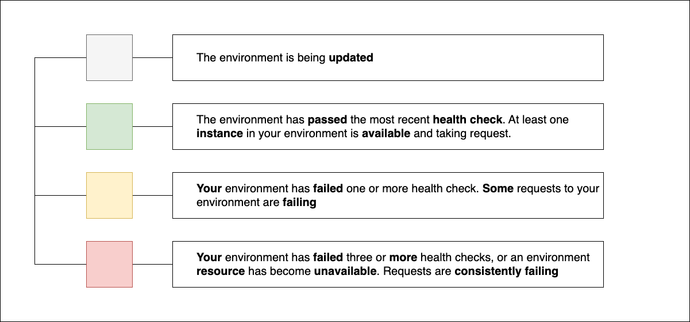

# Compute (DVA-C02)

## Giriş

AWS'de hesaplama yani **compute** hizmetleri üzerine olan bu bölüme hoş geldiniz.

Bu bölümde, sınavda ele alınabilecek AWS'de mevcut çeşitli hesaplama hizmetlerini tanıtan bir dizi alt başlık bulunmaktadır.
Bu bölümün amacı, geliştiriciler için AWS'deki hesaplama hizmetlerine bir giriş sağlamaktır, bunlar:

- Amazon Elastic Compute Cloud (EC2)
- AWS Elastic Beanstalk
- AWS Lambda
-  AWS Serverless Application Model (SAM)

Bu repodaki diğer başlıklarla birlikte, AWS Certified Developer - Associate sınav kılavuzundaki tüm anahtar araçları, teknolojileri ve kavramları ele alacağız ve bu sınavı tam olarak geçmeye hazır olmayı hedefleyeceğiz.

AWS Certified Developer - Associate sertifikası, AWS hizmetlerini kullanarak uygulama geliştirme, test etme, dağıtma ve hata ayıklama konularında bilgi ve deneyime sahip olan herkes için tasarlanmıştır. Bu repoda tanıtılan tüm AWS Cloud kavramlarını temelinden başlayarak açıklamaya çalıştım, umarım bu süreç pekiştirmenizi kolaylaştırır.

## AWS'de (compute) hesaplama nedir?

Hesaplama hizmetlerini, kaynaklarını ve özelliklerini incelemeye başlamadan önce, hesaplama terimiyle ne kastedildiğini anlamamız gerekiyor.

Basitçe söylemek gerekirse, hesaplama kaynakları (compute resources), uygulamalar ve sistemler tarafından bir dizi talimatla hesaplama görevlerini yerine getirmek için gereken beyin ve işlem gücüdür. Yani hesaplama, muhtemelen zaten aşina olduğunuz yaygın sunucu bileşenleri olan CPU'lar ve RAM ile yakından ilişkilidir. Bu bağlamda, bir veri merkezi içindeki fiziksel bir sunucu, muhtemelen birden fazla CPU'ya, işletim sistemi ve uygulamalar tarafından verilen talimatları işlemek için birçok gigabayt RAM'e sahip olduğundan bir hesaplama kaynağı olarak kabul edilebilir.

AWS içinde, farklı işlevler sunmak için hesaplama gücü sağlayan birçok farklı hizmet ve özellik vardır. Bazı hizmetler, aylarca veya hatta yıllarca sürekli olarak kullanılarak milyarlarca talimatı işleyen yüzlerce EC2 örneği (instance) veya sanal sunucu kullanabilir. Ölçeğin diğer ucunda, bir olay yanıtında bir AWS Lambda işlevi içinde birkaç satır Python kodunu yürütmek için yalnızca birkaç milisaniye hesaplama kaynağı kullanmanız gerekebilir. Ardından bu süreci, hesaplama gücünü bırakabilirsiniz. Hesaplama kaynakları, geniş bir kategori yelpazesinde, farklı miktarlarda ve farklı sürelerde kullanılabilir. Çeşitli performans ve fayda seçenekleri sunar. Dolayısıyla AWS içinde kullanacağınız hesaplama kaynakları nihayetinde genel iş gereksinimlerinize bağlı olacaktır ve bu kapsamda değişiklik gösterecektir.

## Amazon EC2: Elastic Compute Cloud

Bu başlık altında Amazon Elastic Compute Cloud veya EC2 hizmetini tanımlayacağız. EC2, AWS ile çalışırken karşılaşacağınız ilk hesaplama hizmeti olabilir. AWS ortamınızda sanal sunucular dağıtmanıza olanak tanır ve çoğu insan en az bir çözümünün bir parçası olarak bir EC2 örneğine ihtiyaç duyar. Bir EC2 örneği oluştururken yer alan bir dizi unsur vardır ve şimdi sırayla bunları açıklayalım. Bu başlık altındaki detaylar, EC2 hizmetinin nasıl çalıştığını tanımlamamıza ve sahip olabileceğiniz birçok soruyu yanıtlamamıza yardımcı olacaktır. EC2 hizmeti şu bileşenlere ayrılabilir:

-   Amazon Machine Images yani AMI'ler,
-   Instance türleri (Instance Types),
-   Instance satın alma seçenekleri (Instance Purchasing Options),
-   Kiralama (Tenancy),
-   Kullanıcı verileri (User Data),
-   Depolama seçenekleri (Storage Options),
-   Güvenlik (Security)

Şimdi bunların her birine ayrı ayrı bakalım.

### AMI : Amazon Machine Images

Öncelikle AMI'leri, Amazon Machine Images'i inceleyelim. AMI'ler, AMI'de tanımlanan yapılandırmaya dayalı olarak hızlı bir şekilde yeni bir EC2 instance'ı başlatmanıza olanak tanıyan önceden yapılandırılmış EC2 instance'lerinin şablonlarıdır. Bu şablonlar, işletim sistemi veya diğer yaygın uygulamaları bir dizi başka EC2 örneğine tek tek yüklemeniz gerekmesinin önüne geçer. Yüksek düzeyde bakıldığında, bir AMI, bir işletim sistemi ve uygulamaları içeren bir image olup, tanımlanmış herhangi bir ek özel yapılandırma ile birlikte gelir.

AWS, Amazon Linux, macOS, Ubuntu ve Microsoft Windows gibi çeşitli işletim sistemlerini kapsayan çok sayıda AMI sağlar. EC2 örneğinizi yapılandırırken, yapmanız gereken ilk yapılandırma seçimi bir AMI seçmektir. Kendi AMI'lerinizi de oluşturarak dağıtım sürecinizi hızlandırabilirsiniz. Örneğin, bir AWS AMI'si seçerek başlayabilirsiniz, belki Amazon Linux. Ve sonra, bu çalışır duruma geldikten sonra, bir dizi özel uygulamanızı yüklemeniz ve diğer belirli yapılandırma değişikliklerini ayarlamanız gerekebilir. Diyelim ki aynı işlevselliği yerine getiren ikinci bir sunucuya ihtiyacınız var. Aynı Amazon Linux AMI'yi seçme sürecini tekrarlayabilir ve uygulamaları manuel olarak yükleyebilirsiniz. Sonrasında, yapılandırma değişikliklerinizi tekrar yapabilirsiniz. Veya, bu değişiklikleri ilk instance'da yaptıktan sonra, tüm uygulamalarınızın yüklü olduğu ve yapılandırma değişikliklerinizin zaten ayarlanmış olduğu bu örneğin yeni bir AMI'sini veya şablonunu oluşturabilirsiniz. Ardından, aynı yapılandırmanın başka bir instance'ine ihtiyacınız varsa, tek yapmanız gereken yeni bir instance için temel image olarak özel AMI'nizi seçmektir. Bu sayede, özel uygulamalarınızın yüklü olduğu, yapılandırma değişikliklerinizin halihazırda ayarlanmış olduğu şekilde başlatılacaktır. Gördüğünüz gibi, bu yaklaşımın birçok faydası vardır ve özellikle artan talepleri karşılamak için temel yapılandırmanızın birden fazla örneğinin hızla devreye alınması gereken otomatik ölçeklendirme uygularken çok işe yarar. Bu da üzerinizden külfetli bir işi almış olacaktır.


Şimdi, AWS tarafından yönetilen ve kendi özel oluşturduğumuz AMI'lerinizin yanı sıra, AWS Marketplace'ten bir AMI de seçebilirsiniz. AWS Marketplace, Cisco Systems, F5, Palo Alto Networks gibi güvenilir satıcılardan AMI satın almanıza olanak tanıyan bir çevrimiçi mağaza gibidir. Bu satıcı AMI'leri, yerleşik güvenlik ve izleme araçlarıyla optimize edilmiş instance'ler gibi belirli uygulamaları ve yapılandırmaları içerir.

Ayrıca, herkes tarafından oluşturulabilen ve paylaşılabilen topluluk AMI'leri olan Community AMI'lerine de göz atabilirsiniz.

### Instance Türleri (Instance Types) 

Şimdi instance çeşitlerine bir göz atalım. Az önce tartıştığımız farklı kaynaklardan AMI'nizi seçtikten sonra, bir instance türü seçmeniz gerekecek. Bir instance türü, örneğin boyutunu, aşağıda listelenen maddeler gibi bir dizi farklı parametreye dayalı olarak tanımlar:

-   vCPU'lar, yani instance'deki sanal CPU'ların sayısı,
-   Mimari, yani işlemci mimarisi, instance'nin i386, x86 veya ARM,
-   Bellek, yani instance ile ilişkilendirilen gigabayt RAM miktarı,
-   Depolama, yani varsa instance'deki yerel instance depolama birimlerinin kapasitesi,
-   Depolama türü, yani instance depolama birimlerinin manyetik sabit diskler (HDD) mi yoksa SSD'ler mi olduğunu gösterir ve
-   Ağ performansı, yani veri aktarım hızını veya performans seviyesini gösterir.

EC2 instance'nin genel kullanımı için bilinmesi gereken ana parametreler, vCPU'lar, bellek, instance depolama ve ağ performansı olarak özetlenebilir. Ancak bu gerçekten sizin gerçek kullanım durumunuza bağlıdır. Yüzlerce istance çeşiti arasından seçim yapma esnekliği, uygulamalarınızda optimal performans için en uygun boyut veya kapasitedeki instance türünü seçmenize olanak tanır. Bu farklı instance türleri, farklı performans avantajları sunan farklı sınıflara ayrılmıştır, bu da yine ihtiyaçlarınıza en uygun instance'i seçmenize yardımcı olur. Bu instance sınıflarından her birinde, farklı CPU, bellek, depolama ve ağ performansına sahip bir dizi instance türü bulunur. Bu instance sınıfları yani kategorileri şu şekilde özetlenebilir:

-   **Genel Amaçlı (General Purpose)**, CPU, bellek ve depolamanın dengeli bir karışımına sahiptir, bu da instance'ları küçük ve orta ölçekli veritabanları, test ve geliştirme ortamları veya web sunucuları için ideal kılar.
-   **Hesaplama İçin Optimize Edilmiş (Compute Optimized)**, hesaplama gücüne daha fazla odaklanır ve toplu işleme, makine öğrenimi gibi yüksek performanslı işlemciler gerektiren uygulamalar için idealdir.
-   **Bellek İçin Optimize Edilmiş (Memory Optimized)**, büyük ölçekli kurumsal sınıf bellek içi uygulamalar için kullanılır, örneğin yapılandırılmamış verilerin gerçek zamanlı işlenmesi gibi.
-   **Hızlandırılmış Hesaplama (Accelerated Computing)**, donanım hızlandırıcıları (hardware accelerators) veya yardımcı işlemciler kullanarak kayan nokta (floating-point) hesaplamalarını daha hızlı ve verimli bir şekilde gerçekleştirir.
-   **Depolama İçin Optimize Edilmiş (Storage Optimized)**, geliştirilmiş depolama için optimize edilmiştir. Bu sınıftaki instance'lar, düşük gecikme süresi ve çok yüksek giriş/çıkış (I/O) performansı için SSD destekli instance depolama kullanır. Bu tip instance'lar çok yüksek IOPS (saniye başına giriş/çıkış işlemleri) sahiptir. Bu instance'ler, veri dosya sistemleri ve günlük (log) işleme uygulamaları için oldukça kullanışlıdır.
-   Ve son olarak, **HPC İçin Optimize Edilmiş (HPC Optimized)**, yüksek performanslı hesaplama (HPC) iş yükleri için tasarlanmıştır.


### Instance Satın Alma Seçenekleri (Instance Purchasing Options)

AWS, EC2 instance'leri için bir dizi farklı satın alma seçeneği sunar. Bu seçenekler, maliyetleri optimize etmenize yardımcı olmak için tasarlanmıştır. Bununla beraber dağıtımınız için en uygun seçeneği seçmenize olanak tanır. Bu seçenekler şu şekilde listelenebilir:

-   Talep Üzerine Instance'ler (On-Demand Instances),
-   Spot Instance'ler (Spot Instances),
-   Rezerve Edilmiş Instance'ler (Reserved Instances),
-   Talep Üzerine Kapasite Rezervasyonları (On-Demand Capacity Reservations),

Tüm bu seçeneklerin farkında olmak sizler için avantajlı olacaktır, çünkü aralarındaki farkları anlamak, kullanım durumunuza bağlı olarak size önemli miktarda maddi tasarruf sağlayabilir. Şimdi bu seçeneklerin her birini daha ayrıntılı olarak inceleyelim. İlk olarak, **Talep Üzerine Instance'ler (On-Demand Instances)** başlayalım.

Talep Üzerine Instance'ler, istediğiniz zaman başlatabileceğiniz ve kullanmanız için dakikalar içinde sağlanabilen ve kullanılabilen EC2 instance'leridir. Talep Üzerine Instance'leri ihtiyacınız olduğu sürece kullanabilir ve instance'i sonlandırına kadar kullanabilirsiniz. Bu instance'lerin, seçtiğiniz instance türüne dayalı olarak saatlik bir sabit ücreti vardır ve saniye bazında faturalandırılır. Talep Üzerine Instance'ler, tipik olarak kesintiye uğramaması gereken kısa vadeli veya düzensiz iş yükleri için kullanılır. Birçok müşteri, test ve geliştirme ortamları için Talep Üzerine Instance'leri kullanır. Ve Talep Üzerine Instance'nizi durdurduğunuzda veya sonlandırdığınızda, bunun için ödeme yapmayı bırakırsınız.

Sonraki seçeneğimiz **Spot Instance'leri**, Talep Üzerine fiyatlandırmaya göre büyük indirimler sağlamak için kullanılmayan EC2 kapasitesini kullanır. Spot instance'lerin, arz ve talebe göre AWS tarafından belirlenen değişken bir saatlik fiyatı vardır. Spot Instance'leri başlatırken, ödemek istediğiniz maksimum fiyatı belirleme opsiyonuna sahipsiniz. Spot fiyatı maksimum fiyatınızı aşmadıkça, Spot Instance'niz çalışmaya devam eder. Bununla birlikte, Spot fiyatı maksimum fiyatınızı aşarsa, Spot Instance'niz AWS tarafından otomatik olarak sonlandırılacak ve yalnızca örneğin çalıştığı süre için ödeme yapacaksınız. Spot instance'ları, kesintilere dayanıklı olan ve önceden tahmin edilebilir veya esnek başlangıç ​​ve bitiş süreleri olan uygulamalar için kullanmak daha caziptir. Örneğin, veri analizleri veya işleme işleri gibi. Spot instance'lar, büyük veri analizleri veya toplu işleme gibi kesintiye uğramaya dayanıklı iş yüklerini çalıştırmak için harika bir yollardan biridir.

Bir başka seçenek de, belirli bir süre için özel bir kapasiteyi rezerve etmek olan **Rezerve Edilmiş Instance'lerdir**. Rezerve Edilmiş Instance'ler, sabit ve uzun vadeli iş yükleri için optimize edilmiş, maliyet tasarrufu sağlayan fiyatlandırma modelini içerir. Rezerve Edilmiş Instance'ler ya bir yıllık ya da üç yıllık taahhütlerle satın alınabilir. Rezerve Edilmiş Instance'lerle, başlangıçta ödemek istediğiniz miktara bağlı olarak daha fazla tasarruf edebilirsiniz:

- **Tamamı Peşin (All Upfront)** seçeneğiyle, Rezerve Edilmiş Instance için tam ödeme dönem başında yapılır. Bu teklif, en büyük indirimi sunar ve instance'nin kullanıldığı saat sayısına bakılmaksızın başka bir ödeme gerekmez.

- **Kısmi Peşin (Partial Upfront)** seçeneğini seçerseniz, dönem başında daha küçük bir ödeme yapılır ve ardından dönem boyunca kalan tüm saatlere indirim uygulanır.

- Ve son olarak, **Peşinatsız (No Upfront)** seçeneğiyle, hiçbir peşin veya kısmi ödeme yapılmaz. Bu durum ise, üç seçenek arasında en küçük indirim dönemdeki kalan tüm saatlere uygulanır.

Bir Rezerve Edilmiş Instance satın aldığınızda, bu instance tüm bir veya üç yıllık dönem boyunca sizindir ve iptal edilemez. Ancak, dönem süresince bilişim ihtiyaçlarınız değişirse, Rezerve Edilmiş Instance'nizde değişiklikler yapmak veya hatta seçtiğiniz teklif sınıfına bağlı olarak başka bir türle değiştirmek mümkün olabilir. Rezerve Edilmiş Instance'ler, Standart ve Dönüştürülebilir olmak üzere iki teklif sınıfında gelir. Standart Rezerve Edilmiş Instance kullanırken, instance'nizin bazı özelliklerini değiştirmek mümkündür, bunlara kullanılabilirlik bölgesi veya mevcut instance sınıfınızın içindeki boyut gibi değerlerdir. Örneğin t2.micro'dan t2.large'a geçmek sunulan değiştirilebilir özelliklerdendir. Ancak, Standart Rezerve Edilmiş Instance'ler farklı bir instance sınıfıyla değiştirilemez veya değişiklik yapılamaz. Bunu örneklendirmek gerekirse; t2.large'dan m4.large'a geçmek mümkün olmayacaktır. Bununla birlikte, AWS Rezerve Edilmiş Instance mağazalarında (AWS Reserved Instances Marketplace), Standart Rezerve Edilmiş Instance'leri alıp satmak mümkündür.

Şimdi ise diğer seçeneğe bakalım: Dönüştürülebilir Rezerve Edilmiş Instance. Dönüştürülebilir Rezerve Edilmiş Instance de az önce açıkladığımız gibi değiştirilebilir, ancak aynı zamanda tamamen yeni özelliklere sahip başka bir Dönüştürülebilir Rezerve Edilmiş Instance'le de değiştirilebilir; bu farklı bir instance sınıfı, türü veya platformu içerebilir. Ancak bu daha büyük esneklik karşılığında, Dönüştürülebilir Rezerve Edilmiş Instance'ler, Standart Rezerve Edilmiş Instance'lere göre daha küçük bir indirimle gelir. Ve Standart Rezerve Edilmiş Instance'lerin aksine, AWS Reserved Instances Marketplace üzerinde, Dönüştürülebilir Rezerve Edilmiş Instance'leri alıp satmak mümkün değildir.

Rezerve Edilmiş Instance'lere (Reserved Instances) benzer şekilde, İsteğe Bağlı Kapasite Rezervasyonları (On-Demand Capacity Reservations), belirli bir kullanılabilirlik bölgesinde instance türü ve platform gibi farklı özelliklere dayalı olarak EC2 instance'leriniz için kapasite ayırmanıza olanak tanır. Ancak, İsteğe Bağlı Kapasite Rezervasyonları sadece bir yıl veya üç yıl değil, herhangi bir süre için kullanılabilir. Bu, belirli bir kullanılabilirlik bölgesinde ihtiyaç duyduğunuz sayıda instance'nin her zaman hemen kullanılabilir olmasını ve gereksiz yere uzun bir zaman taahhüdü olmadan kullanabimenizi sağlar. İsteğe Bağlı Kapasite Rezervasyonlarını kullanırken herhangi bir fatura indirimi almazsınız, ancak bu rezervasyonları ihtiyaç duyduğunuz sıklıkta oluşturma ve iptal etme esnekliğine sahip olursunuz. Ek maliyet tasarrufu için, İsteğe Bağlı Kapasite Rezervasyonlarını, Rezerve Edilmiş Instance'lere veya belirli bir süre boyunca belirli bir miktarda hesaplama gücü kullanma taahhüdü karşılığında para tasarrufu yapmanıza olanak tanıyan EC2 Instance Tasarruf Planlarıyla (EC2 Instance Savings Plans) birleştirebilirsiniz.


### Kiralama (Tenancy)

Bu, EC2 instanceleri için satın alma seçeneklerini kapsar. Şimdi EC2 kiralama ve EC2 instance'nizin bulunacağı bir AWS veri merkezindeki altta yatan ana bilgisayar veya fiziksel sunucuyla nasıl ilişkili olduğunu tartışalım. Yeni bir EC2 instance'i başlattığınızda, varsayılan olarak paylaşılan kiracılıkla (shared tenancy) çalışacaktır. Bu, seçtiğiniz instance türü için gerekli olan belirtilen kaynaklara sahip herhangi bir kullanılabilir ana bilgisayarda çalışacağı anlamına gelir. Sizinle birlikte, aynı ana bilgisayarda instance çalıştıran diğer müşteriler ve kullanıcılar kim olursa olsun aynı makinede barınacaktır, bu yüzden bu tür kiralamaya paylaşılan kiracılık adı verilir. AWS, farklı müşterilerin EC2 instance'lerin aynı ana bilgisayarda birbirlerine erişmesini önlemek için gelişmiş güvenlik mekanizmaları uygular. Bu yüzden burada herhangi bir güvenlik riski yoktur, ancak iç güvenlik politikaları veya dış uyumluluk kontrolleri nedeniyle iş yüklerinizin adanmış yani dedike edilmiş donanımda çalışması gereken durumlar olabilir. Bu durumlarda, tahsis edilmiş kiracılık (dedicated tenancy) kullanmak isteyebilirsiniz.

Tahsis edilmiş ya da adanmış kiracılık, hem Tahsis Edilmiş Instance'leri hem de Tahsis Edişmiş Ana Bilgisayarları (dedicated hosts) barındırır. Tahsis Edilmiş Instance'ler, başka hiçbir müşterinin erişemeyeceği donanımda barındırılır. Bunlar ek ücretlere tabidir çünkü başka hiçbir müşteri aynı donanımda EC2 instance'leri çalıştıramaz ve bu nedenle muhtemelen kullanılmayan kapasite kalacaktır. Ancak, bu donanım kendi AWS hesabınızda çalışan diğer kaynaklarla paylaşılabilir. Tahsis Edilmiş Ana Bilgisayar (Dedicated Host), temelde Tahsis Edilmiş Instance'ler (Dedicated Instance) ile aynıdır. Ancak, Tahsis Edilmiş Ana Bilgisayarlar, instance'lerinizi fiziksel ana bilgisayara nasıl yerleştirebileceğiniz konusunda ek görünürlük ve kontrol sunar. Ayrıca, belirli bir makineye bağlanması gerekebilecek mevcut soket başına, çekirdek başına veya VM başına yazılım lisanslarınızı kullanmanıza olanak tanır. Ancak tahsis edilmiş kiracılık gerektiren herhangi bir özel lisanslama, uyumluluk veya güvenlik sorununu ele almanız gerekmiyorsa, o zaman genel maliyetlerinizi azaltmak için varsayılan olan paylaşılan kiracılığı (shared tenancy) kullanmanızı önerilir.


### Kullanıcı Verileri (User Data)

Yeni bir EC2 instance'si yapılandırırken, Kullanıcı Verileri (User Data) adlı bir bölümle karşılaşacaksınız. Bu, instance'nin ilk önyükleme döngüsü sırasında çalışacak komutları veya bir komut betiği girmenize olanak tanır. Bu, önyükleme sırasında otomatik olarak işlevleri gerçekleştirmenin harika bir yoludur. Örneğin, instance'nin sahip olabileceğiniz herhangi bir yazılım deposundan (repo) yüklemek üzere ek yazılımları kurmak gibi. Ayrıca en son işletim sistemi güncellemelerini indirip yükleyebilirsiniz. Örneğin, `yum update -y` girebilirsiniz, bu bir Linux instance'i için önyükleme sırasında kendi yazılımını otomatik olarak güncelleyecektir.


### Depolama seçenekleri (Storage Options)

Yeni bir EC2 instance'i kurarken, depolama gereksinimlerinizi seçmeniz ve yapılandırmanız da istenecektir. EC2 instance'niz için depolama seçimi, seçilen instance türüne, instance'i nasıl kullanmayı planladığınıza ve verilerinizin ne kadar kritik olduğuna bağlı olacaktır. EC2 için depolama, kalıcı veya geçici (persistent / ephemeral) olarak sınıflandırılabilir. Kalıcı depolama, Amazon Elastic Block Store veya EBS kullanılarak elastik blok depolama birimleri eklenerek kullanılabilir. Geçici depolama, bazı EC2 instance'lerinin kendileri tarafından, altta yatan fiziksel ana bilgisayardaki yerel diskler olan instance depolama birimleri kullanılarak oluşturulur.

Bu depolama seçeneklerinin her birine daha ayrıntılı bakalım. EBS birimleri, EC2 instance'nin kendisinden ayrı cihazlardır, bu nedenle geçici depolama gibi fiziksel olarak bağlı değillerdir. EBS birimleri, ağa bağlı depolama cihazları olarak kabul edilir ve AWS ağı üzerinden EC2 instance'sine mantıksal olarak bağlanır. Bu, dizüstü bilgisayarınıza veya kişisel bilgisayarınıza harici bir sabit disk bağlamaya benzer; burada harici sabit disk EBS biriminizi, kişisel bilgisayarınız ise EC2 örneğinizi temsil eder.

EBS birimlerinizdeki veriler, dayanıklılık için aynı kullanılabilirlik bölgesi (availabity zone) içinde otomatik olarak çoğaltılır ve bu AWS tarafından yönetilir. EBS birimini EC2 instance'nizden ayırabilirsiniz ve veriler bozulmadan kalır. Böylece gerekirse aynı kullanılabilirlik bölgesindeki başka bir EC2 instance'ine yeniden bağlayabilirsiniz. Ayrıca, bir EBS birimindeki tüm verileri S3'e yedekleyecek belirli bir zamandaki anlık görüntüler (snapshots) almak da mümkündür.

Gerekirse EBS birimlerinizde şifreleme (encryption) de uygulayabilirsiniz. Bu, AWS konsolundaki EC2 panelinden varsayılan olarak şifrelemeyi etkinleştirerek, oluşturduğunuz tüm yeni EBS birimleri ve anlık görüntü kopyaları için varsayılan olarak yapılabilir. Bunun yerine, birim bazında şifrelemeyi etkinleştirmeyi de seçebilirsiniz.

EBS birimleri, gereksinimlerinize bağlı olarak farklı boyutlarda ve farklı performans yetenekleriyle oluşturulabilir. 

Geçici depolama veya instance destekli depolama (instance-backed storage), EC2 instance'nin bulunduğu altta yatan ana bilgisayara fiziksel olarak bağlı depolamadır. EBS biriminden farklı olarak, geçici bir instance depolama birimini bir instance'den ayıramazsınız. Önceki örneğimize dönersek, bu dizüstü bilgisayarınızın veya kişisel bilgisayarınızın dahili sabit diskine benzer. Ancak burada önemli bir fark var. EC2 instance'lerinde, bir instance depolama biriminde kaydedilen tüm veriler, instance uyku moduna geçer geçmez, durdurulur veya sonlandırılırsa kaybolur. Örneğinizi yeniden başlatırsanız, veriler kalacaktır. Ancak instance uyku moduna geçer (hibernated), durdurulur (stopped) veya sonlandırılırsa (terminated), ya da altta yatan diskte herhangi bir donanım arızası olursa, o instance depolama birimindeki veriler sonsuza dek kaybolacaktır.

Instance depolama birimleri fiziksel olarak bağlı olduğundan, son derece hızlıdırlar, bu da onları önbellek verilerini ve diğer geçici içerikleri depolamak için harika kılar. Ancak saklamanız gereken verileriniz varsa, bunun yerine kalıcı veri depolama için EBS birimlerini kullanmalısınız.

### Güvenlik (Security)

Güvenlik (Secuirty), herhangi bir AWS dağıtımının temelidir. Bunu göz önünde bulundurarak, özellikle EC2 güvenliğiyle ilgili birkaç noktayı vurgulamamız gerekir. Bir EC2 örneği oluştururken, örneğiniz için bir güvenlik grubu (security group) seçmeniz istenecektir. Güvenlik grubu, temelde instance düzeyinde bir güvenlik duvarıdır ve hangi trafiğin instance'nizle iletişim kurmasına izin verildiğini belirterek, instance'nize gelen ve giden trafiği kısıtlamanıza olanak tanır. Bu iletişimi, hem gelen (inbound )hem de giden (outbound) iletişim için kaynak bağlantı noktalarına ve protokollere göre kısıtlayabilirsiniz. Instance'lerinizi daha sonra bu güvenlik grubuyla ilişkilendirilir ve bu grup diğer instance'lerle de ilişkilendirilebilir.

Bir EC2 örneği oluştururken, mevcut bir anahtar çifti (key pair) seçmeniz veya yeni bir tane oluşturup indirmeniz de gerekecektir. Peki, anahtar çifti nedir ve ne için kullanılır? Adından da anlaşılacağı gibi, bir anahtar çifti iki anahtardan oluşur: bir genel anahtar (public key) ve bir özel anahtar (private key). Anahtar çiftleri, Linux ve Windows EC2 instance'leri için oturum açma bilgilerini şifrelemek, ardından aynı bilgileri çözerek instance'e kimlik doğrulaması yapmanıza olanak tanımak için kullanılır.

Genel anahtar (public key), kullanıcı adı ve şifre gibi verileri şifrelemek için kullanılır. Windows instance'leri için özel anahtar (private key), şifre dahil oturum açma kimlik bilgilerine erişmenize olanak tanıyarak bu verilerin şifresini çözmek için kullanılır. Linux instance'leri için özel anahtar, SSH kullanarak instance'a uzaktan bağlanmak için kullanılır.

Genel anahtar AWS tarafından tutulur ve saklanır, ancak özel anahtarı saklamak ve asla kaybolmadığından veya tehlikeye girmediğinden emin olmak sizin sorumluluğunuzdadır. EC2 örneğiniz için yeni bir anahtar çifti oluşturmayı seçerseniz, oluşturduktan sonra yerel makinenize indirilecektir. Bunu yaptıktan sonra, ilgili EC2 instance'ine bağlanmaya hazır olana kadar o dosyayı güvenli bir şekilde saklamalısınız.

Birden fazla özel anahtarı yönetmek zorunda kalmamak için aynı anahtar çiftini birden fazla instance için kullanabileceğinizi belirtmekte fayda var. Ancak, özel anahtarınızın tehlikeye girmesi durumunda, o anahtar çiftinin kullanıldığı herhangi bir instance'ye erişim sağlanabileceğini unutmayın.

EC2 örneğinize ilk kez kimlik doğrulaması yaptıktan sonra, diğer kullanıcıların instance'nize bağlanmasına ve kimlik doğrulaması yapmasına olanak tanıyan yerel Windows hesapları gibi ek, daha az ayrıcalıklı erişim kontrolleri kurabilirsiniz.

EC2 örneğinizdeki güvenlikle ilgili son bir nokta: AWS Paylaşılan Sorumluluk Modeli'nin (AWS Shared Responsibility Model) öngördüğü şekilde, işletim sistemi satıcısı tarafından yayınlanan en son işletim sistemi ve güvenlik yamalarını korumak ve yüklemek sizin sorumluluğunuzda olduğunu unutmayın.

## EC2 Otomatik Ölçeklendirme (Auto Scaling)

EC2 Auto Scaling'i detaylandıracağımız alt başlıkların ilkine hoş geldiniz. Peki, EC2 Auto Scaling tam olarak nedir? Basitçe söylemek gerekirse, Auto Scaling, özel olarak tanımlanmış ölçümler ve eşikler temelinde talebi karşılamak için EC2 kaynaklarınızı otomatik olarak artırmanıza veya azaltmanıza olanak tanıyan bir mekanizmadır.

AWS'de, EC2 instance'leriniz ölçeklendirilmesine odaklanan EC2 Auto Scaling vardır, ancak aynı zamanda bir Auto Scaling hizmeti de bulunmaktadır. Auto Scaling hizmeti, Amazon Aurora replikalarının yanı sıra Amazon ECS görevlerini, DynamoDB tablolarını ve indekslerini ölçeklendirmenize olanak tanır. Bu başlık kapsamında sadece EC2 Auto Scaling'e odaklanacağız.

EC2 Auto Scaling'in pratikte nasıl kullanılabileceğine dair bir örneğe bakalım. Diyelim ki internet üzerinden genel kullanıcılardan gelen istekleri alan bir web sunucusu olarak çalışan tek bir EC2 instance'niz var. İstekler ve talep arttıkça, instance üzerindeki yük de artar. Ek istekleri işlemek için ek işlem gücü gerekecek ve dolayısıyla CPU kullanımı da artacaktır. Son kullanıcılarınızın (end user) yaşayacağı düşük performansa yol açacak olan instance'nizdeki CPU kaynağının tükenmesini önlemek için, talebi dengelemek ve artan istekleri işlemek üzere başka bir EC2 instance'i dağıtmanız gerekecektir.

Auto Scaling ile, ilk instance'deki CPU kullanımı %75'e ulaştığında otomatik olarak ikinci bir instance başlatacak bir metrikler yapılandırabilirsiniz. Trafiği yükünü eşit şekilde dengeleyerek, her bir instance'e uygulanan talebi azaltır ve ilk web sunucusunun yüksek CPU kullanımı nedeniyle başarısız olma, yavaşlama gibi durumlarının önüne geçersiniz.

Benzer şekilde, web sunucunuza olan talep azaldığında, CPU kullanımınız da azalacaktır. Böylece geri ölçeklendirmek için de bir metrik belirleyebilirsiniz. Bu instance'da, CPU kullanımı %20'ye düştüğünde, azalan talep nedeniyle artık gerekli olmayacağı için Auto Scaling'i EC2 instance'lerinden birini otomatik olarak sonlandıracak (terminate) şekilde yapılandırabilirsiniz.

Kaynaklarınızı geri ölçeklendirmek, EC2 kaynaklarınız maliyetini optimize etmeye yardımcı olur çünkü kaynaklar için yalnızca çalıştıkları zaman ödeme yaparsınız. Bu özelleştirilebilir ve tanımlanmış metrikler aracılığıyla, EC2 kaynaklarınızın boyutunu otomatik olarak kolayca artırabilir (dışa ölçeklendirme) ve azaltabilirsiniz (içe ölçeklendirme).

Bunun birçok avantajı vardır ve işte bazı önemli noktalar:

İlk olarak, **otomasyon (automation)**. Auto Scaling, özel olarak tanımlanmış eşiklere dayalı otomatik provizyon sağladığı için, altyapınız gerekli kaynakları elastik olarak sağlayabilir ve operasyon ekibinizin altyapınıza uygulanan talepleri karşılamak için manuel olarak kaynakları dağıtmasını ve kaldırmasını önler.

**Daha yüksek müşteri memnuniyeti**. Talep arttığında ortamınızda her zaman yeterli kapasite sağlayabiliyorsanız; son kullanıcılarınızın performans sorunları yaşama olasılığı düşüktür. Bu sayede kullanıcı tutmanıza yardımcı olur.

Ve **maliyet azaltma**. Talep düştüğünde sahip olduğunuz kaynak miktarını otomatik olarak azaltma yeteneği ile, bu kaynaklar için ödeme yapmayı durdurursunuz. Bir EC2 kaynağı için yalnızca çalışır durumda olduğunda ödeme yaparsınız ve bu da saniye bazında hesaplanır.

Auto Scaling'i bir **Elastic Load Balancer** ile birleştirdiğinizde, kaynaklarınız için ölçeklenebilir ve esnek bir mimari oluşturmanın ne kadar faydalı olabileceğini gerçekten anlarsınız.

Bir sonraki başlıkta, Auto Scaling'in nasıl yapılandırılacağına dair bir detaylandırmadan önce Auto Scaling'in farklı bileşenlerini açıklayacağız.

## EC2 Auto Scaling Bileşenleri

Bu başlık altında, EC2 otomatik ölçeklendirmenin farklı bileşenlerine odaklanacağız. Bu detaylandırma birlikte, sürecin ve hizmetin nasıl çalıştığını anlamanız kolaylaşacak. Yapılandırmada iki belirgin adım vardır. İlk adım, başlatma yapılandırması (launch configuration) / başlatma şablonunun (launch template) oluşturulmasıdır. İkinci kısım ise bir otomatik ölçeklendirme grubunun (auto scaling group) oluşturulmasıdır.

EC2 otomatik ölçeklendirme kullanırken, bir başlatma yapılandırması veya başlatma şablonu oluşturabilirsiniz. Her ikisi de bir otomatik ölçeklendirme grubunun yeni EC2 instance'lerin nasıl oluşturacağını tanımlamaktadır. İkisi de yeni bir instance başlatırken gerekli olan;
- Hangi Amazon Machine Image'ın (AMI) kullanılacağı, 
- Hangi instance türünün seçileceği, 
- Maliyetleri düşürmeye yardımcı olmak için Spot Instance'leri kullanmak isteyip istemediğiniz, 
- Instance'lerin için genel IP adreslerinin kullanılıp kullanılmayacağı, 
- İlk önyükleme (first boot) sırasında otomatik komut dosyası çalıştırma için herhangi bir kullanıcı verisinin gerekli olup olmadığı, 
- Hangi depolama birimi yapılandırmasının kullanılması gerektiği,
- Hangi güvenlik grubunun uygulanması gerektiği gibi,

 bir dizi soruyu yanıtlar. Daha önce manuel olarak bir EC2 örneği oluşturduysanız, bu adımların çoğuna aşina olabilirsiniz, oldukça benzerdir.

Başlatma şablonu (launch template), temelde başlatma yapılandırmasının (launch configuration) daha yeni ve daha gelişmiş bir versiyonudur. Bir şablon olarak, otomatik ölçeklendirme gruplarınız için instance'leri başlatma şeklinizi basitleştirmenize olanak tanıyan standart bir yapılandırma oluşturabilirsiniz. Şimdi hem bir başlatma yapılandırması (launch configuration) hem de bir başlatma şablonu (launch template) nasıl oluşturulacağına adım adım bakalım.

İlk olarak AWS hesabına giriş yapalım ve yönetim konsolu ekranına ulaşalım. Başlatma şablonlarımızı ve başlatma yapılandırmalarımızı oluşturmak için hesaplama (compute) altında EC2'ye girmemiz gerekiyor. İlk etapta başlatma şablonunu oluşturarak başlayalım. Daha sonra, aralarındaki farkları görebilmemiz için başlatma yapılandırmasını oluşturacağız.

Şimdi sol tarafta, instances altında, başlatma şablonlarını (launch template) görebilirsiniz. Onu seçerseniz, sadece hızlı bir karşılama ekranı sizi bekliyor olacak, başlatma şablonlarına hoş geldiniz diyor. Bu sayfa bizlere kısa bir özet sunuyor. Bir başlatma şablonu oluşturmak için başlatma şablonu oluştur (Create launch templete) düğmesine tıklayacağız. Bu butona tıkladıktan sonra, üzerinde bir dizi yapılandırılabilir parametre bulunan tek bir sayfa belirecektir. Hadi her birini gözden geçirelim.

İlk olarak, yeni bir şablon oluşturabilir veya yeni bir şablon sürümü oluşturabiliriz. Mevcut bir şablonumuz olmadığı için, o şablonun yeni bir sürümünü oluşturamayız. O yüzden yeni bir şablon oluşturarak sıfırdan başlayalım. Buna bir isim verelim. Ben buna sadece 'LaunchTemplete' diyeceğim. Ve açıklama olarak 'demo' yazacağım. Burada kaynak şablonu belirleyebiliriz, bu esasen zaten sahip olabileceğiniz mevcut bir şablondan bir şablon oluşturmanıza olanak tanır. Ve daha önce değindiğimiz gibi, şu anda başka şablonumuz yok. Bu yüzden bunu yapamayız ve zaten biz sıfırdan bir şablon nasıl oluşturulacağını göstermek istiyoruz. Sayfanın aşağısında başlatma şablonu içeriği (launch templete content) bölümü var. İşte bu alan, tam olarak ne başlatacağımızın asıl yapılandırmasına geçmeye başlıyoruz.

AMI ID'sini seçerek başlayabiliriz. AMI'yi ara seçeneğine (search for AMI) tıklarsak, farklı kataloglara göz atabiliriz. Hızlı başlangıç (Quick Start), kendi AMI'leriniz, mağazadan bir AMI veya topluluk AMI'lerinden herhangi birini seçebilirsiniz. Hızlı başlangıçla (Quick Start) devam edelim. Ve sonra bir AMI seçebiliriz, burada en üsttekini, Amazon Linux'u seçelim. AMI'yi seçtikten sonra, bir instance türü seçebiliriz. T1 mikro'yu seçelim. Ve eğer mevcut anahtar çiftlerimiz (key pair) varsa, instance'lerimize bağlanmamıza izin vermek için mevcut bir anahtar çifti seçebiliriz. Bu instance'da, mevcut bir anahtar çifti seçeceğim. Dilerseniz kendinize hızlıca bir anahtar çifti oluşturabilirsiniz. Sadece private key'inizi güvenli bir yerde sakladığınızdan emin olun.

Ardından, bu örneğin bulunacağı ağ türü, VPC ortamında mı yoksa klasik ortamda mı olduğu, biz VPC'yi seçeceğiz. Şimdi burada ayrıca herhangi bir güvenlik grubu da ekleyebiliriz. Yine, sahip olabileceğiniz mevcut güvenlik gruplarını seçmenize olanak tanıyan bir açılır liste var. Ben burada birkaç farklı grup seçeceğim.

Daha aşağıda, herhangi bir ek ağ arayüzü eklemek istiyorsanız, buradan ağ arayüzü ekle'ye tıklayarak ve ilgili alanları doldurarak bunu yapabilirsiniz. Bu instance'da buna gerek yok.

Şimdi burada depolama birimleri var. Sekiz gigabaytlık bir EBS birimi, genel amaçlı (general purpose) olarak geliyor. Ve istersek burada şifrelemeyi (encryiption) belirleyebiliriz ve sonlandırmada sırasında silme (Delete on termination) seçeneğini evet veya hayır olarak, IOPS'u vb. belirleyebiliriz. Ve istersek buraya ek birimler de ekleyebiliriz.

Daha aşağıda instance etiketleri var. Bir etiket ekleyelim, örneğin key olarak 'project' ve value olarak 'aws-developer' olarak devam edelim. Bu hem instance'i hem de birimi etiketleyecektir.

Gelişmiş ayrıntılara (Advanced details) gidersek, bunun bir Spot Instance olmasını isteyip istemediğimizi seçebiliriz. Başlatıldığında EC2 örneğinize bir rol ilişkilendirmenize olanak tanıyan bir instance profili seçebiliriz. Kapatma davranışını seçebiliriz, kapattığımızda sonlandırılmasını (terminate) mı yoksa sadece durmasını (stop) mı istediğimizi belirleyebiliriz. Ve instance'nizle ilgili seçebileceğiniz bir dizi başka gelişmiş seçenek var.

En altta, önyüklemede (boot) herhangi bir komut çalıştırmak istiyorsanız kullanıcı verileri (user data)  alanı bulunur. Tüm değerlerinizden memnun olduğunuzda, tek yapmanız gereken 'Create lanuch templete' butonuna tıklamaktır. İşte bu kadar.

Artık başlatma şablonumuzun oluşturulduğunu görebiliriz. Varsayılan sürüm bir (1) ve en son sürüm de bir (1) olarak görünecektir. İstersek bu oluşturduğumuz şablonu temel alan başka bir başlatma şablonu oluşturup farklı bir sürüm verebiliriz.

Şimdi başlatma şablonunun başlatma yapılandırmasıyla nasıl karşılaştırıldığına bakalım.

Şimdi, başlatma yapılandırması (launch configuration) sol tarafta, Auto Scaling başlığının en altında yer alıyor. Başlatma yapılandırmalarına tıklarsanız, bu esasen başlatma şablonuyla aynıdır. Ancak başlatma şablonunun biraz daha fazla seçeneği var ve oluşturulması daha basit, genel kullanıcı kitlesi tarafından tercih edilen yöntem genelde budur. Yine de siz, başlatma yapılandırmaları oluşturabilirsiniz. Hadi bir bakalım. Create launch configurations butonuna tıklayalım.

Burada AMI'mizi seçebiliriz. Ve yine, başlatma şablonunda olduğu gibi burada farklı kataloglarımız var. Esasen sadece farklı şekilde sunuluyor. AMI'yi seçin. Burada instance türümüzü seçebiliriz. Ve yine bu seçenek başlatma şablonunda da vardı. Burada bir isim verebiliriz. Buna 'LaunchConfigurations' diyelim. Yine, Spot Instance kullanmak isteyip istemediğinizi seçebilir ve bir IAM rolü seçebilirsiniz. Başlatma şablonunda da instance profilini seçebiliyordunuz.

Gelişmiş seçeneklere geçersek, burada başlatma şablonunda olduğu kadar çok gelişmiş seçenek yok, orada çok daha uzun bir listemiz vardı. Ancak, kullanıcı verileri, Kernel ID'si belirtme vb. gibi ihtiyaç duyabileceğiniz bir dizi seçenek hala burada mevcut.

Depolamaya geçersek, yine seçtiğiniz instance türü için varsayılan depolama ile geliyor. Ve yine ihtiyacınız varsa yeni birimler ekleyebilirsiniz. Yani temelde başlatma şablonuna oldukça benzer.

Burada güvenlik gruplarınızı seçebilirsiniz, mevcut bir grup seçebilirsiniz. Yani şablonda olduğu gibi, burada da ihtiyacınız olan güvenlik gruplarını seçebilirsiniz. Ardından 'Review' butonuna tıklayın. Ve burada seçtiğiniz tüm seçeneklerin bir özeti var. Bunlardan memnun olduğunuzda, sadece Create Launch Configurations butonuna tıklayın.

Son olarak, burada bir anahtar çifti seçebilir veya ihtiyacınız varsa yeni bir anahtar çifti oluşturabilirsiniz. Bu aşamada şablon oluştururken kullandığım anahtar çiftini kullanarak devam ediyoruz. Ardından 'Create Launch Configurations' butonuna tıklayın. İşte, başlatma yapılandırmamız hazır.

Yani, otomatik ölçeklendirme gruplarınızın hangi instance'leri başlatacağını ve nasıl yapılandırılacağını bilmesi için bu yapılandırmayı oluşturmanın iki farklı yöntemi var. İkisi arasındaki temel fark, başlatma şablonlarının bir dizi farklı ekran arasında geçiş yapmak yerine seçeneklerinizi hızlıca seçmenize olanak tanıyan tek bir sayfada sunulmasıdır. Ayrıca biraz daha gelişmiş özellikler ve seçenekler de içeriyor. 

**Başlatma yapılandırması veya başlatma şablonu olmadan, otomatik ölçeklendirme hangi örneği başlattığını ve hangi yapılandırmaya göre başlattığını bilemezdi. Bu nedenle, otomatik ölçeklendirme grubunuzu oluşturmadan önce başlatma yapılandırmanızı tanımlamanız gerekir.** Peki otomatik ölçeklendirme grubu (Auto Scaling Group) ne yapar? Otomatik ölçeklendirme grubu, ölçeklendirme politikalarını kullanarak grubun istenen kapasitesini ve diğer sınırlamalarını ve grubun kaynaklarınızı nerede ölçeklendirmesi gerektiğini, instance'nin hangi kullanılabilirlik bölgesinde olması gerektiği gibi metrikleri ve seçenekleri tanımlar.

Bir otomatik ölçeklendirme grubu oluşturma konusunda başka bir senaryo aracılığıyla bu ayrıntıların her birine daha yakından bakalım. Bu senaryo sırasında, önceki başlatma şablonumuza dayalı yeni bir otomatik ölçeklendirme grubu oluşturacağız. Ve grup boyutunu hem artırmak hem de azaltmak için ne zaman harekete geçileceğini tanımlayan bir otomatik ölçeklendirme politikası oluşturacağız. Hadi bir bakalım.

Yine AWS Yönetim Konsolu sayfasındayız. Ve otomatik ölçekleme grubumuzu oluşturmak için EC2 seçeneğine gitmemiz gerekiyor, bu da compute (hesaplama) altında bulunur. Ve sonra sol alt tarafta otomatik ölçekleme (Auto Scaling) başlığı altında otomatik ölçekleme gruplarını (Auto Scaling Groups) seçeneğini görebiliriz, bu yüzden buna tıklayalım. Ve bu tıklama bizi, grubumuzu oluşturabileceğimiz sayfaya yönlendirecektir. İlk olarak,  "create auto scaling group" (otomatik ölçekleme grubu oluştur) düğmesine tıklıyoruz. Açılan sayfa, bir başlatma yapılandırmasından veya bir başlatma şablonundan oluşturabiliriz. Bu yüzden yeni ve tercih edilen seçenek olan başlatma şablonunu (launch templete) seçeneği ile devam edelim. Açılan sayfada kullanmak istediğimiz başlatma şablonunu seçebiliriz. Burada, önceki senaryoda oluşturduğum şablonu seçiyoruz. Kullanmak istediğim başlatma şablonunu seçtikten sonra, "next step" (sonraki adım) düğmesine tıklıyorum. Şimdi ona bir grup adı verebiliriz. Bu aşamada isim olarak sadece 'demo' diyelim. Başlatma şablonumuzun birden çok versiyonu olsaydı, burada farklı versiyonları seçebilirdik. Ama şu anda sadece tek bir versiyonumuz var. Fleet composition seçeneğine gelince, başlatma şablonu yapılandırmamıza uyabiliriz. Ya da farklı satın alma seçenekleri ve instance'lerin bir kombinasyonunu kullanabiliriz. Başlatma şablonumuzda kullandığımız yapılandırmayı kullanmak istiyorum. Grup boyutuna (Group Size) gelince, otomatik ölçekleme grubumuzda iki instance ile başlayalım. Ve bunu başlatmak istediğim uygun VPC'yi seçebiliriz. VPC'yi seçtikten sonra, istediğimiz alt ağları seçebiliriz. Şimdi VPC'mizde birkaç alt ağ (subnet) seçelim. Şimdi gelişmiş (advanced) ayrıntılara doğru indiğimizde, burada bir dizi başka seçenek bulunur. Şimdi auto scaling grubumuzu bir yük dengeleyici (load balancer) ile ilişkilendirmek istiyorsak, bunu burada yapabiliriz. Ve yük dengeleyicimizi ve hedef gruplarımızı seçebiliriz. Ama şu anda bunu boş bırakacağz çünkü sonraki başlıkta mevcut bir otomatik ölçekleme grubunu yeni yük dengeleyicilerinizden biriyle nasıl ilişkilendireceğiniz konusuna detaylıca değineceğiz. Bu yüzden şu anda bunu boş bırakalım. Ama otomatik ölçekleme grubunuzu oluştururken bir yük dengeleyici ile ilişkilendirmek isterseniz, bunu burada yapabilirsiniz. Burada instance koruması (instance protection) var. Bu alanda 'Protect From Scale in' seçeneği var. Eğer bu seçiliyse, ölçekleme işlemleri sırasında, otomatik ölçeklemden korunan herhangi bir instance'i sonlandırmaz. Şu anda seçenekleri kaldırıalım. Son olarak bir hizmet bağlantılı rol (service-linked role) seçilmiş durumda. Bu, otomatik ölçekleme tarafından kullanılan veya yönetilen AWS hizmetlerine ve kaynaklarına erişim sağlar. Yapılandırmamız ayarlandığında, ölçekleme politikalarını yapılandırmaya geçebiliriz. (Next: Configure scaling policies butonu)

Şimdi burada iki seçeneğimiz var: bu grubu başlangıç boyutunda tutabiliriz (Keep this group at its initial size). Bildiğiniz gibi bunu iki instance olarak ayarladım. Yani bu seçeneği seçersek, bu şekilde tutacaktır. Diğer seçenekle ise; grubun kapasitesini ayarlamak için ölçekleme politikaları kullanabiliriz. Burada bu seçenek ile devam edelim.  Şimdi iki ile beş instance arasında ölçeklemek istiyorum diyelim. Yani minimum 2, maximum ise 5 instance olacak. Şimdi otomatik ölçekleme grubumu adım adım veya basit bir ölçekleme politikası kullanarak ölçeklemek istiyoruz. Bu yüzden 'Scale the Auto Scaling group using step or simple scaling policies' seçeneğini kullanalım . Şimdi grup boyutunu artırma politikası için ve grup boyutunu azaltma politikası için birer politika var. Bu politikanın adı olarak, 'Increase Group Size' olarak bırakacağım. Otomatik ölçeklemenin bu politikayı ne zaman yürüteceğini bilmesi için bir alarm kurmamız gerekiyor. Yani yeni bir alarm ekleye (Add new alarm) tıklayın. Şu anda bir bildirim olarak CADemo adlı bir SNS topic'imiz var. Dilerseniz bu aşamada yeni bir alarm oluşturabilirsiniz. Ve bu alarmın ortalama CPU kullanımının beş dakika boyunca ardışık olarak %75 veya daha fazla olduğunda tetiklenmesini istiyorum. Bu alarmın adı 'Deploy-new-instances' olacak. Ve sonra sadece alarm oluştur düğmesine tıklıyorum. Şimdi CPU kullanımı %75'in üzerinde olduğunda bir instance ekleme eylemini gerçekleştirmek istiyorum.

Şimdi grup boyutunu azaltma için de aynı şeyi yapabiliriz, yani ortalama CPU kullanımı beş dakika boyunca ardışık olarak %30 veya daha az olduğunda tetiklenecek bir alarm oluşturalım. Bu alarma 'Remove-instances' adını verelim. Ve bu alarmı oluşturalım. CPU %30'un altındayken bir instance kaldır diyorum. Politikalarınız ayarlandığında, 'Configure notifications' butonuna tıklayabilirsiniz. Bildirimlerinizi yapılandırmak istiyorsanız, bildirim ekle (add notifications) düğmesine tıklayın. Ve burada listelenen az önce alarm oluştururken gördüğümüz ve sahip olduğum SNS topic'i. Yani instance'ler başlatıldığında, sonlandırıldığında, başlatılamadığında ve sonlandırılamadığında bu bildirimleri almak istiyorum. Daha sonrasında etiketleri yapılandır (configure tags) düğmesine tıklayın. Ve burada otomatik ölçekleme grubuna herhangi bir etiket ekleyebilirsiniz. Bu senaryo için boş bırakabiliriz, gözden geçir yani review düğmesine tıklayın. Ve burada yaptığımız tüm yapılandırmalar var. Burada listelenen tüm yapılandırmalardan memnunsanız, otomatik ölçekleme grubunu oluştur düğmesine tıklayın.

Evet, otomatik ölçekleme grubumuz (Auto Scaling Group) yapılandırıldı ve burada minimum ve maksimum instance sayısını iki ve beş olarak ayarladık. Bununla beraber kullanılabilirlik bölgeleri gibi çeşitle ayarlamaları tamamladık. Bu aşamadan sonra, otomatik ölçekleme grubu detaylarına gidebilirsiniz. Burada iki yeni örneğin başlatıldığını görebiliriz çünkü başlangıçta iki instance'le başlamak istediğimizi söyledik. Ölçekleme politikalarımızı gözden geçirebiliriz. Instance'leri, izlemeyi, bildirimleri vb. gözden geçirebiliriz. Yani instance'lerimize gidersek, başlatılan iki yeni instance'i görmeliyiz. Instance'larının listelendiği sayfaya gittiğimizde, bu alanda bu ikisinin de başlatıldığını görebiliriz. Yani bu, başlatma şablonumuza dayalı olarak otomatik ölçekleme grubumuz sayesinde çalışan iki yeni instane. Ve bu kadar.

Bir sonraki başlıkta, hem ELB hem de otomatik ölçeklemeyi birleştirerek EC2 altyapınızı nasıl yönetebileceğinizi daha detaylı inceleyeceğiz.

### Auto Scaling Policies (Otomatik Ölçeklendirme Poliçeleri)

Otomatik ölçeklendirme, esnek ve hata toleranslı mimariler için herkesin ihtiyaç duyacağı temel araçlardam biridir. Örneğin, sunuculara ve benzeri şeylere ihtiyaç duyan mimariler için otomatik ölçeklendirme hayatı önem taşıyabilir. Bunu, iyi yağlanmış makinenin çalışmasını sağlayan yapıştırıcı gibi düşünebilirsiniz.

Otomatik ölçeklendirme aynı zamanda AWS'de (Amazon Web Services) varlığını kabul ettiğimiz şeylerden biridir. İnsanlar bunu mimarilerinin bir parçası olarak varsayar ve bir şekilde başka bir zamana erteleyerek ele alırlar. Politikaların başka biri tarafından doğru bir şekilde ayarlanacağını ve her şeyin amaçlandığı gibi çalışacağını varsayarlar. Ancak, otomatik ölçeklendirmenin performansının kalitesi ve tutarlılığı üzerinde büyük fark yaratabilecek bir dizi karmaşıklığı vardır; ve bu başlık altında bunlardan bahsedeceğiz.

Temel olarak bir otomatik ölçeklendirme grubundaki instance sayısını değiştirmenin ve düzenlemenin dört farklı yolu vardır:

1.  **Manual Scaling:** Değişkenleri manuel olarak ayarlayabilirsiniz - üst ve alt sınırları veya istenen miktarı değiştirerek.
2.  **Dynamic Scaling:** Ayrıca Dinamik ölçeklendirme kullanılabilir, bu otomatiktir ve gerektiğinde instance ekler veya çıkarır.
3.  **Predictive Scaling:** Tahmine dayalı ölçeklendirme de AWS tarafından sunulan diğer bir yöntemdir, bu makine öğrenimini kullanarak ortalama yüklerinizi anlar ve eğitim verilerine dayanarak instance'lerinizi sağlar.
4.  **Schedule Scaling:** Günün belirli zamanlarında ölçeklendirmeyi planlayabilirsiniz - gerektiğinde instance ekleyerek veya çıkararak.

Bu yöntemlerin her birinin artıları ve eksileri vardır aynı zamanda, ne zaman ve nerede hangi yöntemin kullanılması gerektiğini anlamak önemlidir. Şimdi sırayla tüm bu yöntemlere sırayla bakalım.

#### Manual Scaling (Manuel Ölçeklendirme)

Bu başlığa geldiğinizde, otomatik olması gereken bir şeyle neden elle uğraşmamız gerektiğini merak ediyor olabilirsiniz. Bu hizmetin tüm amacı, sistemin ihtiyaçlarına göre kaynakların esnek bir şekilde ölçeklenmesine izin vermektir.

Bu kapsamda, akla gelen başlıca instance, büyük bir trafik artışı yaşayacağınızı bildiğiniz durumdur. Bu, sorunun önüne geçmek ve otomatik ölçeklendirme grubunuzdaki istenen instance sayısını manuel olarak ayarlamak için mükemmel bir zamandır. Büyük bir trafik artışından önce sanal sunucularınızı önceden ölçeklendirerek, kullanıcılarınızın kötü bir deneyim yaşamasını önleyebilirsiniz. Örneğin, bir çok e-ticaret sitesi "Black Friday" denen alışveriş kampanya dönemlerinde bu yola başvurabilir.

Bu tür senaryolar genellikle yeni bir pazarlama kampanyası başlatıldığında ortaya çıkar. Örneğin, milyonlarca izleyicisi olan büyük bir spor etkinliği sırasında bir reklam yayınlayacaksanız, muhtemelen yoğun trafiğin üstesinden gelmek için sanal sunucularınızı önceden hazırlamak istersiniz. Bir kullanıcının web sayfanızın veya uygulamanızın yüklenmesini beklemek zorunda kaldığı süre ne kadar uzun olursa, ayrılma olasılığı o kadar yüksek olur. Yani sayfanızda veya uygulamanızda olacak yavaşlık, kullanıcıların hızlıca ürününüzü terk etmesine yol açacaktır. Ve olası durumda, kullanıcıları ürününüze getirmek için zaten milyonlarca dolar reklam harcaması yaptıysanız, patronunuz gelip sorduğunda bu iyi görünmeyecektir.

Dolayısıyla bu senaryoda, sadece sanal sunucularınızın sayısını ayarlamakla kalmaz, aynı zamanda mevcut maksimum ve minimum sayıları da artırmak istersiniz. Ve artışın azaldığını bildiğinizde, geri dönüp sayıları normal seviyelerine döndürebilirsiniz.

Otomatik ölçeklendirme gruplarınızı manuel olarak ölçeklendirmenin avantajı, bir olay gerçekleşmeden önce hazırlıklı olabilmenizdir. Bu, son kullanıcılarınız için kesinti süresini azaltmanızı sağlar ve aşırı hazırlık yaptığınızı fark ederseniz manuel olarak geri çekilme esnekliği sunar. Bu da size maaliyet olarak ekstra yük binmesinin önüne geçer.

Dezavantajları ise, bunun ölçeklenebilir bir çözüm olmamasıdır. Ölçeklendirme gruplarınızı her gün elle ayarlamak, uzun vadede yapmak isteyeceğiniz bir şey değildir. Bu, nadir senaryolar ve planlanmış büyük ölçekli etkinlikler içindir.

#### Dynamic Scaling (Dinamik Ölçeklendirme)

AWS içinde dinamik ölçeklendirme, otomatik ölçeklendirmenin olmazsa olmazıdır. Instance'leri kendiniz manuel olarak başlatma ve ihtiyaç duyulmadığında kaldırma yükünü ortadan kaldırır. İyi bir dinamik ölçeklendirme politikası, doğru şekilde ayarlandığı sürece günlük ihtiyaçlarınızı karşılayabilmelidir.

Şu anda iki tür dinamik ölçeklendirme politikası vardır - ilki adım ölçeklendirmedir (step scaling), bu bir otomatik ölçeklendirme grubu içindeki instance'lerinizi ölçeklendirmenin orijinal yöntemiydi. İkinci yöntem ise instance'lerinizi dinamik olarak ölçeklendirmek için Hedef izlemeyi (Target Tracking) kullanmaktır.

Öncelikle adım ölçeklendirmeden bahsederek başlayalım, çünkü bu, tüm ölçeklendirmenin perde arkasında nasıl çalıştığını göstermede gerçekten yardımcı olur.

**Adım ölçeklendirme (step scaling)**, belirli bir metriğin izlenmesine dayalı olarak otomatik ölçeklendirme grubunuzdan instance ekleme veya çıkarma yöntemidir. İzlenen en yaygın metrik, tüm otomatik ölçeklendirme grubunun genel CPU kullanımıdır. İzlediğiniz metrik belirli bir eşiği (üst sınır) aştığında, otomatik ölçeklendirme grubunun bu metriği üst sınır eşiğinin altına düşürmek için gruba daha fazla instance eklemesini sağlayabilirsiniz.

Örneğin, %80 CPU kullanımı üst sınırı belirleyebilir ve bu sınırın üzerine çıktığımızda adım ölçeklendirme politikasının otomatik ölçeklendirme grubuna bir instance eklemesini sağlayabilirsiniz. Bu instance kullanılabilir olduğunda, CPU kullanımını %60'a düşürecek ve CPU yükünü belirlenen üst sınır noktasının altına indirecektir.

Aynı şeyi spektrumun alt ucunda da yapabiliriz. %20'lik bir alt sınır belirleyebilir ve CPU yükü çok düşük olduğunda otomatik ölçeklendirme grubunun bir instance'i kaldırmasını sağlayabilirsiniz. Bu, talep düştüğünde maliyetleri azaltmaya yardımcı olur.

Bu sistemlerin her ikisinin de çalışması, otomatik ölçeklendirme gruplarınızı ve içerdikleri instance'leri bir denge durumunda tutar.

Grubunuza yeni instance'ler eklemek, bunların tamamen kullanılabilir olması ve yükü işlemesi için birkaç dakika sürecektir. Bunu fark etmemiz ve eşiğin üzerinde kalmaya devam ederken daha fazla instance eklemeye devam etmememiz önemlidir. Bu nedenle, bu sorunu çözmek için bir soğuma politikası (cooldown) belirlememiz gerekecektir.

Soğuma (cooldown) politikası, sisteme daha fazla instance ekleme ihtiyacını değerlendirmeden önce belirli bir süre beklemesini söyler. Uygun şekilde ayarlandığında, bu politika, yeni eklenen instance'lerin kullanılabilir olmasına ve sistemden bazı yükleri kaldırmasına izin verecektir. Bu olmadan, otomatik ölçeklendirme grubunuz hızla aşırı ölçeklenecek ve size çok maddi yüke mal olacaktır.

Otomatik ölçeklendirmenin kararlar aldığı eşik tetikleme noktaları (instance ekleme ve kaldırma için), otomatik ölçeklendirmenin dinleyebileceği bir **CloudWatch** alarmı kurularak oluşturulur. Hatta farklı miktarlarda ölçeklendirmeyi tetikleyen birden fazla alarm seviyeniz olabilir. %60 CPU kullanımında devreye giren bir alarmınız, %80'de devreye giren başka bir alarmınız ve hatta %95'te devreye giren üçüncü bir alarmınız olabilir.

Bu alarmların her biri kendi başına tetiklenebilir ve gruba belirli sayıda instance eklemeye çalışacaktır. Örneğin, %60 alarmı sadece bir instance ekleyebilir, %80 alarmı 3 instance ekleyebilir, %95 alarmı ise 5 instance ekleyebilir. Yük zamanla arttıkça bu alarmların hepsinin sırayla tetiklenebileceğini unutmamak önemlidir. İşte işler burada biraz karmaşıklaşabilir. Belirli bir eşiğin otomatik ölçeklendirme grubuna kaç instance eklemesi gerektiğini hesaplarken, sistem önce herhangi bir ölçeklendirme olayının zaten gerçekleşip gerçekleşmediğini kontrol eder.

Örneğin, bir instance ekleyen %60 alarmının zaten tetiklendiğini varsayalım. İki dakikalık bir soğuma süresi var. %80 CPU eşik alarmı tetiklenirse, üç instance eklemek isteyecektir. Ancak, önce zaten bir ölçeklendirme olayının gerçekleşip gerçekleşmediğini kontrol edecek ve bunu dikkate alacaktır. Önceki alarmdan gelen bir örneğin üzerine üç instance eklemek yerine, iki instance ekleyecektir. Bu, yeni instance'lerin **toplam sayısını dört yerine üçe** çıkaracaktır.

Örneğe devam etmek gerekirse, şimdi 5 instance eklemek isteyen %95 CPU kullanım alarmını tetiklersek, o da zaten bir ölçeklendirme olayının gerçekleşip gerçekleşmediğini kontrol edecektir. Zaten kaç yeni instance'in eklendiğini kontrol ettiğinde (şu anda üç), sadece iki instance daha hazırlar ve toplamı beşe çıkarır bu sayı tek başına ölçeklendirme olayı olsaydı eklemek istediği sayıya denktir.

Otomatik ölçeklendirme, büyük bir aşırı ölçeklendirme olayının gerçekleşmesini önlemek için bu şekilde çalışır. Bu, yukarı ve aşağı yöndeki kontrol edilemez dalgalanmaları önlemeye yardımcı olur.

Bazı genel tavsiyelere değinmek gerekirse: Yük sorunlarıyla başa çıkmaya yardımcı olmak için daha agresif bir şekilde yukarı ölçeklendirmeye çalışmalı, ancak aşağı ölçeklendirmeyi daha yavaş yapmalısınız. Bunun nedeni, instance'lerin kullanılabilir olmasının zaman alması, ancak neredeyse anında sonlandırılabilmeleridir. Yukarı ve aşağı sürekli dalgalanarak, instance'leri öldürüp kısa süre sonra yeniden oluşturarak kendinizi zor duruma düşürmek istemezsiniz.

Bunun olmasını engellemenin yolu, otomatik ölçeklendirme gruplarınızın instance kaldırma politikasında uzun bir soğuma (cooldown) süresi olmasıdır. Bu, instance'lerinizi daha uzun süre canlı tutmanıza ve dalgalanma sorununu ortadan kaldırmanıza yardımcı olacaktır. Bu, instance'ler saatlik olarak ücretlendirildiğinde daha büyük bir sorundu, bu yüzden instance'leri sürekli ekleyip hızla öldürmek istemezdiniz, çünkü sadece on dakika kullanılabilir kalsalar bile tam bir saat için ücretlendirilirdiniz.

Günümüzde bu kadar büyük bir sorun değil, bu yüzden endişelenmenize gerek olmayabilir. Peki, şimdi adım ölçeklendirmenin nasıl çalıştığını anladığımıza göre, hedef izlemeye geçebiliriz.

**Hedef izleme (Target Tracking)**, otomatik ölçeklendirme grubunun izlemesini istediğiniz bir metrik belirlemeniz açısından adım ölçeklendirmeye benzer şekilde çalışır. Bu instance için, yine CPU Kullanımını (CPU Utilization) metriğimiz olarak kullanacağız.

Adım ölçeklendirme kullanırken, alarmlar, eşikler ve benzeri şeylere dayalı olarak ne zaman instance ekleyip çıkaracağımızı belirleme sorumluluğu bizdedir. Bu bize CPU kullanımının oturabileceği bir aralık verir ve bunun ne kadar hızlı yukarı ve aşağı ölçekleneceğinden biz sorumluyuz.

Şimdi hedef izleme, sizi denklemden çıkaran adım ölçeklendirmenin daha basitleştirilmiş bir versiyonudur. Hedef izleme için, sisteme sadece CPU kullanımının nerede olmasını istediğinizi söylemeniz gerekir (diyelim ki otomatik ölçeklendirme grubunun %40 CPU kullanımını izlemesini istiyoruz) ve geri kalanını o halledecektir.

Hedef izleme, tıpkı adım ölçeklendirme gibi alarmları ve ölçeklendirme mekanizmalarını otomatik olarak ayarlayacaktır - bu süreçte sizin herhangi bir iş yapmanıza gerek kalmaz. İzlenen metriği belirlediğiniz seviyede veya ona çok yakın tutmak için elinden geleni yapacaktır.

Ancak, akılda tutulması gereken bir şey, daha küçük otomatik ölçeklendirme gruplarınız olduğunda (çok fazla instance olmayan gruplar), sistemin metrikleri izlenen seviyede tutması çok daha zor olur. Bunun nedeni, her bir instance ekleme veya çıkarmanın kapasitede büyük bir dalgalanmaya neden olmasıdır. Örneğin, sadece 4 instance'niz varsa ve bir tane daha eklerseniz, bu %25'lik yeni bir kapasite artışıdır. Oysa 100 instance'niz varsa ve bir tane eklemeniz sadece %1 daha fazla kapasite demektir.

Yukarı ölçeklendirme konusunda sistem agresif davranacaktır. İzlediğiniz sayı istediğiniz hedeften uzaklaştıkça daha da agresif olacaktır. Ancak, adım ölçeklendirme için önerdiğimiz gibi, sistem kullanıcılar için en iyi kullanılabilirliği ve deneyimi sağlamak adına yavaşça geri ölçeklenecektir.

Son bir not olarak, hedef izlemeli otomatik ölçeklendirmenin oluşturduğu CloudWatch alarmlarından herhangi birini **silmemeniz** gerektiğini belirtmek önemlidir, aksi takdirde düzgün çalışmayacaktır. Ölçeklendirme politikasını silerseniz bunlar otomatik olarak kaldırılacaktır.

#### Predictive Scaling (Tahmine Dayalı/Öngörücü Ölçeklendirme)

Önceki bölümde bahsettiğimiz dinamik ölçeklendirme yöntemlerinin her ikisi de reaktif ölçeklendirme instance'leridir. Kullanılan ölçeklendirme sistemi, metriği kabul edilebilir bir aralıkta veya belirli bir sayıda tutarak optimize etmeye çalıştığı bir metriğe sahiptir. Dışarıdan bir güç sisteme daha fazla yük ekleyerek etki ettiğinde (örneğin, bir grup kullanıcının öğle molalarında sosyal medya hesaplarını kontrol etmesi gibi), bu sistem yük artışı nedeniyle daha fazla instance ekleyerek reaktif bir şekilde hareket eder.

Öngörücü (Predictive) ölçeklendirme de ise amaç, sistemin yükün önüne geçmesi olmalıdır. Öngörücü bir sistem, her zaman hedefe uygun olmanız için bir olay gerçekleşmeden önce ölçeklendirme yapmaya çalışacaktır. Şimdi şu soruyu sorabiliriz: Yükün ne zaman geleceğini önceden nasıl belirleriz?

Bu hizmet, iş yüklerinizi anlamak için makine öğrenimini kullanır. Trafiğinizin gün boyunca normalde ne zaman yükselip düştüğünü öğrenebilir. Bu bilgiye dayanarak, ihtiyaç duyulmadan hemen önce yeni instance'ler hazırlayacak ve trafik azaldıkça bunları kaldırmaya başlayacaktır.

Bu tür ölçeklendirme, özellikle döngüsel trafik (cyclical trafic) için iyidir. Kullanıcılarınızın her zaman günün belirli bir saatinde çevrimiçi olduğu trafik türü (normal iş saatleri, gece veya hafta sonları gibi) döngüsel trafiktir. Ayrıca, tekrarlanan (recurring on) ve iş yükü dışında (off workloads) yüklerinde de iyi bir kullanım alanı bulur. Bu yükler, düzenli bir model benzeri temelde çağrılan toplu işleme veya analitik gibi şeyler olabilir.

Bu hizmet işlevini yerine getirmek için makine öğrenimini kullandığından, trafikteki kalıpları öğrenmesi için biraz zaman vermemiz gerekecek. İyi haber şu ki, zaman görecelidir ve öngörücü ölçeklendirme, ölçeklendirme modelini oluşturmak için CloudWatch'tan arşivlenmiş verileri kullanabilir. En az 24 saatlik geçmiş veri zaten hazırsa, öngörücü ölçeklendirmeyi kullanmaya direkt olarak başlayabilirsiniz.

Hizmet, CloudWatch metriklerinizde geçmişte 14 güne kadar uzanan kalıpları bulabilir. Ve bu verilerle, sisteminizin gelecekteki ihtiyaçlarının bir tahminini oluşturmaya başlayacaktır. Ve bu tahmin verileri, en son CloudWatch metrik verilerine dayanarak günlük olarak güncellenir. Bu da döngülerin değişmesi durumuna sisteminizin cevap vermesini olumlu yönde etkileyecektir.

Bu yöntemden emin olamıyorsanız ve kullanıcılarınızın deneyimini riske atmadan denemek istiyorsanız, öngörücü otomatik ölçeklendirmeyi yalnızca tahmin modunda (forecast mode only) çalıştırabilirsiniz. Bu, sistemin herhangi bir eylem almadan verilerinize dayalı tahminler yapmasına olanak tanır.

Bu seçeneğe sahip olmak, tam kontrol vermeniz durumunda ne kadar iyi performans göstereceğini görmenizi sağlar. Tahminleri kendiniz görebilir ve EC2 otomatik ölçeklendirme konsolunda sizin için oluşturduğu grafiği kontrol ederek gerçeklikle karşılaştırabilirsiniz.

Tahmin görünümünden memnunsanız, öngörücü otomatik ölçeklendirmeyi tahmin ve ölçeklendirme (forecast and scale) moduna geçirebilirsiniz. Bu, otomatik ölçeklendirme işlevselliğini devralabileceği ve tahmin edilen modele göre yeni instance'ler hazırlayabileceği anlamına gelir.

Ancak, tahmini kullandığınızda akılda tutulması gereken bir şey, EC2 otomatik ölçeklendirmenin **her saatin başında** instance sayısını ölçeklendirmesidir. Bu nedenle, umduğunuz kadar gerçek zamanlı olmayabilir.

Kullanıcılarınızın ihtiyaç duyabileceği şeye daha yakın bir yaklaşım sağlamak için öngörücü otomatik ölçeklendirme (predictive scaling) ve dinamik otomatik ölçeklendirmeyi (dynamic scaling) aynı anda kullanabilirsiniz. Bunu tam olarak ayarlamak biraz ince ayar gerektirecektir, ancak size oldukça iyi bir kapsama (coverage) sağlayacağını ve yüksek kullanılabilirliğiniz (availabity) nedeniyle kullanıcılarınızı mutlu edeceğini düşünüyorum. Bu biraz daha pahalıya mal olma eğiliminde olacaktır, bu yüzden bu seçeneği kullanmak size kalmış bir durumdur.

#### Scheduled Scaling (Zamanlanmış/Programlı Ölçeklendirme)

Bahsetmemiz gereken son ölçeklendirme türü, zamana dayalı (time based) veya programlı (sceduled) ölçeklendirmedir. Programlı ölçeklendirme, belirli zaman parametrelerine göre otomatik ölçeklendirme gruplarınıza instance eklediğiniz veya çıkardığınız ölçeklendirme türüdür. Örneğin, yalnızca spot instance fiyatlarının genellikle daha düşük olduğu gece yarısında kullanılabilir olmasını istediğiniz bir toplu işleme instance grubuna sahip olabilirsiniz. Bu instance'leri yüklemek ve işinizi bu belirli saatlerde yapmak için programlanmış bir ölçeklendirme mekanizması ayarlayabilirsiniz. Programlı ölçeklendirme, mimarilerinizin çalıştığı zaman dilimlerini belirleyerek maliyetleri azaltmaya yardımcı olmanın harika bir yoludur.

Başka bir instance, iş saatleri sona erdikten sonra geliştirme ortamlarınızı kapatmak için programlı ölçeklendirmeyi kullanmaktır. Neden ihtiyaç olmadığında ekstra instance'lerin çalışmasını istersiniz ki? Programlı ölçeklendirme ile, kullanılmadığında tüm bu test ve geliştirme iş yüklerini kapatabilir ve sabah tekrar açılmak üzere basitçe programlayabilirsiniz.

Ve hala bu ölçeklendirme mekanizmalarının kombinasyonlarını birlikte çalışır halde tutabilirsiniz. Belki geliştirme ve test ortamlarınızı gece açılıp kapanacak şekilde ayarlamışsınızdır, ancak gün içinde gerektiğinde instance sayısını artırmak için dinamik ölçeklendirme (dynamic scaling) kullanabilir ve hiçbir test yapılmadığında minimum gereksinime geri dönebilirler.

Programlı ölçeklendirmeyi mimarilerinize dahil edebilirseniz, size oldukça fazla para tasarrufu sağlayabilir. Özellikle spot instance'lerin gücünden yararlandığınızda iyi çalışır. Bu çözüm bazı izinler (allowances) gerektirir - durma ve başlama işlemlerini yönetebilmek gibi.

### AWS Elastik Beanstalk Nedir?

Bu başlıkta, AWS Elastic Beanstalk hizmetine genel bir bakış bulabilirsiniz. AWS Elastic Beanstalk, web uygulamanızın kodunu ortam yapılandırmalarıyla (environment configurations) birlikte yüklemenize olanak tanıyan yönetilen bir hizmettir. Elastic Beanstalk'ın web uygulamasını çalışır hale getirmek için AWS içinde gerekli olan uygun ve gerekli kaynakları otomatik olarak sağlamasına ve dağıtmasına olanak tanır. Bu kaynaklar, kapasite sağlamanın yanı sıra EC2, otomatik ölçeklendirme (auto scaling), uygulama sağlığı izleme ve elastik yük dengeleme (elastic load balancing) gibi diğer AWS hizmetlerini ve özelliklerini içerebilir. Bu otomasyon ve basitleştirme, geliştirilen uygulamaları çalıştırmak için doğru ortamı kendileri dağıtmak, sağlamak, izlemek ve ölçeklendirmek için AWS içinde aşinalık veya gerekli becerilere sahip olmayan mühendisler için ideal bir hizmet haline getirir. Bunun yerine, yüklenen kodu çalıştırmak için doğru altyapıyı dağıtma sorumluluğu AWS Elastic Beanstalk'a devredilir. Bu, web uygulamanızı dağıtmak için basit, etkili ve hızlı bir çözüm sağlar.

Uygulama çalışır duruma geldikten sonra, özel oluşturulmuş bir ortamda olduğu gibi ortamı desteklemeye (support) ve sürdürmeye (maintain) devam edebilirsiniz. Ayrıca bazı bakım görevlerini Elastic Beanstalk panelinden gerçekleştirebilirsiniz. AWS Elastic Beanstalk, çeşitli platformlar ve programlama dilleriyle çalışabilir, bu da onu devops ekibiniz için çok esnek bir hizmet haline getirir. Şu anda, bu repo'nun yazıldığı sırada, Elastic Beanstalk şu listeyle uyumludur: Packer Builder, Single Container Docker, Multi Container Docker, Önceden Yapılandırılmış (Preconfigured) Docker, Go, Java SE, Tomcat ile Java, IIS ile Windows Server üzerinde .NET, Node.js, PHP, Python ve Ruby.

Dikkat edilmesi gereken önemli bir nokta, hizmetin kendisinin kullanımının **ücretsiz** olmasıdır. Elastic Beanstalk ile ilişkili bir maliyet yoktur. Ancak, uygulamanız adına oluşturulan EC2 instance'leri gibi herhangi bir kaynak için, dağıtım (deployment) sırasındaki standart fiyatlandırma politikasına göre ücretlendirilirsiniz.

Şimdi AWS Elastic Beanstalk'ın ne olduğunu ve ne yaptığını belirli düzeyde biliyoruz. Bu hizmeti oluşturan bazı temel bileşenlerini gözden geçirelim.

- **Uygulama Sürümü (Application Version):** Bir uygulama sürümü, dağıtılabilir bir kod bölümüne yapılan çok spesifik bir referanstır. Uygulama sürümü genellikle dağıtılabilir kodun bulunabileceği S3'e (Simple Storage Service) işaret eder.

- **Ortam (Environment):** Bir ortam, AWS kaynaklarında dağıtılmış bir uygulama sürümünü ifade eder. Bu kaynaklar AWS Elastic Beanstalk tarafından yapılandırılır ve sağlanır. Bu aşamada uygulama, bir çözüm olarak dağıtılır ve ortamınızda operasyonel hale gelir. Ortam, sadece yüklediğiniz kodla bir EC2 instance değil, Elastic Beanstalk tarafından oluşturulan tüm kaynaklardan oluşur.

- **Ortam Yapılandırmaları (Environment configurations):** Bir ortam yapılandırması, Elastic Beanstalk'ın bir ortamın kaynaklarını nasıl sağlayacağını ve bu kaynakların nasıl davranacağını belirleyen parametreler ve ayarlar topluluğudur.

**Ortam Katmanı (Environment Tier):** Bu bileşen, uygulamanın ne yapmak üzere tasarlandığına bağlı olarak Elastic Beanstalk'ın kaynakları nasıl sağladığını yansıtır. Uygulama HTTP isteklerini yönetiyorsa ve işliyorsa, uygulama bir web sunucusu ortamında (web server environment) çalıştırılacaktır. Uygulama HTTP isteklerini işlemiyorsa ve bunun yerine belki bir SQS'den veri çekiyorsa, bir çalışma ortamında (work environment) çalışacaktır. Web sunucusu ve çalışma ortamları arasındaki farklar hakkında daha fazlasını bir sonraki başlıkta detaylı olarak ele alacağız.

- **Yapılandırma Şablonu (Configuration Template):** Yeni ve benzersiz bir ortam yapılandırması oluşturmak için temel sağlayan bir şablondur.

- **Platform:** Bir platform, Elastic Beanstalk kullanarak uygulamanızı üzerine inşa edebileceğiniz bileşenlerin bir kombinasyonudur. Bunlar, instance işletim sistemi, programlama dili, sunucu türü (web veya uygulama), ve Elastic Beanstalk'ın kendisinin bileşenlerinden oluşur ve bir bütün olarak platform olarak tanımlanabilir.

- **Uygulamalar (Applications):** Elastic Beanstalk içinde bir uygulama, ortamlar, ortam yapılandırmaları ve uygulama sürümleri gibi farklı öğelerin bir koleksiyonudur. Aslında, bir uygulama içinde birden fazla uygulama sürümü bulundurabilirsiniz.

Artık Amazon Elastic Beanstalk'ın ne olduğu ve hizmet içinde kullanılan bazı öğeler hakkında yüksek düzeyde bir farkındalığa sahip olmalısınız. Bir sonraki başlıkta, daha önce bahsedilen hem web sunucusu hem de çalışan katmanları (web server and the worker tiers) hakkında daha fazla konuşacağız.

#### Environment Tiers

Bu başlık altında, AWS Elastic Beanstalk'ın uygulamanızı oluşturmak ve build etmek için kullandığı iki farklı ortam katmanına (environment tiers) daha yakından bakacağız.

Kısa bir hatırlatma olarak, ortam katmanı Elastic Beanstalk'ın uygulamanın tasarım amacına göre kaynakları nasıl sağladığını gösterir. Eğer uygulama HTTP isteklerini yönetip işliyorsa, uygulama bir web sunucusu ortamında (web server environment) çalıştırılacaktır. Eğer uygulama bir SQS Kuyruğundan veri çekiyorsa, bir işçi ortamında (worker environment) çalıştırılacaktır. Uygulamanız için yapılandırma şablonunu oluştururken, kullanım senaryosuna bağlı olarak hangi ortamı seçeceğinize karar vereceksiniz. Şimdi, ikisi arasındaki farkları anlayabilmeniz için her ikisinin de detaylarını açıklayayım.

Web sunucusu katmanı: Web sunucusu ortamı genellikle HTTP 80 portu üzerinden istek alan ve çalışan standart web uygulamaları için kullanılır. Bu katman tipik olarak ortamda aşağıda listelenen AWS kaynaklarını kullanır:

1.  Route 53: Elastic Beanstalk tarafından bir ortam oluşturulduğunda, ekranda gösterilen URL gibi ilişkili bir URL'ye sahip olur. Route 53'teki CNAME kaydı kullanılarak, bu URL bir Elastic Load Balancer'a (ELB) yönlendirilir.
2.  Elastic Load Balancer: Her ortam için en az bir ELB,  EC2 instance'leriniz önünde bulunur ve Route 53 tarafından referans gösterilir. Bu ELB ayrıca bir otomatik ölçeklendirme (auto scaling) grubu ile entegre olacaktır.
3.  Auto Scaling: Her ortam için, uygulamanızın kapasite planlamasını aldığı yüke göre yöneten bir otomatik ölçeklendirme grubunuz olacaktır. Gerektiğinde, uygulamanızın kullanıcı taleplerini karşılamasını sağlamak için EC2 instance'leri ekleyecek ve kaldıracaktır.
4.  EC2 Instance'leri: Ortam içinde, AWS Elastic Beanstalk uygulamanızı çalıştırmak için en az bir EC2 örneği oluşturacaktır. Bu EC2 örneği otomatik ölçeklendirme grubunun bir parçası olacaktır.
5.  Güvenlik grupları: EC2 instance'leriniz, varsayılan olarak 80 numaralı bağlantı noktasını (port) herkese açık tutan bir güvenlik grubu tarafından yönetilecektir.

Ortam içindeki önemli bir bileşen, sağlanan her EC2 örneğine yüklenen **Host Manager**'dır. Host Manager'ın birkaç temel sorumluluğu vardır:

-   Uygulamanızın dağıtımına (deploy) yardımcı olmak
-   EC2 instance'inden çeşitli metrikler ve olaylar (events) toplamak (bunlar daha sonra konsoldan, AWS CLI veya API aracılığıyla incelenebilir)
-   Instance düzeyinde olaylar (events) oluşturmak
-   Hem uygulama günlük dosyalarını (logs  ) hem de uygulama sunucusunun kendisini izlemek
-   Instance bileşenlerine patch uygulamak
-   Günlük dosyalarını (logs) yönetmek ve S3'e yayınlanmalarına olanak tanımak

Şimdi işçi katmanına (worker tiers) bakalım:

İşçi ortamı biraz farklıdır ve AWS SQS (Simple Queue Service) ile etkileşime girecek arka plan işleme görevi olan uygulamalar tarafından kullanılır. Bu katman tipik olarak ortamda aşağıda listelenen AWS kaynaklarını kullanır:

1.  SQS Kuyruğu: Eğer halihazırda çalışan ve yapılandırılmış bir SQS kuyruğunuz yoksa, işçi ortamının oluşturulmasının bir parçası olarak AWS Elastic Beanstalk sizin için bir tane oluşturacaktır.
2.  IAM Hizmet Rolü: EC2 instance'lerinizin SQS kuyruğundaki kuyruk etkinliğini izlemesine izin vermek için, her EC2 instance'ının ilişkili bir instance profil rolü olacaktır.
3.  Auto Scaling: Performansın yüke bağlı olarak etkilenmemesini sağlamak için bir otomatik ölçeklendirme grubu oluşturulur.
4.  EC2 Instance'leri: Minimum bir EC2 instance'i kullanılır ve otomatik ölçeklendirme grubuna bağlanır. Ortamdaki her EC2 instance'ı aynı SQS Kuyruğundan okur.

Web katmanı Elastic Beanstalk için bazı temel görevleri gerçekleştirmek üzere **Host Manager**'ı kullanırken, işçi katmanında bunun yerine her EC2 örneğine SQS kuyruğunuzdan istekleri çekmek için bir **Daemon** yüklenir. Ayrıca uygulamanın mesajı işlemesine olanak tanımak için veri gönderir. Bu nedenle, kuyruktan okuma izinlerinin verilmesini sağlamak için instance profil rolü gereklidir.

Gördüğünüz gibi, iki katman arasında açık farklar var ve muhtemelen bu iki katmanı birlikte kullanacaksınız. Bu katmanlar, Simple Queue Service kullanılarak birbirinden ayrılır, böylece her ortamın otomatik ölçeklendirme ve Elastic Load Balancing aracılığıyla talebe bağlı olarak birbirinden bağımsız olarak ölçeklenmesine olanak tanır.

Son olarak, bu başlığı tamamlamadan önce, hizmetin kendisi tarafından bu ortamlarda sağlanan şeyler üzerinde ek özelleştirmeye ihtiyacınız olması durumunda, kendi Elastic Beanstalk yapılandırma dosyalarınızı geliştirip uygulama kaynak kodunuza ekleyebileceğinizi belirtmek istiyorum. Bu özelleştirmeler ya YAML ya da JSON tabanlı bir formatta yazılır. Bu özelleştirme dosyaları .config dosya uzantısıyla kaydedilmeli ve kaynak kodunuzun .ebextensions klasöründe/dizininde saklanmalıdır.

Bir sonraki başlıkya, mevcut farklı dağıtım (deployment) seçenekleri konusuna detaylı bir giriş yapacağız.

#### Deployment Options (Dağıtım Seçenekleri)

Elastic Beanstalk uygulama dağıtımlarınız için mevcut olan bir dizi seçeneği inceleyeceğimiz bu bölüme hoş geldiniz. Mevcut farklı seçeneklerin anlaşılması, altyapınızı verimli bir şekilde yönetmenizi sağlar. Elastic Beanstalk şu dağıtım seçeneklerini sunar: Hepsi bir arada (All at once), aşamalı (rolling), ek gruplu aşamalı (rolling with additional batch) ve değişmez (immutable). Elastic Beanstalk tarafından yönetilen birkaç instance üzerinde bir uygulama dağıtılmış bir ortamınızın zaten olduğunu varsayalım. Bu bağlamda, her bir dağıtımın nasıl çalıştığını açıklayayım, hepsi bir arada ile başlayalım.

1.  **Hepsi bir arada dağıtım (All at once deployment):** Başka bir seçenek belirtmezseniz varsayılan seçenektir. Elastic Beanstalk ortamınızdaki uygulamanızı güncellemeniz gerekirse, hepsi bir arada seçeneği uygulamayı tüm kaynaklarınıza aynı anda dağıtacaktır. Bu, güncelleme devam ederken uygulamanızda bir kesintiye neden olacak ve sonuç olarak son kullanıcılarınızı etkileyecektir.
2.  **Aşamalı (Rolling):** Aşamalı bir dağıtımla, hepsi bir arada yaklaşımını kullanırken oluşan kesinti miktarını en aza indirebilirsiniz. Aşamalı bir dağıtım gerçekleştirirken, Elastic Beanstalk uygulamanızı gruplar halinde dağıtacak, bir seferde sadece kaynaklarınızın bir kısmına güncelleme yapacaktır. Güncelleme tamamlandığında, bir sonraki gruba güncelleme yapacaktır. Bu, çok kısa bir süre için uygulamanın iki farklı sürümünün aynı anda çalıştığı anlamına gelir. Ancak, bu aynı zamanda dağıtım altyapınız için kademeli olarak gerçekleştirilirken uygulamanız aracılığıyla istekleri sunmaya ve bilgileri işlemeye devam edebileceğiniz anlamına da gelir.
3.  **Ek gruplu aşamalı (Rolling with additional batch):** Ek gruplu aşamalı, aşamalı ile aynı prensibe sahiptir. Ortamınız, tüm kaynaklarınız yeni güncellemeye sahip olana kadar gruplar halinde güncellenir. Ancak, aşamalı dağıtımlarda güncelleme uygulanırken kullanılabilir kaynaklarınız üzerinde bir etki vardır. Örneğin, diyelim ki aşamalı bir dağıtım sırasında Elastic Beanstalk dört farklı grup oluşturuyor. Güncelleme uygulanırken, bir grup güncellenirken uygulamanızın kullanılabilirliği %25'lik bir düşüş yaşar. Ek gruplu aşamalı dağıtımda, Elastic Beanstalk uygulama kullanılabilirliğinin etkilenmemesini sağlamak için ortamınızdaki kaynak havuzunuza başka bir instance grubu ekler. Bu durumda, dağıtımınızda beş grup olacaktır. Mevcut gruplarınızdan birine güncelleme uygulanırken, işlemi sürdüren dört grup örneğiniz hala kalacaktır. Tüm gruplara güncelleme tamamlandığında, Elastic Beanstalk bu ek instance grubunu sonlandıracaktır.
4.  **Değişmez (Immutable)**: Değişmez dağıtımlar, mevcut ve eski kaynaklarınıza paralel olarak tamamen yeni bir instance seti oluşturacaktır. Bu yeni instance'lere elastik yük dengeleyicinizin arkasındaki geçici bir otomatik ölçeklendirme grubu aracılığıyla hizmet verilecektir. Bu, kısa bir süre için ortamınızın esasen iki katına çıkacağı anlamına gelir. Ancak, yeni instance'leriniz dağıtıldıktan ve tüm sağlık kontrollerinden geçtikten sonra eski ortam kaldırılacak ve otomatik ölçeklendirme grubu güncellenecektir. Yeni instance'ler için sağlık kontrolleri başarısız olursa, Elastic Beanstalk bunları sonlandıracak ve otomatik ölçeklendirme grubunu silecek, trafik orijinal ortamınıza hizmet vermeye devam edecektir.

Bir sonraki adımda, Elastic Beanstalk'ı nasıl yapılandıracağınıza dair detaylı bir başlığı inceleyeceğiz.

#### Environment Configuration (Ortam Yapılandırması)

Bu başlık altında, AWS Elastic Beanstalk içinde uygulamanız için bir ortam yapılandırması oluşturma ve yapılandırma demonstrasyonu yapacağız. Önceki başlık altında bahsettiğimiz farklı dağıtımlar da dahil olmak üzere daha önce tartıştığımız bileşenlerin bazılarını burada daha yakından göreceğiz. EC2 instance'leri için kullanılacak belirli bir AMI veya instance'lerinizin belirli bir VPC ile ilişkilendirilmesini istiyorsanız gibi sahip olabileceğiniz özel kriterleri karşılayacak şekilde dağıtımı özelleştirmek için çeşitli parametreleri nasıl yapılandıracağımıza sırasıyla bakacağız. Hazırsanız, hadi başlayalım.

İlk etapta AWS yönetim konsoluna giriş yapalım. Elastic Beanstalk'a gidersek, eğer daha önce Elastic Beanstalk kullanmadıysanız, bir tanıtım ekranıyla karşılaşacaksınız. Başlamak için tek yapmanız gereken 'Get started' yazan düğmeye tıklamak. Burada artık Elastic Beanstalk ile yeni web uygulamamızı oluşturmaya başlayabiliriz. Önce bir uygulama adı verelim. Ben buna sadece 'Demo' diyeceğim. Ardından uygulamamıza istediğimiz etiketleri ekleyebiliriz. Örneğin, bunun ortam testimiz olduğunu söyleyebiliriz. Bunu key alanına 'Env' ve value alanına 'Test' yazarak kolayca sağlayabiliriz. Ayrıca bir temel yapılandırma alanımız (base configuration) var. Bu alanda platformumuzu seçiyoruz. İhtiyacınıza bağlı olarak birçok farklı platform var. Bu demonstrasyon için docker platformunu seçelim. Uygulama kodu için bir instance uygulama kullanabiliriz. Bu, hemen başlamamıza olanak tanır. Ya da burada kendi kodumuzu yükleyebiliriz. Elastic Beanstalk ile kullanmak istediğiniz kendi kodunuz varsa, ki bu çok muhtemel, bu seçeneği seçin ve kaynak kodunuzu yükleyin. Bu, yerel bir dosya veya S3 içinde tutulan bir dosya olabilir. Ancak bu instance için sadece instance uygulama (sample application) seçeneğini kullanacağız. Bu seçeneği seçin. Buradan birçok varsayılan ayar kullanarak uygulamayı hemen oluşturabilirsiniz, ancak size Elastic Beanstalk uygulamanız için farklı seçenekleri nasıl yapılandıracağınızı göstermek istiyoruz. Bu yüzden 'Configure more options' butonuna tıklarsak, bu bizi ortam yapılandırmamıza getirir ki bu instance senaryo sırasında size öncelikle göstermek istediğim kısım bu alan aslında.

Üst kısımda farklı yapılandırma ön ayarlarımız (configuration presets) var. Düşük maliyet (low cost), yüksek kullanılabilirlik (high availabity) ve özel yapılandırma (custom configuration) seçeneklerimiz var. Düşük maliyet seçeneği, uygulamayı minimum kaynak miktarı ve en küçük instance'ler ile dağıtacaktır; yüksek kullanılabilirlik ise uygulamayı yük dengeleme (load balancing) ve otomatik ölçeklendirme (auto scaling) vb. kullanarak çoklu kullanılabilirlik nölgeleri (availabity zone) arasında dağıtacaktır. Özel yapılandırma ise istediğiniz herhangi bir öğeyi değiştirmenize olanak tanır. Bunlar arasında geçiş yaptıkça aşağıda listelenen kaynakların değiştiğini görebiliriz. Örneğin, düşük maliyet seçenğinde iken kapasiteye bakarsak, ortam türü tek bir instance'dir; ancak seçeneği yüksek kullanılabilirlik ile değiştirirsek, artık herhangi bir kullanılabilirlik bölgesinde bir ila dört instance arasında yük dengelemeli ve otomatik ölçeklendirmeli olduğunu görebiliriz. Yapılandırma ön ayarlarının nasıl farklılaştığını görebiliyorsunuz. Tekrar düşük maliyeti seçersek ve sonra yük dengeleyiciye bakarsak, bu yapılandırmanın bir yük dengeleyici içermediğini görebiliriz. Ancak yine yüksek kullanılabilirliği seçersek, bir dinleyici (listeners), bir işlem (process) ve bir kural (rules) ile birlikte bir türü uygulama (application) olan bir yük dengeleyicimiz olduğunu görebiliriz. Şimdi, daha geniş bir yapılandırma seçeneği yelpazesine bakabilmek için yüksek kullanılabilirlik seçeneğinde kalalım ve devam edelim.

Kaynakların listelendiği alanın hemen üstünde platform yapılandırmamızı (Change platform configuration) değiştirebiliriz. Bu, sadece bir platform sürümü seçmenize olanak tanır. Bu açılır listeye tıkladığımızda, size hangi sürümlerin mevcut olduğunu gösterecektir. Burada en son sürümü seçeceğiz ve kaydedeğiz. Bu işlem sonrasında kaynakların ve ortamların listelendiği alanda bir dizi farklı kutumuz var. Gördüğünüz gibi, her birinin altında bir değiştirme (modify) seçeneği var. Böylece instance türümüzü, kapasitemizi, dağıtımların nasıl yönetildiğini, güvenliği vb. değiştirebiliriz. Şimdi yazılım (software) seçeneği ile başlayarak bunların her birine hızlıca bir göz atalım. 

- Software kutusunda bulunan 'modify' yazısına tıklayalım. Uygulamamız için bir proxy sunucusuna ihtiyacımız varsa, burada birini seçebiliriz. İki seçenek vardır: ya Nginx ya da hiçbiri. Gördüğünüz gibi, bu seçenek konteyner davranışını kontrol etmenizi ve RS ortamında anahtar-değer çiftleri kullanmanızı sağlar. Ardından S3 günlük depola (log storage) başlığı var. Instance'ler tarafından döndürülen günlükleri Amazon S3'e yüklemesini istiyorsak, bunu yapabiliriz. Yani günlüklerin döndürülmesini etkinleştirebiliriz. Ayrıca CloudWatch Logs'a günlük kayıtlarının kaydedilmesi gibi başka bir seçeneğimiz daha var. Burada ortamımızdaki instance'mizi CloudWatch Logs'a günlük kayıtlarını aktarma yapacak şekilde yapılandırabiliriz. Bu, 10 yıla kadar tutmayı ayarlamamıza ve ortamımızı sonlandırdığımızda Elastic Beanstalk'ın günlükleri silmesini yapılandırmamıza olanak tanır. Yine, günlük kayırların depolanmasını etkinleştirebilir, tutmayı tek bir günden 10 yıla kadar ayarlayabiliriz, ki bu instance senaryodaki instance için buna gerek olduğunu sanmıyorum. Bununla beraber, yaşam döngüsü (life cycle) yönetimimiz var; burada ortamımızı sonlandırdıktan sonra log kayıtarını tutabiliriz veya sonlandırma sırasında log kayıtları sil seçeneğini de seçebiliriz. Bu instance senaryo için, CloudWatch Logs'a günlük kaydını devre dışı bırakacağım. Ve diğer AWS kaynaklarında olduğu gibi, ortamımız için bazı etiketler ekleyebiliriz.

- Şimdi instance'lere bakalım. Bu alan bize bir instance türü seçme seçeneği sunar. Varsayılan olarak t2.micro'yu seçmiş, ki bu şu aşamada bizim için yeterli. Varsayılan olarak bir AMI ID'si seçilmiş durumda. Kök depolamamızın yapılandırmasını (root volume type) değiştirebiliriz. Sadece varsayılanı kullanabilir veya isterseniz gerektiği durumda kendi kök depolamanızı seçebilirsiniz. Bunlara ek olarak boyutu ve IOPS'yi de belirtebiliriz. Şimdi burada bir dizi güvenlik grubumuz (secuirty groups) var. Dağıtılan EC2 instance'lerinize belirli bir güvenlik grubu atanmasını istiyorsanız, ihtiyacınız olan ilgili güvenlik gruplarını seçebilirsiniz. Bilgilerden memnun olduğunuzda, sadece kaydet (save) butonuna tıklayın. Bu kutuların her birinde de, değiştirmeye gitmeden önce, seçtiğiniz yapılandırma seçeneklerinin bir özetini sunar. Yani burada sadece bu özet kutusuna bakabilirdik; örneğin instance kutusu için AMI ID'si, seçilen instance türü ve kök depolama yapılandırması gibi özet bilgiler kutu üzerinde bizlere gösterilmektedir.

- Kapasite kutusunda, yük dengeleme ve otomatik ölçeklendirmenin herhangi bir bölgede bir ila dört instance ile yapılandırıldığını görebiliyoruz. Bu alanda modify dediğimizde, ortam türünde (environment type), tek bir instance'miz veya yük dengelemeli bir yapımız olabilir. Bunu tek bir instance ile değiştirirsek, kullanılabilir parametrelerin değiştiğini göreceksiniz. Şimdi bu alanı tekrar yük dengelemeli (load balanced) olarak değiştirelim.  Şimdi diğer konfigürasyonlara bakalım. Otomatik ölçeklendirmemiz için, istediğimiz minimum ve maksimum instance sayısını belirtebiliriz. Uygulamanıza bağlı olarak, bunu değiştirmek isteyebilirsiniz. Kaynaklarınızın belirli kullanılabilirlik bölgelerinde (AZs) yerleştirilmesini isteyebilirsiniz. Burada hangi Kullanılabilirlik Bölgelerini kullanmak istediğinizi belirtebilirsiniz. Biraz daha aşağıya indiğimizde, otomatik ölçeklendirmenize dayalı bazı tetikleyicilerin (scaling triggers) yer aldığı alanı görebilirsiniz. Burada bir dizi farklı seçeneğiniz var, örneğin CPUUtilization. Şimdi bunun ortalama istatistiklere göre ölçeklenmesini isteyelim. Ardından birimi (unit) yüzdeye değiştirebiliriz. Devamında, otomatik ölçeklendirmeniz devreye girmeden önceki periyot ve ihlal (breach duration) süresi var. Daha sonra üst eşiğin %75, alt eşiğin %30 olduğunu söyleyebiliriz. Temel olarak bu, CPU kullanımınız ortalama olarak beş dakikalık bir süre boyunca %75'in üzerine çıktığında ilgili otomatik ölçeklendirmeyi gerçekleştir demektir.

- Şimdi yük dengeleyiciye kutusuna inip 'modify'a tıklarsak, burada farklı yük dengeleyici türlerimizi seçebiliriz: Uygulama Yük Dengeleyici (Application Load Balancer), Klasik Yük Dengeleyici (Classic Load Balancer) veya Ağ Yük Dengeleyici (Network Load Balancer). Burada yük dengeleyicinizle ilgili dinleyici (listener), işlemler (processes) ve kurallar (rules) açısından bir dizi yapılandırma değişikliği yapabilirsiniz. Uygulamanız için gerektiği gibi yapılandırdığınızdan emin olun.
Erişim günlük dosyaları (Access log files) için, Elastic Load Balancing'i yük dengeleyicinize gönderilen istekler hakkında ayrıntılı bilgi içeren günlükleri (logs) yakalamak üzere yapılandırabilirsiniz. Bu günlükler S3'te depolanır. ELB'niz için günlüklerin depolanmasını etkinleştirmek istiyorsanız, burada etkinleştirebilir ve bir bucket belirleyebilirsiniz, ardından günlükleriniz S3'te otomatik olarak depolanacaktır.

- Şimdi aşamalı güncellemeler ve dağıtımlara (rolling updates and deployments) kutusuna bakalım. Daha önce farklı dağıtım seçeneklerinden bahsetmiştik. Burada hepsi bir kerede (all at once), aşamalı (rolling), ek grupla aşamalı (rolling with additional batch) ve değişmez (immutable) seçeneklerini görebilirsiniz. Örneğin, aşamlı seçeneğini seçersek, her seferinde instance setinizin yüzdesini belirleyebiliriz, örneğin %25 veya bunu her seferindeki sabit  instance sayısına dayandırabiliriz. Ben bu aşamada yüzde olarak bırakacağım. Yani kısaca, herhangi bir yapılandırma güncellemesi için, dağıtım türünü de belirleyebiliriz. Netlik açısından, bu bölüm ana uygulama dağıtımınız içindir. Biraz aşağı indiğimizde bu alanda yapılandırma güncellemeleri (Configuration updates) başlığı bulunur.  Sanal makine ayarlarınızdaki ve VPC yapılandırmasındaki herhangi bir değişiklik, ortamınızdaki instance'leri kesinti olmadan değiştirmek için dönen güncellemeler tetikler. Bu alanda bu yapılandırma güncellemelerini gerçekleştirmek istediğiniz aşamalı güncelleme türünü belirleyebilirsiniz. Yine, bu dağıtımı kontrol etmenize yardımcı olacak bir dizi parametreniz de bulunmaktadır.
Biraz daha indiğimizde, dağıtım tercihleri (deployment preferences) alanı bulunur. Sağlık kontrolü gereksinimlerini ve dağıtım zaman aşımlarını özelleştirebilirsiniz. Yani, sağlık kontrolü başarısızlıkları olsa bile dağıtımınızın devam etmesini istiyorsanız, bu kutuyu (Ignore healtch check) seçebilirsiniz. Bu, dağıtımınızın herhangi bir sağlık kontrolü sorunu nedeniyle başarısız olmasını önleyecektir. Oramınız için, sağlıklı eşiğinizi (Healthy treshold) belirleyebilirsiniz. Sanal dağıtım söz konusu olduğunda bir uyarının sağlıklı olarak kabul edilmesinde sorun yoksa, sadece uyarı'yı seçebilirsiniz.

- Şimdi güvenlik kutusuna geçebiliriz. Burada Elastic Beanstalk için hizmet rolünü belirleyebilirsiniz. Şu anda yönetilen varsayılan bir AWS hizmet rolünüz olacaktır. Ayrıca kaynaklarınıza erişim için kullanmak istediğiniz anahtar çiftlerini de belirleyebilirsiniz. Bu alan için sahip olabileceğiniz herhangi bir anahtar çiftini belirleyebilirsiniz.

- Şimdi de, izleme (monitoring) kutusuna gidelim. Burada bir sağlık kontrolü yolu (health check path) ayarlayabilirsiniz. Bu, yük dengeleyicinin sağlık kontrolleri yapmasına yardımcı olacaktır. Bu sağlık raporlamanız, ya gelişmiş ya da temel olabilir. Bir sonraki başlıkta bu raporlama öğelerinin her ikisini de tartışacağız. O zaman aralarındaki farkı daha detaylı açıklayacağız.
Bu sayfada en altta doğru gidelim, yine CloudWatch Logs'a, log kayıtlarının akışını etkinleştirebilir ve ortam sonlandırıldığında log kayıtlarına ne yapmamız gerektiğini belirleyebiliriz.

- Diğer bir kutu olan yönetilen güncellemeler (managed updates) kutusuna tıklarsak, burada platform güncellemelerinin seçtiğiniz haftalık bir bakım penceresi sırasında otomatik olarak uygulanmasını sağlayan yönetilen platform güncellemelerini etkinleştirebileceğimizi görebiliriz. Uygulamanız güncelleme işlemi sırasında kullanılabilir durumda kalır. Yönetilen güncellemeleri etkinleştirebilir ve bu güncellemelerin ne zaman uygulanmasını istediğinizi belirleyebilirsiniz.

- Değinmek istediğim bir sonraki bölüm ise bildirimler (notifications). Burada ortamımızda meydana gelen önemli olaylardan bizi haberdar etmesi için basitçe bir e-posta adresi girebiliriz. Bunun için SNS kullanacak. Bu olaylardan herhangi biri hakkında bana bir e-posta gönderecek.

- Bir sonraki bölüm olan ağ (network) bölümünde, bu ortamın bir VPC'nin parçası olmadığını görebiliriz. Bunu değiştirebiliriz. Bunun benim VPC'mde, yani daha önceden oluşturduğum bir VPC'de çalışmasını isteyebilirim. Şimdi herkese açık olan bir uygulamamız varsa, ne tür bir yük dengeleyici istediğimizi belirtmemiz gerekiyor. Ya genel (public) ya da dahili (internal) seçeneğini kullanabiliriz. Bu aşamada bu alanı, bunu genel olarak bırakabiliriz. Yeni VPC ayarlarımıza göre alt ağı belirlememiz gerekecektir. Altta bulunan alandan, instance alt ağlarımızı yani instance'lerimizin nerede çalışmasını istediğimizi de seçebiliriz . Ve kaydet'e tıklayıp çıkalım.

- Şimdi sırada bir veritabanı (database) seçeneğimiz var. Burada Elastic Beanstalk yapılandırmamıza bir veritabanı ekleyebiliriz; ya mevcut bir anlık görüntüden (snapshot) geri yükleyerek ya da burada yeni bir veritabanı kurarak. Geliştirme ve test için ortamımıza bir Amazon RDS SQL veritabanı ekleyebiliriz ve Elastic Beanstalk, veritabanı ana bilgisayar adı, kullanıcı adı ve şifre, tablo adı ve port için ortam özellikleri ayarlayarak instance'lerimize bağlantı bilgilerini sağlayacaktır. Yani, ortamımıza veritabanı eklediğimizde, yaşam döngüsü de ortamımıza bağlı olur. Yapmamız gereken tek şey bir kullanıcı adı ve şifre eklemek. Ve kullanılabilirliği değiştirerek ya çoklu AZ veritabanı (yani yüksek kullanılabilirlik için birden fazla kullanılabilirlik bölgesi genelinde) ya da sadece tek bir AZ olarak ayarlayabiliriz. Bu instance senaryoda için tek AZ olarak bırakacağız. Kaydet'e tıklayalım.

- Son olarak, kendi ortamımıza istediğimiz etiketleri (tags) ekleyebiliriz.

Tüm bu aşamalardan ve detaylardan sonra  yapmamız gereken tek şey 'Create app' butonunu kullanmaktır.

Elastic Beanstalk daha sonra yapılandırmamıza göre ortamımızı oluşturacak. Oluşturma ekranında kalırsanız görürsünüz ki, ortamımız için farklı kaynaklar oluşturuyor. Bunun tamamlanması ve işlenmesi birkaç dakika sürebilir. Hepsi oluşturulduktan sonra, uygulamanızın farklı öğelerine bakabilirsiniz. Ayrıca üstte bir bilgi kutusu görebilirsiniz. Bir RDS veritabanının en az iki kullanılabilirlik bölgesinde seçilmiş alt ağlara sahip olması gerektiğini belirtiyor. Veritabanı alt ağlarını ağ bölümünde yapılandırabiliriz. Ancak bu demo için, bunu olduğu gibi bırakalım. Buradaki yapılandırma, esasen daha önce yaptığımız yapılandırmadır. Eğer yapılandırdıysak, herhangi bir günlük bilgisine bakabiliriz. Sağlık, izleme seçenekleri ve alarm, ve yönetilen güncellemeler vb. bakabiliriz. Yani, özel değişiklikler yapmak istiyorsanız, yapılandırılabilir birçok bileşen içeren oldukça basit bir süreç. Ancak tüm yapılandırma seçeneklerinizi yaptıktan sonra, uygulamanızı dağıtmak ve ortamı oluşturmak çok basittir.

Sıradaki başlıkta, Elastic Beanstalk'ın uygulamanızı ve ilişkili ortamını nasıl izlediğini ve sağlık kontrollerini nasıl gerçekleştirdiğini daha yakından inceleyeceğiz.

#### Monitoring and Health Checks (İzleme ve Sağlık Kontrolleri)

Bu başlık altında, Elastic Beanstalk'ın hem web hem de çalışma ortamlarınızda nasıl performans izlemesi yaptığına daha yakından bakacağız. Önceki başlıktan hatırlayacağınız üzere, ortamınızı kurarken hangi izleme (monitoring) ve log kaydının gerçekleşeceğini etkileyecek bir dizi yapılandırılabilir öğe bulunmaktadır. Elastic Beanstalk içinde seçebileceğiniz iki farklı izleme düzeyi vardır: temel sağlık raporlaması (basic health reporting) ve gelişmiş sağlık raporlaması ve izleme (enhanced health reporting and monitoring). Bu ikisi arasındaki farkları daha iyi anlamak için detaylarına inelim.

**Temel sağlık raporlamasıyla (basic health reporting)** başlayalım. İsimlerinden de anlayacabileceğimiz gibi, temel sağlık raporlaması, gelişmiş sağlık raporlaması ve izleme (enhanced health reporting and monitoring) kadar ayrıntılı ölçümler sağlamaz. Ancak yine de ortamınızın nasıl performans gösterdiğine dair yüksek düzeyde bir genel bakış sunan bilgi ve veri sağlar. Ortamınızda çalışan herhangi bir kaynak beş dakikalık aralıklarla Amazon CloudWatch'a metrikler gönderecektir. Bu metrikler çeşitli kaynakları kapsar. Örneğin, bir web katmanı (web tier) çalıştırıyorsanız, EC2 veya ELB istek oranları hakkında metrikler içerecektir. Bir çalışan katmanında (work tier) çalışıyorsanız, SQS ile ilişkili metrikleriniz olacaktır. Ancak, toplanan bu CloudWatch metrikleri, ortamın ne kadar sağlıklı olduğunu belirlemek için kullanılmaz. Ortamın sağlığı aslında birazdan açıklayacağımız gibi diğer kontrollerle belirlenir. Ve bu kontrollerin sonuçları, Elastic Beanstalk panosunda dört farklı renkle sunulur.




Elastic Load Balancer kullanan bir ortam için, genellikle bir web katmanı (web tier), ELB her 10 saniyede bir Auto Scaling grubundaki her instance'ına bir sağlık kontrolü isteği gönderir ve sağlığını onaylamak için bir yanıt bekler. Bir yanıt alınırsa, instance sağlıklı kabul edilir. Örneğin, tek bir instyance veya çalışan katmanı (worker tier) olan bir ortam gibi yani herhangi bir ELB'si olmayan ortamlar için, instance'nin sağlığı EC2 instance durum kontrolü tarafından belirlenir.

Bu durum kontrolleri EC2 tarafından kontrol edilir ve EC2 instance'nizin durumunun sağlığını kontrol etmek için kullanılır. Bu kontrollerin başarısız olmasına neden olabilecek yaygın hataları anlamak, kaynaklarınızla ilgili sorunları gidermenize yardımcı olabilir. İki tür durum kontrolü vardır. İlki, sistem durum kontrolüdür (system status check). Bu başarısız olursa, muhtemelen EC2 örneğinizin kendisiyle ilgili bir yapılandırma sorunu yerine, altta yatan ana bilgisayarla (host) ilgili bir sorun olabilir. Sistem durum kontrollerinin başarısız olmasına neden olan yaygın sorunlar arasında güç kaybı, ağ bağlantısı kaybı ve ana bilgisayardaki donanım ve yazılım sorunları bulunur. Temel olarak, bir sistem durum kontrolü arızası bizim kontrolümüz dışındadır, ancak hata AWS tarafından yönetilen bileşenlerde yatar. Bunu çözmenin en iyi yolu, instance'i durdurmak ve yeniden başlatmaktır. Bu, büyük olasılıkla instance'ın başka bir fiziksel ana bilgisayarda başlatılmasına neden olarak sorunu çözecektir.

İkinci kontolümüz ise, instance durum kontrolüdür (instance status check). Bunlar sistem durum kontrollerinden farklıdır, çünkü bu başarısız olursa, sorunu çözmek için muhtemelen bizim müdahalemiz gerekecektir. Bu kontrol, ana bilgisayara (host) odaklanmak yerine EC2 örneğinin kendisine bakar. Bu kontrolün başarısız olmasına neden olan yaygın sorunlar arasında yanlış ağ yapılandırması, bozuk dosya sistemleri, tükenmiş bellek veya uyumsuz çekirdek (incompatible kernel) bulunur. Ve bu arızalar, sorunu gidermenizi ve çözmenizi gerektirecektir. Örneğin, ağ yapılandırmasını değiştirmek gibi.

Elastic Beanstalk ayrıca kırmızı olarak tanımlanmış olabilecek diğer kaynaklarınızın da yüksek düzeyde izlenmesini sağlar. Elastic Beanstalk, bir web ortamında, bir auto Ssaling grubu kullanılıyorsa, operasyonel olduğundan ve sağlıklı olan minimum bir instance'ın çalıştığından emin olacaktır. Ayrıca Route 53'teki doğru ayarların kullanıldığından, CNAME değerinin doğru ELB'ye yönlendirildiğinden emin olacaktır. Son olarak, EC2 instance'leriniz için güvenlik grubunun 80 numaralı bağlantı noktasına gelen trafiğe izin verdiğini kontrol edecektir. Ayrıca, çalışma ortamları için Elastic Beanstalk kullanılan SQS kuyruğunun minimum üç dakikada bir çekildiğinden emin olacaktır.


Şimdi **gelişmiş sağlık raporlaması ve izlemeye (enhanced health reporting and monitoring)** bakalım. Gelişmiş sağlık raporlaması kullanılırken ortamın sağlığını belirten renk endeksi, temel izlemede kullanılan renk endeksinden farklı bir anlama sahiptir. Tahmin edeceğiniz gibi, gelişmiş sağlık izleme, temele göre ek bilgiler gösterir. Buna ek olarak, ortamlar gelişmiş izleme için yapılandırıldığında, EC2 instance'leriniz için kullanılan AMI'lere ayrıca bir sağlık ajanı (health agent) yüklenir ve desteklendiğinde çalıştırılır. Bu, Elastic Beanstalk'ın sistem metrikleri ve web sunucusu log kayıtları gibi ek bilgileri yakalamasına olanak tanır. Bu olanak, Elastic Beanstalk'ın ortamın genel sağlığını daha derin bir düzeyde belirlemesine olanak tanırken, aynı zamanda ELB'ler ve auto scaling gruplarından alınan verilerle ilişkilendirir. Elastic Beanstalk tarafından yakalanan bu ek metrikler ayrıca özel metrikler olarak CloudWatch'a gönderilebilir. Ancak unutmayın ki, bu özellik ek bir maliyet gerektirir.

Amazon CloudWatch'a veri göndermek, ortamınızın sağlığını zaman içinde görüntülemenize ve ayrıca diğer herhangi bir CloudWatch metriği ile yapacağınız gibi eşikler ve bildirimler ayarlamanıza olanak tanır. Sağlık ajanı, basitçe dağıtılan EC2 instance'lerinize yüklenen bir daemon veya hizmettir. Tek amacı instance ve o instance'de çalışan uygulamalardan istatistikler ve metrikler raporlamaktır. Sağlık ajanının metrikleri ile CloudWatch'un topladıkları arasındaki temel fark, sağlık ajanının instance'u daha derin bir düzeyde ve CloudWatch'tan daha sık araştırmasıdır. Aslında, Elastic Beanstalk kaynaklarından her 10 saniyede bir veri alır ve sonuçları değerlendirerek, daha önce açıkladığım renk göstergelerine göre instance'lerin sağlığını belirler.

Şimdi, önceki başlıklarda ele alınan bazı önemli noktaları bir özet halinde toplayalım.

### Summary (Özet)

Bu genel özette bu aşamaya kadar değindiğimiz konuların üzerinden geçeceğiz. Tüm konulara, AWS Elastic Beanstalk'ın ne olduğunu açıklayarak başladık ve şu konulara değindik:

Elastic Beanstalk, yüklenen kaynak koduna dayalı olarak web uygulamanızı çalıştırmak için gereken kaynakları otomatik olarak sağlayan (provisions) ve dağıtan (deploys) bir yönetilen bir AWS hizmetidir. Kaynaklar, EC2, Route 53, Auto Scaling, uygulama sağlığı izleme ve ELB'ler gibi diğer AWS hizmetlerini ve özelliklerini içerebilir. Elastic Beanstalk, AWS'de beceri ve güvene sahip olmayan mühendislerin doğru ortamı dağıtmasına, sağlamasına, izlemesine ve ölçeklendirmesine olanak tanır. Tüm bunları, basitleştirilmiş bir framework ile yapma yeteneği sunar. AWS Elastic Beanstalk, aşağıda listelenenler gibi farklı platformlar ve dillerle çalışabilir. 

- Packer Builder
- Single Container Docker
- Multicontainer Docker
- Preconfigured Docker
- Go
- Java SE
- Java with Tomcat
- .Net on Windows Server with IIS
- Node.js
- PHP
- Python
- Ruby

Unutlmaması gereken konu şudur ki; Elastic Beanstalk ile ilişkili bir maliyet yoktur, ancak oluşturulan her kaynak için standart fiyatlandırma politikalarına göre ücretlendirilirsiniz.

Elastic Beanstalk hizmetinin temel bileşenleri şunları içerir:

-   **Application Version (Uygulama sürümü):** Dağıtılabilir kodun belirli bir bölümüne yapılan özel bir referans.
-   **Environment (Ortam):** AWS kaynaklarıyla dağıtılmış bir uygulama sürümünü ifade eder.
-   **Environment Confirurations (Ortam yapılandırmaları):** Bir ortamın kaynaklarının nasıl sağlanacağını belirleyen parametreler ve ayarlar koleksiyonu.
-   **Environment Tier (Ortam katmanı):** Uygulamanın ne yapmak üzere tasarlandığına bağlı olarak Elastic Beanstalk'ın kaynakları nasıl sağlayacağını belirler (web veya çalışan katmanı).
-   **Configuration Template (Yapılandırma şablonu):** Yeni, benzersiz bir ortam yapılandırması oluşturmak için temel sağlar.
-   **Platform:** İşletim sistemi, programlama dili, sunucu türü ve Elastic Beanstalk'ın kendisinin bileşenlerini içeren bir birleşimdir.
-   **Applications (Uygulamalar):** Ortamlar, ortam yapılandırmaları ve uygulama sürümleri gibi farklı öğelerin bir koleksiyonu.

Bu başlıktan hemen sonra, web sunucusu katmanı (web server tirer) ve çalışma ortamı katmanı (worker tier) arasındaki farklara baktık. Bir uygulama HTTP isteklerini yönetiyorsa ve işliyorsa, uygulamanın bir web sunucusu ortamında çalışacağını açıkladım. Uygulama bir SQS kuyruğundan veri çekiyorsa, bir çalışan ortamında çalışacaktır.

**Web sunucusu katmanına (web server tier)** bakarsak, genellikle 80 numaralı port üzerinden isteklere hizmet veren standart web uygulamaları için kullanılır. Bu katman genellikle şu hizmetleri ve özellikleri kullanır: 
- Route 53, 
- ELB, 
- Auto Scaling, 
- EC2,
- Security Groups. 

Her EC2 örneğine bir ana bilgisayar yöneticisi (host manager) yüklenir. Ana bilgisayar yöneticisinin sorumlulukları şunları içerir: 
- Uygulamanızın dağıtımına yardımcı olmak, 
- EC2 instance'ından farklı metrikleri ve olayları toplamak, 
- Instance düzeyinde olaylar (events) oluşturmak, 
- Hem uygulama log dosyalarını hem de uygulama sunucusunun kendisini izlemek, 
- Instance bileşenlerini yamalamak (patch),
- Log kayıtlarını yönetmek ve kayıtları S3'e yayınlanmasına izin vermek.

**Çalışan katmanı (worker tier)**, SQS ile etkileşimde bulunan arka uç işleme görevine sahip uygulamalar tarafından kullanılır. Bu katman genellikle ortamda şu AWS kaynaklarını kullanır: 
- SQS Kuyruğu,
- IAM Hizmet Rolü, 
- Auto Scaling,
- EC2 Instances. 

Minimum bir EC2 instance'ı kullanılır ve otomatik ölçeklendirme grubuna eklenir. Ortamdaki her EC2 instance'ı aynı SQS kuyruğundan mesaj okur. SQS kuyruğunuzdan istekleri çekmek için her EC2 instance'ına bir daemon yüklenir ve böylelikle muhtemelen iki katmanı birlikte kullanmış olacaksınız.

Uygulama kaynak kodunuzda kendi Elastic Beanstalk yapılandırma dosyalarınızı geliştirebilir ve ekleyebilirsiniz. Bunların `.config` dosya uzantısıyla kaydedilmesi ve kaynak kodunuzun `.ebextensions` klasöründe saklanması gerekir.

Bunun ardından, ortamınızı güncellemenize yardımcı olmak için mevcut olan farklı dağıtım seçeneklerini tartıştık. Bunlar;
- Hepsi bir kerede (All it once), 
- Aşamalı (Rolling), 
- Ek grupla aşamalı (Rolling with additional batch),
- Değişmez (Immutable), seçenekleridir. 

Hepsi bir kerede varsayılan seçenektir ve güncelleme sırasında bir hizmet kesintisine neden olarak uygulamanızı kaynaklarınıza aynı anda güncelleyecektir. Aşamalı dağıtımlar uygulamalarınızı gruplar halinde dağıtır, bir seferde kaynaklarınızın sadece bir kısmına güncelleme yapar. Güncelleme tamamlandığında, bir sonraki grup üzerinde güncelleme gerçekleştirir. Ek grupla aşamalı seçeneğinde, Elastic Beanstalk, güncelleme sırasında uygulama kullanılabilirliğinin etkilenmemesini sağlamak için mevcut kaynak havuzunuza başka bir instance grubu ekler. Bu, aşamalı dağıtım seçeneğine kıyasla daha yüksek uygulama kullanılabilirliği sağlar. Değişmez dağıtımlar, mevcut kaynaklarınızın yanında ortamınıza güncellemeniz uygulanmış tamamen yeni bir instance seti oluşturacaktır.

Ardından AWS instance kodunu kullanarak Elastic Beanstalk hizmetinin nasıl yapılandırılacağına dair bir instance senaryo üzerinden inceledik. Bu gösterimin ardından, Elastic Beanstalk'ın sağlık izleme ve raporlama sağlamak için kullandığı bazı yöntemleri açıkladık. Bu başlık altında, Elastic Beanstalk ile iki izleme düzeyi olduğunu öğrendik: 
- Temel sağlık raporlaması (Basic health reporting), 
- Gelişmiş sağlık raporlaması ve izleme (Enhanced health reporting and monitoring)

**Temel sağlık raporlaması (Basic health reporting)**, ortamınızın nasıl performans gösterdiğine dair yüksek düzeyde bir genel bakış elde etmenizi sağlayan bilgi ve veri sağlar. Bu işlemi yaparken, ortamınızda çalışan kaynaklar beş dakikalık aralıklarla Amazon CloudWatch'a metrikler gönderir. AWS Elastic Beanstalk panosunda sağlık durumunu gösteren dört renk vardır ve ELB her 10 saniyede bir otomatik ölçeklendirme grubundaki her instance'a bir sağlık kontrolü isteği gönderir ve sağlığını onaylamak için bir yanıt bekler. Tek instance'li ortamlar için, instance'ın sağlığı EC2 instance durum kontrolü tarafından belirlenir. Elastic Beanstalk, bir Web ortamında bir otomatik ölçeklendirme grubunun sağlıklı olan minimum bir instance çalıştırdığından emin olur ve Route 53'teki CNAME'in doğru ELB'ye yönlendirildiğinden emin olmak için de ayrıca kontrol eder. Bununla beraber, EC2 instance'leriniz için güvenlik grubunun 80 numaralı bağlantı noktasına gelen trafiğe izin verdiğinden emin olmak için kontrol eder ve çalışan ortamlarında (worker tier), kullanılan SQS kuyruğunun minimum üç dakikada bir yoklandığından emin olmak için bir kontroller yapılacaktır.

**Gelişmiş sağlık raporlaması ve izleme (Enhanced health reporting and monitoring)** için, ortamın sağlığını gösteren renk dizini, temel izlemede kullanılan renk dizininden farklıdır. Gelişmiş sağlık izleme, temel izlemeye göre ek bilgiler gösterir. EC2 instance'leri için kullanılan AMI'lere bir sağlık ajanı (health agent) yüklenir ve çalıştırılır. Sağlık ajanı, sistem metrikleri ve web sunucusu günlükleri gibi ek bilgileri yakalar. Bu metrikler daha sonra ek bir maliyet karşılığında özel metrikler olarak CloudWatch'a gönderilebilir. Amazon CloudWatch'a veri göndermek, ortamınızın sağlığını zaman içinde görüntülemenize olanak tanır. Sağlık ajanı, dağıtılan bir EC2 instance'ına yüklenen bir daemon veya hizmettir. Sağlık ajanı, CloudWatch ile karşılaştırıldığında örneği daha derin bir düzeyde ve daha sık araştırır.

Artık AWS Elastic Beanstalk hizmetinin ne olduğu ve ne için kullanıldığı, nasıl yapılandırıldığı ve hizmetin temel bileşenleri hakkında daha net bir anlayışa sahip olmalısınız. 


## AWS Lambda'ya Genel Bakış

Sunucusuz hesaplamayı gerçekten anlamak için önce sunucuları anlamanız gerekir. Örneğin, bir EC2 instance'ını çalıştırmak için gereken tüm işleri düşünün: 
- Yazılım yüklemeniz (Instalation), 
- Instance güncellemeniz (Patching), 
- Ölçeklendirme ve yüksek kullanılabilirliği yönetmeniz (Scaling), 
- Depolamayı yapılandırmanız (Storage management), 
- Ardından uygulamanız için kod yazmanız (Coding),
- Kodu instance üzerinde dağıtmanız gerekir. (Deploy). 

Şimdi bu altyapı bakımı ve yönetiminin ortadan kalktığını, yalnızca kodunuza ve iş mantığınıza odaklanabildiğinizi düşünün. Sunucusuz hesaplamanın arkasındaki fikir budur. Elbette, bu bakım ve sunucu yönetimi perde arkasında hâlâ var, ancak artık bunu yapmak sizin işiniz değil - bu, AWS tarafından sunulan hizmetin sorumluluğu haline geliyor.


Bu başlıkta odaklanacağımız sunucusuz hesaplama hizmeti **AWS Lambda** olarak adlandırılır. Lambda'yı anlamak, herhangi bir kod parçasındaki herhangi bir fonksiyonu anlamakla aynıdır. Üç ana parça vardır:

1.  İlk parça girdidir (input)
2.  İkinci parça fonksiyondur
3.  Son parça ise çıktıdır (output)

**Fonksiyonla** başlayalım. EC2'nin instance'lerinden oluşması gibi, Lambda da fonksiyonlardan oluşur. Fonksiyonlar, iş mantığınızı temsil eden yazdığınız koddur. Bu fonksiyonda ayrıca izinler, ortam değişkenleri ve fonksiyonun ihtiyaç duyduğu güç miktarı gibi diğer önemli ayrıntıları da yapılandırırsınız. Gücü belirtme şekliniz, fonksiyonunuza atamak istediğiniz bellek miktarını seçmektir. Hizmet daha sonra bu sayıyı kullanır ve orantılı miktarda CPU, ağ ve disk G/Ç (I/O: Input / Output) sağlar.

Kodunuzu hizmete yüklemek için ya kodu doğrudan hizmetin içinde yazabilir ya da bu kodu bir zip dosyası veya Amazon S3'te depolanan dosyalar aracılığıyla yükleyebilirsiniz. Kodunuzu yazdığınız programlama dili, hizmette seçtiğiniz çalışma zamanıyla (run time) eşleşmelidir.

Çalışma zamanları için birkaç seçenek vardır. Lambda'nın yerel olarak desteklediği Java, Go, PowerShell, Node.js, C#, Python ve Ruby gibi bir run time kullanabilirsiniz. Veya bu listede olmayan bir dil kullanmak istiyorsanız, özel run time API'sini kullanarak başka dilleri getirebilirsiniz. Yani Lambda'da PHP veya C çalıştırma fikri sizi heyecanlandırıyorsa, özel çalışma zamanı (custom runtime) özelliği tam size göre.

Kodunuzu yükledikten veya yazdıktan sonra - kodunuz nasıl çalışır? Eh, çağrılması (invoke) gerekir. İşte burada denklemin ilk parçası olan girdi (input) devreye girer. Fonksiyonunuzun çağrılması için birkaç seçenek vardır:

-   Fonksiyonunuz doğrudan konsol, SDK, AWS araç setleri (toolkits) veya CLI aracılığıyla çağrılabilir.
-   Lambda fonksiyonunuz için etkinleştirebileceğiniz bir HTTP uç noktası olan bir fonksiyon URL'si kullanılarak çağrılabilir.
-   Veya bir AWS hizmeti veya kaynağı gibi bir tetikleyici (trigger) tarafından otomatik olarak çağrılabilir. Bu tetikleyiciler, belirli olaylara yanıt olarak veya belirlediğiniz bir programa göre fonksiyonunuzu çalıştıracaktır. Yani fonksiyonunuzu her gün saat 8'de çalıştırmak istiyorsanız, bunu kolaylıkla yapabilirsiniz.

Fonksiyonunuzu çağırdığınızda, fonksiyonun işlemesi için olaylar (events) geçirebilirsiniz. Bir hizmet fonksiyonunuzu çağırırsa, onlar da olaylar geçirebilir. Ancak, bu olayları yapılandırmak hizmetin sorumluluğunda olacaktır. Örneğin, kodunuz API Gateway'den gelen bir isteğe veya bir S3 olayına (örneğin, bir PUT API çağrısı) yanıt olarak çalışabilir. PUT nesne API çağrısı yapıldığında, AWS Lambda kodunuzu, tam olarak yazdığınız gibi, yalnızca tanımladığınız hesaplama gücünü kullanarak çalıştıracaktır.

Sonra üçüncü ve son parça olan çıktı (output) var. Fonksiyon tetiklendikten ve kodunuz çalıştıktan sonra, Lambda fonksiyonunuz daha sonra aşağı akış kaynaklarına çağrılar yapabilir. Bu, kodunuzdan Amazon DynamoDB, Amazon SQS, Amazon SNS ve daha fazlası gibi diğer hizmetlere API çağrıları yapabileceğiniz anlamına gelir.

Lambda fonksiyonunuz tetiklendiğinde, hizmet otomatik olarak fonksiyonunuzu log kayıtları ve ölçümler aracılığıyla izler. Ek olarak, kodunuzun beklendiği gibi çalışıp çalışmadığını belirlemenize yardımcı olacak özel log kaydı ifadeleri yazmayı seçebilirsiniz. Bu log kaydı akışları, fonksiyonunuzdan gelen olayların sırasının bir kaydı olarak düşünebilir. Lambda ayrıca fonksiyonlarınızın genel ölçümlerini izleme ve uyarı için CloudWatch'a gönderir.

Peki bu hizmet için ne ödüyorsunuz?

Yalnızca kullandığınız kadar ödersiniz - bu da üç şey anlamına gelir:

1.  Fonksiyonunuza gönderdiğiniz isteklerin miktarı için ücretlendirilirsiniz.
2.  Lambda fonksiyonu tetiklendiğinde ücretlendirmeye başlar ve kod yürütüldüğünde ücretlendirmeyi durdurur. Diğer bir deyişle, çalışma süresi için ücretlendirilirsiniz. Bu, en yakın 1 milisaniyelik kullanıma yuvarlanır.
3.  Fonksiyonunuz için sağladığınız hesaplama gücü miktarına göre ücretlendirilirsiniz. Yani maksimum bellek miktarını sağlarsanız, bunun için ücretlendirilirsiniz.

### Lambda Fonksiyonu için Demo Oluşturma

Bu başlıkta, AWS Console kullanarak bir Lambda fonksiyonu oluşturacağız. Hadi başlayalım.

Konsola gitmeden önce ihtiyacınız olan ilk şey koddur. Elbette, bu kodu Lambda arayüzünde konsol içinde yazabilirsiniz - ancak basitlik adına, bir dağıtım paketi oluşturmak için önceden yazılmış bir kodu kullanabiliriz. Öncelikle bu koda IDE'mde bir göz atalım.

```python
import json
import urllib.parse
import boto3 # Pyton SDK

s3 = boto3.client('s3')

def lambda_handler(event, context):
    print("Reveived event: " + json.dumps(event, indent=2))
    
    # Get the object fromt the events and show its content type
    bucket = event['Records'][0]['s3']['bucket']['name']
    key = urllib.parse.unquote_plus(event['Records'][0]['s3']['object']['key'], encoding='utf-8')
    try:
        response = s3.get_object(Bucket=bucket, Key=key)
        print("CONTENT TYPE: " + response['ContentType'])
        return response['ContentType']
    except Exception as e:
        print(e)
        print('Error getting object {} from bucket {}. Make sure they exist and your bucket is the same region as this function.'.format(key, bucket))
        raise e
    
 
```

Bu fonksiyon için Python kullanıyoruz, bu yüzden boto3 dahil olmak üzere birkaç kütüphane import ediyoruz. boto3, Python SDK'sıdır. Sonra lambda_handler adında fonksiyonum var. Lambda, fonksiyonunuzu çağırmak için bu ismi giriş yani input noktası olarak kullanır.

Bu fonksiyon, bir S3 nesnesi oluşturulmasına yanıt olarak çalışmak üzere tasarlanmıştır. Bu yöntemde bir S3 olayıyla çalışıyoruz. Önce tüm olayı yazdırıyorum, sonra da yüklenen nesnenin içerik türü olan o olayın bir parçasını alıyorum.

Artık kodum hazır olduğuna göre, bir dağıtım paketi oluşturalım. Dağıtım paketi oluşturmak, kodunuzu nasıl yapılandırdığınıza çok bağlıdır. Bu konuda daha fazla ayrıntı için AWS belgelerine göz atmak isteyebilirsiniz. Lambda iki tür dağıtım paketini destekler: konteyner görüntüleri ve .zip dosya arşivleri. Bu demo için .zip dosyası seçeneğini kullanacağım.

Bunu yapmak için, terminale gidip kodumunuzun  bulunduğu dizinde olduğumdan emin olacağız. Ardından, lambda_function.py dosyamdan lambda-deployment-package.zip adlı bir dağıtım paketi oluşturmak için zip komutunu çalıştıracağım. (`zip lambda-deployment-package.zip lambda_function.py`)

Bu başarılı olduktan sonra, AWS Console'a geri dönüp bir Lambda fonksiyonu oluşturabiliriz. Zaten AWS Lambda gösterge panelinde olduğumu görebilirsiniz ve buradan fonksiyon oluştur'a tıklayabilirim. Ekranın üst kısmında artık seçebileceğimiz dört seçenek var: sıfırdan oluştur (author from stratch), bir plan seç (use a blueprint), bir konteyner görüntüsü (container image) kullan veya AWS Sunucusuz Uygulama Deposu'nu (browse serverless app repository) kullan.

Bu seçeneklerden birini seçerek, aslında kodunuzu nasıl yazmak istediğinizi seçiyorsunuz. Sıfırdan oluşturursanız, kodunuzu doğrudan Lambda konsolundan yazabilirsiniz. Bunu yaparak, dağıtım paketleriniz sizin için oluşturulacaktır. Zaten bir dağıtım paketim olduğu için ben de bu seçeneği kullanacağım.

Bir plan (blueprint) kullanırsanız, gerektiğinde koda ufak değişiklikler yapabileceğiniz fonksiyonunuzu mevcut bir şablona dayandırmanıza olanak tanır. Gördüğünüz gibi, seçebileceğiniz çok sayıda farklı plan var. Referans olması açısından, bu demoda kullandığım kod aslında s3-get-object-python planı (blueprint) adlı bir plandır.

Ardından, Lambda fonksiyonlarını konteyner görüntüleri olarak paketlemenize ve dağıtmanıza olanak tanıyan konteyner seçeneği var.

Ve son olarak, Sunucusuz Uygulama Deposu (Serverless Application Repository), genellikle AWS'nin ortakları olan diğer üçüncü taraflarca oluşturulan ve paylaşılan sunucusuz uygulamaları kullanmanıza olanak tanır. Plan seçeneğine benzer şekilde arama işlevi vardır. Örneğin, CloudWatch ile ilgili tüm seçenekleri bulmak istiyorsanız, CloudWatch'u arayabilir ve seçebileceğiniz bir dizi eşleşmeyi gösterir.

Kodumu zaten yazdığım için, sıfırdan oluştur seçeneğini seçeceğim. Bu noktada üç parça bilgiye ihtiyacınız var. Fonksiyonun adı - S3GetObjectContentType gireceğiz. Çalışma zamanı (runtime), bu alanda hangi programlama dilini kullandığınızı seçeceksiniz. Kendi çalışma zamanınızı oluşturma seçeneğiyle birlikte. Python kullanalım. Bu yüzden Python'un en son sürümünü seçeceğim. Ve sonra rol seçimi alanı bulunur. Burası, Lambda'nın diğer AWS hizmetlerine ve kaynaklarına erişmek için üstleneceği IAM rolünü seçtiğiniz yerdir. Bu demo için, Lambda'nın Amazon S3'e erişmek için kullanabileceği S3LambdaRole adlı mevcut bir rolü kullanacağız.

Ardından, 'create function' butonuna tıklayacağız. Bu, sizi kodu ve yapılandırmaları değiştirebileceğiniz fonksiyonun kendisine götürür.

Atacağım ilk adım, yazdığım kodu yüklemek olacak. Bunu yapmak için sayfada kod düzenleyici (code editor) bölümüne ineceğiz. Kodumuzu doğrudan bu kod düzenleyiciye kopyalayıp yapıştırabiliriz veya açılır menüye gidip bir .zip dosyası yüklemeyi veya bir S3 bucket'ında saklanan kodunuzu yüklemeyi seçebiliriz. Bu instance senaryomuzda, zip yükle'ye tıklayacağız, daha önce oluşturduğum lambda dağıtım paketi zip dosyasını seçeceğiz ve ardından kaydete tıklayacağız.

Kodumu görmek istersem, kod düzenleyicide lambda_function.py dosya adıma çift tıklamamız yeterli olacaktır.

Tamam, artık kod yüklendi, bu diğer öğelere odaklanabilirim. Bu kodu sadece bir S3 olayına yanıt olarak çalıştırmak istediğim için, S3'ü fonksiyon tetikleyicisi (triggers) olarak ayarlamam gerekecek. Fonksiyon genel bakış bölümüne doğru yukarı doğru kaydırırsam, sol tarafta bir tetikleyici ekleme (Add trigger) yeteneğim olduğunu görebilirsiniz. Tetikleyici ekle'ye tıklayacağım. Ardından aradığım hizmeti seçebiliriz. Bunu yapmak için S3 yazacağız.

Ardından bu hizmet için yapılandırma seçeneklerini seçebilirim. Bucket'ı seçeceğim, bu durumda istediğiniz bucket'ı seçebilirsiniz. Ve sonra bu lambda fonksiyonunu ne zaman çalıştırmak istediğimi seçeceğiz yani hangi tür olaylara yanıt olarak çalışacağını seçeneğiz. Bu senaryoda, tüm nesne oluşturma olayları (all obhect create events) diyeceğiz. Ve geri kalan ayarları olduğu gibi bırakacağız, böylece bu bucket'taki tüm nesnelere uygulanacak. Lambda'yı aynı giriş bucket'ına bir yanıt çıkarmak için kullanmadığımı söyleyen aşağıdaki uyarıyı kabul edeceğiz ve ardından 'Add' butonuna tıklayacağız.

Tetikleyiciyi yapılandırdıktan sonra, bize bir başarı mesajı verdiğini görebiliriz. Ayrıca fonksiyon genel bakışında tetikleyiciyi görsel olarak da ekleyecektir.

Tamam, hadi bu fonksiyonu çağıralım. Bunu yapmak için Amazon S3'e gideceğim ve tetikleyicide belirttiğim bucket'a bir fotoğraf yükleyeceğiz. Yani S3'e gideceğiz. Sonra tetkileyici olarak belirlediğimiz bucket'a tıklayacağız. Ve sonra yükle'ye (upload) tıklayacağız. Bir fotoğraf bulacağız. Ve sonra yükle'ye (upload) tıklayacağız. Ve sonra kapat'a tıklayıp süreci tamamlayacağız.

Bu işlevselliğin çalışması için izinlere ihtiyacınız olduğunu unutmayın. Lambda fonksiyonunun S3'e izinleri olan bir rolü üstlenmesi gerekir ve bu S3 bucket'ının da o rolün S3 nesnesini almasına izin veren bir bucket politikasına ihtiyacı vardır. Bu poliçe S3LambdaRole olarak görebilirsiniz. Gerektiği durumda bunu bucket'ınıza eklemeniz gerekecektir. Bunu yaptıktan sonra, Lambda konsoluna gidip oluşturduğumuz fonksiyona tıklayalım. Ardından izleme (monitoring) sekmesine gideceğiz ve fonksiyonumun çağrıldığını göreceğiz.


Sonucu görmek için, CloudWatch'ta günlükleri görüntülemek için tıklayabiliriz ve günlük akışına tıklayabiliriz. Şimdi fonksiyonda yazdırdığım her şeyi görebilirsiniz. Tüm S3 olayını yazdırdık ve ayrıca seçilen içerik türü veri noktasını da yazdırdık, ki bu durumda bir fotoğrafı yüklediğim için JPEG'dir.

### AWS Lambda Önemli Yapılandırmalar için Demo Çalışması

AWS Lambda ile çalışırken anlaşılması önemli olan diğer bazı özelliklere bakalım. Burada, daha önceki başlıkta oluşturduğumuz S3GetObjectContentType adlı bir fonksiyonum var. Bir S3 nesne oluşturma olayı gerçekleştiğinde, bu fonksiyonu çalıştırır ve nesnenin içerik türünü yazdırır.

Fonksiyon gösterge panelinde etkinleştirebileceğimiz bazı yapılandırmalara bakalım. Sayfayı aşağı doğru kaydırırsak, çalışma zamanı ayarları (runtime settings) adlı bir bölüm görebilirsiniz. Bu bölümde düzenle dersek, farklı bir çalışma zamanı seçebiliriz. Runtime değiştirme opsiyonun sunulması, fonksiyonu yeniden oluşturmak zorunda kalmadan dili değiştirme fırsatı verir. Ayrıca mimarinin de değiştirilmesine olanak tanır. x86 mimarisi ile Graviton2 işlemcileri kullanan arm64 mimarisi arasında seçim yapabilirsiniz. Bu sayfada bulunan üçüncü yapılandırma, işleyici (handler) bölümüdür. İşleyici, dosya adı ve fonksiyon adının birleşiminden oluşur. Yani dosyanızı lambda_function dışında bir şey olarak adlandırdıysanız veya fonksiyon adı lambda_handler dışında bir şeyse, Lambda'nın kodunuzu düzgün bir şekilde çalıştırabilmesi için bu bölümü eşleşecek şekilde güncellemeniz gerekecektir.

Bir önceki sayfaya dönüp ana ekranda, kod düzenleyicinin (code editor) üzerinde seçebileceğiniz sekmeler olduğunu görebilirsiniz. Bahsedeceğimiz ilk sekme yapılandırma (configuration) sekmesidir. Fonksiyonla ilgili neredeyse tüm önemli ayarlar burada buradadır. Üzerine tıkladığımda, ilk gösterdiği şey genel yapılandırmadır. Bu alanda 'edit' butonuna tıklarsanız, fonksiyonuma bir açıklama verebileceğimi görebilirsiniz. Ayrıca fonksiyonuma ayrılan bellek miktarını da değiştirebiliriz. AWS, yapılandırdığınız bellek ayarını kullanarak fonksiyona ayrılan CPU gücünü hesaplar. Fonksiyonunuza daha fazla bellek verdiğinizde, daha fazla CPU ve belirli bir noktaya kadar daha fazla ağ bant genişliği elde edersiniz. Şu anda ayırabileceğiniz en küçük miktar 128 MB ve en büyük miktar 10.240 MB'dır. Ayrıca fonksiyonunuz için geçici depolama alanı da yapılandırabilirsiniz. Bu, veri analizi iş yüklerinde gerçekten yardımcı olur çünkü küçük miktarlarda veriyi hızlı bir şekilde işlemek için geçici depolamayı kullanabilirsiniz. Bunun altında zaman aşımı (timout) bölümü bulunur. Bu, fonksiyonun sonlandırılmadan önce ne kadar süre çalışması gerektiğini belirler. Varsayılan zaman aşımı 3 saniyedir, ancak gerekirse bunu maximum 15 dakikaya kadar artırabilirsiniz. Bu bölüm ayrıca Lambda'nın üstleneceği farklı bir IAM rolü belirtebileceğiniz yerdir. Belki fonksiyonu oluştururken yanlış bir rol seçtiğiniz bir durumda, bu alanı kullanarak doğru rolle değiştirebilirsiniz. Burada seçtiğiniz **rolün, fonksiyonlarınız için log grupları oluşturabilmesi için CloudWatch Logs'a erişimi olması gerektiğini unutmayın.**

Bir önceki sayfaya dönelim ve inceleyeceğimiz bir sonraki tab olan izinler (permissions) sekmesine geçelim. Bu sayfa, gerekirse yürütme rolünü değiştirebileceğim başka bir yerdir. Şimdi aşağı doğru kaydırırsak, kaynak politikası (resource policy) adı verilen başka bir izin ayarı olduğunu da görebiliriz. Kaynak tabanlı politikalar, diğer AWS hesaplarına veya kuruluşlara fonksiyonunuzu çağırmaları veya yönetmeleri için izin vermenizi sağlar. Ayrıca bir AWS hizmetinin, fonksiyonunuzu sizin adınıza çağırmasına izin vermek için de kaynak tabanlı bir politika kullanırsınız.

Bakacağımız bir sonraki bölüm ise ortam değişkenleri (environment variables) bölümüdür. Düzenle'ye tıklarsanız ve ardından bu alanın ne işe yaradığını görmek için ortam değişkeni ekle'ye tıklayacabilirsiniz. Ortam değişkenleri, değişkenleri doğrudan kodunuza gömmeden fonksiyonunuza dahil etmenizi sağlayan anahtar-değer çiftleridir. Kodunuz bu değişkenlere referans verir ve bu değişkenleri istediğiniz zaman güncelleyebilirsiniz. Örneğin, normalde fonksiyonunuzu üretim ortamına taşımadan önce test etmek istersiniz. Değişkenler kullanarak bunu yapmak çok kolaydır. Örneğin, test ve üretim ortamınızın farklı bir S3 bucket'ı kullandığını varsayalım. Anahtar olarak S3 bucket girebilirsiniz ve değer olarak testbucket girebilirsiniz. Şimdi testler başarılı olursa, kodu değiştirmeden sadece değişkendeki değeri değiştirebilirsiniz, bu da kod mantığını tam olarak aynı tutmanıza olanak tanır. Yani fonksiyonunuzu üretime taşırken, değişkeni testbucket'tan diyelim ki productionbucket'a değiştirirsiniz, bu kadar basit. Ortam değişkeni bölümünün ayrıca bir şifreleme yapılandırma seçeneği olduğunu fark edeceksiniz. Varsayılan olarak, AWS Lambda, fonksiyon dağıtıldıktan sonra ortam değişkenlerini KMS (Anahtar Yönetim Servisi) aracılığıyla o bölgedeki AWS Lambda ana anahtarını kullanarak şifreler. Bu veriler daha sonra fonksiyonunuz her çağrıldığında şifresi çözülür. Ancak, değişkenlerinizde hassas bilgiler saklıyorsanız, bu verileri dağıtımdan önce aktarım sırasında şifreleme için yardımcıları etkinleştir (enable helpers for encryption in transit) onay kutusunu kullanarak şifrelemeniz önerilir.

Lambda kontrol paneline geri döndüğünüzde, ortam değişkenleri bölümünün hemen altında etiketler (tags) bölümü bulunur. AWS'deki diğer kaynaklarda olduğu gibi, kaynaklarınızı tanımlamaya ve gruplandırmaya yardımcı olmak için etiketler oluşturabilirsiniz.

Devam edelim, bir başkta tab olarak VPC bölümü bulunur. Varsayılan olarak, yapılandırdığınız tüm fonksiyonlar AWS tarafından kontrol edilen bir VPC'de çalıştırılır. Ancak, isterseniz fonksiyonlarınızı kendi VPC'nizde çalıştırmayı seçebilirsiniz. Burada fonksiyonunuzu bağlamak için VPC, alt ağlar ve güvenlik gruplarını seçebilirsiniz. Fonksiyonunuzu özel kaynaklara erişim için özel alt ağlara bağlamanız ve internet erişimi sağlamak için NAT veya ağ erişim çevirisi (network access translation) kullanmanız önerilir.

Son olarak diğer bir tab olarak eşzamanlılık (concurrency) bölümü bulunur. Bir fonksiyonu çağırdığınızda, bir seferde yalnızca bir olay veya isteği işleyebilir. Bu, fonksiyon ilk olayı hâlâ işlerken ikinci bir olay gelirse, hizmetin bu isteği işlemek için fonksiyonunuzun ikinci bir instance'ı başlatacağı anlamına gelir. Buna eşzamanlılık denir. Eşzamanlılık, fonksiyonunuzun aynı anda hizmet verdiği istek miktarını işlemek için fonksiyonunuzun kaç instance'ı başlatıldığıdır. Eşzamanlılık kontrolleriyle hem ayrılmış eşzamanlılığı (reserved concurrency) hem de sağlanmış eşzamanlılığı (provisioned concurrency) yapılandırabilirsiniz.

**Ayrılmış eşzamanlılık (rererved concurrency)**, fonksiyonunuzun herhangi bir zamanda başlatılmasını istediğiniz maksimum eşzamanlı instance sayısını belirlemenize olanak tanır. Bu sayıyı ayırdıktan sonra, başka hiçbir fonksiyon bu eşzamanlılığı kullanamaz. Ayrılmış eşzamanlılık olmadan, aynı bölgedeki diğer fonksiyonlar mevcut tüm eşzamanlılığı kullanabilir. Bu ayrıca fonksiyonunuzun kontrolden çıkmamasını sağlar. Yani belirli bir sayıda sınırlayabilirsiniz, böylece diğer fonksiyonlardan çalmaz. Bunun kullanımının ücretsiz olduğunu unutmayın.

Öte yandan, **sağlanmış eşzamanlılık (provisioned concurrency)**, korkulan soğuk başlatma (cooldown) sürecini durdurmak için oluşturulmuştur. Soğuk başlatma genellikle Lambda fonksiyonunun başlatılması gerektiğinde oluşur. Bu durum en yaygın olarak bir lambda fonksiyonu dağıtıldıktan sonra ilk kez bir isteğe hizmet verdiğinde görülür. Genellikle bu başlatma süreci, fonksiyonun çalışmasını tamamlaması için ek süre ekleyebilir. Bu, bir fonksiyonu ilk kez çalıştırdığınızda, fonksiyonun başlatmadan sonraki normal 400 ms yerine çalışması 500 ms sürebilir anlamına gelir. Bu sorunu çözmek için AWS, sağlanmış eşzamanlılığı geliştirmiştir. Fonksiyonları zaten başlatılmış ve sıcak (warm) tutmak için tasarlanmıştır. Bu uygulamanız için önemliyse, burada yapılandırabilirsiniz. Ancak, bu özelliği kullanmanın ücretsiz olmadığını unutmayın.

### Lambda Fonksiyonunu Çağırmak (Invoking)

Lambda fonksiyonunu çağırmanın birkaç yolu vardır. Konsolu, CLI'yi, SDK'ları kullanarak doğrudan çağırabilir veya AWS servisi gibi bir tetikleyici (triggers) kullanarak otomatik olarak çağırabilirsiniz.

Lambda fonksiyonunu nasıl çağırırsanız çağırın, hatta doğrudan Lambda servisinin kendisi aracılığıyla çağırsanız bile, servisin API'sini kullanıyorsunuz demektir. Her çağrı Lambda API'si üzerinden geçer. Bu API size fonksiyonunuzu çağırabileceğiniz üç farklı model sunar:

İlk seçenek **senkron veya push-tabanlı (synchronous / push-based invocation)** modeldir. Bu, istek/yanıt (request/response) modelini takip eder. Örneğin, bir istemciden istek alan API Gateway gibi bir servisimiz olduğunu düşünelim. API Gateway daha sonra bu isteği bir arka uca, bu durumda Lambda'ya gönderir. API Gateway bunu, o fonksiyona bir çağrı yaparak gerçekleştirir. Lambda fonksiyonu çalıştıktan sonra, API Gateway'e bir yanıt döndürür, o da bu yanıtı istemciye iletir. İstek gider, yanıt gelir. Senkron çağrılar için, eğer fonksiyon başarısız olursa, tetikleyici onu yeniden deneme sorumluluğunu üstlenir. Bazı durumlarda bu, hiç yeniden deneme olmayacağı anlamına gelebilir. Örneğin, API Gateway ile hata mesajı doğrudan istemciye gönderilebilir. Bir Lambda fonksiyonunu senkron olarak çağırmak için, AWS SDK'sını kullanarak çağrı türünü ayarlayabilir veya CLI `invoke` komutunu kullanabilirsiniz. İşte bu komutun nasıl göründüğü:

```bash
aws lambda invoke -function-name my-function --cli-binary-format raw-in-base64-out --payload '{ "key":
"value"}' response.json
```

Ayrıca bu komut için `--invocation-type` parametresini kullanabilir ve senkron çağrı için RequestResponse olarak ayarlayabilirsiniz.

```bash
aws lambda invoke \
--function-name my-function \
--invocation-type RequestResponse \
--cli-binary-format raw-in-base64-out \
--payload '{ "key": "value" }' response.json
```

İkinci model, **asenkron model olarak da bilinen olay-tabanlı (asynchronous / event-based invocation)** modeldir. Bu konfigürasyonda, yanıt lambda fonksiyonunu çağıran orijinal servise geri dönmez. Aslında, siz kendiniz bu mantığı yazmazsanız, fonksiyonu çalıştırmayı tetikleyen servise geri giden bir yol yani path yoktur. Bu, Amazon S3 ve Amazon Simple Notification Service ile kullanımlarda oldukça yaygındır.

Örneğin, bir nesne bir bucket'a yerleştirildiğinde bir lambda fonksiyonunun çalışmasını tetiklemek istediğinizi varsayalım. Bunu yapabilirsiniz, ancak ek iş mantığı olmadan çalışmayı tamamladığında S3'e bir yanıt göndermeyecektir. Asenkron modelin güzel yanı, fonksiyon bir hata döndürürse veya kısıtlanırsa yeniden denemeleri ele almasıdır. Ayrıca yerleşik bir kuyruk (built-in queue) kullanır. Yani, fonksiyonunuza gönderilen herhangi bir olay (event) önce bu kuyruğa yerleştirilir ve sonra fonksiyona gönderilir.

Bu olaylardan herhangi biri herhangi bir nedenle işlenemezse, başarısız olan olayı bir ölü mektup kuyruğuna (dead letter queue) gönderebilir veya çağrımın kaydını bir servise göndermek için Lambda hedeflerini kullanabilirsiniz. Ölü mektup kuyruğu yalnızca olayın içeriğini (content) alırken, Lambda hedef kayıtlarını (destination record), istek bağlamını ve yükünü (request context and payload), yanıt bağlamını ve yükünü (response context and payload) içerecektir. Her ikisi de başarısız olayları sorun gidermek için harika bir yol olsa da, Hedefler (Lambda destinations) daha fazla özellik sunan seçenektir.

Bir lambda fonksiyonunu asenkron olarak çağırmak için, invoke komutunu kullanabiliriz, ancak bu sefer invocation-type parametresini kullanmamız ve 'Event' olarak ayarlamamız gerekecektir.

```bash
aws lambda invoke \
--function-name my-function \
-invocation-type Event \
--cli-binary-format raw-in-base64-out \
--payload '{ "key": "value" }' response.json
```

Son model, akış modeli olarak da bilinen çekme-tabanlı (stream / poll-based) modeldir. Bu genellikle DynamoDB akışları, Kinesis akışları ve Amazon SQS gibi akış veya kuyruk tabanlı servislerden mesajları çekmeniz gerektiğinde kullanılır. Bu modelin nasıl çalıştığı oldukça ilginçtir, çünkü Lambda servisi sizin adınıza bir çekici (poll-er) çalıştırır ve bunlardan çıkan mesajları ve verileri consume eder, kullanım durumunuza uyan mesajlar üzerinde Lambda fonksiyonunuzu çağırmak için bunları filtreler. Bu modelle, akışınızdan veya kuyruğunuzdan öğeleri işlemek için bir olay kaynağı eşlemesi (event source mappings) oluşturmanız gerekecektir.

Bir olay kaynağı eşlemesi (event source mapping), olay kaynağınızı Lambda fonksiyonunuza bağlar. Böylece olay kaynağınızdan oluşturulan olaylar fonksiyonunuzu çağıracaktır. Bu eşlemeler, geri aldığınız yanıt, ayarladığınız izinler, anket davranışı ve hatta olayın kendisi, kullandığınız olay kaynağına bağlı olarak çok farklı olabilir. Ancak, olay kaynağı eşlemelerini oluşturma şekli aynı kalır. Bunu SDK veya CLI kullanarak yapabilirsiniz. İşte CreateEventSourceMapping CLI komutunu kullanarak bir olay kaynağı eşlemesi oluşturmanın bir örneği:

```bash
aws lambda create-event-source-mapping --function-name my-function --batch-size 500 \
--maximum-batching-window-in-seconds 5 --starting-position LATEST \
--event-source-arn arn:aws:dynamodb:us-east-2:123456789012:table/my-table/stream/2019-06-
10T19:26:16.525
```

Bu komutta, bir DynamoDB akışı ile Lambda fonksiyonum arasında bir eşleme oluşturduğumu görebilirsiniz. Ayrıca olay kaynağı eşlemesinin kayıtları toplu halde fonksiyonuma göndermek üzere birleştirdiğini belirtiyorum. Batch size ve batching window parametrelerini kullanarak kayıtları nasıl gruplandırdığını kontrol edebilirsiniz. Batch size'a ulaşıldığında veya batching window parametre değeri maksimum değerine ulaştığında  (bu instance'da 5 saniyedir), lambda fonksiyonunuz çağrılacaktır.

Peki bu modellerden hangisi sizin için daha uygun? 

- En kolay kullanım durumu, bir akış veya kuyruktan mesajları işliyorsanız, en iyi seçenek bir olay kaynağı eşlemesi oluşturmak ve Lambda için çekme türü çağrımı kullanmaktır (stream / poll-based).

- Uygulamanızın bir yanıt beklemesi gerekiyorsa, senkron çağrım en iyi seçenek olacaktır ve sırayı korumanıza yardımcı olabilir (Synchronous).

- Yanıt beklemesi gerekmeyen, uzun süre çalışan bir fonksiyonunuz varsa, asenkron olarak çağırmak tercih edilen seçenektir, çünkü otomatik yeniden denemeler, yerleşik bir kuyruk ve başarısız olaylar için bir ölü mektup kuyruğu sunar. (Asynchronous)

- Unutmayın ki, bir AWS servisi fonksiyonunuzu çağırıyorsa, bir çağrım türü seçme yeteneği ortadan kalkar. Bunun yerine servis bu seçimi yapar ve sizin için çağrım yöntemini seçer. Böylece tüm bu zor seçimler ortadan kalkar.

### Lambda İşlevini İzlemek için Demo Çalışması

Lambda ile izleme (monitoring) ve sorun giderme (troubleshooting), diğer AWS hesaplama (compute) hizmetlerinin bazılarına göre daha basittir. Bunun nedeni, önemli izleme ve log kaydı tutma metriklerinin çoğunun zaten varsayılan olarak CloudWatch ile yapılandırılmış ve Lambda kontrol paneline entegre edilmiş olmasıdır.

Hizmet aracılığıyla size sağlanan bazı varsayılan metriklere bir göz atalım. Lambda'nın desteklediği her metriğe değinmeyeceğiz, ancak temel olanlardan bazılarına odaklanabiliriz. Üç ana metrik kategorisi vardır:

-   Çağrım metrikleri (Invocation metrics)
-   Performans metrikleri (Performance metrics)
-   Eşzamanlılık metrikleri (Concurrency metrics)

**Çağrım metrikleri (Invocation metrics)**, çağrımın sonucuyla ilgilidir. Örneğin, fonksiyonun kaç kez çağrıldığını izleyen "invocations" (çağrımlar) adında bir metrik vardır. Benzer şekilde, bu kategoride fonksiyonun başarısız çağrım sayısını sayan "errors" (hatalar) metriği de bulunur.

Öte yandan **performans metrikleri (erformance metrics)**, tam olarak adının önerdiği gibi, bir çağrımın performans detaylarını sağlar. Bu metrikler arasında, fonksiyonun çağrıldığı andan sonlandığı ana kadar milisaniye cinsinden ne kadar süre çalıştığını ölçen "duration" (süre) yer alır. Bu kategori ayrıca yalnızca Amazon Kinesis gibi akış tabanlı çağrımlar için kullanılan "IteratorAge" metriğini de destekler. Bu metrik, Lambda'nın bir grup kaydı almasından akışa yazılan son kayda kadar geçen süreyi ölçer. Bu IteratorAge değeri, milisaniye cinsinden ölçülür.

Son kategori ise **eşzamanlılık metrikleridir (concurrency metrics)**. Eşzamanlılık için metrikleri izlemek istediğinizde, AWS hesabınızda çalışan tüm Lambda fonksiyonlarınız için birleştirilmiş bir metrik olan "concurrent executions" (eşzamanlı yürütmeler) metriğini kullanabilirsiniz. Bu, özel eşzamanlılık sınırı olan fonksiyonlara ek olarak, herhangi bir zamanda eşzamanlı yürütmelerin toplamını hesaplar.

Bu metriklere ek olarak, CloudWatch ayrıca sorunları daha iyi gidermenize ve anlamanıza yardımcı olmak için Lambda tarafından gönderilen log kayıtlarını da toplar. Çalışan her fonksiyonunuz için CloudWatch farklı bir log kayıt grubu oluşturacaktır.

Bunlara konsolda bakalım, 'View logs ing CloudWatch' butonuna tıklayacağız. Bu açılan sayfa da 'Log groups'a tıklarsanız, her biri fonksiyonunuz için olmak üzere iki farklı log kayıt grubu görebilirsiniz. Ayrıca bu günlük grubu adlarının her birinin aws ve lambda ile ön ek (prefix) aldığını görebilirsiniz. 

Buradaki bazı ifadeler, fonksiyonuma eklediğim özel log kaydı tutma ifadeleridir. Örneğin, fonksiyonuma iletilen olayı yazdırmak için Python'da print fonksiyonunu kullanmıştık. Bu ifade, şimdi log kayıtlarımızda gördüğümüz çıktıyı üretir. Bu log kaydı tutma ifadeleri, varsayılan olarak gönderilen yönetilen mesajlara ek olarak verileri otomatik olarak CloudWatch log kayıtlarına göndermek için kullanılır. Bu dile bağlıdır, bu yüzden farklı bir çalışma zamanı (run-time) kullanıyorsanız bunu aklınızda tutun, bu özel log kaydı tutma ifadeleri için uygun sözdizimini araştırmak isteyebilirsiniz.

## AWS Serverless Application (AWS SAM) Nedir?

AWS SAM'e geçmeden önce, öncelikle sunucusuz bir uygulamanın ne olduğunu anlayalım. Bunu bir uygulama olarak düşünün; sadece kodunuzu oluşturmaya odaklanıyorsunuz, kodunuzu sunucular hakkında endişelenmeden çalıştıran. Sunucusuz'un (serverless) hiç sunucu kullanılmadığı anlamına gelmediğini, sadece bu sunucuları kendinizin yönetmek zorunda olmadığınız anlamına geldiğini fark etmek önemlidir. Sunucusuz bir uygulama sadece AWS Lambda fonksiyonlarıyla sınırlı değildir. Genellikle kodu çalıştırmak için Lambda, kodunuzu tetikleyen olay kaynakları (event source) ve bilgi depolamak için veritabanları gibi diğer parçaları da içerir. AWS'de, sunucusuz bir uygulama tipik olarak herhangi bir sunucuyu yönetmenizi gerektirmeden işbirliği (collaborate) yapan birden fazla hizmeti içerir. Bir backend uygulamasını instance olarak ele alırsak, kod çalıştırmak için Lambda, kullanıcı isteklerini işlemek için API Gateway, veri depolamak için S3 ve veritabanı ihtiyaçları için DynamoDB kullanabilir. Önemli nokta şudur ki, tüm bu hizmetlerin sunucu yönetimini hizmetin otomatik olarak sizin için halletmesidir. Yani fiziksel sunucuları veya sanal makineleri kurmak, bakımını yapmak veya ölçeklendirmek konusunda endişelenmenize gerek yoktur.

Artık sunucusuz uygulamalar kavramına aşina olduğunuza göre, AWS SAM'e daha yakından bakalım. AWS SAM açık kaynaklıdır, yani herkes geliştirilmesine katkıda bulunabilir. Sadece birkaç satır kod kullanarak yeni sunucusuz uygulamalar oluşturmanıza yardımcı olur. Tüm sunucusuz uygulamanın kodu, geliştirme desenlerinin (development patterns) oluşumuna yardımcı olan bir depo  yapısında (repository structure) tutulur. AWS SAM'in iki önemli bileşeni vardır: AWS SAM Şablonları (AWS SAM Templates) ve AWS SAM Komut Satırı Arayüzü (AWS SAM Command Line Interface) yani SAM CLI. Bir AWS SAM şablonu, AWS'de sunucusuz bir uygulama için gerekli altyapıyı ve kaynakları tanımlamanıza olanak tanıyan bir yapılandırma dosyasıdır. Sunucusuz bir uygulamayı oluşturan fonksiyonları, API'leri, izinleri, yapılandırmaları ve olayları tanımlamak için basit bir sözdizimi sağlar. AWS SAM şablonları `YAML` veya `JSON` formatında yazılabilir, bu da onları insan tarafından okunabilir ve çalışması kolay hale getirir. AWS SAM şablon spesifikasyonu, AWS CloudFormation'ın sözdizimini extend eder, yani sunucusuz kaynaklar için özellikle basitleştirilmiş ek sözdizimi sağlar.

Bu, saf CloudFormation sözdizimini kullanmaya kıyasla sunucusuz uygulamalar için ayarları ve yapılandırmaları tanımlamayı kolaylaştırır. AWS SAM'in kısaltılmış sözdizimini kullanarak, altyapınızı daha az kodla ve hata riskini azaltarak hızlı bir şekilde tanımlayabilirsiniz. Bu sözdizimi, özellikle sunucusuz uygulama altyapınızı kurarken karşılaşılan karmaşıklığı basitleştirmek için tasarlanmıştır. AWS SAM'de, dönüştürme yönergesi SAM şablonu içindeki önemli bir bileşendir. Bu yönerge, SAM şablonunun üst kısmında bulunur ve şablonun AWS SAM'in yorumlaması kullanılarak işlenmesi gerektiğini belirtir. AWS CloudFormation'a, şablon SAM dönüşüm mantığını uygulamasını söyler. CloudFormation bir SAM şablonunda bu yönergeyle karşılaştığında, şablondaki Lambda fonksiyonları, API'ler ve olay kaynağı (event source) eşlemeleri gibi SAM'e özgü kaynakları ve özellikleri yorumlayan bir SAM işleme mantığını tetikler. Bir AWS SAM şablonunda, çalışma zamanı, bellek ve Cross-Origin Resource gibi ortak yapılandırmaları paylaşan birden fazla Lambda fonksiyonu gibi kaynaklarınız olduğunda, tekrarlamadan kaçınabilirsiniz. Bu ayarları her kaynak için ayrı ayrı belirtmek yerine, bunları global bölümde sadece bir kez bildirebilirsiniz.

Bu yaklaşım, kaynaklarınızın bu yapılandırmaları otomatik olarak miras olarak almasına izin vererek şablonunuzu kolaylaştırır ve kaynaklarınız arasında tutarlılık (consistency) sağlar. AWS SAM kaynak ve özellik referanslarının amacı, bir SAM şablonu içinde sunucusuz bir uygulamanın çeşitli bileşenlerini yapılandırılmış, verimli bir şekilde bildirmenin ve yapılandırmanın bir yolunu sağlamaktır. Bu referanslar, uygulamanın mimarisini ve davranışını özlü aynı zamanda okunabilir bir formatta tanımlamak için çok önemlidir. Şimdi AWS SAM'in serverless kaynaklarına bir göz atalım:
- AWS Serverless Function kaynağı, bir AWS Lambda fonksiyonu ve AWS IAM Access Management yürütme rolü ve fonksiyonu tetikleyen olay kaynağı eşlemeleri oluşturur. 
- AWS Serverless API fonksiyonu, HTTPS uç noktaları aracılığıyla çağrılabilen Amazon API Gateway kaynaklarını ve yöntemlerini oluşturur. 
- AWS Serverless HTTP API kaynağı, REST API'lerinden daha düşük gecikme süresi ve daha düşük maliyetle RESTful API'ler oluşturmanıza olanak tanıyan bir Amazon API Gateway HTTP API'si oluşturur.
- AWS Serverless Simple Table kaynağı, tek öznitelikli birincil anahtarla bir DynamoDB tablosu oluşturur. Verilere yalnızca birincil anahtar (primary key) üzerinden erişilmesi gerektiğinde kullanışlıdır. 
- AWS Serverless Application kaynağı, AWS Serverless Application Repository'den veya bir Amazon S3 bucket'ından bir sunucusuz uygulamayı iç içe uygulama olarak yerleştirir. 
- AWS Serverless StateMachine fonksiyonu, AWS Lambda fonksiyonlarını ve diğer AWS kaynaklarını karmaşık ve sağlam iş akışları oluşturmak için düzenlemek üzere kullanabileceğiniz bir Step Function, durum makinesi (state machine) oluşturur. - 
- AWS Serverless GraphQLApi fonksiyonu, sunucusuz uygulamanız için bir AWS AppSync GraphQL API'si oluşturur ve yapılandırır. Şema, yetkilendirme ve veri kaynakları gibi yönleri SAM şablonunuz içinde yönetir. GraphQL'i AWS tabanlı sunucusuz mimarilere entegre etme sürecini basitleştirir. 
- AWS Serverless Connector fonksiyonu iki kaynak arasındaki izinleri yapılandırır. Bu özellik, Lambda fonksiyonları ve DynamoDB tabloları gibi kaynaklar arasındaki etkileşimleri ayarlamayı, bu bağlantılar için gereken özel IAM politikalarını üreterek basitleştirir. 

SAM CLI, sunucusuz uygulamaların yerel geliştirme ve test edilmesi için önemli bir araçtır. Geliştirme yaşam döngüsünün tüm aşamalarına hitap eden kapsamlı bir komut seti sunar. Bu, uygulamanızı yerel olarak hata ayıklamaktan kodunuzu AWS de bulutta dağıtmaya kadar her şeyi içerir.

SAM CLI, sunucusuz uygulamaları oluşturma, test etme ve dağıtma sürecini basitleştirir. Aynı zamanda da kolaylaştırır, bu da onu AWS Serverless ortamında çalışan geliştiriciler için çok önemli bir kaynak haline getirir. Ek olarak, SAM CLI, AWS SAM şablon dosyalarının spesifikasyona göre yazıldığını doğrulayan ve sağlayan komutlar sağlar. SAM CLI, Lambda fonksiyonlarını yerel olarak çağırabilmeniz ve adım adım hata ayıklayabilmeniz için yerel olarak Lambda benzeri yürütme ortamları sağlar. Son olarak, AWS SAM CLI'yi AWS SAM ile kullanarak sunucusuz uygulamalarınızı oluşturabilir ve çalıştırabilirsiniz. Şimdi SAM CLI'deki en çok kullanılan bazı komutlara bakalım. 

İlk kez kullanan kullanıcılar için, 
- `sam init` kullanıcı girdisine dayalı yeni bir sunucusuz uygulama oluşturur. Kodu oluşturmak istediğiniz Node.js veya Python gibi yaygın dilleri seçebilirsiniz. Bu komut, önceden yapılandırılmış bir AWS SAM şablonu ve instance uygulama kodu oluşturur. 
- `sam build` komutu uygulamanızı dağıtım için hazırlar. AWS SAM CLI bir aws-sam dizini oluşturur ve uygulama bağımlılıklarınızı ve dosyalarınızı dağıtım için orada düzenler.
-  `sam deploy -guided` komutu, uygulamanızı etkileşimli bir akış üzerinden dağıtır. SAM CLI daha sonra size uygulamanızın dağıtım ayarlarını yapılandırma, şablonunuzu AWS CloudFormation'a dönüştürme ve ardından kaynaklarınızı oluşturmak için AWS CloudFormation'a dağıtma konusunda rehberlik eder. 
- `sam local` komutu, geliştiricilerin sunucusuz uygulamalarını kendi makinelerinde yerel olarak test etmelerine ve hata ayıklamalarına olanak tanır. Bu, her değişiklik için buluta dağıtma ihtiyacı olmadan anında geri bildirim ve yineleme sağlayarak geliştirme sürecini önemli ölçüde hızlandırır. 
- `sam local -invoke` komutu, sunucusuz uygulamanızı yerel olarak çağırır. Bunu başarmak için SAM CLI yerel bir konteyner oluşturur, fonksiyonunuzu oluşturur, çağırır ve sonuçları çıktı olarak verir. 
- `sam pipeline init --bootstrap` komutu  ile uygulamanız için bir CI/CD dağıtım hattı yapılandırır. SAM CLI daha sonra size seçenekleriniz konusunda rehberlik eder ve CI/CD sisteminizin kullanımı için AWS kaynaklarını ve yapılandırma dosyasını oluşturur. 
- `sam logs` komutu AWS Lambda fonksiyonları tarafından oluşturulan log kayıtlarını almak ve filtrelemek için kullanılır. Log kayıtlarını doğrudan komut satırından görüntüleme ve hata ayıklama sürecini basitleştirir. Bu özellikle sunucusuz uygulamalar geliştirirken veya sorun giderirken çok kullanışlıdır.

### AWS SAM'in Avantajları

**Simplicity (Basitlik)**
AWS SAM'in en büyük cazibesi **basitliğidir**. SAM şablonlarını kullanarak bir servis uygulaması oluşturmayı, saf CloudFormation şablonlarını kullanarak aynı işi yapmakla karşılaştırırsanız, karmaşıklık ve uzunluk farkları oldukça belirgindir. Örneğin, bir SAM şablonunda yaklaşık 23 satır kodla ifade edilebilen bir yapı, geleneksel bir CloudFormation şablonunda 200 satırdan fazlaya karşılık gelebilir. Bunun nedeni, SAM şablonlarının AWS Lambda, API Gateway ve DynamoDB gibi sunucusuz kaynakları tanımlamak için kısaltılmış bir sözdizimi sağlamasıdır. Bu kısaltılmış sözdizimi, standart CloudFormation şablonlarında gerekli olan çoğu şablon kodunu soyutlar, şablonun uzunluğunu ve karmaşıklığını da önemli ölçüde azaltır.

**Integration With Development Tools (Geliştirme Araçlarıyla Entegrasyon)**
AWS SAM, PyCharm ve VS Code gibi popüler IDE'lerle sorunsuz entegrasyon sunarak geliştirme iş akışlarını geliştirir. Ayrıca AWS'nin tüm sunucusuz araçlar paketi ile bağlantı kurar. AWS Serverless Application Repository'den uygulamaları keşfedebilir ve dağıtabilir, AWS Cloud9 IDE ile geliştirme yapabilir ve sorun giderebilir, ayrıca sunucusuz uygulamalarınız için AWS CodeBuild, CodeDeploy ve CodePipeline kullanarak güvenilir bir dağıtım süreci oluşturabilirsiniz. 

**Local Debugging and Testing (Yer Hata Yıklama ve Test)**
Yerel hata ayıklama ve test, SAM CLI'nin temel özelliklerindendir ve yerel makinenizde AWS Lambda'yı taklit eden bir yürütme ortamı sağlar. Bu kurulum, SAM şablonlarıyla oluşturulan uygulamaları doğrudan bilgisayarınızda test etmenize ve hata ayıklamanıza olanak tanır, böylece bulutta doğru şekilde çalıştıklarından emin olabilirsiniz. Bu testleri yerel olarak çalıştırmak, bulut tabanlı test ve hata ayıklama maliyetlerini düşürebilir. AWS ayrıca, geliştiricilerin potansiyel bulut geliştirme sorunlarını önceden belirlemelerine ve çözmelerine yardımcı olmak için çeşitli IDE'ler için araç setleri sunar.

**Extension of CloudFormation (CloudFormation'ın Uzantısı Olması)**
 AWS SAM, AWS CloudFormation üzerine inşa edildiğinden, SAM şablonlarınızda tüm CloudFormation özelliklerini kullanmanıza olanak tanır. Bu, aynı şablonda normal CloudFormation kaynaklarını SAM sunucusuz kaynaklarıyla karıştırabileceğiniz anlamına gelir. Örneğin, bir SAM şablonunda SAM kullanarak bir Lambda fonksiyonu ve CloudFormation kullanarak bir DynamoDB tablosu tanımlayabilir, böylece her ikisinin de en iyi özelliklerinden yararlanabilirsiniz. 

**Single Deployment Configuration (Tek Dağıtım Yapılandırması)**
Son olarak, AWS SAM, sunucusuz uygulamanızın ilişkili tüm bileşenlerini ve kaynaklarını tek bir CloudFormation yığınında birleştirir. Bu birleşik yığın, bellek tahsisi ve zaman aşımı ayarları gibi paylaşılan yapılandırmalarla tek bir sürüm birimi olarak dağıtılır.


