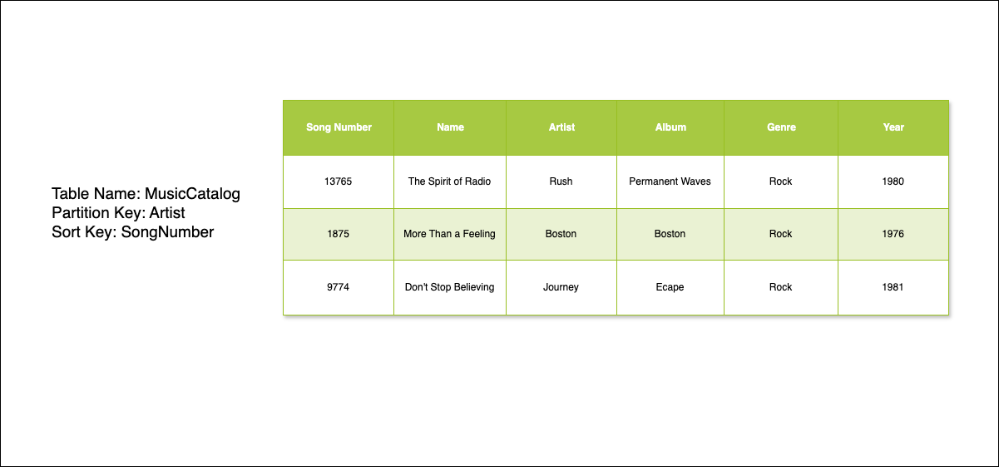
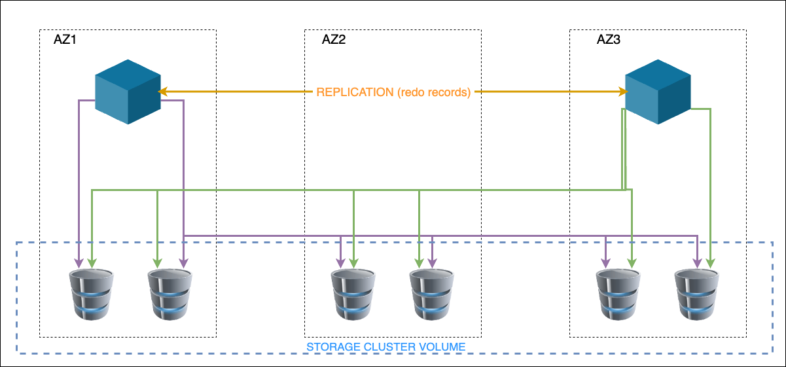
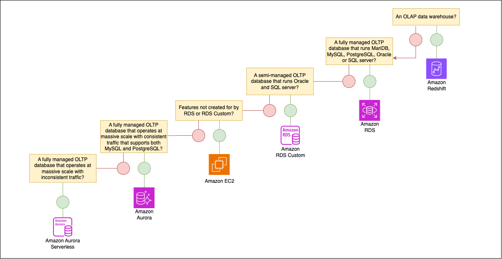
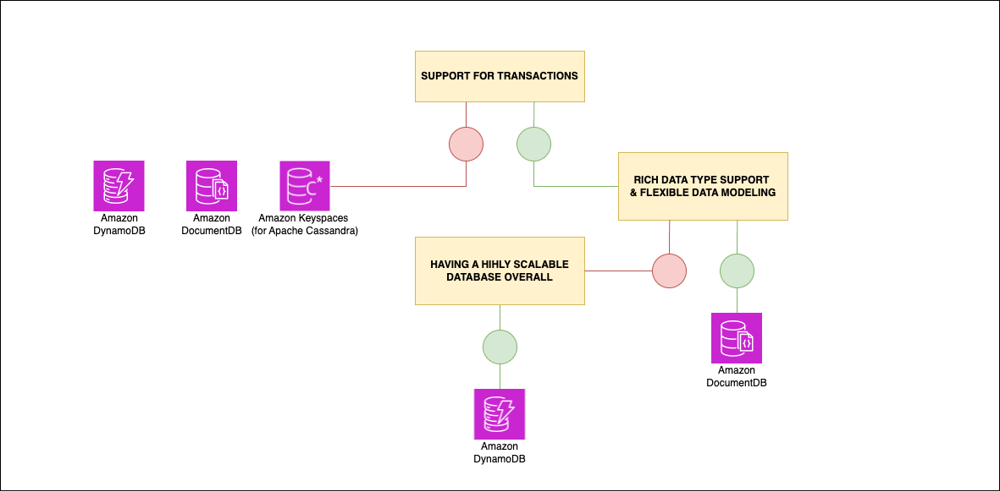

# Database (DVA-C02)

Bu başlık altında, AWS sınavda karşınıza çıkabilecek AWS'de mevcut olan çeşitli veritabanı hizmetlerini tanıtan bir dizi alt başlık olarak aktarılacaktır.

Bu başlığın amacı, geliştiriciler için AWS'deki veritabanı hizmetlerine bir giriş sağlamaktır. Bu hizmetler aşağıdaki gibi listelenebilir:

-   Amazon Aurora,
-   Amazon DynamoDB,
-   Amazon ElastiCache,
-   Amazon MemoryDB for Redis,
-   Amazon RDS.

AWS Certified Developer - Associate sertifikasyonu, AWS hizmetlerini kullanarak uygulama geliştirme, test etme, dağıtma ve hata ayıklama konusunda bilgi ve deneyime sahip geliştirici rolündeki herkes için tasarlanmıştır.


## Amazon DynamoDB Nedir (What Is Amazon DynamoDB) ?

Amazon DynamoDB, tam yönetilen, serverless bir NoSQL veritabanı servisidir. Bu tanım çok yüzeysel kalabilir. Gelin bu tanımı parçalara ayırarak inceleyelim.

"Tam yönetilen" ile, DynamoDB servisinin altyapıyı sağlama ve bakımını yapma sorumluluğuna sahip olduğunu kastediyoruz. Sizin tarafınızda herhangi bir veritabanı yönetimi gerekmez; sunucu tedarik etme, işletim sistemi ve veritabanı güncelleme, sharding, replikasyon ve yedekleme karmaşıklığı yoktur. Tüm bunlar AWS tarafından sizin için halledilir.

Benzer şekilde, "serverless" ifadesiyle kastettiğimiz, tüm sunucu ve sunucu yönetiminin kullanıcıya tamamen görünmez olmasıdır. Arka planda DynamoDB'yi çalıştıran sunucular hala bulunur, ancak bunlar sizin sorumluluğunuzda değildir. AWS bunlarla ilgilenerek yükünüzü hafifletir. Sizin sorumlu olduğunuz tek şey verileriniz ve bu verileri nasıl modellediğinizdir.

Verilerinizi etkili bir şekilde modellemek için, kullandığınız veritabanı türünü anlamak yardımcı olur. DynamoDB bir NoSQL veritabanıdır. NoSQL veritabanları, yani "not-only SQL" veritabanları, verileri ilişkisel veritabanlarından farklı şekilde depolar ve bu veri modeline bağlıdır. En yaygın NoSQL veri modelleri; key-value, document, graph ve wide-column veritabanlarıdır. Amazon DynamoDB çoğunlukla key-value veritabanı olarak kullanılır, ancak document erişim modellerini de destekler.

Peki **key-value** veritabanı nedir?

Bu, belirli bir öğe veya kayıt için key'in benzersiz bir tanımlayıcı olduğu key-value çiftleri koleksiyonudur. Verilerinize bu key'lere göre erişirsiniz. Genellikle, verilere hızlı erişim sağlamak için, bu key-value store'ların yüksek oranda partitionable (bölümlenebilir) ve ölçeklenebilir olması gerekir.

### DynamoDB Temel Özellikleri (DynamoDB Key Features)

Bu başlık altında, DynamoDB veritabanının bazı temel özelliklerinden ve karakteristiklerinden bahsedeceğiz. Genellikle, DynamoDB'den bahsedildiğinde, iki diğer ifadeyle birlikte anılır:

1. Yüksek erişilebilirlik ve dayanıklılık (Highly available and durable)
2. Sonsuz ölçeklenebilirlik ve hız (Infinitely Scalable and fast)

DynamoDB, varsayılan olarak yüksek erişilebilirlik için tasarlanmıştır. Verileriniz otomatik olarak bir coğrafi region (bölge) içindeki üç farklı Availability Zone'a (erişilebilirlik alanı) replike edilir. Bir kesinti durumunda veya tüm bir hosting tesisini etkileyen bir olayda, DynamoDB etkilenen Availability Zone'un etrafından dolaşarak dayanıklılık sağlamaya devam eder.

Verilerinizin replikasyonu genellikle milisaniyeler içinde gerçekleşir, ancak bazen daha uzun sürebilir. Bu, sorgularınızın en son kopya tamamen AZ'ler arasında replike edilmeden önce verilerin eski versiyonlarını döndürebileceği anlamına gelir. Bu, **eventual consistency (nihai tutarlılık)** olarak bilinir ve DynamoDB'nin varsayılan modudur.

Ancak, veritabanınızdan her zaman en güncel bilgileri aldığınızdan emin olmak için **strong consistency (güçlü tutarlılık)** gerektiren bazı workload'lar yani iş yükleri olabilir. Bu durumlarda, veritabanınıza yaptığınız her okuma isteğinde strong veya eventual consistency kullanmayı tercih edip etmediğinizi belirtebilirsiniz. Strong consistency kullanırsanız, her zaman verilerinizin en yeni versiyonunu alırsınız, ancak bu okumalar küçük bir performans kaybına neden olabilir.

DynamoDB ayrıca, workload'unuz ACID uyumluluğu (atomicity, consistency, isolation ve durability) gerektiriyorsa, transaction'ları da destekler. Bu, temel olarak *"veritabanında yapmak istediğim bir dizi işlem var. Ya hepsinin gerçekleşmesini ya da hiçbirinin gerçekleşmemesini istiyorum"* demenin bir yoludur. Bu, bankacılık gibi kullanım senaryolarında çok önemlidir; bir işlem başarısız olursa, uygulama ve müşteri deneyimini ciddi şekilde etkileyebilir.

Bu noktada DynamoDB'nin verilerinizi üç AZ'ye replike ettiği için varsayılan olarak yüksek erişilebilir olduğunu biliyoruz, ancak daha yüksek dayanıklılık ve performans seviyelerine ihtiyaç duyabilirsiniz. Bu kullanım senaryoları için DynamoDB, **Global Tables** konseptini sunar. Global Tables, verilerinizi bölgeler arasında replike etmenizi sağlar. Bunu yapmak için, servis seçtiğiniz bölgelerde replica table'lar kurar. Bu işlem, bir düğmeye basmak kadar kolaydır ve servis sizin adınıza table'ları kurar ve verilerinizi senkronize eder. Bu replica'lar **active-active**'dir, yani herhangi bir table'a yazabilir ve size en yakın table'dan okuyabilirsiniz. Bu, çok yüksek performansa ihtiyaç duyduğunuz ve birkaç konuma yakın table'larda düşük latency okuma ve yazma gerektiren kullanım senaryoları için harikadır.

Diğer veri dayanıklılığı özellikleri açısından, DynamoDB ayrıca **backup** işlevselliğine sahiptir. DynamoDB ile backup'lar biraz farklıdır. Yüksek erişilebilirlik konfigürasyonu nedeniyle, sunucunuzu veya sunucunuzdaki verileri kaybetmekten endişelenmezsiniz. Ancak, uyumluluk amaçları için veya pozitif bir duruma geri dönebilmenizi sağlamak için backup'lar almak isteyebilirsiniz. DynamoDB ile iki tür backup vardır:

- İlk seçenek **on-demand backup**'lardır. İstediğiniz zaman bir butona basarsınız ve verilerinizin tam bir backup'ını oluşturur. Bu çoğunlukla uyumluluk ve arşivleme amaçları için kullanılır.

- İkinci seçenek **point-in-time recovery**'dir. Bu, son 35 günün herhangi bir saniyesindeki veritabanı durumuna geri dönmenizi sağlar. Bu, bir hata yapıldığında ve o hata gerçekleşmeden önceki zamana geri dönmek istediğinizde en iyi şekilde kullanılır.

Bu seçeneklerden birini veya her ikisini kullanabilirsiniz. Aynı zamanda, tüm farklı veritabanlarınız için merkezi bir backup arayüzü tercih ederseniz, DynamoDB ayrıca **AWS Backup ile entegre** olur.

DynamoDB ile ilgili bir sonraki temel ifadeye geçelim yani; **"sonsuz ölçeklenebilir ve hızlı"**. Servis, bir table'ın ne kadar büyük ölçeklenebileceğine dair esasen bir üst sınıra sahip değildir. Ve table ne kadar büyük olursa olsun, DynamoDB hızlı performans sağlar. Table büyüdükçe yavaşlayabilen ilişkisel bir veritabanının aksine, DynamoDB performansı sabittir ve birçok terabayt büyüklüğündeki table'larda bile tutarlı kalır.

Peki, DynamoDB'yi ne zaman kullanırsınız?

Bu veritabanı, yüksek ölçeklenebilirlik ve veri dayanıklılığı gerektiren **OLTP (On Line Transaction Processing)** workload'ları için en iyi şekilde kullanılır. Genellikle yeni bir uygulama geliştirirken önerilir. Legacy bir uygulamayı DynamoDB kullanacak şekilde migration etmek mümkün olsa da, gereken zaman ve çaba göz önüne alındığında her zaman değerli olmayabilir.

OLAP workload'ları veya ad-hoc sorgu erişimi gerektiren uygulamalar için önerilmez. İlişkisel bir veritabanı, bu workload türlerinin her ikisi için de daha uygun olacaktır. DynamoDB'yi genellikle oyun uygulamalarında leaderboard'ları depolamak için, e-ticaret uygulamalarında alışveriş sepeti bilgilerini ve kullanıcı profil verilerini depolamak için, hatta ulaşım sektörlerinde ride share'ler için GPS verilerini depolamak için kullanıldığını görebilirsiniz.

Sonsuz ölçeklenebilir ve serverless, tam yönetilen bir OLTP veritabanı gerektiren ve erişim modellerinizi iyi anladığınız her kullanım senaryosu, DynamoDB için harika bir seçimdir. 

### DynamoDB Terminolojisi (DynamoDB Terminology)

DynamoDB'de, verilerinizden ve bu verileri nasıl modellediğinizden siz sorumlusunuz. Bunu yapmak için, servisin kullandığı terminolojiyi anlamak faydalıdır.

DynamoDB'de verilerinizi table'larda saklarsınız. Bir table oluştururken, ona bir isim ve bulunduğu AWS Region'ı (bölge) belirtirsiniz. Örneğin, us-east-1 bölgesinde `cars`  adında bir table'ınız olabilir. Herhangi bir veritabanında olduğu gibi, table'lar sadece nesnelerin bir koleksiyonlarıdır. Kullandığınız veritabanına bağlı olarak, bu nesneler birçok şekilde adlandırılabilir - ancak DynamoDB'de bunlara **item** denir. Bir item temel olarak bir satır **(row)** veya **kayıt (record)** olarak adlandırılır.

Ardından, item'ı tanımlayan attribute'lar yani özellikler vardır. Attribute'ları sütunlar olarak düşünebilirsiniz. Örneğin, her araba için brand (marka), model ve year (yıl) attribute'larına sahip bir item'ınız olabilir.

Her item için tek gereklilik, onu benzersiz şekilde tanımlayan bir key'e sahip olmasıdır. Bu key'lere DynamoDB'de **partition key** denir. DynamoDB, verilerinizi arka planda mantıksal veri partition'larında depolamak için partition key'leri kullanır. Örneğin, arabalar için bir partition key, bir araba kimliği veya VIN numarası olabilir.

Her item'ın uygun bir partition key'i olduğu sürece, farklı attribute setlerine sahip olabilirler. Hepsinin aynı attribute'lara veya diğer item'larla aynı sayıda attribute'a sahip olması gerekmez. Örneğin, arabalardan birinin başka hiçbir arabada olmayan bir trim attribute'u olabilir. Bu, NoSQL veritabanlarının bir avantajıdır ve bu nedenle genellikle şemasız (schemaless) olarak kabul edilirler.

Partition key'iniz ile birlikte, isteğe bağlı olarak bir sort key de kullanmayı seçebilirsiniz. Sort key'ler, verilerinizi aynı partition içinde sıralar, bu da hızlı sorgulama için kullanışlıdır. Örneğin, araba VIN numarasıyla bir partition key ve arabaya sahip olan müşteri için bir müşteri ID'si sort key'i olabilir. Artık bu sort key'e dayalı güçlü sorgular gerçekleştirebilirsiniz. Hem partition hem de sort key'i kullanarak, partition key'inizin artık benzersiz olması gerekmez. Birçok partition key aynı değere sahip olabilir. Unutmayalım ki bu durumda da **partition ve sort key kombinasyonu benzersiz** olmalıdır . Hem partition hem de sort key kullanmak, **composite primary key** olarak adlandırılır.

Yani, tek yapmanız gereken bu table'ları kurmak ve verilerinizi item'lar ve attribute'larla modellemektir. Table'ı oluştururken, her table'ın sahip olması gereken okuma ve yazma **throughput seviyesini** de yapılandırmanız gerekir.

Bu throughput'u yapılandırmanın iki yöntemi vardır: 
- **Provisioned throughput mode**
- **On-demand capacity mode**. 

İlk seçenek **provisioned throughput mode**'dur. Bu,**Read Capacity Unit (RCU)** ve **Write Capacity Unit (WCU)** sayısını seçerek table'ınız için okuma ve yazma miktarını belirlemenizi sağlar. 4 KB'a kadar olan bir item için, strongly consistent read için bir RCU'ya, eventually consistent read için yarım RCU'ya ihtiyacınız vardır ve transaction'ları kullanırsanız, iki RCU'ya ihtiyacınız olacaktır. Bir WCU, 1 KB'a kadar olan bir item için saniyede bir yazma işlemini temsil eder. Transaction'ları kullanırsanız, aynı item boyutu için saniyede bir yazma işlemi gerçekleştirmek için iki WCU gerekir. Yani, provisioned throughput mode'u kullanmak, table'ınızın yeterli bant genişliği aldığından emin olmak için biraz hesaplama gerektirir. Bu, trafiğiniz çoğunlukla sabit olduğunda harika bir seçimdir.

Ancak, trafiğiniz yükselip düşüyorsa (çoğu trafik modeli gibi), provisioned throughput mode'u DynamoDB Auto Scaling ile birlikte kullanabilirsiniz. Auto Scaling ile, RCU ve WCU'lar için üst ve alt sınırlar belirleyebilirsiniz. Böylece, trafik düşerse, provisioned okuma ve yazmalarınızı azaltacaktır. Trafik artarsa, provisioned okuma ve yazmalarınızı artıracaktır. Tüm bunlar, RCU ve WCU sınırlamalarınızın sınırları içinde kalarak gerçekleşir.

Auto Scaling olmadan, veritabanı kullanımında bir artış bekliyorsanız, önceden daha fazla throughput sağlamanız gerekecek veya veritabanı istekleri *ProvisionedThroughputExceededException* ile başarısız olacaktır.

Provisioned mode ile ayrıca minimum bir provisioned kullanım seviyesine bağlı kalarak bu kapasiteyi reserve etmeyi de seçebilirsiniz. Bu, karşılığında, provisioned ettiğiniz RCU ve WCU'lar için indirimli bir saatlik ücret almanızı sağlayacaktır.

İkinci mod, **on-demand capacity mode**'dur. Bu mod çok daha basittir. Bu modda, DynamoDB aldığınız trafiğe göre table'ınızın kaç okuma ve yazma ihtiyacı olduğuna karar verir. Bu, uygulamanıza tam ihtiyaç duyduğu anda tam olarak ihtiyaç duyduğu kadar kapasite sağlayan bir **just-in-time yaklaşımı** sunar. Böylece tüm WCU ve RCU hesaplamaları ortadan kalkar ve Auto Scaling'i sizin için halleder.

Bu noktada kendi kendinize şöyle sorabilirsiniz: *"On-demand mode ile WCU ve RCU'ları hesaplamak ve Auto Scaling ile uğraşmak zorunda değilim. Neden biri hala provisioned throughput mode'u kullansın ki?"*

Cevap tahmim edebileceğiniz gibi, her şey fiyatlandırmaya bağlı. Her iki modda da, kullandığınız toplam okuma ve yazma istekleri miktarı artı verilerinizin kullandığı toplam depolama alanı miktarı için ücretlendirilirsiniz. On-demand mode'u kullanmanın en büyük dezavantajı, istek başına provisioned throughput mode'dan daha pahalıya mal olmasıdır. Ancak, veritabanınıza hiç istek yoksa, ödeme yapmanız gerekmez. Sadece depoladığınız şey için ödeme yaparsınız. Oysa provisioned throughput mode ile, hiç istek olmazsa bile - provisioned ettiğiniz RCU ve WCU'lar için hala ödeme yapmanız gerekir.

### DynamoDB'yi Diğer Veritabanlarıyla Karşılaştırma (Comparing DynamoDB to Other Databases)

DynamoDB'nin, halihazırda aşina olabileceğiniz diğer veritabanı teknolojileriyle nasıl karşılaştırıldığına bir göz atalım. Muhtemelen MySQL, Oracle veya Microsoft SQL Server gibi ilişkisel bir veritabanlarıyla çalışmış olabilirsiniz veya bir kulak dolgunluğunuz bulunabilir.

DynamoDB ile ilişkisel veritabanları arasındaki farkları anlamak önemlidir. İlk büyük farklılaştırıcı, NoSQL veritabanlarının nasıl ölçeklendiğidir. İlişkisel veritabanları dikey olarak ölçeklenir, yani daha fazla güç ve CPU'ya ihtiyacınız varsa, sunucunuzun boyutunu artırırsınız. DynamoDB yatay olarak ölçeklenir, yani daha fazla güç ve CPU'ya ihtiyacınız varsa, sunucu grubunuza daha fazla sunucu eklersiniz. DynamoDB'nin neredeyse sonsuz bir şekilde ölçeklenebilmesinin nedeni budur. Bunun gerçek faydası, kullanıcıya şeffaf bir şekilde ölçeklenmesidir. Çoğu ilişkisel veritabanında ölçeklenebilirliği sizin yönetmeniz gerekir. DynamoDB, depolamayı sizin için ölçeklendirir. Bununla beraber, seçtiğiniz kapasite moduna bağlı olarak ya hesaplamayı da sizin için ölçeklendirir ya da en azından Auto Scaling işlevselliği sunar.

İkinci faktör şemadadır. İlişkisel veritabanları **sabit bir şemaya** sahipken, DynamoDB **şemasız** olarak kabul edilir, bu nedenle önceden sabit bir tablo yapısı tanımlamanız gerekmez. Bir DynamoDB item'ı eklediğinizde, diğer item'ların aynı attribute'lara sahip olması gerekmese bile, ihtiyaç duyduğu herhangi bir attribute'a sahip olabilir. Faydası, sütunları ve veri türlerini anında ayarlayabilmenizdir.

Ancak, DynamoDB'yi ilişkisel veritabanlarıyla karşılaştırıldığında kullanmanın bazı dezavantajları vardır. Örneğin, SQL'e ve JOIN anahtar kelimeleri ile, gruplamalarla gelişmiş sorgular yazmaya alışkınsanız, DynamoDB'nin yerleşik sorgu ve tarama özellikleri SQL ile yapabileceğiniz kadar esnek değildir. Bununla birlikte, DynamoDB, verilerinizi sorgulamak ve değiştirmek için SQL benzeri bir dil olan **PartiQL**'i destekler. Bu, DynamoDB'yi bazıları için biraz daha erişilebilir hale getirebilir ve backend'de DynamoDB sorgu ve taramalarına dönüştürülen SQL benzeri bir dil kullanarak daha karmaşık sorgular yazmanızı sağlar. Bununla birlikte, yalnızca PartiQL dilinin bir alt kümesini desteklediğini belirtmekte fayda var.

DynamoDB ayrıca birçok ilişkisel veritabanının sunduğu geniş veri türü yelpazesini sunmaz. DynamoDB'nin yalnızca **string'ler, sayılar, boolean değerler, binary veriler ve null** değerler gibi birkaç yerel veri türü vardır. Ayrıca **list'leri, map'leri ve set'leri** destekler. Ancak, tarihler gibi veri türleriyle çalışıyorsanız, bunları DynamoDB'de depolamak için string veya sayı olarak temsil etmeniz gerekecektir.

MongoDB veya Cassandra gibi NoSQL veritabanlarına zaten alışkınsanız, DynamoDB size daha tanıdık gelebilir. Yine de, NoSQL veritabanları kendi kategorileri içinde oldukça farklılık gösterir. Örneğin, **MongoDB bir JSON document tabanlı** veritabanıyken, **DynamoDB key-value ve document veri modellerini** destekler. MongoDB platform bağımsızken, DynamoDB yalnızca bir AWS ortamında çalışabilir. İkisinin oldukça farklı olduğunu göreceksiniz.

Anlaşılması gereken son önemli şey, DynamoDB'nin onunla çalışmanıza izin verilen şekilde bazı katı sınırlamaları olduğudur. Örneğin, akla gelecek ilk katı sınırlama **400 kilobaytlık maksimum item** boyutudur. Item başına sık sık büyük nesneler depoluyorsanız, bu sınırlamayı aşmak için bunun yerine bu nesneleri Amazon S3 gibi daha ucuz bir depolama çözümünde depolamanız ve referansı DynamoDB'de saklamanız gerekecektir. Ayrıca, bir AWS hesabındaki maksimum tablo sayısı ve maksimum throughput sınırlamaları gibi kısıtlar da vardır. Bu kısıtları dilerseniz, AWS müşteri desteğine başvurarak ayarlayabilirsiniz.

### DynamoDB ile Etkileşim Kurma (Interacting with DynamoDB)

Diyelim ki bir DynamoDB table'ınız var - peki onunla nasıl etkileşime geçersiniz? DynamoDB ile etkileşime geçmenin dört ana yolu vardır:

- DynamoDB table'larınızı yönetmek için grafiksel bir arayüz sunan **AWS console**'unu kullanabilirsiniz. Console ile table'larınızdaki verilere bakabilir, veri ekleyebilir ve değiştirebilirsiniz.

- Ayrıca bir terminal üzerinden API çağrılarını script haline getirmek için **AWS Command Line Interface veya CLI**'yi kullanabilirsiniz.

- **AWS Software Development Kit**'leri veya **SDK**'ları kullanarak DynamoDB ile programatik olarak etkileşime geçen kod yazabilirsiniz. Bu SDK'lar Java, .NET, PHP, Python, Ruby, Go, C++ gibi çoğu büyük dil için mevcuttur.

- Son olarak, DynamoDB table'larınızı oluşturmak, yönetmek ve sorgulamak için görsel bir IDE aracı sağlayan **NoSQL Workbench for DynamoDB**'yi kullanabilirsiniz.


DynamoDB application programming interface veya API'ye erişmek için bu yöntemlerden herhangi birini kullanabilirsiniz. DynamoDB API'si, DynamoDB table'larınızda yürütebileceğiniz bir dizi işlem olarak düzenlenmiştir.

Her işlemin bir adı, komutun tamamlanması için gerekli olan bir dizi parametresi ve yanıt olarak geri gönderilen bir dizi çıktısı vardır.

Örneğin, `CreateTable` API çağrısını ele alalım. İsminden de anlaşılacağı gibi, bu API çağrısı bir DynamoDB table'ı oluşturur. Ancak, bu komutu başarıyla çalıştırmak için, table adı ve o table için kaç RCU ve WCU provision etmek istediğiniz gibi belirli parametreleri belirtmeniz gerekir. Komutu doğru şekilde oluşturursanız, işlemin başarılı olduğunu onaylayan bir çıktı yanıt olarak geri gönderilir.

Bu başlık altında, DynamoDB API'sini kullanarak üç ana işlem kategorisinden bahsedeceğiz.

İlk işlem seti **control plane operations** olarak adlandırılır. Bu işlemler, hesabınızdaki DynamoDB table'larını yönetmenizi sağlar. Yani, hesabınızda bulunan table'ları listelemek istiyorsanız, `ListTables` API çağrısını kullanabilirsiniz. Belirli bir table hakkında bilgi istiyorsanız, `DescribeTable` API çağrısını kullanabilirsiniz. Son olarak table'larınızı değiştirmek veya düzenlemek istiyorsanız, `CreateTable`, `UpdateTable` ve `DeleteTable` API çağrılarını kullanabilirsiniz.

Ardından, **data plane operations** olarak adlandırılan bir sonraki işlem kategorisi bulunmaktadır. Bu operasyonlar, DynamoDB table'larınızda **create, read, update ve delete (CRUD operations)** gerçekleştirmenizi sağlar. Örneğin, DynamoDB table'ınızdan veri okumak istiyorsanız, kullanabileceğiniz altı işlem şu şekilde listelenebilir:

- Tek bir item okumak için `GetItem API` çağrısını kullanabilirsiniz. Bu çağrıyı yapmak için, aradığınız item'ın tam primary key'ini belirtmeniz gerekir, yani partition key'i ve kullanılıyorsa sort key'i belirtmeniz gerekir. Bu çağrı, item'ın var olup olmamasına bağlı olarak 0 veya 1 item döndürecektir.

- Ardından `BatchGetItem` API çağrısı var. Bu, item'ları okumak için birden fazla GetItem API çağrısı yapmakla aynı şeydir. Tek fark, sonuçların toplu olması, bu da çağrıyı birkaç GetItem API çağrısı yapmaktan daha verimli hale getirir. Bu, 100'e kadar değer döndürebilir.

- Bir sonraki seçenek `Query`'dir. Query ile yalnızca partition key'i belirtmeniz gerekir ve isteğe bağlı olarak bir sort key koşulu eklemeyi seçebilirsiniz. Ayrıca **filter expression**'ları (filtre ifadeleri) da kullanabilirsiniz, bu da veri isteyebileceğiniz ve DynamoDB'nin aradığınız şeye uyan verileri size tek bir sonuç olarak döndürmeden önce yanıtı filtreleyeceği anlamına gelir.

- Ardından `scan` alt işlevi bulunur. Scan ile herhangi bir key belirtmeniz gerekmez. Tüm table'ı okuyorsunuz. Teknik olarak, scan'lerde de filtreler olabilir. Ancak yine de item'ın belirttiğiniz filtre ifadesine uyup uymadığını görmek için tüm table'ı tarayacaktır. Bu, hepsinin içinde en pahalı çağrıdır.

- Son olarak, `ExecuteStatement` ve `BatchExecuteStatement` API çağrılarını kullanarak verilerinizde get işlemleri gerçekleştirmek için PartiQL'i de kullanabilirsiniz.

Veri değiştirmek için, tek bir yeni kayıt depolamak için `PutItem` API çağrısını veya değiştirmek için `UpdateItem` API çağrısını kullanabilirsiniz. Bununla beraber, tek bir kaydı silmek için `DeleteItem` API çağrısını kullanırsınız. Bir kerede birçok yazma işlemi yapmanız gerekiyorsa, `BatchWriteItem` API çağrısını kullanabilirsiniz. Ayrıca, okumak için kullandığınız aynı API çağrılarını, `ExecuteStatement` ve `BatchExecuteStatement`'ı kullanarak bu işlemleri gerçekleştirmek için **PartiQL**'i de kullanabilirsiniz.

Son olarak, **Transactions** operations var. ACID uyumluluğu için, sırasıyla `TransactGetItems` ve `TransactWriteItems` adlı yerleşik API çağrılarını okumak ve yazmak için kullanabilirsiniz. Veya dilerseniz, `ExecuteTransaction` API çağrısını kullanarak PartiQL'i kullanabilirsiniz.


### Konsoldan DynamoDB'ye Okuma ve Yazma (Reading and Writing to DynamoDB from the Console)

Bu başlık, doğrudan console'dan DynamoDB'ye veri okuma ve yazma işlemlerine bir göz atalım. Pratikte bunu çok fazla yapmayacaksınız, ancak bir uygulama geliştirirken, sorun giderirken veya sadece yeni bir DynamoDB table'ı tasarlarken harika bir araçtır. DynamoDB yönetim paneline geçelim ve ardından 'Tables' üzerine tıklayalım. Burada frequent_flyers adında bir tane hazırlamıştım. 'Explore table items' seçeneğini seçelim. Şu anlık bu table altında hiçbir item bulunmuyor.


O halde, bir item oluşturalım. Burada dilerseniz direkt form görünümü üzerinden bir kayıt eklemesi yapabilirsiniz. Ancak bu başlık altında 'JSON view'a tıklayarak JSON formatında ekleme yapalım. Dilerseniz DynamoDB JSON ile dilerseniz standart ve bilinen JSON ile devam edebilirsiniz. Bu kapsamda 'View DynamoDB JSON' değerini kapatıp normal JSON olarak devam edelim. Eklemek istediğim kayıt şu şekilde;

```json
{
	"id": 1,
	"first_name": "Fatih",
	"last_name": "ES",
	"home_airport": "ESB",
	"subscriber": true,
	"ip_address": "53.44.124.60",
	"last_flight": "18/03/2024"
}
```

'Create item' butonunu kullanarak ilk item'ı oluşturalım. Oluşturulan item'a tıkladığımızda, oluşturma ekranına benzer bir ekran bizi karşılayacaktır. Yine form görünümü ile JSON görünümü arasında seçim yapabilir ve dilerseniz istediğiniz bir değeri güncelleyebilirsiniz. İsterseniz 'subscriber' değerini `false` olarak değiştirebilir ve ardından 'Save changes' seçeneğine tıklayabilirsiniz.

'Create JSON' seçeneğine tıklayalım ve tam olarak aynı kaydı yapıştırırsak ne olacağını görelim. Değeri JSON alanına yapıştıralım ve 'Create Item' seçeneğine tıklayalım. Önceki başlıklarda değindiğimiz gibi, bu ID'nin unique olması gerektiği için bir hata mesajı almalıyız. O halde, bu değerde bazı değişiklikler yapalım. Ekleyeceğimiz kayıdın id değeri için 10 diyelim, adı kendi aadınız ile değiştirin, havaalanını "SAW" olarak değiştirelim ve sonra tekrar deneyelim. Bu sefer sorunsuz şekilde çalışacaktır.

Başka bir örneğe bakalım. Bir CSV dosyanız olduğunu düşünün. Bir sürü satır içerebilir, ID, first_name, last_name, home_airport gibi. Bu verileri tutan CSV dosyanızın da Amazon S3'te *MOCK_DATA.csv* adıyla depolandığını düşünelim. Bu CSV dosyasını nasıl DynamoDB'ye aktarabileceğimize bakalım. S3 console'u üzerinden, bu CSV dosyamızın S3 URI değerini kopyalayalım. Daha sonra DynamoDB yönetim paneline geçeceğim.

DynamoDB panelinde sol menüde, 'Import from S3' adında bir başlık göreceksiniz. Buna tıklayacağız. Sağ üstte bulunan 'Import from S3' butonuna tıklayalım ve ardından dosyamızın URI değerini buraya yapıştıralım. S3 bucket owner alanında, dosyanın bulunduğu hesapla şu anda işlem yaptığımız hesap aynı; bu yüzden burada herhangi bir çapraz hesap sorunumuz yok. Dosya sıkıştırılmamış yani 'no compressions', sadece düz metin ve formatımız CSV. Tüm bunları göz önüne alarak gerekli alanları seçelim. CSV dosyanıza göre aşağıda çıkan ekstra tanımlamaları yaptığınızdan emin olun.  Her şeyden eminseniz, 'Next' seçeneğine tıklayalım. Ve şimdi bir ad girelim, buna 'imported_pax' veya 'passengers' diyeceğim. Partition key bir ID olacak ve bu değer bir sayı; bu yüzden gerekli ayarlamaları yapalım. Sort key için last_flight değerini kullanacağız ve bir tarihimiz olmadığı için string olarak tutacağız.

'Next' seçeneğine tıklayalım, karşımıza bir review ekranı olacaktır. Eğer gereki değerler doğru ise; 'Import' seçeneğine tıklayacağız. Bu iş orijinal dosyada ne kadar veri olduğuna bağlı olarak biraz zaman alabilir. Dosya yükleme tamamlanana kadar bekleyebiliriz. İçeri aktarma işlemi tamamlandıktan sonra, tablolara bir göz atalım. Ekranı yenileyelim, ve görebileceğiniz gibi verdiğimiz isim olan 'imported_pax' adında bir table bulunmakta. Üzerine tıklayalım ve sayfada aşağı doğru inelim. 'Explore table items' butonunu kullanırsanız, burada bir sürü verimiz bulunacaktır. Toplu veri yüklerken, CSV dosyanızı bir metin editörü veya hatta Microsoft Excel gibi bir elektronik tablo kullanarak atayabilirsiniz.

### Kod Üzerinden DynamoDB'ye Yazma (Writing to DynamoDB From Code)

AWS Lambda ve Python kullanarak kod üzerinden bir DynamoDB table'ına yapılan bir yazma işlemine bakalım.

```python
import json
import boto3

def lambda_handler(event, context):
    print(event)

    # STEP 1 // PREPARE AND FORMAT YOUR DATA
    Data = {}
    Data["id"] = event["id"]
    Data["last_flight"] = event["last_flight"] 
    Data["first_name"] = event["first_name"]
    Data["last_name"] = event["last_name"]

    # STEP 2 CONNECT TO YOUR TABLE -- CHECK IAM PERMISSIONS
    dynamodb = boto3.resource('dynamodb')
    table = dynamodb.Table('frequent_flyers')

    # STEP 3 WRITE YOUR DATA
    print(table.put_item(Item=Data))
```

Yukarı Lambda yönetim panelinde bulunan kodumuzu görebilirsiniz. Table'ımıza koymak için kayıt olarak kullanacağım bir veri yapısını değerlerini tanımlıyoruz. Verimizin değerlerini lambda fonksiyonun'un event'i ile dolduruyoruz.

Kodumuz bir veri yapısı oluşturuyor ve bahsettiğimiz gibi event'i kullanarak bu veri yapısını dolduruyor. Daha sonra Boto3'ten bir DynamoDB kaynağı kaynağı istiyoruz. Daha sonra veritabanına bağlanıyoruz ve bu işlemi `table` değişkenine atıyoruz. Bu değişken bize DynamoDB table'ına açık bir bağlantı verecek. Ve son olarak, sadece PutItem metodunu çağırıyorum ve metoda `Item` paramateresi olarak içerisini doldurduğumuz `Data` değişkenini veriyoruz.

Yukarıda bulunan `Test` butonunun yanındaki oka tıklayarak *Configure test event* seçeneğine tıklayalım. Burada *Event JSON* alanına şu JSON'u yerleştirebiliriz:

```json
{
	"id": 90,
	"first_name": "Fatih",
	"last_name": "ES",
	"home_airport": "SAW",
	"subscriber": true,
	"ip_address": "8.8.8.8",
	"last_flight": "21/08/2024"
}
```

Bu işlemden sonra direkt olarak *Test* butonuna tıklayalım. Eğer aynı id değerine sahip bir kaydımız yok ise hata almamız lazım.  DynamoDB console'umuza geri dönelim. Görebileceğiniz gibi, az önce event olarak tanımladığımız JSON verisi burada listeleniyor. Eğer üzerine tıklarsanız ve JSON görünümüne geçerseniz kaydı daha net görebilirsiniz. 

### DynamoDB'yi Kod Üzerinden Sorgulama ve Tarama (Querying and Scanning DynamoDB From Code)

Peki, DynamoDB table'ınız hakkındaki bilgileri ararken sorgu (querying) mu yoksa tarama (scanning) mı yapmalısınız?

Partition key ve sort key'e erişiminiz varsa, tabi ki bu sizi çok düşündürmemelidir. Bir sorgu işlemi amazınıza ulaşmanıza yeter.  Taramanın (scanning) yavaş ve verimsiz bir süreç olduğunu ve mümkünse bunu kaçınmanız gerektiğini unutmayalım. 

```python
import json
import boto3

def lambda_handler(event, context):
    print(event)

    # STEP 1 // PREPARE AND FORMAT YOUR DATA
    dynamodb = boto3.resource('dynamodb')
    table = dynamodb.Table('frequent_flyers')

    # STEP 2 CONNECT TO YOUR TABLE -- CHECK IAM PERMISSIONS
    response = table.get_item(Key={'id': 10, 'last_flight': '3/18/2022'})
    print(response['Item'])

    print("--- scanning the entire table now ---")
    result = table.scan()
    items = result['Items']

    for item in items:
        print(item)

    print("--- scanning the entire table now with a filter ---")
    result = table.scan(FilterExpression=boto3.dynamodb.conditions.Attr('subscriber').eq(True))
    items = result['Items']

    for item in items:
        print(item)
```

Buradaki Lambda'ma bir göz atalım. Yazma işleminde olduğu gibi, Boto3 kaynağıyla başlayacağız ve oluşturduğumuz bu kaynak ve table özniteliği kullanarak table'ımıza bağlanacağız. Bir kez bağlandığımızda, bir sorgu için get item işlemini çağırabiliriz. Bu durumda, table'ın partition key'ini sağlayalım. Ve tabii ki, bu durumda aynı zamanda sort key olan `last_flight`'ı da sağlamalıyız. Ve bu table'da var olduğunu bildiğimiz birkaç değer burada tanımlayalım, böylece bir yanıt alalım.

`result = table.scan()` satırına dikkat edelim, tam bir table taraması var. Bu, kesinlikle kaçınmanız gereken bir şey, özellikle table'ınızda yüz binlerce, hatta milyonlarca kayıt varsa. Asla böyle bir tam table taraması yapmamalısınız.

Oluşturduğumuz table kaynağının scan metodunu çağırmak çok daha uygun bir yöntemdir. Fark edeceğiniz gibi filter ile tarama aynı table taramasına benzer, sadece filtreyi parametre olarak alır. Eğer, table'daki bilgilerin en azından bir kısmını biliyorsanız bu yöntem akıllıca olacaktır. Bu filtrelemede, sadece `subscriber` alanına odaklanıyoruz. Yani, kaydın bir subscriber özniteliği olması ve bu durumda true olması gerekiyor ki döndürülsün. Bu tarama işlemleri gerçekten her kaydı, her satırı table'da gezecek. Daha önce değindiğimiz gibi çok fazla kaydınız varsa, bu çok zaman alacak ve çok verimsiz olacaktır. Özellikle table'ınıza aynı anda erişmeye çalışan tonlarca kullanıcı ve tonlarca veri işlemeye çalışıyorsanız durum felakete dönebilir.

Sadece, bir düzine kullanıcınız olduğu sürece bunun önemli olmadığını unutmayın. Süper verimli kod yazmanıza gerek yok. DynamoDB table'ınızla yaptığınız herhangi bir şey için bu gayet iyi çalışacaktır. Ama ölçeklendirmeye başlar başlamaz, taramaların (scanning) yerine sorgular (querying) üzerinde düşünmeniz gerekir, çünkü işlediğiniz veri miktarına bağlı olarak çok hızlı çok yavaşlayabilir.

### DynamoDB Performansı (DynamoDB Performance)

DynamoDB tablonuzu oluştururken birincil kullanımını göz önünde bulundurun. Çok fazla veri mi yazacaksınız? Bu durumda, kayıt boyutları performans açısından çok önemlidir. Ya da okuma işlemleri sık sık gerçekleşirken yazma işlemleri nispeten daha az mı olacak? Diğer tablolardaki kayıtlarla ilişkilendirilmesi gereken kayıtlarınız var mı? Özniteliklerinizden biri resim veya şifreleme materyali gibi ikili veriler mi? Verilerinizi anlamanın önemi, DynamoDB'yi özel ihtiyaçlarınıza göre ince ayar yapmanızı sağlamasıdır. Bu ince ayarlar, gereksiz veritabanı maliyetlerinden kaçınmanızı ve tablonuzun en yüksek performansı elde etmenizi sağlar. Örneğin, ikili verileri (binary data) ve tablo ilişkilerini bahsetmiştik, her iki durumda da DynamoDB optimal bir çözüm değildir. Amazon RDS bu tarz veriler için daha uygun olacaktır. Veri boyutu konusunda, 4 KB'dan büyük JSON dokümanlarıyla çalışıyorsanız, bu durum okuma ve yazma kapasite birimlerinizi etkileyecek ve tablonuzun performans taleplerini iki katına çıkaracaktır. Aslında, bu **kapasite birimleri (capacity units)** diye adlandırılan terime daha yakından bakalım.

Tablonuzu *sağlanan kapasite (provision capacity)* kullanarak oluşturduğunuzda, okuma/yazma kapasite birimlerinizi yönetebilirsiniz. Bu yönetme yeteneği, *on-demand* veya *otomatik ölçekleme* kapasite modlarını kullandığınızda geçerli olmayabilir.

Kapasite modunuz ne olursa olsun, okuma/yazma kapasite birimlerini anlamak önemlidir. Okuma/yazma kapasite birimleri (RCU/WCU: Read/write Capacity Units) saniye başına gerçekleştirilen güçlü tutarlı okumalar veya saniyelik sonraki tutarlı okumalar için bir item'ın 4 KB'a kadar olan boyutunu temsil eder. Bir sorgu (query) veya tarama (scan) işlemi gerçekleştirirken, tüketilen RCU sayısı döndürülen öğelerin boyutu, öğe sayısı ve seçtiğiniz okuma tutarlılığı (read consistency) türüne bağlıdır. Dolayısıyla, 4 KB'dan büyük veri öğeleri ek kapasite birimleri (capacity units) gerektirecektir. Ayrıca, tablo için ortalama öğe boyutunu DynamoDB konsolunda görebilirsiniz.

Yazma kapasite birimleri (WCU: Write Capacity Units) ise, bir maddenin 1 KB'a kadar olan boyutu için saniye başına yazma isteklerinin sayısını temsil eder. Bir öğe ekle veya öğe güncelle işlemi gerçekleştirirken, tüketilen WCU sayısı yazılan öğelerin boyutu ve yazma isteği türüne (PUT veya UPDATE) bağlıdır. Yani okuma işlemine çok benzer, sadece boyutu daha küçüktür.

Bir tabloya uygun sayıda RCU ve WCU belirterek, DynamoDB tablonuzun performansını ve ölçeklenebilirliğini kontrol edebilirsiniz. RCU ve WCU değerleri, uygulamanızın değişen performans ve kapasite gereksinimleri doğrultusunda her zaman ayarlanabilir.

DynamoDB'de, sorgu (query) ve tarama (scan) işlemleri farklı amaçlar için kullanılır.

Sorgu, bir tabloda veya ikincil bir dizinde (secondary index), partition key'ini ve varsa sıralama anahtarını (sort key) belirterek bir veya daha fazla öğeyi getirmek için kullanılır. Sorgu işlemi, belirtilen partition key değeri ve isteğe bağlı sort key değeri ile eşleşen öğeyi döndürür. Bir filtre ifadesi sağlarsanız, yalnızca filtre ile eşleşen öğeler döndürülür. Sorgu işlemi, partition ve sort key'lerini kullanarak belirli öğeleri tanımlaması ve yalnızca ilgilendiğiniz öğeleri döndürmesi nedeniyle verimlidir.

Öte yandan, tarama (scaning) işlemi tablodaki veya dizindeki her bir öğeyi okur ve filtre ifadesi ile eşleşen tüm veri özniteliklerini döndürür. Tarama işlemi, partition ve sort key'lerini kullanılarak tanımlanamayan filtre ifadelerini kullanmanız gerektiğinde sorgu (querying) işleminden daha verimli değildir, çünkü tüm tabloyu okur ve ilgilendiğiniz öğelerden daha fazlasını döndürebilir.

Özet olarak, öğeleri getirmek istediğiniz partition key'ini ve sort key'i değerlerini biliyorsanız, sorgu (queryining) işlemini kullanın. Tüm tabloyu veya dizini, filtre ifadesi ile eşleşen öğeleri bulmak için aramanız gerekiyorsa tarama (scaning) işlemini kullanın.

Endeksleme konusuna hızlıca değinelim. Bir Global Secundary Index (GSI), taban tablodakilerden farklı bir partition key'i ve sort key'ine sahip bir endekstir. Tek bir tabloda birden fazla GSI oluşturabilirsiniz, her biri benzersiz bir bölüm anahtarı değerine sahip olacaktır. Bir Local Secondary Index (LSI) ise, tablonuzla aynı partition key'ine ama farklı bir sort key'ine sahip bir endekstir. Hem LSI hem de GSI uygulamanızın performans ve ölçeklenebilirliğini artırmaya yardımcı olacaktır. Bununla birlikte, hangi veri öğelerinin önceden endekslenmesi gerektiğini bilmek her zaman akıllıca bir yaklaşımdır.

### DynamoDB Tablo Erişimi Sağlama (DynamoDB Table Access Provisioning)

DynamoDB tablo provizyon işlemi, veritabanı operatörlerinin çalışmalarını gerçekleştirebilmeleri için gerekli erişimi yetkilendirmek amacıyla Identity and Access Management'ı (Kimlik ve Erişim Yönetimi) servisi önemlidir. Bu erişim yetkilendirmeleri, DynamoDB kullanmanın ilk faydalarından biridir. AWS servislerinin ve deploymentlarının geri kalanı için ortak olan kimlik ve erişim yönetimini kullanan birleştirilmiş erişim yönetimi kontrolleridir. Test ve denemeler için administrator erişimi kullanabilirsiniz.

Ancak, production workloadları (iş yükleri) için en az ayrıcalık ilkesini (least privilege) uygulama best practice'ini dikkate almanız ve gerekli erişim kontrollerini buna göre tanımlamanız önemlidir. DynamoDB için tam erişim (Full Access), salt okunur erişim (Read Only Access) ve Lambda çağrı (Lambda Invocation) politikaları dahil olmak üzere çeşitli AWS-Managed politikalar mevcuttur. Akılda tutulması gereken önemli nokta operasyonların çeşitlerine göre bazen, bireysel tablolar veya belirli tablolar üzerindeki spesifik eylemler için, bazen de yalnızca belirli itemlara ve attributelara ulaşmakl için erişim kontrollerini provision etmenin önemli oluşudur.

Amaç, verilerinizi her zaman korumak ve belirli bir görevi gerçekleştirmek için gereken en az miktarda erişimi sağlamaktır.

```json
{
  "Version": "2012-10-17",
  "Statement": [
    {
      "Sid": "AllowAccessToOnlyItemsMatchingUserID",
      "Effect": "Allow",
      "Action": [
        "dynamodb:GetItem",
        "dynamodb:BatchGetItem",
        "dynamodb:Query",
        "dynamodb:PutItem",
        "dynamodb:UpdateItem",
        "dynamodb:DeleteItem",
        "dynamodb:BatchWriteItem"
      ],
      "Resource": [
        "arn:aws:dynamodb:us-west-2:123456789012:table/Music"
      ],
      "Condition": {
        "ForAllValues:StringEquals": {
          "dynamodb:LeadingKeys": [
            "${www.amazon.com:user_id}"
          ],
          "dynamodb:Attributes": [
            "UserID",
            "Artist",
            "Song",
            "Album"
          ]
        },
        "StringEqualsIfExists": {
          "dynamodb:Select": "SPECIFIC_ATTRIBUTES"
        }
      }
    }
  ]
}
```
Yukarıdaki örnek politikada, belirli bir kullanıcı ID'sine müzik tablosu itemlarına erişim izni veren, ince elenip sık dokunmuş bir erişim kontrol politikası uygulamak için identity and access management koşul elementini kullanılmıştır. Bu politikadaki koşul elementi, DynamoDB politikalarına ve izinlerine özgü koşul anahtarları kullanır. DynamoDB leading keys koşulu, kullanıcıların yalnızca kendi kullanıcı ID'leriyle eşleşen itemlara erişmesine izin verir. Bu durumda kullanıcı ID'si, ${[www.amazon.com:user_id](http://www.amazon.com:user_id)} formunda bir substitution değişkeni ile tanımlanır. Lütfen bu örnek kapsamında, AWS hesap kullanıcısından değil, uygulamanızın kullanıcılarından birinden bahsettiğimizi unutmayın. Ayrıca, bir koşul (condition) ifadesinde leading keys kullanırken, yukarıda gösterildiği gibi `ForAllValues` modifikatörünü kullanmanız gerekir. DynamoDB attributes koşulları, erişimi belirtilen attributelere sınırlar.

Bu sınırlar, bir istekteki attribute adlarının listesini veya bir istekten döndürülebilecek attributeleri temsil eder. Son olarak, `StringEqualsIfExists` koşulunun eklenmesi, uygulamanın her zaman kullanılacak belirli attributeların bir listesini sağlamasını ve bir tablodaki tüm attributeları talep edememesini sağlar. Burada işleyen prensip, **koşul elementlerinden herhangi biri false olarak değerlendirilirse, tüm politikanın da false olarak değerlendirilmesi ve erişimin reddedilmesidir.**

### DynamoDB Tablosunu Modelleme (Modeling a DynamoDB Table)

DynamoDB tablosu oluşturmadan önce veri yapınızı ve beklenen erişim modellerinizi dikkate almanız önemlidir. Bu, implementasyon başladığında size zaman ve çaba kazandıracaktır.

```json
{
	"SongNumber": 13765,
	"Name": "The Spirit of Radio",
	"Artist": "Rush",
	"Album": "Permanent Waves",
	"Genre": "Rock",
	"Year": 1980
}
```

Yukarıdaki veri yapısını düşünün. Bu, her şarkının bir item olarak temsil edildiği bir müzik kütüphanesini temsil eder. 

|  | SQL DBs | DynomoDB |
|--|--|--
| Data Storage | Rows and Columns | Items and Attibutes |
|Schemas | Fixed| Dynamic |
|Querying|Using SQL| Item Collectios  |


Aşina olacağınız bir bilgi olsa da, bilinmesi gereken ilk detay, SQL veritabanının verileri satır ve sütunlarda saklamasıdır. DynamoDB, satır ve sütunların eşdeğeri olarak item ve attributeları kullanır. DynamoDB şemaları dinamiktir ve geleneksel veritabanlarında olduğu gibi her satırın her sütun için veri içermesi gerekmez. DynamoDB tablolarındaki veriler, item koleksiyonlarına odaklanarak sorgulanır. Yukarıda görebileceğiniz gibi bit item'ı JSON formatında import etmek de oldukça yaygındır.

Tablo adına ek olarak, DynamoDB bir primary key'i zorunlu tutar. Bu key'in tanımlanması ve tablodaki her item için benzersiz olması gerekir. Yukarıdaki JSON tipindeki item'ı göz önüne alırsak, primary key için iyi bir aday `SongNumber` değeri olacaktır. Çünkü bunun veri setinde temsil edilen her şarkı için benzersiz olması gerekmekted,r. Diğer tüm attributeların duplicate form'da var olma potansiyeli vardır. Bu veri setini bir DynamoDB yapısına koyarken, tabloyu Music olarak adlandırabilir ve her attribute'u şarkı numarası, şarkı adı, sanatçı, albüm, tür ve yıl için kullanımına göre adlandırabiliriz. Bununla birlikte, bu tabloyu aramak muhtemelen sanatçı, albüm veya türe göre olacaktır. `SongNumber` ve `Year`, bu tablo için aranacak bir attribute olmayacaktır. Veri setini, bir Partition Key ve bir Sort Key kullanarak benzersiz bir kombinasyon oluşturan composite bir *birincil anahtar (Primary Key)* tanımlamak için yeniden düzenleyebiliriz.

Tüm bunları göz önüne alarak, composite key'i partition key olarak `Artist` ve `SortKey` olarak `SongNumber`'dan oluşacak şekilde modelleyebiliriz. Bu, tablodaki tüm itemlar için benzersiz bir kombinasyon oluşturmaya devam edecektir. Gerekirse, benzersiz bir composite primary key elde etmek için `SongNumber` ile birlikte herhangi bir attribute'u da kullanabiliriz. Mantıksal olarak, partition key olarak `Artist` ve sort key olarak `Song Number` değerini kullanmak mantıklıdır. Bu, sanatçıya göre arama yapabileceğimiz bir müzik kütüphanesi için yaygın bir erişim modeline uygun olacaktır. Kombinasyon benzersiz olduğu sürece, verilere nasıl erişmek istediğimize göre modelleyebiliriz. Secondary index'ler temelde, tabloyu sorgulamanın alternatif yollarına olanak tanır. İki tür secondary index vardır: İlki **Local Secondary Index** olarak adlandırılır; ikincisi **Global Secondary Index** olarak adlandırılır. Global secondary index'ler daha yaygın ve esnektir, çünkü bunları istediğiniz zaman oluşturabilir ve gerekirse alternatif bir partition key ve sort key tanımlamanıza izin verir. Bu örnekte, attribute listesinden `Album` ile bir Global Secondary Index Partition Key tanımlayabilir ve Sort Key olarak `SongNumber` değerini kullanabiliriz. Peki bu index tanımlamalarının faydası tam olarak ne olacak? Orijinal Primary Key'i kullanarak `Artist` değerine göre ve Global Secondary Index kullanarak `Album` değerine göre tabloyu sorgulama yeteneği verecektir. 

|  |Global Secondary Index|Local Secondary Index|
|--|--|--|
|Defination|Anytime|During table creation only|
|Stracture|Allows for alernate partition and sort keys|Allows for alernate sort key only|
|Capacity|Requires its own throughput|Uses the core table throughput|
|Consistency|Eventual consistency only|Allow for strong consistency|
|Quota per Table|20|5|


Local secondary index'ler bazı kısıtlamalar getirir ve daha az sıklıkla kullanılır. Global Secondary Index'ler tablonun yaşam döngüsü boyunca herhangi bir zamanda oluşturulabilir. Ek attribute'lara dayalı sorgulama esnekliği vermek için alternatif partition ve sort key'lere izin verirler. Local Secondary Index'lerin tablo ile birlikte oluşturulması gerekir ve yalnızca alternatif bir sort key olarak davranırlar. Local secondary index ile core tablonun mevcut partition key'ini kullanmanız gerekir. Yani, Global Secondary Index'ler ve Local Secondary Index'ler arasında bir trade-off vardır.

Örneğin, Local Secondary Index strongly consistent okumaya izin verir ve core tablonun tanımlı throughput'unu kullanır. Global secondary index'ler yalnızca eventual consistency okumalarına izin verir ve kendi throughput tanımlarını gerektirir. Erişim modellerinize bağlı olarak, birini diğerine tercih edeceksiniz. Genel olarak, Global Secondary Index'ler daha pratiktir ve Local Secondary Index'ler operasyonlarınızdan her zaman strongly consistent okumalar gerektiriyorsa kullanılır. Ayrıca, tablo başına Global Secondary Index kotasının aslında 20 olduğunu, buna karşılık tablo başına yalnızca 5 Local Secondary Index sınırı olduğunu unutmayın. 

Music örneğimize geri dönelim. Model veri setimizde Local Secondary Index kullanamayacağımızı lütfen unutmayın. Partition Key olarak `Artist` seçimi, Local Secondary Index olarak `Album` değerinin yararlı olmasına izin vermeyecektir, çünkü `Artist` ve `Album` kombinasyonu primary key gereksinimlerini karşılayacak kadar benzersiz olmayacaktır. Belirli bir `Artist` ve `Album` için, kesinlikle bu attributeların her ikisini de ortak olarak içeren birden fazla şarkı olacaktır. Bu yüzden, tablo modellemesini partition key olarak `Artist`, sort key olarak `SongNumber` ile sonuçlandırmaya ve Partition Key olarak `Album` ve sort key olarak `SongNumber` değeri ile bir Global Secondary Index oluşturmaya karar vermemiz akıllıca olacaktır. Ayrıca, partition key olarak `Genre` değerini kullanan ve sort key olarak `SongNumber` değerini tutmaya devam eden ikinci bir Global Secondary Index de modelleyebiliriz. Bu adımlar bize `Artist`, `Album` ve `Genre` değerlerine göre arama yapabileceğimiz üç erişim modelini de verecektir. Ayrıca, bunların temel örnekler olduğunu ve bir veri setinin birden fazla şekilde modellenebileceğini unutmayın.


### AWS Konsolunu Kullanarak DynamoDB Tablosu Oluşturma (Create a DynamoDB Table Using the AWS Console)

DynamoDB tablosu oluşturmanın en basit yolu AWS Console'u kullanmaktır. Console bize DynamoDB'nin özelliklerini inceleme imkanı sağlar, bu yüzden hadi gelin bununla başlayalım. Ancak, DynamoDB tablosu oluşturmanın en yaygın yolu, command line interface'i veya tanımı otomatikleştirmek, sonrasında tabloyu gerçek veri setleriyle doldurmak için software developer's kit'lerden birini kullanan bir script kullanmaktır.



Görseldeki yapıyı kullanarak bir tablo oluşturalım. Tablo adı olarak 'MusicCatalog'u kullanıyoruz. Tablodaki her item için benzersiz bir kombinasyon oluşturmak üzere partition key olarak 'Artist' değerini ve sort key olarak 'SongNumber'ı kullanmanın faydalı olacağını önceki başlıkta konuşmuştuk. SongNumber ve Year değerleri, number tipi attributelar olarak tanımlanması gerektiğine dikkat edin. Diğer attributelar string tipinde olacaktır. AWS Console'u kullanarak DynamoDB tablosu oluşturmak için, DynamoDB ana sayfasına gidelim ve ardından 'Create Table' butonuna tıklayalım.

Herhangi bir tablo için bir tablo adı, bir partition key ve opsiyonel bir sort key sağlamamız gerekiyor. Bu attributelar için gerekli tipi belirtmek de önemlidir. Ek olarak, tanımlanması gereken bazı tablo ayarları vardır. Bu durumda, capacity mode, read capacity, write capacity ve auto scaling'in varsayılan ayarlar (Default settings) olarak önceden tanımlanmıştır. Gerekirse bunları daha sonra dilediğiniz zaman ayarlayabilirsiniz. Customize Settings tab'ini seçerseniz, DynamoDB tablolarının standart sınıf tipi tablo veya standart infrequent access sınıfı tablo olarak iki seçenekten birini seçerek tanımlanabileceğini göreceksiniz. Standart erişim sınıfı en yaygın kullanılanıdır. İnfrequent access sınıfı, adından da anlaşılacağı gibi, nadiren erişilen veriler için kullanılır ve aksi halde gerçekleşemeyecek bazı masraflardan tasarruf etmenizi amaçlar. Ayrıca, Amazon DynamoDB'de depolanan tüm kullanıcı verilerinin rest halinde tamamen şifrelendiğini unutmayın.

Varsayılan olarak, DynamoDB şifreleme anahtarını yönetir ve kullanımı için herhangi bir ücret ödemezsiniz. Şifreleme anahtarının nasıl yönetileceğini seçebilirsiniz, ancak şifrelemeyi devre dışı bırakamazsınız. Önceki başlıktaki karşılaştırmalara dayanarak, verilerimizi modellemede yaptığımız seçimler nedeniyle local secondary index'in yararlı olmayacağını fark etmiştik. Genel olarak local secondary index, partition key'i core tablo ile aynı tutarken alternatif bir sort key olarak davranır.

Secondary indexes başlığı altında, partition key olarak 'Album' değerini kullanan ve sort key olarak 'SongNumber' değerini tutan iki global secondary index uygulayabiliriz. Ayrıca partition key olarak 'Genre' değerini kullanan ve sort key olarak 'SongNumber' değerini tutan ikinci bir global secondary index oluşturabiliriz. 

Tüm bu tanımlama ve konfigürasyonları kullanarak bir tablo oluşturalım. Global secondary index'in temelde sizin için ikinci bir tablo oluşturduğunu ve attribute projections'ı seçerek hangi attributeların yeni tabloya kopyalanacağına karar verebileceğinizi unutmayın. Aynı nedenle, bir Global Secondary Index oluşturmak aynı zamanda kendi kapasitesini provision etmeyi de gerektirir.

Varsayılan olarak, Global Secondary Index kapasitesi core tablolarla aynı olacak şekilde tanımlanır. Ancak, bu ayarı her zaman değiştirebilirsiniz. Dikkat edilmesi gereken bir başka detay da, bir Global Secondary Index'i her zaman oluşturabileceğiniz ve silebileceğinizdir. Bu, global secondary index'lerin dokümantasyonda Sparse Indexes olarak adlandırılan terimle kullanılmasına olanak tanır; bunlar temel olarak nadiren kullanılan sorgulardır. Burada tüm gerekli projections ile bir global secondary index oluşturabilir, sorguyu çalıştırabilir ve tamamlandıktan sonra global secondary index'i silebilirsiniz.

Bu, nadir bir sorgu için modelleme yapmak ve onu her zaman tabloya bağlı tutmakla karşılaştırıldığında size zaman ve para tasarrufu sağlayabilir. AWS console'u kullanarak bir DynamoDB tablosu oluşturduğunuzda, tablonun kullanıma hazır hale gelene kadar oluşturulduğu rapor edildiğini göreceksiniz. Lütfen sadece tabloyu oluşturduğumuzu, henüz hiçbir veri depolanmadığını unutmayın. Console'u kullanarak bir tablo oluşturmak ve ardından bu tabloyu gerçek verilerle doldurmak muhtemelen birden fazla adım gerektirecektir. Actions menüsünden, tabloya veri eklemeye başlamak için 'Create Item'ı seçebiliriz.


Bu örnek için, bir müzik kataloğunu temsil eden veri setini kullanalım. Console'u kullanarak bir item oluşturmak, partition ve sort key'e ek olarak attributeları eklemenizi gerektirir. Ayrıca, tüm attributelarıyla bir item girmek için DynamoDB JSON formatını da kullanabilirsiniz. Ortaya çıkan süreç sıkıcıdır ve büyük veri setleri için bir tür scripting ve otomasyon kullanmak isteyebilirsiniz. Bir avuç itemdan fazlası için muhtemelen bir script kullanmak veya software developer's kit'lerden birinden yararlanmak en iyisidir. CLI aracılığıyla bir script veya SDK aracılığıyla bir kod kullanmak size daha güvenilir ve verimli sonuçlar sağlayacaktır. Bununla beraber eğer ki DynamoDB oluşturmada yeniyseniz, AWS console servis tarafından sağlanan farklı özellikleri keşfetmek ve ek bilgi için sizi dokümantasyona yönlendirmek gibi sebeplerden dolayı AWS Console'u kullanmak daha verimli olacaktır.

### AWS Konsolunu Kullanarak DynamoDB Tablosunu Silme (Delete a DynamoDB Table Using the AWS Console)

AWS Konsolunu kullanarak bir DynamoDB tablosunu silmek için DynamoDB yönetim paneline gidelim. Listelenen tablolardan silmek istediğiniz tabloyu seçin. Eylemler menüsünden Tabloyu sil'i seçebilirsiniz. Alternatif olarak tablo listesinin solundaki onay kutusunu işaretleyebilir ve ardından ekranın sağ üst köşesinden Sil öğesini de seçebilirsiniz. 

## Bölümlemeye Giriş (Introduction to Partitioning)

İlişkisel bir veritabanı düşündüğünüzde, genellikle tüm verilerinizi barındıran tek bir node düşünürsünüz. İlişkisel olmayan veritabanları hakkında da aynı şekilde düşünmek ve DynamoDB gibi bir veritabanının her şeyi yöneten tek bir node'a sahip olduğunu varsaymak kolaydır. Ancak kaçırmamanız gereken şey şudur; DynamoDB sonsuz ölçeklenebilir. Yani sonsuza kadar ölçeklenebilen tek bir node fikri basitçe uygulanabilir değildir.

Gerçekte, DynamoDB verilerinizi perde arkasında partition olarak adlandırılan segmentlere ayırır. Kavramsal olarak, bu partition'lar verilerinizi depolayan birden çok node üzerinde saklanır. Bu nedenle, bir DynamoDB item'ı için primary key'e partition key denir. Çünkü temelde, bir item'ın hangi partition'da saklanması gerektiğine karar vermesine yardımcı olan bir anahtardır. Yani, sadece bir partition key ile basit bir primary key'iniz varsa ve bir `putItem` isteği gerçekleştirirseniz ne olur? DynamoDB bu yeni item'ı alır, partition key'e bakar, bu değeri hash'ler ve ardından saklanacağı en iyi partition'ı belirler.

Tablodan bir item okurken, partition key'i sağlarsınız ve DynamoDB bunu verinin hangi partition'da saklandığını belirlemek için hash fonksiyonuna girdi olarak kullanır. Bu hash tekniği genellikle bir partition key'in neden **hash key** olarak adlandırıldığının nedenidir.

Eğer bir partition ve sort key'den oluşan bileşik bir primary key'iniz varsa, verilerinizi bölümlemek için bu değerlerin her ikisini de kullanır. Yeni bir item yazdığınızda, önce partition key'i alır, değeri hash'ler ve saklanacağı en iyi partition'ı belirler. Yalnızca, aynı partition key'e sahip tüm item'lar fiziksel olarak birbirine yakın saklanır ve item'ların sıralanma düzeni sort key'e dayanır.

Örneğin, partition key'i yazar adı ve sort key'i kitap adı olan bir kitap veritabanımız olduğunu varsayalım. Veritabanında üç item var:

-   İlk item'ın partition key'i "Stephen King" ve sort key'i "The Shining"
-   İkinci item'ın partition key'i "Stephen King" ve sort key'i "Cujo"
-   Üçüncü item'ın partition key'i "Stephen King" ve sort key'i "Carrie"

Hepsinin aynı partition key'i olduğu için, üç kitabın tümü fiziksel olarak aynı partition'da saklanabilir. Partition içinde, sort key sırayı belirleyecektir, bu nedenle item'lar önce Carrie, ikinci olarak Cujo ve üçüncü olarak The Shining şeklinde saklanabilir. Bu partition'ların her biri yaklaşık 10 GB veri ile sınırlıdır ve tablo büyüdükçe, DynamoDB arka planda daha fazla partition ekler.

DynamoDB, iki eşikten birini geçtiğinizde yeni bir partition ekler:

1.  Bir partition'daki verinin boyutu 10 gigabayt'tan büyük olduğunda,
2.  Herhangi bir partition için toplam okuma kapasitesi birimleri saniyede 3000'i veya yazma kapasitesi birimleri 1000'i geçtiğinde.

DynamoDB tablonuzun kaç partition'a sahip olduğunu açıklamaz ki aslında, bu sayı sizin için çok da önemli olmamalıdır. Bunun nedeni, DynamoDB'nin sürekli olarak arka planda verilerinizi otomatik olarak yeniden sharding (parçalaması) yapması, okuma throughput'u, yazma throughput'u ve depolamadaki değişikliklere yanıt olarak partition'larınızı yeniden dağıtmasıdır. Tüm dengelemeyi  uygulamanız için tamamen şeffaf bir şekilde sizin adınıza yapar,.

### Büyük Tablolarda Bölmeleri Dengeleme (Balancing Partitions in Large Tables)

DynamoDB hakkında önceki başlıkları göz önüne alarak birkaç önemli detayı biliyoruz:

- DynamoDB, verileriniz için partition'ları partition key'e göre seçer

- Her partition belirli miktarda okuma ve yazma kapasitesi alır. Bu kesin sınırlar 3000 RCU (Read Capacity Unit) ve 1000 WCU (Write Capacity Unit) değerleridir.

Bileşik bir primary key kullanıldığı durumlarda, DynamoDB aynı partition key'e sahip tüm item'ları fiziksel olarak birbirine yakın saklar. Bu senaryo, yüksek önem derecesine sahip bir partition key'iniz varsa, yani çok sayıda benzersiz değere sahipse yardımcı olacaktır. Örneğin, bir kitap ID alanı olan bir partition key'iniz varsa, bu çok sayıda farklı değer sağlar ve her kitap farklı bir partition'da sonlanır. Ancak düşük önem derecesine sahip bir partition key'iniz varsa, örneğin true/false alanı gibi bu sürekli olarak aynı partition'lara tekrar tekrar eriştiğiniz anlamına gelecektir.

Bu ayrım önemlidir çünkü DynamoDB, her partition için throughput belirlemek üzere tablo sınırlarını RCU'lar ve WCU'lar için kullanır. Örneğin, provisioned throughput capacity mode kullanıyorsanız 400 RCU ve 400 WCU ile bir tablo oluşturduğunuzu varsayabiliriz. Ayrıca bu tablonun dört partition'a sahip olduğunu varsayalım. DynamoDB kapasitenizi her partition arasında eşit olarak bölecektir. Böylece her partition 100 RCU ve 100 WCU alır. İlk 3 partition'ın sadece 50 WCU kullandığını, ancak son partition'ın soft limitini aşıp 150 WCU kullandığını varsayalım. Diğerlerinden daha fazla istek alan ve normal kapasite sınırlarını aşan bir partition'ınız varsa, buna **hot partition** denir.

Aslında, partition'larınız aşırı dengesiz hale gelirse ve bir partition, tahsis edilen okuma ve yazma kapasitesinin destekleyebileceğinden çok daha fazla okuma ve yazma trafiği alırsa, DynamoDB okumaları ve yazmaları o partition'da çalışmayı durdurur. Throttling veya darboğazlar (bottlenecks) yaşayabilir. Bununla beraber *ProvisionedThroughputExceeded* adlı bir hata alabilirsiniz.

Bu hatayı alırsanız ve AWS SDK'yı kullanıyorsanız, SDK otomatik olarak *built-in exponential backoff* ile birkaç kez yeniden deneyecektir. Exponential backoff'un arkasındaki fikir, yeniden denemeler arasında giderek daha uzun beklemeler kullanmasıdır. Tüm bu yeniden denemelerden sonra hala throttle ediliyorsanız, sonunda bir *ProvisionedThroughputExceededException* alacaksınızdır. Bu hatayı aldığınızda yapılacak en iyi şey, istek hızınızı azaltmak ve *exponential backoff* kullanmaktır.

Sürekli olarak aynı partition'a tekrar tekrar denk geliyorsanız, bu hatayı sık sık alıyor olabilirsiniz ki bu can sıkıcı olabilir. Bu, primary key'inizin son derece önemli olduğu anlamına gelir. Çünkü çoğu erişim modeli primary key'inize dayanacaktır ve diğer attribute'lar üzerinde verimli bir şekilde sorgu yapamayabilirsiniz. Amaç, DynamoDB'yi destekleyen node'lar arasında sorgularınızın dengeli olması için az sayıda büyük partition yerine çok sayıda küçük partition'a sahip olmaktır.

Bu nedenle, kaç partition'ınız olduğunu veya DynamoDB'nin verilerinizi nasıl partition'ladığını önemsemeyebilirsiniz, ancak okuma ve yazma trafiğinizin sisteminiz genelinde eşit olarak dağıtılmadığı bir duruma düşmemek için verilerinizi nasıl böleceğinizi önemsemek zorundasınız. Bununla birlikte, DynamoDB'nin sisteminiz genelindeki dengesizlikleri yönetmeye yardımcı olmak için yaptığı birkaç özellik vardır.

Şimdi DynamoDB'nin bizler için neler yaptığından bahsedelim.

Sağladığı ilk şey biraz **ücretsiz burst kapasitesidir**. Bu, kısa, hafif trafik artışlarına yardımcı olur. Temel olarak, DynamoDB partition'lar için kullanılmayan kapasiteyi rezerve eder. Bir partition için trafik artışı olduğunda, bu ekstra kapasite birimlerini kullanır ve kısa bir süre için o partition'ın throughput'unu aşmanıza olanak tanır. Ancak DynamoDB, burst kapasitesinin bazı müşterilerin workload'ları için yeterli olmadığını fark etti. Bu nedenle, **adaptive capacity** sunmaya başladılar. Adaptive capacity ile DynamoDB, kullanılmayan kapasiteyi diğer partition'lardan hot partition'a yönlendirir, böylece daha fazla RCU ve WCU tüketmesini sağlar. Böylelikle, workload'unuzun dengesiz kalmasına ve yine de çalışmasına olanak tanır.

Yeniden denemeler ve exponential backoff kullanmanın yanı sıra, belirli partition'lar üzerindeki yükün bir kısmını hafifletmek için yapabileceğiniz bazı daha büyük yapısal değişiklikler de vardır. Yapabileceğiniz ilk şey, tablonuzun kapasitesini fazla provision etmektir. Bunun dezavantajı, elbette maliyet ve kullanılmayan kapasitedir yani atıl alan olacaktır.

Workload'unuz okuma ağırlıklıysa, yapabileceğiniz ikinci şey DAX yani DynamoDB Accelerator kullanmayı düşünmektir. DAX kullanarak, okumalarınızı önbelleğe alarak DynamoDB tablolarınız üzerindeki yükün bir kısmını hafifletebilirsiniz. Böylece tablonuzdan veya herhangi bir belirli partition'dan RCU tüketmezler.

Ancak gerçekten yapabileceğiniz en iyi şey, partition'larınızı nispeten küçük ve dengeli tutmak için iyi bir partition key stratejisine sahip olmaktır.

Özetle, tablolarınız ölçeklendikçe, DynamoDB'nin bu partition'ları veritabanını destekleyen node'lar arasında dengeleyebilmesi için partition'ları nispeten küçük tutan yüksek öncelikli bir partition key seçmek çok önemlidir. Adaptive capacity, ölçeklendirme sırasında dengesizliklere yardımcı olmada size destek sağlamaktadır. Ancak iyi bir primary key stratejisine sahip olmak hala hayati önem taşımaktadır.

## Amazon İlişkisel Veritabanı Hizmeti (Amazon Relational Database Service)

Bu başlık altında, AWS veritabanı hizmetlerinden olan ve yaygın olarak RDS olarak bilinen Amazon Relational Database Service'i derinlemesine inceleyeceğiz. Hizmetin nasıl yapılandırıldığı hakkında genel bir fikir vermek için bir dizi farklı ortak özelliğine göz atacağız. Adından da anlaşılacağı gibi, AWS içinde ilişkisel bir veritabanını provision etmek, oluşturmak ve ölçeklendirmek için basit bir yol sağlayan bir ilişkisel veritabanı hizmetidir. Bu, sıradan idari operasyonların çoğunu elinizden alan ve bunun yerine AWS tarafından yönetilen bir managed servistir. Örneğin, yedeklemeler ve seçtiğiniz veritabanı motoru yazılımının yanı sıra altta yatan işletim sisteminin güncellenmesi gibi işlemler AWS tarafından yönetilir.

Amazon RDS, farklı veritabanı motorları arasından seçim yapmanıza olanak tanır. Güncel olarak şu seçenekler vardır: 
- MySQL, bir numaralı açık kaynak ilişkisel veritabanı yönetim sistemi olarak kabul edilir. 
- MariaDB,temelde MySQL'in topluluk tarafından geliştirilen fork'udur. 
- PostgreSQL, veritabanı motoru, tercih edilen açık kaynak veritabanı olarak MySQL'in hemen arkasından ikinci sırada gelir. 
- Amazon Aurora, AWS'nin kendi MySQL fork'udur ve kendi cloud-native veritabanı motoruna sahip olduğu için ultra hızlı işleme ve kullanılabilirlik sağlar. 
- Oracle veritabanı kurumsal ortamlarda yaygın bir platformdur. 
- SQL Server, bir dizi farklı lisanslama seçeneği sunan bir Microsoft veritabanıdır.

Bu kadar çok farklı veritabanı motorunun yanı sıra, veritabanınızı çalıştırmak istediğiniz compute instance'ı seçerken de geniş bir seçeneğiniz bulunmaktadır. Farklı seçenekler farklı performanslar sunar ve beklenen yükünüze göre ortamınızı tasarlamanıza olanak tanır. RDS veritabanınızı oluşturduğunuzda, seçtiğiniz veritabanına uygun olacak şekilde, işlem ve bellek perspektifinden veritabanınızı destekleyecek bir instance seçmelisiniz. AWS, veritabanı motorlarının her biri için genel amaçlı (general purpose) ve bellek optimize edilmiş (memory optimized) olarak kategorize edilen, kullanımınıza sunulan farklı instance türleri bulundurur Aşağıdaki tabloda T3 türü instance genel amaçlı iken, R5, X1 ve Z1 türleri bellek optimize edilmiş instance türleridir.

|             |    T3    |    T3    |    R5    |    X1    |    Z1    |
|-------------|:--------:|:--------:|:--------:|:--------:|:--------:|
| MySQL       |    X     |    X     |    X     |          |          |
| PostgreSQL  |    X     |    X     |    X     |          |          |
| MariaDB     |    X     |    X     |    X     |          |          |
| Aurora      |    X     |          |    X     |          |          |
| Oracle      |    X     |    X     |    X     |    X     |    X     |
| SQL Server  |    X     |          |          |          |          |

Bu instance türlerinin her biri için, vCPU ve bellek açısından farklı bir performans seviyesine karşılık gelen çeşitli instance boyutları da mevcuttur. Örneğin, T3 instance'a baktığımızda, aşağıdaki tabloda bulunan boyutlar mevcuttur.

| T3 INSTANCE TYPE | vCPUs | MEMORY (GiB) |
|-------------------|:-----:|:------------:|
| t3.nano           |   2   |     0.5      |
| t3.micro          |   2   |     1.0      |
| t3.small          |   2   |     2.0      |
| t3.medium         |   2   |     4.0      |
| t3.large          |   2   |     8.0      |
| t3.xlarge         |   2   |     16.0     |
| t3.2xlarge        |   2   |     32.0     |

RDS instance'ınızı tek bir availability zone'da deploy edebilirsiniz. Ancak, veritabanınız söz konusu olduğunda yüksek kullanılabilirlik ve esneklik önemliyse, Multi AZ olarak bilinen bir özelliği düşünmek isteyebilirsiniz. Multi AZ, çoklu availability zone'lar anlamına gelir. Multi AZ yapılandırıldığında, ikincil bir RDS instance'ı, birincil instance ile aynı bölgede farklı bir availability zone'da deploy edilir. İkinci instance'ın temel amacı, birincil RDS instance'ınız için bir failover seçeneği sağlamaktır. Birincil RDS veritabanı ile ikincil replica instance arasındaki veri replikasyonu senkron olarak gerçekleşir.

Multi AZ'nin bir production ortamında nasıl çalışacağını daha detaylı inceleyelim. Multi AZ'yi yapılandırdıysanız ve birincil RDS instance'da bir kesintiye neden olan bir olay meydana gelirse, RDS failover süreci otomatik olarak devreye girer. Bu süreç AWS tarafından yönetilir ve manuel olarak gerçekleştirmeniz veya tetiklemeniz gereken bir süreç değildir. RDS, DNS kaydını ikincil instance'ı işaret edecek şekilde günceller. Bu süreç genellikle 60 ile 120 saniye arasında sürer. Sürenin uzunluğu, veritabanının boyutuna, işlemlerine ve failover anındaki veritabanı aktivitesine bağlıdır. Bu otomatik geçiş, bir mühendisin ortamınızda herhangi bir değişiklik yapmasına gerek kalmadan veritabanını kullanmaya devam etmenizi sağlar. Birincil instance'da güncelleme bakımı yapılmışsa, birincil veritabanının instance'ında bir host arızası varsa, birincil veritabanının availability zone'u arızalanırsa, birincil instance failover ile yeniden başlatıldıysa ve birincil veritabanındaki, birincil veritabanı instance sınıfı değiştirilmişse failover süreci gerçekleşir.

Gördüğünüz gibi, Multi AZ'yi etkinleştirmek, bir kesinti meydana geldiğinde yerleşik esnekliğe sahip olmanızı sağlamak için uygulanacak etkili bir önlem ve tedbirdir.

Zaman içinde, veritabanınızdaki workload'larınız dalgalanacaktır. Yani inişli çıkışlı bir grafik izlemesi olasıdır. Peki RDS veritabanınızı hem depolama hem de compute perspektifinden yükünüzün taleplerini karşılayabilecek şekilde nasıl optimize edebilirsiniz? Depolamanızı ölçeklendirme konusuna bakmak gerekirse, **storage autoscaling** adı verilen bir özelliği kullanabilirsiniz. MySQL, PostgreSQL, MariaDB, Oracle ve SQL Server'ın tümü, hem veri hem de log depolama için Elastic Block Store, EBS volume'lerini kullanır. Ancak Amazon Aurora, paylaşılan bir cluster storage mimarisi kullanır ve EBS kullanmaz. EBS kullanan veritabanı motorları, general purpose SSD depolama, provisioned IOPS SSD depolama ve magnetic depolamayı destekler.

General purpose SSD depolama, tek haneli milisaniye gecikmeleri sağlayan ve uygun maliyetli bir depolama çözümü sunan çok çeşitli kullanım durumları için iyi bir seçenektir. Birincil veri setiniz için minimum SSD depolama volume'ü 20 gibibyte'tır. Bu değer, MySQL, PostgreSQL, MariaDB ve Oracle için maksimum 64 tebibyte'tır. Ancak bu değer, SQL Server için maksimum 16 tebibyte'tır. Diğer bir seçenek ise; Provisioned IOPS SSD'dir. Bu seçenek çok yüksek I/O'da çalışan workload'larınız olduğunda harikadır. MySQL, PostgreSQL, MariaDB ve Oracle için minimum 8.000 IOPS ve maksimum 80.000 IOPS provision edebilirsiniz, ancak SQL Server için maksimum 40.000'dir.

Workload'ınız için gereken IOPS'yi provision edebilmenin yanı sıra, birincil veri setiniz için minimum depolama MySQL, PostgreSQL, MariaDB ve Oracle için 100 gibibyte, maksimum 64 tebibyte iken SQL Server için 16 tebibyte'tır. Magnetic depolama sadece geriye dönük uyumluluk sağlamak için desteklenmektedir. Bu nedenle, AWS bunun yerine general purpose seçmenizi önerir. Aşağıdaki ekran görüntüsü, bir MySQL RDS veritabanı oluştururken depolama gereksinimlerinizi ayarlarken yapılandırma ekranını göstermektedir.


Bu örnekte, minimum 100 gibibyte birincil depolama ile general purpose depolama seçilmiştir. Storage autoscaling bölümünde, özelliği onay kutusuyla etkinleştirilmiş ve maksimum depolama eşiğini 1000 gibibyte olarak ayarlanmış. Bu, veritabanı oluşturulduğunda depolamanın 100 gibibyte'tan başlayacağı ve herhangi bir şekilde müdahale etmenize gerek kalmadan depolamanın otomatik olarak maksimum 1000 gibibyte'a kadar talebe göre ölçekleneceği anlamına gelir. Maksimum depolama eşiği 65.536 gibibyte olarak ayarlanabilir. Aurora EBS kullanmaz ve bunun yerine servisin kendisi tarafından yönetilen paylaşılan bir cluster storage mimarisi kullanır.

Aurora veritabanınızı konsolda yapılandırırken, daha önce gördüğümüz gibi depolama seçeneklerini yapılandırma ve seçme seçeneği mevcut değildir. Depolamanız, veritabanınız büyüdükçe otomatik olarak ölçeklenecektir. Compute boyutunuzu ölçeklendirmek, ki bu esasen instance'ınızdır, RDS'de hem dikey hem de yatay olarak yapmak kolaydır. Dikey ölçeklendirme, veritabanı instance'ınızın performansını artıracaktır. Örneğin, bir m4.large'dan bir m4.2xlarge'a ölçeklendirme. Yatay ölçeklendirme, mevcut instance'ınızın miktarında bir artış görecektir. Örneğin, ortamınızda tek bir m4.large'dan üç m4.large instance'a read replica'lar aracılığıyla geçiş yapmak.

İstediğiniz zaman RDS veritabanınızı dikey olarak ölçeklendirebilir, instance'ınızın boyutunu değiştirebilirsiniz. Bunu yaparken, değişikliği hemen gerçekleştirmeyi veya planlanmış bir bakım saatini için beklemeyi seçebilirsiniz. Yatay ölçeklendirme için, read replica'lar uygulama ve diğer servisler tarafından ayrı bir instance üzerinden veritabanı verilerinize salt okunur erişim sağlamak için kullanılabilir. 

Örneğin, hem okuma hem de yazma trafiğine hizmet veren bir birincil RDS instance'ımız olduğunu varsayalım. Instance'ın boyutu ve sorgular için veritabanına yönlendirilen yoğun okuma trafiği nedeniyle, instance'ın performansı düşmüştür. Bunu çözmek için bir read replica oluşturabilirsiniz. Bir read replica oluşturma işlemi temelde; veritabanınızın bir snapshot'ı alınacak ve Multi AZ kullanıyorsanız, bu süreç sırasında herhangi bir performans etkisi olmamasını sağlamak için bu snapshot ikincil veritabanı instance'ınızdan alınacaktır. Snapshot tamamlandıktan sonra, bu verilerden bir read replica instance'ı oluşturulur. Read replica daha sonra kendisi ve birincil veritabanı arasında güvenli bir asenkron bağlantı sürdürür. Bu noktada, salt okunur trafik sorguları sunmak için read replica'ya yönlendirilebilir. RDS için birçok idari görev AWS tarafından halledilir. Örneğin, güncelleme ve otomatik yedeklemeler bu görevlerden başlıcalarıdır. Amazon RDS managed bir servistir ve paylaşılan sorumluluk modelinden, veritabanınızın çalıştığı altta yatan işletim sistemine erişiminizin olmadığı bir container servisi olarak kabul edilir. Buradan da anlayacağımız gibi, hem platform ve uygulama yönetimi hem de işletim sistemleri AWS sorumluluklarının kapsamına girer. 

Sonuç olarak, AWS hem işletim sisteminin hem de veritabanı motorunun kendisinin patching'inden sorumludur. Yedekleme perspektifinden, Amazon RDS varsayılan olarak otomatik bir özellik sağlar. Bu özellik, RDS instance'ınızı Amazon S3'e yedekleyen tüm yeni RDS veritabanlarında etkindir. Sıfırdan 35'e kadar günlerde retention seviyesini yapılandırabilir ve key management service yani KMS kullanarak bir şifreleme seviyesi uygulayabilirsiniz. Ayrıca, ihtiyaç duyduğunuz herhangi bir zamanda snapshot olarak bilinen manuel yedeklemeler de gerçekleştirebilirsiniz. Ancak, bu snapshot'lar otomatik yedekleme yapılandırmasında belirlenen retention süresine bağlı değildir ve yalnızca manuel bir süreç ile silinirler. MySQL uyumlu bir Aurora veritabanı kullanırken, **backtrack** adı verilen bir özelliği de kullanabilirsiniz. Bu özellik, bir restore gerçekleştirmek veya başka bir veritabanı cluster'ı oluşturmak zorunda kalmadan bir hata veya olaydan (event) kurtulmak için veritabanında zamanda geriye gitmenize olanak tanır. 


Aurora veritabanı oluşturma süreci sırasındaki yapılandırma sayfasından alınmış yukarıdaki ekran görüntüsünde görebileceğiniz gibi, bir onay kutusu aracılığıyla etkinleştirilir ve maksimum 72 saat olmak üzere ne kadar geriye gitmek istediğinizi saat cinsinden girmenize olanak tanır. Örneğin bu değeri 12 saat girdiğimizi düşünelim, böylece Aurora belirtildiği gibi tüm değişikliklerin log verilerini 12 saat boyunca saklayacaktır. 

### Amazon RDS Proxy Nedir (What is Amazon RDS Proxy) ?

Bu başlık altında, Amazon RDS Proxy'i inceleyeceğiz. RDS Proxy'nin ne olduğunu, kullanmanın faydalarını, ne zaman kullanılması gerektiğini ve serverless workload'lar için neden faydalı olduğunu ele alalım.

Serverless uygulamalar kullanırken, genellikle bu uygulamalar her biri benzersiz bir rol üstlenen birçok farklı Lambda fonksiyonundan oluşur. Basit bir CRUD (create, read, update ve delete) uygulamasında, bu işlevlerin her biri için veritabanından okuyan ayrı bir Lambda fonksiyonunuz olabilir. Yani bir kayıt oluşturmak için bir tane, bir kayıt silmek için bir tane, okumak için bir tane ve güncellemek için bir tane.

Veriyi depolamak, okumak ve güncellemek için serverless uygulama, bunu yapmak üzere veritabanına bir bağlantı oluşturmalıdır. Bu fonksiyonlar sürekli tetiklenebileceğinden, uygulama çok kısa sürede veritabanına birçok bağlantı oluşturup kapatabilir.

Elbette, çok kısa bir süre içinde bu eylemi çok fazla yaptığınızda sorunlar ortaya çıkar. Oluşturulan her bağlantı için veritabanı CPU ve bellek kullanır. Bu nedenle çok sayıda bağlantı oluşturduğunuzda, büyük miktarda CPU ve bellek tüketerek veritabanını tüketirsiniz. Bu, veritabanı bağlantıları yönetmekle çok meşgul olduğu için veri oluşturma, okuma ve güncelleme konusundaki uygulama yanıt sürelerini etkileyebilir.

Veritabanı üzerindeki yükü azaltmak ve uygulama performansını iyileştirmek için, veritabanınız ile uygulamalarınız arasında bir proxy katmanı kullanabilirsiniz. Veritabanı proxy'si, uygulama kodunuz ile RDS arasında oturacak ve uygulamanız tarafından oluşturulan veritabanı bağlantılarını yönetecektir. Böylece, bağlantıların yönetimi ve depolanması proxy'ye devredilir.

AWS'de bir veritabanı proxy'si uygulamanın en yaygın yolu, uygulamanız ve veritabanınız arasında aracı görevi gören yönetilen bir hizmet olan RDS Proxy'yi kullanmaktır. Bu servisin getirdiği en önemli kolaylık, yönetilen bir hizmet olmasıdır. Yani kendi proxy sunucunuzu barındırmak, kurulum, güncelleme, ölçeklendirme ve yönetimini yapmak yerine, RDS Proxy tüm bu görevleri sizin için halledecektir.

Bağlantıları yönetme açısından, bağlantıları temizlemek için kod yazmanıza gerek kalmayacaktır. RDS Proxy tüm bunları sizin için halledecek ve ayrıca veritabanınız üzerindeki yükü daha da azaltmak için veritabanı bağlantılarını yeniden kullanmak ve paylaşmak için ek logic'ler uygulayacaktır.

Bağlantıları yönetmek bu servis tarafından, sunduğu tek fayda değil. RDS Proxy kullanmanın diğer iki ana faydası, veritabanı güvenliğini artırması ve uygulama kullanılabilirliğini artırmasıdır.

RDS Proxy, veritabanınız için ek bir güvenlik katmanı sağlar. Veritabanına bağlanırken, koddaki veritabanı kimlik bilgilerine güvenmek yerine IAM kimlik bilgilerinin kullanılmasını zorunlu kılmanızı sağlar. Ayrıca, veritabanı kimlik bilgilerini merkezi bir konumda daha fazla yönetmek ve kimlik bilgilerinin koda sabit kodlanmasını önlemek istiyorsanız, AWS Secrets Manager ile iyi entegre olur.

Diğer faydası ise uygulama kullanılabilirliğini artırmasıdır. Veritabanında bir arızaya veya kesintiye neden olan bir sorun varsa, RDS Proxy mevcut bağlantıları yönetmeye devam etmek için otomatik olarak yeni veritabanı instance'ina bağlanacaktır. Ardından, yeni istekleri yeni instance'a yönlendirecek ve geçişi tamamen fark edilmez hale getirecektir.

RDS Proxy, bağlantıları açıp kapatma hızları nedeniyle serverless uygulamalar için faydalı olmakla kalmaz, aynı zamanda Amazon EC2 veya Amazon ECS üzerindeki workload'lar dahil diğer workload'lar için de faydalı olabilir. RDS Proxy genellikle birkaç kullanım senaryosu için önerilir:

- İlk kullanım senaryosu, **öngörülemeyen workload'lara (unpredictable workload)** sahip uygulamalardır: Yüksek trafik dönemleriniz varsa ve bu dönemlerde veritabanınıza çok sayıda bağlantı açıyorsanız, RDS proxy bu bağlantıları ölçeklendirmeye yardımcı olabilir. Bağlantıları yeniden kullanacak ve birden fazla uygulama bağlantısının bir veritabanı bağlantısını paylaşmasına izin verebilir. Bu bağlantıları ölçeklendirerek ve yöneterek, yükü veritabanından kaldırır.

- İkinci kullanım senaryosu, zaten bahsettiğimiz bir konu: RDS proxy, **sık sık bağlantı açıp kapatan (frequent connections)** uygulamalar için idealdir. Bu, serverless uygulamalar için çok yaygındır, bununla beraber PHP veya Ruby on Rails gibi belirli dillerde çalışan uygulamalar için de oldukça fayda sağlamaktadır.

- Son kullanım senaryosu, veritabanına **boşta kalan bağlantılar (idle connections)** barındıran uygulamalardır. Belirli uygulamalar, müşteriler veri talep ettiğinde veya yazdığında hızlı yanıt vermek için bu boşta kalan bağlantıları açık tutar. Bu boşta kalan bağlantıları tutmak ve yönetmek için RDS proxy'yi kullanabilirsiniz.

Genel olarak, RDS Proxy serverless uygulamalar için çok faydalıdır, çünkü veritabanınız üzerindeki yükü azaltır, veritabanı bağlantılarını daha iyi yönetir, uygulama performansını ve veritabanı güvenliğini artırır.

## Amazon Aurora Yüksek Kullanılabilirlik Seçenekleri (Amazon Aurora High Availability Options)

Bu başlık altında, Amazon Aurora içinde mevcut olan HA (High Availability - Yüksek Kullanılabilirlik) yapılandırma seçenekleri hakkında bilgi edineceğiz. Bu seçenekleri bilmek ve nasıl uygulanacağını anlamak, uygulamalarınızın maksimum çalışma süresiyle (uptime) çalışmasını sağlayacaktır.

Başlangıç olarak, genellikle AWS'nin en hızlı büyüyen hizmeti olarak anılan Amazon Aurora, üstün MySQL ve Postgres engine uyumlu performans sağlayan bir veritabanı hizmetidir. Compute layer'ı, storage layer'dan ayıracak şekilde tasarlanmıştır. Compute layer ve storage layer'ı birbirinden ayırmak, verilerinizin kullanılabilirliğini artırıp azaltmanıza olanak ve bu işlemi de read replica'ların kolayca eklenip çıkarılabilmesi ile sunan kilit bir mimari olarak düşünülebilir.

Compute layer başlatıldığında, çeşitli konfigürasyonlarda sağlanabilir ve bu konfigürasyonlar farklı performans ve kullanılabilirlik biçimleri sunar. Compute layer, EC2 instance'ları kullanılarak uygulanır, ancak bu yönetilen bir hizmet olduğundan, bu instance'lar EC2 konsolunda görünmeyecektir.

Storage layer, cluster konfigürasyonundan bağımsız olarak cluster içindeki tüm compute node'ları arasında paylaşılır. Aurora, verileri 10 GB'lık bloklar halinde depolar ve her blok üç AZ'ye dağıtılmış şekilde altı kez çoğaltılır. Yani veriler, her availability zone içinde iki kez çoğaltılır. Kullanılabilirlik ve dayanıklılık açısından bakıldığında, Aurora okumalar için 3 kopya kaybını, yazmalar için 4 kopya kaybını (bu sayı yazma işlemleri için eskiden 2 idi.) tolere edebilir. Bu özellik, verileri oldukça yedekli dayanıklı ve kullanılabilir kılar. Storage layer, compute layer'a tek bir mantıksal volume olarak sunulur. Bu aynı tek mantıksal volume master veya read replica olup olmadığından bağımsız olarak, compute layer'daki tüm compute instance'ları arasında paylaşılır. Bu yöntem de, read replica'ların master'ın kendisiyle neredeyse aynı sorgu performansını elde etmesine olanak tanır.

RDS ile karşılaştırıldığında, replikasyon açısından verilerin yönetimi temelde farklıdır. RDS'de verilerin master'dan her bir replica'ya replike edilmesi gerekir. Aurora ise, tüm compute instance'ları arasında tek bir mantıksal volume kullandığı ve paylaştığı için replikasyona ihtiyaç duymaz.

Aurora, verilerin tutarlı kalmasını sağlamak için storage layer içine yerleştirilmiş bir **quorum** ve **gossip** protokolü kullanır. Quorum ve gossip protokolü birlikte, veriler için sürekli bir kendi kendini iyileştirme mekanizması sağlar. Okumalar 3'lük bir quorum gerektirirken, Yazmalar 4'lük bir quorum gerektirir. **Peer-to-peer gossip protokolü**, verilerin 6 storage node'unun her birine kopyalanmasını sağlamak için kullanılır. Eğer bir storage node geçici olarak çevrimdışı olursa ve sonrasında tekrar çevrimiçi olduğunda, gossip protokolü aracılığıyla eşlerinden tüm veri değişikliklerini alacaktır. Availability zone'lar birbirine çok yüksek hızlı direkt bağlantılarıyla bağlıdır, bu da gossip protokolünün çok hızlı olduğu anlamına gelir.

Aurora genel olarak ve compute layer kurulumundan bağımsız olarak, her zaman 3 availability zone üzerinde 6 katlı replike edilmiş storage sağlar. Aurora'nın storage layer tasarımı nedeniyle, Aurora yalnızca 3 veya daha fazla availability zone'a sahip bölgelerde desteklenir.

Ayrıca Aurora, master'ın otomatik ve manuel failover'ını sağlar ve bunların tamamlanması yaklaşık 30 saniye sürer. Bu yeteneği, Aurora kullanmanın harika faydalarından biridir.

Aurora, master'ın çevrimdışı olduğunu tespit ettiğinde, otomatik bir failover gerçekleştirilir. Bu senaryoda, Aurora ya bir yedek master başlatacak ya da mevcut bir read replica'yı master rolüne yükseltecektir; ikinci seçeneğimiz, tamamlanması daha hızlı olduğu için tercih edilen seçenektir.

Bir Aurora veritabanına bağlanmak, veritabanı bağlantı endpoint'lerinden birini kullanarak gerçekleştirilir. Bağlantı endpoint'leri, cluster'ın belirli compute instance'larına bağlanmanıza olanak tanımak için hizmet tarafından oluşturulur.

4 farklı bağlantı endpoint türü vardır. Hangisini kullanacağınız gereksinimlerinize bağlıdır. Şimdi hızlıca her birini gözden geçirelim:

- **Cluster Endpoint:** Cluster endpoint, mevcut master veritabanı instance'ı ile eşlenir. Cluster endpoint'ini kullanmak, uygulamanızın master instance üzerinde okuma ve yazma gerçekleştirmesine olanak tanır.

- **Reader Endpoint:** Reader endpoint, cluster içindeki read replica instance'ları arasında bağlantıları load balance eder.

- **Custom Endpoint:** Custom endpoint, seçtiğiniz ve custom endpoint içinde kaydettiğiniz bir dizi cluster instance'ı arasında bağlantıları load balance (yük dengeleme) eder. Custom endpoint'ler, instance'ları instance boyutuna göre veya belki belirli bir veritabanı parameter group'una göre gruplandırmak için kullanılabilir. Daha sonra custom endpoint'i organizasyonunuz içindeki belirli bir rol veya görev için kullanabilirsiniz. Örneğin, ay sonu raporları oluşturma gereksiniminiz olabilir, bu nedenle özellikle bu görev için kurulmuş bir custom endpoint'e bağlanabilirsiniz.

- **Instance Endpoint:** Instance endpoint, doğrudan bir cluster instance'ına eşlenir. Her cluster instance'ının kendi instance endpoint'i vardır. İsteklerinize hangi instance'ın hizmet etmesi gerektiği konusunda ince ayarlı bir kontrole ihtiyaç duyduğunuzda bir instance endpoint kullanabilirsiniz. Genel bir kural olarak, okuma işleminin yoğun olduğu workload'lar reader endpoint üzerinden bağlanmalıdır.

Reader ve Custom bağlantı endpoint'leri, yükü üye instance'lar arasında yaymak amacıyla bağlantıları üyeleri arasında load balance edecek şekilde tasarlanmıştır. Bağlantı endpoint'i load balancing'i dahili olarak **Route 53 DNS** kullanılarak uygulanır. Bu nedenle client layer'da bağlantı endpoint'i aramalarını belirtilen TTL'lerinden daha uzun süre önbelleğe almamaya dikkat edin. Bağlantı endpoint'leri çoğunlukla "Single Master with Multiple Read Replica" kurulumlarında uygulanabilir ve kullanılır.

### Aurora Single Master - Çoklu Okuma Kopyaları (Aurora Single Master - Multiple Read Replicas)

Aurora, tek bir read/write master instance ve birden fazla read replica ile yapılandırılabilir. Aurora kullanılırken, tek bir master instance en fazla 15 read replica ile yapılandırılabilir. Verilerin replikasyonu milisaniyeler içinde asenkron olarak gerçekleştirilir. Aurora, replikasyonun senkron olarak gerçekleştiği izlenimini verecek kadar hızlıdır.

Read Replica'lar, master'a bağlı aynı altta yatan storage layer'ı paylaşır. Read replica'lar, aynı VPC içindeki farklı availability zone'larda konuşlandırılabilir veya gerekirse cross region replica'lar olarak başlatılabilir. Read replica'lar, genel okuma throughput'unu artırmanıza ve aynı zamanda veritabanı okumalarını master instance'dan uzaklaştırmanıza olanak tanır. Bu imkan da master'ın yazma işlemlerine odaklanmasına izin verir. Master instance'ın devre dışı kalması durumunda, read replica'lardan herhangi biri master rolünü üstlenmek üzere yükseltilebilir.

Her read replica, master'ın devre dışı kalması durumunda hangisinin master rolüne yükseltileceğini öncelik açısından belirten bir etiketle temsil edilebilir. Master, 60 saniye veya daha kısa sürede yeniden başlatılabilir. Bu tür bir cluster, tamamının manuel olarak durdurulmasını ve başlatılmasını destekler. Yani bir cluster'ı durdurduğunuzda ve başlattığınızda, altta yatan tüm compute instance'ları ya durdurulur ya da başlatılır. Durdurulduğunda, cluster en fazla 7 gün boyunca durdurulmuş kalır, bu süreden sonra otomatik olarak kendini yeniden başlatır.

Günlük yedeklemeler otomatik olarak gerçekleştirilir ve varsayılan saklama süresi 1 gündür. Bu süre maksimum 35 güne kadar ayarlanabilir. Yedeklemelerin otomatik olarak alınacağı bir zaman aralığı belirleme yeteneğine de sahipsiniz. Ek olarak, veritabanı üzerinde istenildiği zaman isteğe bağlı manuel snapshot'lar gerçekleştirilebilir. Manuel snapshot'lar, siz açıkça silmeyi seçene kadar süresiz olarak saklanır. Geri yüklemeler her zaman yeni bir veritabanına gerçekleştirilir. 

### Aurora Multi Master

Bir Aurora multi-master kurulumu, müşterinin daha sonra talep üzerine en fazla dört master'a kadar ölçeklendirebileceği aktif-aktif okuma-yazma yapılandırmasında bir çift master yapılandırmanıza olanak tanır. Bu konfigürasyonda, sağlanan herhangi bir master instance'ına okuma ve yazma yapabilirsiniz, bu da compute katmanında gelişmiş hata toleransı sağlar.



Yukarıda verilen örnekte, konfigürasyon her bir instance'ın kendi availability zone'unda konuşlandırıldığı aktif-aktif bir çift compute instance'ı dağıtır. Bir availability zone'da bir instance kesintisi meydana gelirse, tüm veritabanı yazma işlemleri müşteri tarafından client-side mantığında yönetilen kalan aktif instance'a yönlendirilebilir ve bunu bir failover gerçekleştirme ihtiyacı olmadan yapabilir. Bu durum, aynı zamanda availability zone kesintilerine karşı da koruma sağlar.

Daha önce değindiğimiz gibi, gerektiğinde müşteri multi-master instance sayısını en fazla dört instance'a olacak şekilde ölçeklendirebilir. Bu multi-master konfigürasyonunda kümeye ek read replica'lar **ekleyemeyeceğinizi** unutmayın. Bağlantı yönetimi açısından, gelen veritabanı bağlantıları servis tarafından yük dengelemesi yapılmaz. Bunun yerine, yük dengeleme bağlantı mantığı sizin tarafınızdan uygulanmalı ve client tarafında gerçekleştirilmelidir.

## Aurora Serverless

Aurora Serverless, uygulama talebine göre compute katmanını otomatik olarak ölçeklendiren elastik bir çözümdür. Bununla beraber, yalnızca kullanıldığında ücretlendirilir. Aurora Serverless, değişken iş yüküne sahip, nadiren veri erişimi ve değiştirme ihtiyacı olan uygulamalar için idealdir.

Bir Aurora Serverless veritabanı oluştururken instance boyutlarını planlamanız ve tahsis etmeniz gerekmez. Bunun yerine, kapasite için sadece alt ve üst sınırları yapılandırırsınız. Kapasite, ACU (Aurora Capacity Units) olarak ölçülür. Kapasite için üst ve alt sınırları belirleme opsiyonu sizlere sunulmuştur.

Aurora, gelen talebe göre kapasiteyi sürekli olarak ayarlayacak ve optimize edecektir, böylelikle belirtilen sınırlar içinde kalacaktır. Altta yatan compute instance'ları mevcut talebe göre otomatik olarak başlatılır ve durdurulur. Instance'lar saniyeler içinde soğuk başlatılabilir (cold boot).

Yüksek kullanılabilirlik açısından hizmet, aynı hata toleranslı, kendi kendini onaran storage katmanı tarafından desteklenir. Gerekirse manuel olarak ayarlanabilen kapasite ayarlarının ötesinde sizin yapmanız gereken bir şey kalmayacaktır. Hizmet, veritabanının kullanılabilir olmasını ve gerektiğinde gerekli kapasiteye sahip olmasını sağlamak için compute katmanını ve kapasiteyi otomatik olarak arka planda ayarlayacaktır. Trafik düşmeye başlarsa, ölçeklendirmeyi azaltmaya başlayacak ve etkinleştirilmişse, talep olmadığında compute'u tamamen kapatacaktır. Compute kapatıldığında, yalnızca kullanılan storage kapasitesi için ödeme yaparsınız.

Aurora Serverless, tasarım gereği tepe talebi karşılamak için otomatik olarak ölçeklendirme yaptığından, read replica ekleme seçeneği veya ihtiyacı yoktur. Bir Aurora Serverless veritabanı, tek bir bağlantı endpoint'i ile yapılandırılır. Serverless olacak şekilde tasarlandığı göz önüne alındığında bu oldukça mantıklıdır. Bu endpoint açıkça hem okuma hem de yazma için kullanılır.

Bir Aurora Serverless veritabanına nasıl bağlanılacağını ve sorgu çalıştırılacağını düşünürken ilginç bir başka seçenek de Web Service Data API özelliğidir. Bu özellik yalnızca Aurora Serverless veritabanlarında kullanılabilir. Bu opt-in özellik, veritabanına bir HTTP web servisi arabirimi sağlar, yani JDBC sürücüsü veya bağlantı olmadan veritabanına karşı sorgular çalıştırabilir ve yürütebilirsiniz. Bu nedenle bu özellik genellikle bağlantısız (connectionless) olarak adlandırılır. Web Service Data API, bir Aurora serverless veritabanında veri aramaları ve manipülasyonlar gerçekleştirmesi gereken Lambda fonksiyonlarının uygulanmasını çok kolaylaştırır. Bu özelliği kullanırken bir başka fayda da, AWS CLI'ın komut satırından sorgular çalıştırmanıza olanak tanıyacak şekilde güncellenmiş olmasıdır.

Aurora Serverless, varsayılan olarak 1 günlük bir saklama süresi ile veritabanının sürekli otomatik yedeklemesini gerçekleştirir. Bu süre manuel olarak maksimum 35 günlük bir saklama süresine kadar artırılabilir. Bu yedekleme stili, mevcut yapılandırılmış yedekleme saklama süresi içinde belirli bir zamana geri yükleme yapabilme yeteneği sağlar. Geri yüklemeler yeni bir serverless veritabanı kümesine gerçekleştirilir.

## Performansın Önemi (The Importance of Performance)

Uygulama performansının, gelir dahil olmak üzere işinizin birçok yönü üzerinde doğrudan etkisi olduğunu fark etmişsinizdir. Web ve uygulama gecikmelerinin dönüşüm oranı, bounce rate, engagement rate ve elde edilen gelir (revenue) gibi iş metrikleri üzerindeki etkisini vurgulayan birçok çalışma yapılmıştır. Bir uygulamanın kullanılamaz durumda olması, gelir kaybına ve müşteri sadakati ile iş imajınız üzerinde olumsuz bir etkiye yol açar. İyi performans, yüksek hızda sayfa görüntüleme, daha iyi müşteri deneyimi ve daha yüksek dönüşüm oranları sağlar. Strange Loop tarafından 2017'de yapılan bir çalışma, sayfa yüklenme süresindeki 1 saniyelik gecikmenin dönüşümlerde %7 kayba, %11 daha az sayfa görüntülemeye ve müşteri memnuniyetinde %16 düşüşe yol açtığını bulmuştur. Buna karşılık, Shopzilla, site deneyimlerinin yüklenme süresini 6 saniyeden 1.2 saniyeye düşürmenin gelirlerinde %12 ve sayfa görüntülemelerinde %25 artışla sonuçlandığını tespit etmiştir. Kısacası, bir uygulamanın yanıt vermesi için birkaç saniye daha beklemek, işi bir rakibe kaptırmak anlamına gelebilir. Peki, bu konuda ne yapabiliriz?

## Önbelleğe Alma Nedir (What is Caching) ? 

Genel olarak caching fikri, uygulamalarınız ile ilgili veri depoları arasına yüksek hızlı erişim veri katmanı ekleyerek uygulama performansını iyileştirme fırsatı olarak karşımıza çıkar. Caching, sık erişilen veri kümelerini, veritabanı sorgusu veya disk erişimine kıyasla daha hızlı erişim sağlamak için bellek içinde depolamayı amaçlar. Bir caching çözümü uygulamak, uygulamalarınıza daha iyi performans, dayanıklılık (resiliency) ve ölçeklenebilirlik (scalability) sağlayabilir. Disk ve bellek içi erişimin özelliklerini karşılaştırdığımızda, bellek içi erişimin disk erişiminden en az 50 kat daha hızlı olduğunu, gecikmeleri milisaniyelerden mikrosaniyelere indirdiğini görüyoruz. Çoğu büyük uygulama, veritabanı ve uygulama instance'larının boyutlandırılmasını yönetmek için caching'e önemli yatırımlar yapar. **Amazon ElastiCache**, stratejik veri kümelerini yüksek hızlı erişim için bellek içinde depolayarak uygulama performansını iyileştirir.

Bu, okuma ağırlıklı iş yüklerinizde gecikmeyi ve throughput'u iyileştirir. Sosyal medya, oyun, medya paylaşımı ve haber siteleri, büyük ölçüde caching'e dayanan uygulama kullanım örnekleridir. Bellek içi veri katmanı, büyük veri kümelerine birden fazla node üzerinde yüksek hızda erişilmesi gereken yüksek performanslı bilgi işlem için de kritik öneme sahiptir. Bu tür kullanım senaryoları için alternatif yoktur. Disk tabanlı erişimin gecikmesi, bu tür uygulamalar için bir darboğaz (bottleneck) oluşturacaktır.

## ElastiCache Genel Bakış (ElastiCache Overview)

Amazon ElastiCache, bellek içi bir cache'in dağıtımını ve işletilmesini kolaylaştıran bir web servisidir. ElastiCache API'si, makinelerin oluşturulması, yazılım kurulumu dahil olmak üzere bellek içi bir cache kurma prosedürünü yönetir. Bununla beraber, yazılım güncelleme, hata tespiti ve kurtarma gibi operasyonel detayları otomatikleştirir. ElastiCache, Amazon EC2 ve Amazon RDS, CloudFormation, Elastic Beanstalk ve AWS OpsWorks ile entegre olur. Ayrıca, sorunları daha hızlı değerlendirmeniz ve teşhis etmeniz için cache cluster'ınız hakkında ayrıntılı izleme metriklerini Amazon CloudWatch'a gönderir. Amazon ElastiCache, hem **Memcached** hem de **Redis**'in key-value bellek içi motorlarını (engine) destekler. Yaygın idari görevler açısından önemli miktarda otomasyonu hazır olarak sunar.

Uygulamalarınız ile ilgili veri depoları arasında, okuma işlemlerinin performansını hızlandırmak için bellek içi veri katmanı oluşturur. Amazon ElastiCache'in uygulamalarınızla bağlantı kurduğunu ve kalıcı depolama olarak görev yapan veri depoları hariç, doğrudan etkileşime girdiğin açıklığa kavuşturmak önemlidir. Uygulamanızın performansı için bir veya birden fazla cache cluster'ı uygulayabilirsiniz. Hem Memcached hem de Redis, bellek içi key-value motorlarıdır. Memcached daha uzun süredir bulunmaktadır ve web uygulaması standardı olarak yaygın şekilde kullanılmaktadır. Memcached ile uyumlu olan herhangi bir araç, Amazon ElastiCache for Memcached ile de uyumludur. Memcached'in çok iş parçacıklı olduğu ve büyük çok çekirdekli EC2 instance'larından yararlanabildiği iyi bilinir. Kalıcılık olmadan bir caching çözümü olarak tasarlanmıştır.

Node'lar, uygulamalarınızın ihtiyacına göre artırılıp azaltılabilen ve hatta birden fazla availability zone'a yayılabilen bir pool olarak ele alınır. Node sayısının ölçeklendirilmesi mekaniği, EC2 Autoscaling'e çok benzerdir. Ancak otomatik olarak gerçekleşmek yerine uygulamanız tarafından ElastiCache API aracılığıyla uygulanır. ElastiCache for Memcached, yeni node'ların otomatik keşfi ve bir arıza durumunda otomatik node değişimini içerecek şekilde node havuzunu yönetir. Ayrıca, Memcached'in güçlü kimlik doğrulama veya şifreleme desteklemediğini, bu nedenle bazı uyumluluk standartları için uygun olmadığını belirtmek önemlidir.

Son olarak, cache node'larının otomatik keşfedilmesi (auto discovery) yalnızca Memcached için çalışır. ElastiCache for Memcached bir node değişimi uyguladığında, cache'in DNS adı aynı kalır, böylece uygulamanızın başarısız node'lara yönelmek için otomatik keşif kullanması gerekmez. Uygulamalarınız Memcached cluster'ına tek bir endpoint kullanarak bağlanır ve node'lar eklendiğinde veya başarısız olduğunda dahil olmak üzere tüm node'lar hakkında yapılandırma ayrıntıları alır. Otomatik keşif desteği, cache'inizin uygulama gerçekten çalışır durumdayken yeni node'lar eklenerek ölçeklendiği duruma daha çok uygulanabilirdir.

Uygulama iş yükünüz önemli ölçüde değişirse ve cluster için CloudWatch panolarınızda yüksek CPU kullanımı gözlemlerseniz bir gerekliliktir. Genellikle ek node'lar eklemek, doygunluk sorununu hafifletir. Redis, sıralı kümeler ve listeler gibi karmaşık veri kümelerini destekleyen çok popüler bir key-value deposudur. Redis ayrıca, farklı availability zone'larda otomatik failover'lı bir cluster'dan oluşan Amazon RDS topolojisine benzer şekilde Multi-AZ yapılandırmasında dağıtılmasına olanak tanıyan bir replikasyon mekanizması olarak disk kalıcılığı özelliğini içerir.

ElastiCache for Redis, role based access controls (RBAC) ve şifrelemeyi destekler. Bu, onu PCI DSS, HIPAA ve FedRAMP gibi uyumluluk standartları için uygun hale getirir. Amazon ElastiCache for Redis hizmeti, bellek içinde olan ilişkisel bir veritabanına benzer şekilde yönetilir. Hem Memcached hem de Redis, key-value depolardır ve benzerlik burada biter. Uygulama detayları, topolojiler, özellik desteği ve ElastiCache hizmetinin her birini nasıl ele aldığı açısından önemli ölçüde farklıdırlar. 

### Memcached vs Redis

Eğer ihtiyacınız olan tek şey basit, bellek içi bir nesne cache'i ise, **Memcached** iyi bir seçimdir. Ayrıca, büyük cache node'larına ve birden fazla CPU çekirdeği arasında çok iş parçacıklı performansa ihtiyacınız varsa, Memcached en iyi seçiminizdir. Elasticache for Memcached, cache'inizi *yatay olarak* ve availability zone'lar arasında ölçeklendirebilir, böylece büyük, yüksek kullanılabilirliğe sahip bir node havuzu oluşturabilir. Yine de bu durumda, uygulamalarınızın availability zone'lar arasında olsa bile, mevcut her node'a bağlanacağını unutmayın. 

Eğer listeler, kümeler ve bit dizileri gibi karmaşık veri türlerini kullanmanız gerekiyorsa, **Redis** en iyi seçiminizdir. Önbelleğe alınmış veri kümelerinizi sıralama ve derecelendirme yapmanız gerekiyorsa, Redis en iyi seçiminizdir. Redis ayrıca yayınlama (publish) ve abone olma (subscribe) mesajlaşmasını, kalıcılığı (persistency), birden fazla availability zone dağıtımını, şifrelemeyi ve PCI DSS, HIPAA ve FedRAMP gibi bir dizi hesaplama düzenlemesine uygun Role Based Access Controls'ü destekler. 

Redis, yeni uygulamalar için en iyi seçenek olarak görünmektedir. Ancak, Memcached daha uzun süredir var ve çok iş parçacıklığı yoluyla çok çekirdekli CPU'lardan en iyi şekilde yararlanma benzersiz yeteneğine sahiptir. Yatay olarak ve availability zone'lar arasında ölçeklenebilir. Bu nedenle, her birinin kendine özgü kullanım senaryoları vardır.

### ElastiCache for Memcached

ElastiCache for Memcached, uygulamalarınız ile Amazon RDS veya hatta Dynamo DB gibi kalıcı veri depoları arasında bellek içi bir depolama katmanı (in-memory storage layer) olarak yer alır. Kullanılacak EC2 instance'larının boyutu açısından, Memcached için ne kadar büyük olursa o kadar iyidir. M6 ve R6 instance türleri, Memcached uygulamaları için en iyi performansı sağlar. Sadece bir node ile başlayabilir ve uygulamanızın davranışını incelemek için CloudWatch cache metriklerini kullanabilir, ardından tanımlamanızı yeniden ayarlayabilirsiniz. CloudWatch, cache cluster'ınızın davranışını gözlemlemek için metrik olarak bellek kullanımı, CPU kullanımı ve cache hit oranını sağlar. Cache'inizin boyutunu, depolanacak öğelerin boyutunu önbelleğe almak istediğiniz öğe sayısıyla çarparak tahmin edebilirsiniz. Bu biraz genel ve karmaşık olabilir, ancak bir cluster'daki bir node'un başlangıç boyutu için makul bir tahmin verecektir. Uygulamanızın cache anahtarlarının tutarlı hash'lenmesi için ayarlandığından emin olun, bu da bellek içi cache katmanınızı yatay olarak ölçeklendirmek için ek Memcached node'ları eklemenize olanak tanıyacaktır.

Amazon ElastiCache, altta yatan hesaplama sistemleri olarak Amazon EC2 instance'larını kullanır. Bu nedenle, VPC'ler, availability zone'lar, security group'lar, network access control list (NACLS) ve özel IP adresleme gibi özellikleri de kullanabilme ihtimaliniz ortaya çıkar. Security group'lar, IP ve ağ portuna dayalı olarak instance'lara erişimi sınırlamak için kurallarınızı tanımlar. Network Access Control List, VPC'nizdeki subnet'ler için aynı şeyi yapmanıza olanak tanır. ElastiCache cluster'larınızı özel subnet'lerde dağıtmak isteyebilirsiniz. En iyi uygulama, cache cluster'larına erişimin yalnızca uygulama katmanınızdan (application tier) izin verilecek şekilde yapılandırılmasıdır. ElastiCache'in veri katmanınıza (data tier) herhangi bir şekilde erişim gerektirmediğini lütfen unutmayın. Veritabanları gibi veri depolarınız, ElastiCache ile doğrudan etkileşime girmez. Cache'e bağlanan ve sorgular yapan uygulamalar kesinlikle veritabanına bağlantı gerektirecektir.

Bunların tümü uygulamanızdaki kodunuz aracılığıyla yapılır. Bir ElastiCache cluster'ını bir VPC'ye dağıtmak için, güvenlik ve yüksek kullanılabilirlik için en iyi uygulamaları izlemek iyi bir fikirdir. Bunlar şu şekildedir: 
- Her zaman private subnet'ler kullanın,
- Cash cluster'ınızı yüksek kullanılabilirlik için yaymak üzere en az iki availability zone üzerinde dağıtın;,
- Uygulamalarınızdan cluster'a erişimi tanımlamak için security group ve NACL kuralları oluşturun. Memcached varsayılan olarak 11211 portunu, Redis ise 6379 portunu kullanır. 
- Cluster'ınız için kullanmak istediğiniz private subnet'leri içerecek bir ElastiCache subnet grubu oluşturun. Bu subnet grubu, ElastiCache'in cluster node'larınız için hangi subnet'leri kullanacağını bilmesini sağlar. 
- ElastiCache cluster'ınızı dağıtın ve bu cluster için ilgili VPC ve subnet grubunu seçin. 
- Son olarak, cluster'ınıza bağlantıyı test ettiğinizden emin olun. 

Uygulamalarınızın, cache anahtarlarınızı cache node'ları arasında verimli bir şekilde dağıtmak için bir mekanizmaya sahip olması gerekir. Bu nedenle, istemci kütüphanelerinizin tutarlı (consistent) hash'lemeyi desteklemesi gerekir. Bu, iyi bilinen bir algoritmadır ve çoğu Memcached istemci kütüphanesi tarafından desteklenir. Bazen bu özelliği etkinleştirmek için kütüphanelerinizde özel yapılandırma ayarı gerektirir. Lütfen istemci kütüphanelerinizin tutarlı hash'leme için yerel destek içerdiğinden ve bunu etkinleştirdiğinizden emin olun. Bu küçük ama çok önemli ayrıntı, Memcached cache cluster'ınızdan en iyi şekilde yararlanmak için kritik öneme sahiptir. Ayrıca, belirli bir sorgu için bir anahtar oluşturmak üzere bir MD5 hash'i kullanabilirsiniz, bu da cache'inizdeki bir anahtar olarak temsilini basitleştirmenin bir yoludur.

### Önbelleğe Alma Türleri (Caching Types)

**Lacy caching** veya cache aside cluster, veri kümelerini bir cluster'a önbelleğe almanın en yaygın yoludur. Temel olarak, cache yalnızca uygulama tarafından gerçekten istendiğinde ve cache'de bulunmadığında bir veri kümesi alır. Uygulama daha sonra ana veri deposuna bir sorgu yapar, cache sonucun bir kopyasını alır ve sorgu döndürülür. Genel olarak, lazy caching adımları şu şekildedir: 
1. Uygulamanız bir veri kümesi için bir istek alır, 
2. Uygulama nesnenin orada var olup olmadığını görmek için cache'i kontrol eder, 
3. Nesne bulunursa, nesne döndürülür ve iş akışı sona erer. 
4. Nesne cache'de bulamazsa, nesne için ana veri deposuna sorgu yapılır. Cache nesnenin bir kopyasını alır ve ardından nesne gerçekten döndürülür. 

Bu, cache'in yalnızca uygulamanın kullandığı nesneleri tutacağı için önbelleklemeye temel bir yaklaşım olarak kabul edilir. Ayrıca cache boyutunu minimum düzeyde tutar. Yeni veri kümeleri yalnızca gerektiğinde cache'e eklenir. ElastiCache for Memcached, cache varsayılan olarak dolarken en az istenen veri kümesini otomatik olarak siler veya çıkarır. Cache cluster'larınız yeni cache node'larıyla ölçeklenirse, lazy caching mekanizması, uygulama ilk kez istediğinde yeni node'lara veri kümeleri ekleyecektir. Bir cache'deki bir veri kümesini basitçe silerek sona erdirebilirsiniz. Yeni sürüm, uygulama buna bir sonraki ihtiyaç duyduğunda veritabanından sorgulanacak ve cache'de depolanacaktır. Lazy caching popülerdir ve büyük programlama dili framework ve kütüphanelerinde yer alır. Uygulamanızın **sık sık okunacak ancak nadiren değiştirilecek** verileri olduğunda lazy caching'i kullanmak mantıklı olacaktır. Bir sosyal medya uygulamasındaki kullanıcının profilini düşünün. Bir kez tanımlandıktan sonra, bir kullanıcının profili nadiren değişir, belki yılda birkaç kez, ancak bu profilin günde düzinelerce kez okunması gerekebilir.

Memcached'in belleği boşaltmak için daha az sık kullanılan cache anahtarlarını otomatik olarak çıkaracağını unutmayın, bu nedenle uygulamanızın cluster üzerinde gerçekleştirmesi gereken bir ekstra bakım yoktur. ElastiCache hizmeti bakım prosedürlerini otomatik olarak yönetir. 

**Write-through caching** mekanizması, birincil veri deposu güncellendiğinde cache'i doldurur. Bu, bir cache isteğinin kaçırılmasını önlemeye yönelik bir strateji olarak kabul edilir. Sık sık isteneceğini bildiğiniz veri kümeleriniz varsa, write-through caching en iyi yaklaşımınızdır.

Yeni bir sitenin açılış sayfasını veya çevrimiçi bir oyun için lider tablosunu düşünün, bunlar sıkça istenecek veri kümelerini temsil eder. Write-through caching, cache kaçırmalarını önlediği ve uygulama gecikmelerini verinin yazıldığı veya güncellendiği noktaya taşıdığı için kıyasla lazy caching'e almadan biraz daha iyidir. Bir kullanıcı profilinde değişiklik yaparken biraz bekleme süresi olması olağandışı değildir. Ayrıca, write-through kullanmak cache cluster'ını her zaman güncel tutar. Write-through caching kullanmanın cezası, cache cluster'ınızın nadiren istenen nesnelerle dolabilmesi ve ek bellek tüketebilmesidir. Son olarak, disk önbellekleme stratejisi altında, bazı kayıtlar sık sık güncelleniyorsa ağır bir cache değişimi oluşturabilirsiniz. Lazy ve write-through caching karşılıklı olarak birbirini dışlamaz yani beraber çalışabilirler.

En iyi uygulama, bunları birbirleriyle kombinasyon halinde kullanmaktır. Örneğin, bir cache node'u bir arıza yaşarsa, node'daki veri kümelerinin hayatta kalması beklenmez ve veri kaybını yeniden doldurmak için lazy caching yaklaşımı kullanmanız gerekecektir, özellikle de engine olarak Memcached kullanıyorsanız. Bu stratejileri görselleştirmenin iyi bir yolu, **lazy caching'in okuma isteklerine** göre nasıl çalıştığını ve **write-through caching'in yazma veya güncelleme **isteklerine göre nasıl çalıştığını düşünmektir. Bu nedenle veri akışının zıt taraflarında çalışırlar. Genellikle lazy cacging uygulamasıyla başlamak, ardından iyi tanımlanmış durumlara ve veri kümelerine uygulanabilen bir optimizasyon biçimi olarak write-through caching eklemek yaygın bir kullanım örneğidir.

### Önbellek Anahtarının Sona Erme Süresi (Cache Key Expirations)

Bir cache cluster'ında son kullanma tarihleri yani expirations dikkatle ele alınmalıdır. Bir veri kümesini her zaman cache'den silerek sona erdirebilirsiniz. Ayrıca, cache anahtarlarınıza bir yaşam süresi yani TTL (Time To Live) tanımlayarak otomatik sona ermesini sağlayabilirsiniz. Birincil veri deposundaki gerçek kaydı güncellerken bir cache anahtarını güncellemeyi veya silmeyi unutursanız, TTL metriği zamanla anahtarı otomatik olarak sona erdirecek ve veri kümesi yenilenecektir. Bununla beraber write-through caching algoritması kullanırken TTL kullanımının mantıklı olmadığını unutmayın, çünkü write-through caching cache'i her zaman güncel tutar. TTL'ler yalnızca lazy caching için kullanışlıdır. Yüksek hızda değişen veri kümeleriniz varsa, genellikle write-through caching uygulamak yerine saniye cinsinden ölçülen bir TTL kullanmak daha kolay ve daha verimlidir. Bu durumun karşı tarafı, bir veri kümesinin sık sık istendiği ve uzun süreler boyunca değişmediği durumdur. Milyonlarca takipçisi olan bir sosyal medya influencer profilini düşünün.

Bu tür bir durumda, profile bir yaşam süresi veya TTL ayarlamak, kayıt sona erdiğinde ve profil için yüz binlerce eşzamanlı istek geldiğinde potansiyel olarak birincil veri deponuzu bunaltabilir ve potansiyel olarak bir cache kaçırmasına neden olabilir. Bu isteklerin her biri bu da kullanımı gereksiz yere arttırabilir. Bu nedenle, son kullanma tarihlerini dikkatle ele almamız gerekiyor, çünkü bu değerler cache cluster'ınızın sunulan performansı üzerinde doğrudan bir etkiye sahiptir. Diğer bir konu ise; bazı veri kümelerinin, sık olmayan değişiklikleri ve istekler açısından popülerlikleri nedeniyle bir yaşam süresine ihtiyaç duymayacağıdır. Yani bu tarz veriler sıkça değişmediği için ancak bolca istek alacağı için TTL tanımlamak gereksiz olabilir.

Ayrıca, yaşam süresi metriklerini uygularken, anahtarların sona erme ayarına **biraz rastgelelik getirmenin**  faydası olacaktır. Aynı yaşam süresini kullanmak, birden fazla anahtarın yaklaşık aynı zamanda sona ermesine neden olabilir, bu da büyük bir dizi cache kaçırma isteği ve birincil veri deposuna ilişkili istek ile sonuçlanacaktır. Uygulamanız kullanıcı sayısı açısından ne kadar büyükse, bu tür durumları dikkatle gözetlemek o kadar kritik hale gelir. Cache kaçırmalarını izlemek, cache cluster'ınızın etkinliğini ölçmek için önemli bir metriktir. Bu kapsamda da, CloudWatch servisi cache cluster'larınıza görünürlük kazanmak için vazgeçilmez hale gelir.

### ElastiCache For Redis

ElastiCache for Memcached, basit önbellekleme uygulamaları için çok kullanışlıdır. Donanım veya birden çok CPU'nun yanı sıra büyük bellek havuzlarında da faydalı olabilir. ElastiCache for Redis seçimi, liste, hash'ler, kümeler ve sıralı kümeler gibi karmaşık veri yapılarını desteklediği için önemli miktarda ek olasılık açar. Redis için temel mimari, cluster'lar ve node'lar kelime dağarcığın ı kullanmaya devam eder. Kalıcı veri depolarınız ile uygulama node'larınız arasında bir katman olarak oturur. Ancak, uygulama ayrıntıları önemli ölçüde farklıdır. ElastiCache for Memcached ile ElastiCache for Redis arasındaki ana farklar bulunur. 

Redis cluster'ları, read replica'lar olarak olası ek node'larla tek bir node'dan oluşur. Yalnızca tek bir node okuma ve yazma işlemlerini destekleyebilir. Read replica'lara bağlı tek bir okuma/yazma node'unun gruplanmasına genellikle **Shard** denir. Bir Redis shard'ındaki birincil node, yüksek kullanılabilirlik için read replica node'larına çoğaltılabilir.

Bir Redis shard'ında **en fazla beş** read replica'nız olabilir, ancak genellikle sadece **iki read replica yeterlidir**. İki read replica, en iyi uygulama olarak kabul edilir. Herhangi bir ek read replica, birincil node'u gereksiz yere zorlamakla sonuçlanabilir. Redis shard'larında read replica'lar için destek, bir shard'daki farklı node'lara ayrı okuma ve yazma trafik işlemlerine olanak tanır. Bu, okuma ve yazma trafiğini birbirinden bağımsız olarak ölçeklendirmenize olanak tanır. Çoğaltmanın asenkron olması nedeniyle bir okuma işleminin biraz güncel olmayan veri sunması mümkündür. Read replica'lara çoğaltma nedeniyle, bir arıza durumunda birincil node'u bir read replica'ya failover yapabilirsiniz. ElastiCache for Redis'i, Amazon RDS'ye benzer şekilde Multi-AZ özelliğini kullanarak availability zone'lar arasında otomatik failover için yapılandırabilirsiniz. Bununla beraber, veri çoğaltmasının asenkron olarak gerçekleştiğini ve bu nedenle bir arıza durumunda küçük veri kayıpları yaşayabileceğinizi unutmamalıyız. 

Redis, yedekleme ve geri yüklemenin yanı sıra kurtarmayı da içeren veri kalıcılığını destekler. Bu nedenle, bazı kullanım durumları Redis'i sanki gerçekten bir veritabanıymış gibi tek veri deposu olarak uygular. Ancak, Amazon RDS ve Amazon DynamoDB, uzun vadeli veri depolama durumları için çok daha iyi çözümlerdir. Amazon ElastiCache for Redis, Redis birincil node'una atanmış bir DNS adı endpoint'i sağlar. Bir arıza durumunda, DNS kaydı yeni Redis birincil node'unu gösterecek şekilde güncellenir. Bu, uygulamanızın Redis istemci kodunun Redis cluster'ına erişmek için DNS adını kullanmasını gerektirecektir. Ayrıca, okuma ve yazma işlemlerini farklı node'lara ayırmanın bir yolu olarak, uygulamanızda iki ayrı Redis bağlantı işleyicisi oluşturmanız gerekecektir. İlki yazma işlemleri için birincil node'u gösterecek, ikincisi ise okuma işlemleri için read replica'ları gösterecektir. Amazon ElastiCache for Redis, birincil node'un arızasını otomatik olarak algılayacak ve başarısız olan birincil node'un yükseltilmesi ve değiştirilmesi için read replica'yı seçecek şekilde yapılandırılabilir. ElastiCache otomatik failover daha sonra DNS endpoint'lerini buna göre güncelleyecektir.

Uygulamanızı daha önce önerildiği gibi farklı endpoint'lere ayrı okuma ve yazma için yapılandırdıysanız, bir arıza durumunda kodda herhangi bir değişiklik yapılması gerekmeyecektir. Genel olarak, failover işlemi birkaç dakika sürebilir çünkü ElastiCache'in uygulaması gereken birkaç adım vardır ve bu süreçte uygulamanız ElastiCache cluster'ına yazamaz. Bu adımlar şu şekilde sıralanabilir:
1. Failover'ı tespit edilir. 
2. Sistem birincil node'a yazmaları askıya alacaktır,
3. Seçilen replica'ya failover'ı sonlandırın. 

Üretim dağıtımları için, otomatik failover'lı **birden çok shard'a sahip Multi-AZ** en iyi uygulamadır.

### Önbellelk Başarısı Nasıl Ölçülür (How To Measure Cache Success) ?

Amazon ElastiCache'i izlemek (monitoring), temelde cache çözümünüzün sağlığını ve etkinliğini ölçmekle ilgilidir. Temel bir metrik, Amazon ElastiCache dahil tüm EC2 instance'ları için hazır bir metrik olan CPU kullanımı olacaktır. ElastiCache söz konusu olduğunda sürekli yüksek CPU kullanımı, doymuş bir cache node'unu gösterir. Bu, node'a çok fazla eşzamanlı istek olduğunda gerçekleşebilir. Amazon CloudWatch, kaynak kullanımı ve cache cluster'ınızın davranışları hakkında görünürlük kazanmanıza yardımcı olmak için Amazon ElastiCache için metrikler sağlar. Amazon ElastiCache for Redis, CloudWatch'ta **CPUUtilization** ve **EngineCPUUtilization** metriklerini içerir.

**EngineCPUUtilization** metriği, dört veya daha fazla sanal CPU'ya sahip büyük node türleri kullandığınızda kullanışlıdır. Bununla beraber, Redis engine çekirdeğindeki kullanım yüzdesini raporlar. Küçük node türleri için, **CPUUtilization** metriği cache'inizi izlemek için yeterlidir. Hatırlatmakta fayda var, Redis'in tek iş parçacıklı (single-thread) olduğunu unutmayın. Redis engine'i tek bir CPU çekirdeğini maksimuma çıkarırsa, o node tamamen kullanılmış olarak kabul edilir ve bu durumda aksiyon olarak bazı ölçeklendirme eylemleri gerekli olacaktır. Okuma istekleri nedeniyle doymuş bir Redis node'u, ek read replica'lar eklenerek hafifletilebilir. Yazma işlemleri nedeniyle doymuş bir Redis node'u, yazma iş yükünü ek birincil node'lar arasında dağıtmak için daha fazla **shard** eklenerek hafifletilebilir. 

Cache node'larınız arasında CPU kullanımında büyük bir farklılık gözlemlemek, **hot spot** denilen durumu gösterir. Hot spot terimi, bir node'un diğer node'lardan daha yüksek bir işlem oranını sürdürdüğü durumdur. Genellikle bu durum, diğerlerinden daha sık erişilen bir hotkey'i gösterir. Bir sosyal medya influencer'ının profilini düşünün. Genel olarak, birkaç hot spot büyük bir sorun teşkil etmez. Çoğu uygulama, cache anahtarı kullanımında bir miktar farklılığa sahip olacaktır. Bununla beraber, çok büyük ölçekte hot spot'lar dikkatle gözlemlenmelidir. Hatırlanması gereken diğer bir ayrıntı, cache anahtarlarınızı cache node'larınız arasında eşit olarak dağıtmak için uygulamalarınızda consistent hash'leme kullanmaktır. CPUUtilization metriklerine ek olarak, Amazon CloudWatch, davranış ve kullanım hakkında görünürlük sağlamak için cache cluster'ınız için başka metrikler de sağlar: 

- Bu önemli metriklerden biri **eviction**'lardır. Hem Memcached hem de Redis için ElastiCache'in yerleşik bellek yönetimi vardır ve bellek dolduğunda, en az sık kullanılan cache anahtarlarını silerler. Az sayıda eviction olağandır. Çok sayıda eviction, cache'inizin alan tüketmek üzere olduğunu gösterir ve bir tür düzeltici eylem (corrective action) almanız gerekebilir.

- **Cache miss**'ler de başka bir metriktir. Bir cache miss, istenen bir anahtarın cache'de bulunamamasını temsil eder. Lazy caching için, önbellekleme davranışının doğası gereği bu sayı bazen büyük olabilir. Ancak, zamanla bu metrik sabit kalmaya başlayacaktır. Çok sayıda cache miss'in çok sayıda eviction ile aynı anda gerçekleşmesi, cache'inizin belleğinin tükenmekte olduğunu gösterir ve bir tür düzeltici eylem almanız gerekebilir.

- Başka bir metrik **swap kullanımıdır**. Hem Memcached hem de Redis'in bellek içi doğasını temsil eder ve çok az veya sıfır swap kullanımı göstermelidir. Bu metrik büyük bir değer gösteriyorsa, mümkün olduğunca sıfıra yakın olması gerektiğinden nedenini araştırmanız ve bu konuda aksiyon almanız gerekebilir. 

- CloudWatch'tan önemli bir metrik, **Currconnections** yani mevcut bağlantılardır. Mevcut bağlantılar metriği, engine'e bağlı istemci sayısını gösterir. Sorun teşkil edecek değer, uygulama ayrıntılarınıza göre tanımlanmalıdır. Ancak, bu sayı sürekli artmaya başlarsa, uygulamanızı kök neden için araştırmanız gerekecektir.

- CloudWatch ayrıca **BytesUsedForCachedItems** adlı bir metrik sağlar. Bu metrik, cache'in anahtarlar için gerçekte kullandığı bellek miktarını temsil eder. Lütfen bu metriğin sistem belleği kullanımını izlemekten daha doğru olduğunu unutmayın, çünkü hem Memcached hem de Redis, o belleğin cache anahtarları için kullanılıp kullanılmadığından bağımsız olarak mümkün olduğunca çok sistem belleği tahsis eder. Sonuç olarak, sistem belleği kullanımı size gerçekten anlamlı bilgi vermez. BytesUsedForCacheItems metriği, cache engine'i tarafından sistem belleği tahsisine kıyasla cache tarafından bellek kullanımının daha iyi görünürlüğünü sağlar.

Cache'e kullanıcılar, gruplar ve erişim kontrollerini destekleyen Redis'in özel durumunda, Amazon CloudWatch'a raporlanan güvenlik metrikleri, Redis cluster'ına kimlik doğrulama başarısız (AuthenticationFailures) girişimlerini gösteren kimlik doğrulama hatalarıdır. Ayrıca, kullanıcıların izinsiz anahtarlara erişim (KeyAuthorizationFailures) girişimlerini gösteren anahtar yetkilendirme hatalarını da alırsınız. Son olarak, kullanıcıların Redis cluster'ında izinsiz komut çalıştırma (CommandAuthorizationFailures) girişimlerini gösteren komut yetkilendirme hatalarını da alırsınız.

## Amazon MemoryDB for Redis

Bu başlık altında, Amazon MemoryDB for Redis'i tanıyacağız. Amazon MemoryDB for Redis, popüler açık kaynaklı Redis veri yapısı deposuyla uyumlu, tamamen yönetilen bir bellek içi veri depolama hizmetidir. Bellekte depolanan verilere ultra hızlı, düşük gecikmeli erişim sağlamak için tasarlanmıştır. Mikrosaniye okuma ve tek haneli milisaniye yazma gecikmeleri sunar.

MemoryDB for Redis, VPC'niz içinde bir cluster olarak dağıtılır. Her cluster, tek bir veri kümesine hizmet vermekten sorumlu bir veya daha fazla node'dan oluşur. Bu veri kümesi shard'lara bölünür ve her shard'ın bir birincil node'u ve isteğe bağlı olarak 5'e kadar read replica node'u olacaktır. Bu replica node'ları yüksek kullanılabilirlik sağlamak için dilerseniz availability zone'lar arasında bile yayabilirsiniz. Mevcut birincil node'da bir arıza olması durumunda bir replica node'un belirli bir shard için birincil node'a yükseltilmesine olanak tanıyan yerleşik failover yetenekleri vardır.

MemoryDB for Redis ayrıca aşağıda verilenler gibi bir dizi gelişmiş özelliği destekler:

-   500 node'a kadar büyüklükte cluster'lar, node yapılandırmasına bağlı olarak 100 TB'a kadar veri depolama sunabilir,
-   Verilerinizin dayanıklı, tutarlı olmasını ve bir arıza durumunda hızla kurtarılabilmesini sağlamak için birden fazla availability zone'a dağıtılan işlem günlükleri,
-   Daha az sıklıkla erişilen verileri diske taşımanıza olanak tanıyan veri katmanlama,
-   Hem aktarım (transit) sırasında hem de durağan (rest) haldeki verilerin şifrelenmesi için destek,
-   MemoryDB cluster'ınızın kolay yedeklenmesi ve geri yüklenmesi için anlık görüntüler.

Özetlemek gerekirse, Amazon MemoryDB for Redis, bellek içi veri kümelerine ultra hızlı erişim sunar ve uygulamalarınız için veri depolama altyapısını yönetmenin karmaşıklığını ve maliyetini azaltmanıza yardımcı olabilir.

## AWS'de İlişkisel Veritabanı Seçme (Choosing a Relational Database on AWS)

Bir AWS veritabanı hizmeti seçmek oldukça karmaşık bir süreç olabilir. Sonuçta, tüm veri türlerini ve erişim modellerini destekleyen, ACID işlemlerini ve güçlü tutarlılığı sağlayan, sınırsız ölçeklenebilen, kendi kendini yöneten ve uygun maliyetli mükemmel bir veritabanı yoktur. Ancak, AWS veritabanı hizmetlerini değerlendirmenize ve doğru olanı seçene kadar seçenekleri daraltmanıza yardımcı olabilecek genel sorulardan oluşan bir liste üzerinden ilerleyerek uygun olanı bulabiliriz.

**Kendinize sormanız gereken ilk soru şu: "İlişkisel bir veritabanına ihtiyacım var mı?"**

Yıllar önce, bu sorunun cevabı neredeyse kesinlikle "Evet! Tabii ki ilişkisel bir veritabanına ihtiyacım var" olurdu. Ancak, giderek daha fazla şirket mükemmel veritabanını oluşturma arayışına girdiğinden, tüketicilerin artık her zamankinden daha fazla seçeneği var. İlişkisel veritabanları hala baskın olsa ve çoğu büyük yazılım sisteminde mevcut olsa da, artık çoğu mimarideki tek veritabanı değiller. Microservice'lerin ve decoupling'in yükselişiyle birlikte, şirketler uygulamalarını birkaç veritabanıyla destekliyor ve eldeki hizmet veya özellik için doğru veritabanını seçiyor.

Tüm bu seçeneklerle birlikte, artık ilişkisel bir veritabanının size ne sağlayabileceğine ve kullanım senaryonuz için gerekli olup olmadığına daha yakından bakmanız gerekiyor. İlişkisel veya ilişkisel olmayan bir veritabanı kullanıp kullanmadıklarını belirlemesi gereken bir e-ticaret sitesi için bir kullanım senaryosuna bakalım.

Bu e-ticaret sitesinin müşteriler, siparişleri ve envanterlerindeki ürünler hakkında bilgi saklaması gerekiyor. Şirket iyi bir başlangıç yaptı çünkü verilerinin ne olduğunu, nasıl yapılandırıldığını, boyutunu ve hızını bildiğini varsayalım.

Bununla beraber, bu veriler arasında kolayca ilişkiler kurabiliyorlar. Müşterilerin ürünlerine sipariş verdiğini biliyorlar. Bu, tablo modeline kolayca uyuyor. Bir sipariş ID'sine referans veren bir müşteri bilgisi tablosu var. Bu da sipariş bilgilerini barındıran bir tabloya işaret edecektir. Sipariş tablosu daha sonra ürün ID'sine atıfta bulunabilir ve bu da ürün envanteri hakkında bilgi içeren başka bir tabloya işaret eder. Bu tabloları birleştirerek, verilerin çoğaltılmasını önler.

Şimdi belki bu şirketin müşterileri için hesap bakiyeleri de vardır ve bu bakiyelerin her zaman en güncel tutarı göstermesi onlar için bir önceliktir. Bunu yaparken, bir işlemin bir kısmı başarısız olursa, tüm işlemin başarısız olmasını ve veritabanının değişmeden kalmasını sağlamak istiyorlar. Bu nedenle, ACID (Atomicity, Consistency, Isolation, Durability) uyumluluğuna ve güçlü tutarlılığa sahip bir veritabanı gerektiriyorlar.

Peki, bu şirketin ilişkisel bir veritabanına ihtiyacı var mı?

-   Şirket, verilerinin yüksek düzeyde yapılandırıldığını anlıyor. Bu bir artı.
-   Şirket, verileri arasında ilişkiler gerektiriyor. Bir artı daha.
-   Bu ilişkilerin veritabanı tarafından katı bir şemada uygulanması bir avantaj mı? Evet, bu durumda öyle.
-   Ve şirket ACID uyumluluğu gerektiriyor. Bir artı daha.

Bu durumda evet, ilişkisel bir veritabanına ihtiyaçları olduğunu varsayabiliriz. Bu karar verildikten sonra, kendilerine bir sonraki soruyu sorabilirler, o da şu:

**Yönetilen (managed) bir veritabanına mı yoksa yönetilmeyen (unmanaged) bir veritabanına mı ihtiyacınız var?**

Hemen hemen her veritabanı motorunu bir EC2 instance üzerinde çalıştırabilirsiniz ve veritabanının kendisi, işletim sistemi ve yazılım yığını üzerinde tam kontrol ve esnekliğe sahip olursunuz. Bu, kullandığınız belirli bir motor için Amazon tarafından yönetilen bir hizmette mevcut olmayan belirli veritabanı özellikleri varsa veya altta yatan altyapıya erişim gerektiriyorsa yararlı olabilir.

EC2 çalıştırmanın dezavantajı bakımdır. Bu seçenek için, veritabanının yedeklenmesi, replikasyonu, güncellemesi ve kümelenmesini yönetecek veritabanı yöneticilerine ihtiyacınız olacak ki bu da sonuçta bu çözümün maliyetini artırabilir.

Eğer yönetilmeyen (unmanaged) bir ilişkisel veritabanına ihtiyacınız varsa, cevap basittir: SQL Server, MariaDB, MySQL, Oracle gibi seçtiğiniz ilişkisel motoru veya bir veri ambarı motorunu EC2 üzerinde çalıştırın.

Altta yatan altyapının bakımını, yedeklemesini, replikasyonunu ve güncellenmesini yönetmek istemiyorsanız, yönetilen (managed) bir hizmet daha iyi bir seçenek olacaktır. Bu durumda, AWS üzerindeki yönetilen ilişkisel veritabanı seçenekleriniz iki ana seçeneğe indirgenir: Amazon RDS ve Amazon Redshift.

Hangisini kullanacağımıza başka bir soru sorarak karar verebiliriz:

"OLAP (On Line Transaction Processing) yoksa OLTP (On Line Analytical Processing) veritabanına mı ihtiyacınız var?"

**OLAP (On Line Transaction Processing)** kullanım senaryoları için kullanılan tam yönetilen bir ilişkisel veritabanına ihtiyacınız varsa, **Amazon Redshift**'i kullanmalısınız. Bu, petabayt ölçekli veriler için son derece hızlı sorgu süreleri sunan bir veri ambarı hizmetidir. Diğer ilişkisel veritabanları gibi, Redshift de veriniz iyi tanımlandığında en iyi şekilde kullanılır: yapısını, hacmini ve şemasını anladığınızda, bu veriyi daha hızlı sorgular için işleyen ve indeksleyen bir sisteme aktarılabilir. Ve verileriniz zaten işlenmiş ve indekslenmiş olduğundan, tahmin, raporlama ve gösterge tabloları veya makine öğrenimi kullanım senaryoları için çok hızlı sonuçlar alabilirsiniz.

**Redshift** fiyatlandırması konusunda dikkatli olmalısınız, çünkü sorgu başına değil sunucu çalışma süresi için ödeme yapıyorsunuz, bu nedenle bu hizmeti kullanırken kullanım tutarlılığı dikkate alınması gereken bir faktördür. Diğer faktör ise kullanılabilirlik gereksinimleridir. Varsayılan olarak **tek-Bölge, tek-AZ** hizmetidir. Felaket kurtarma örnekleri kurmanın yolları olsa da, bu esasen maliyetinizi ikiye katlayabilir. Redshift ile verilerinize ODBC veya JDBC kullanarak veya SQL komutlarını çalıştırmak için Redshift Query Editor'ü kullanarak bağlanarak erişirsiniz. 

**OLTP (On Line Analytical Processing)** kullanım senaryoları için kullanılan tam yönetilen bir ilişkisel veritabanına ihtiyacınız varsa, **Amazon RDS**'yi kullanmalısınız. RDS, üç farklı kategoride 6 ana veritabanı motor seçeneğini destekler: Açık kaynak seçenekler MySQL, MariaDB ve PostgreSQL'dir. Daha ticari motor seçenekleri Oracle ve SQL Server'dır. Bununla beraber elbette, Amazon Aurora'nın cloud-native seçeneğine sahipsiniz.

**"Peki hangi motoru (engine) seçmelisiniz?"**

Bu genellikle dört ana hususu içerir:

- İlki, **ekibinizin sahip olduğu becerilerdir**. Belki daha önce MySQL veritabanına dayanan bir içerik yönetim sistemi oluşturmuş ekip üyeleriniz vardır, böylece bu uzmanlığı yeni bir projeye taşıyabilirler. 

- İkinci olarak, **geliştirici tercihi** olacaktır. MariaDB ile kavram kanıtlamalarını oluşturmayı tercih eden bir ekip üyeniz olabilir. Onun için veritabanı iyi anlaşılmıştı ve POC'larında hız genellikle önemli olduğundan, veritabanını hızlı bir şekilde çalışır hale getirebileceğini bilebilir. Bu şekilde, uygulamanın daha önemli yönlerine geçebilirdi.

- **Kullandığınız framework'leri ve dilleri** de göz önünde bulundurmanız gerekir. Örneğin, PostgreSQL birçok Python geliştiricisi arasında çok popülerdir. Bu, Python topluluğu için yapılandırma ve sorun gidermeyi kolaylaştırabilecek veritabanı adaptörleri, dokümantasyon ve destek sağlar.

- Ve son olarak, **şu anda kullandığınız mevcut veritabanı teknolojisini** göz önünde bulundurmanız gerekir. Bu özellikle ticari veritabanlarında yaygındır. Çünkü kuruluşların buluta taşımak istedikleri, şirket içinde çalışan mevcut bir Oracle ve SQL Server veritabanı bulunabilir.

Bu durumlarda, RDS sınırlamalarına dikkat etmeleri gerekir. Örneğin, RDS altta yatan işletim sistemine veya root erişimine izin vermez. Bazı durumlarda, uygulamanızı yapılandırmak için bu ek erişim yönetimine ihtiyaç duyan eski uygulamalarınız olabilir.

Bu düzeyde bir erişim istiyorsanız, eskiden veritabanını EC2'de çalıştırmanız gerekiyordu. Şimdi **RDS Custom** adında başka bir seçenek var. RDS Custom ile Oracle ve SQL Server instance'ı çalıştırabilir ve güncellemeyi özelleştirme, üçüncü taraf uygulamalar yükleme ve yüksek kullanılabilirlik yapılandırmalarını özelleştirme esnekliğine sahip olabilirsiniz. Ek olarak, host düzeyinde erişim ve dosya sistemlerini değiştirme yeteneği gibi daha ayrıntılı erişim kontrolüne sahip olacaksınız.

Bu arada, RDS yine de veritabanınızın kurulumunu, işletimini ve ölçeklenmesini üstlenecektir. Buna **yarı yönetilen** veritabanı diyebiliriz; çünkü hala bazı bakım işlemlerinin sizin adınıza yapılmasını istiyorsunuz, ancak **yönetilmeyen** bir veritabanı çalıştırmanın erişim ve özelleştirme esnekliğine ihtiyaç duyuyor olabilirsiniz.

**❗️** RDS Custom kullanımıyla ilgili, önceden bilmeniz gereken bazı sınırlamalar var. Örneğin, Oracle için RDS Custom, Kerberos kimlik doğrulamasını yapılandırmanıza, storage auto-scaling'i açmanıza veya Oracle multitenant mimarisini kullanmanıza izin vermez. SQL Server için, read replica'lar kullanamaz veya veritabanını oluşturduktan sonra storage boyutunu değiştiremez ya da multi-AZ dağıtımı oluşturamazsınız. Bu özelliklere ihtiyacınız varsa, bu motorları EC2 üzerinde çalıştırmak daha iyi bir seçenek olabilir.

RDS'yi seçerken ölçeklenebilirlik gereksinimlerinizi de dikkate almak isteyebilirsiniz. Hem RDS hem de RDS Custom üzerindeki MariaDB, MySQL, PostgreSQL ve Oracle için 64 TiB'a kadar storage'a sahip olabilirsiniz. Hem RDS hem de RDS Custom üzerindeki SQL Server instance'ları için 16 TiB'a kadar storage'a sahip olabilirsiniz.

Şimdi bahsedilecek son engine, Amazon'un özel veritabanı motoru olan **Amazon Aurora**'dır. Aurora, PostgreSQL ve MySQL uyumlu bir veritabanıdır. RDS MySQL veya RDS PostgreSQL yerine Aurora kullanmanın, mimarisi nedeniyle verileriniz için daha yüksek performans ve dayanıklılık sağladığı söylenir. RDS, her motor için birincil ve ikincil veritabanları bununla beraber artı 5'e kadar read replica ile geleneksel veritabanı modelini takip edebilirsiniz. Bunu yaparken, Aurora compute ve storage'ı ayırır ve storage katmanının varsayılan olarak üç ayrı AZ'de altı node'a yayılmasını sağlar. RDS'nin aksine, multi-master yeteneklerini ve 15'e kadar read replica'yı destekler. Ayrıca daha hızlı ölçeklendirmeyi, varsayılan olarak otomatik storage ölçeklendirmeyi ve daha hızlı failover'ı destekler.

Bu özellikler nedeniyle, genellikle tutarlı trafik modellerine sahip büyük ölçekte çalışan ilişkisel OLTP workload'ları için en iyi seçenek olarak kabul edilir. Aurora üzerindeki hem MySQL hem de PostgreSQL için maksimum storage sınırı 128 TB'dır. Ancak, bazı engine sürümleri yalnızca 64 TB'a kadar ölçeklenebilir.

Tutarlı trafiğiniz yoksa, ancak yine de büyük ölçekte çalışabilen kurumsal düzeyde bir veritabanına ihtiyacınız varsa, **Aurora Serverless**'ı düşünmelisiniz. Bu, normal Amazon Aurora'nın tüm avantajlarını sağlar, ancak veritabanı boşta oturup isteklere hizmet vermediğinde çalışma süresi için ödeme yapmanız gerekmez. Bunun yerine, trafik modellerinizin ihtiyaçlarını karşılamak için compute node'larını otomatik olarak durdurup başlatacaktır.



Özetle, 
- Bir OLAP veri ambarına ihtiyacınız varsa, Amazon Redshift en iyi seçim olacaktır. 
- MariaDB, MySQL, PostgreSQL, Oracle veya SQL Server çalıştıran tam yönetilen bir OLTP veritabanına ihtiyacınız varsa, Amazon RDS'yi seçebilirsiniz. 
- Oracle ve SQL Server çalıştıran yarı yönetilen bir OLTP veritabanına ihtiyacınız varsa, Amazon RDS Custom'ı çalıştırabilirsiniz. 
- RDS veya RDS Custom'ın workload'ınızın gerektirdiği özellikler üzerinde sınırlamaları varsa, EC2'yi kullanabilirsiniz. 
- Tutarlı trafikle büyük ölçekte çalışan hızlı bir veritabanına ihtiyacınız varsa, Aurora'yı deneyimleyin. 
- Büyük ölçekte çalışan hızlı bir veritabanına ihtiyacınız var, ancak anlık yükselen trafiğiniz varsa,  Aurora serverless kullanabilirsiniz. 

## AWS'de İlişkisel Olmayan Veritabanı Seçme (Choosing a Non-Relational Database on AWS)

Eğer kendinize şu soruyu sorduysanız: "İlişkisel bir veritabanına ihtiyacım var mı?", "Belki de yok" cevabına ulaşmış olabilirsiniz. Bu birkaç nedenden dolayı olabilir:

- Belki veritabanı yapınızın zaman içinde değişmesine olanak tanıyan esnek veri depolamaya ihtiyacınız olabilir.
- Ya da beklenen büyüme ve ölçeğiniz, bir ilişkisel veritabanının dikey ölçeklendirme ile elde edebileceğinin ötesinde olabilir.
- Veya erişim modelleriniz, ilişkisel bir veritabanının ihtiyaçlarınızı karşılamasını zorlaştırıyor: belki verileriniz bir document, graf veya ledger veritabanında daha kolay sorgulanabilir.

Eğer durum buysa şanslısınız, çünkü AWS tarafından yönetilen veritabanlarının çoğu ilişkisel değildir. Bunlar, anahtar-değer, geniş sütun ve belge sistemleri gibi genel amaçlı veritabanlarından, zaman serisi, graf ve defter veritabanları gibi daha özelleşmiş çözümlere kadar uzanır. Peki hangisini kullanmalısınız? Şimdilik bunları iki kategoriye ayıralım: genel amaçlı ve özelleşmiş veritabanları.

### Genel Amaçlı Kullanım İçin (For General Purpose Usage)

İlk olarak genel amaçlı noSQL veritabanı hizmetlerine odaklanalım. Buradaki üç büyük seçenek **Amazon DynamoDB**, **Amazon DocumentDB** ve **Amazon KeySpaces for Apache Cassandra**'dir.

Bu üçü arasında ayrım yapmak için ilk soru:

**"İşlem (transaction) desteğine ihtiyacınız var mı?"**

Bu soru, bizi ACID prensiplerine geri götürür. İşlemlere yani transaction'a ihtiyacınız varsa, DocumentDB veya DynamoDB arasında seçim yapabilirsiniz. Cassandra'nın kendisi tam olarak ACID uyumlu bir veritabanı değildir ve hafif işlemleri desteklemesine rağmen, bu soru için kapsam dışı olarak değerlendireceğiz.

Şimdi DynamoDB ve DocumentDB arasında birçok farklılık bulunur, bu yüzden şu soruyu soralım:

**"En çok neyi önemsiyorsunuz? Büyük ölçekte düşük gecikme mi? Yoksa gelişen erişim modelleriyle esnek veri modelleme mi?"**

İşlemlere ihtiyacınız varsa ve MongoDB uyumluluğu ile **esnekliğe öncelik veren** bir veritabanına ihtiyacınız varsa, **DocumentDB** en iyi seçimdir. Maksimum veri modelleme esnekliği sunan bir veritabanıdır, böylece bugün kullandığınız erişim modellerine kilitli kalmazsınız. Uygulamanızı zaman içinde tasarlarken değişiklikler yapmaya devam edebilir ve veritabanıyla kolayca evrimleşebilirsiniz.

DocumentDB, verileri JSON formatında depolamak için optimize edilmiştir. Bu, erişim modelleriniz açısından önemlidir. İç içe JSON yeteneklerine ve iç içe belgelerde sorgulama yapabilme yeteneğine ihtiyacınız varsa, DocumentDB doğru seçimdir. Bu kullanımı genellikle kullanıcı profilleri, ürün bilgileri ve büyük veri kullanım senaryoları gibi senaryolarda görürsünüz. DocumentDB'yi sorguladığınızda, MongoDB sorgulama dilini kullanırsınız.

64 TB'a kadar büyüyebilen okuma ağırlıklı workload'lar için en iyi şekilde tasarlanmıştır. En büyük avantajlarından biri, DynamoDB'nin desteklemediği zaman damgaları ve düzenli ifadeler (egular expression) gibi zengin veri türlerini desteklemesidir.

Diğer yandan, MongoDB uyumluluğu gerekli değilse ve veri modellemede biraz daha az esneklik anlamına gelse bile **ölçeklenebilirliğe öncelik** vermeniz gerekiyorsa, **DynamoDB** daha iyi bir seçenek olacaktır. Bu veritabanı sonsuz ölçeklenebilirdir ve DynamoDB'de bir tablonun ne kadar büyük olabileceğine dair etkin bir üst sınır yoktur. Yan, temelde, ne kadar büyürse büyüsün, hala tek haneli düşük gecikme süresi sağlayabilir.

Ancak, ölçekte kazandığınızı esneklikte biraz kaybedersiniz, çünkü genellikle daha tanımlı erişim ve sorgu modellerine sahip workload'lar için en uygun olanıdır. Bununla birlikte, bu AWS'deki en olgun noSQL veritabanı hizmetidir, bu nedenle zengin bir özellik seti ve diğer AWS hizmetleriyle sıkı entegrasyon sunar. Hem sets, lists ve maps gibi iç içe veri türlerini hem de int, Boolean ve String gibi temel veri türlerini destekler.

DynamoDB'yi sorguladığınızda, verilere anahtar-değer formatını kullanarak erişebilirsiniz. Tek bir öğeyi bölüm anahtarına göre, birden fazla öğeyi bölüm anahtarlarına göre veya belirli bir tablo içindeki tüm öğeleri almayı seçebilirsiniz.

**Şimdi listedeki bir sonraki soru: "Ya işlemlere (transactions) ihtiyacım yoksa?"**

ACID uyumluluğuna ihtiyacınız yoksa, DocumentDB, DynamoDB veya Amazon KeySpaces for Apache Cassandra'ı kullanabilirsiniz. Keyspaces'i ne zaman kullanacağınızın en büyük faktörü, Cassandra uyumluluğuna ihtiyacınız olup olmadığıdır. Yani, Cassandra ile zaten bir uygulama oluşturduysanız ve engine'i destekleyen tam yönetilen bir veritabanı arıyorsanız veya Cassandra sorgulama diline (CQL) çok aşinaysanız, bu harika bir seçenektir. DynamoDB gibi, hem iç içe hem de temel veri türlerini destekler.

İşlemlere (transactions) ihtiyacınız yoksa, geliştirici tercihi ve aşinalığı doğru motoru seçme kararınıza rehberlik edebilir. Ancak, zengin veri türü desteğine ve esnek veri modellemesine ihtiyacınız varsa, DocumentDB bunun için en uygundur. Genel olarak yüksek ölçeklenebilir bir veritabanına sahip olmaya öncelik veriyorsanız, DynamoDB bu karışıklığa çözüm olacaktır.




### Özelleştirilmiş Kullanım İçin (For Specialized Usage)

Bu başlık altında, AWS'de ilişkisel olmayan veritabanlarını ne zaman kullanacağımızı incelemeye devam edeceğiz, özellikle **in-memory**, **graph**, **time-series** ve **ledger** veritabanlarını. Bunların her biri özel amaçlı olduğundan, karşılık gelen kullanım senaryoları daha açıktır.

#### 📌 In-memory Type

Öncelikle in-memory veritabanlarına bakalım, çünkü bunlar diğerlerine göre daha az özelleşmiştir. Genellikle birini in-memory veritabanı seçmeye yönlendiren soru şudur: **"Bir caching katmanına ihtiyacınız var mı?"** Cevap evet ise, **Amazon ElastiCache** ve **Amazon DynamoDB Accelerator (DAX)** arasında seçim yapabilirsiniz.

Ana veritabanı katmanınız **DynamoDB** ise, bir caching katmanı için **DAX kullanmak en iyi** seçenektir. Ancak, istekleriniz güçlü tutarlılık veya işlemler gerektiriyorsa DAX faydalı olmayacaktır. Bu durumlarda, DAX isteği DynamoDB'ye geri iletecek ve sonuçlar önbelleğe alınmayacaktır. Ancak uygulamanız eventual consistency'yi tolere edebiliyorsa, DAX eklemek gecikmeyi milisaniyelerden mikrosaniyelere düşürecektir.

DAX yalnızca DynamoDB ile kullanılır, bu nedenle RDS veya DocumentDB gibi başka bir veritabanı kullanıyorsanız, caching katmanınız olarak **ElastiCache**'i kullanmalısınız. ElastiCache iki çeşit gelir: **memcached** ve **Redis**.

Anahtar-değer aramalarıyla çok basit caching'e ihtiyacınız olduğunda **memcached**'i kullanırsınız. Bu, kullanımı kolay bir motora ihtiyacınız olduğunda ve kullanım senaryonuz kalıcılık yani persistence, listeler veya kümeler gibi gelişmiş veri türleri, pub/sub, replikasyon veya işlemler gerektirmediğinde kullanılır.

Kullanım senaryonuz bunlardan herhangi birini gerektiriyorsa, **Redis** bunların tümünü destekler. Genel olarak Redis, geniş bir komut setine ve daha geniş bir kullanım senaryosu yelpazesine sahiptir. En büyük faktör, replikasyon ve failover açısından sağladığı kalıcılık düzeyidir. Ve işlemlere ihtiyacınız varsa, Redis bunu destekleyen tek caching seçeneğidir.

Redis ile ElastiCache kullanmak, başka bir veritabanınız varsa ve nihayetinde yanıtlarınızın hızını artırmak istiyorsanız en iyi seçenektir. Ancak Redis, caching katmanından çok daha fazlası olan çok popüler ve güçlü bir veritabanıdır. Sonuçta, Amazon MemoryDB ile Redis'i birincil veritabanınız olarak kullanmaya karar verebilirsiniz. Bu, ElastiCache'in sağladığından daha yüksek derecede dayanıklılığa sahip, tam yönetilen bir Redis cluster'ı sağlar. Birden çok AZ'ye yayılan bir işlem log kaydından yararlanır, bu da veri kaybı riski olmadan hızlı veritabanı kurtarma ve yeniden başlatma sağlar. Buradaki temel fikir, potansiyel olarak hem ana veritabanınızı hem de caching katmanınızı MemoryDB ile değiştirebilmenizdir.

Sonuç olarak, Redis çevrimiçi oyun ve lider tabloları, makine öğrenimi ve analitik gibi kullanım senaryolarında çok yaygındır.

#### 📌 Graph  Type

Şimdi, bir graf veritabanı kullanmanın uygun olup olmadığını anlamak için sorulması gereken soru şudur: **"Verilerim yüksek oranda bağlantılı ve şema-bağımsız mı?** Eğer öyleyse, veri setinin boyutundan bağımsız olarak bu verileri hızlı bir şekilde sorgulamaya ihtiyacım var mı?"

Bu durumda en iyi seçenek **Amazon Neptune** olacaktır. Örneğin, sitenizde farklı kullanıcılar arasındaki bağlantıları ve aynı zamanda ziyaret ettikleri yerler arasındaki bağlantıları bulmaya çalıştığınız, böylece hem kullanıcılara hem de arkadaşlarına yeni yerler önerebileceğiniz bir senaryo düşünün. Bu tür yüksek oranda bağlantılı verilerle ilişkisel bir veritabanı kullanırsanız, sorgularınız hızla karmaşıklaşacak, yazılması daha fazla zaman alacak ve sonuç olarak veri seti büyüdükçe daha yavaş performans elde edecektir. Bir graf veritabanı ile, verileri bir başlangıç noktasına göre sorgulayabilirsiniz, bu da veri seti büyüdükçe grafın yalnızca bir kısmını gezerek bağlantıları bulmayı kolaylaştırır.

Neptune, verilerin ilişkisinin verinin kendisi kadar önemli olduğu durumlarda en iyi şekilde kullanılır; örneğin sosyal medya ağları, öneri motorları, bilgi grafları ve dolandırıcılık tespiti gibi kullanım senaryolarında.

Neptune, üç ana sorgulama dilini destekler: **openCypher**, **Gremlin** ve **W3C SPARQL**. Amazon Aurora'ya benzer bir depolama dayanıklılık sistemine sahiptir ve verilerinizi 3 ayrı Availability Zone'da altı node'a yayar. Ayrıca 15'e kadar read replica'yı destekler.

#### 📌 Time-Series Type

Şimdi, bir sonraki soru şu: **"Veritabanınızın belirli bir zaman dilimi boyunca veriyi izlemek ve ölçmek için optimize edilmesi gerekiyor mu?"**

Eğer öyleyse, **Amazon TimeStream** en iyi seçenek olacaktır, çünkü tüm amacı herhangi bir ölçekte zaman serisi verilerini toplamak, depolamak ve işlemektir. Bu genellikle **IoT** kullanım senaryolarında önemlidir. Örneğin, sahada sıcaklık verilerini kaydetmesi gereken cihazlarınız varsa ve bu verileri her 10 dakikada bir toplamanız gerekiyorsa, TimeStream veritabanı harika bir seçenektir. Bir başka örnek, bir hisse senedinin fiyatını belirli bir süre boyunca takip etmek olabilir. TimeStream, bu tür verileri depolamak için sunucusuz bir veritabanı çözümü sunar. Bu iş yükü için optimize edilmiştir, çünkü veri alımı, depolama ve sorgu katmanlarını ayırarak hepsinin birbirinden bağımsız olarak ölçeklenmesini sağlar.

Veri alım katmanı, verileri nanosaniye hassasiyetinde veritabanına yazmak için zaman damgasını kullanır. Depolama katmanı iki ana katmandan oluşur: **yakın zamanlı veriler için bellek içi katman** ve bu veriler **eskidikçe manyetik depolama**. Veriler belirli bir yaşa ulaştığında manyetik depolama katmanına taşımak için kurallar yazabilirsiniz. Sorgu katmanı ise SQL motorunu kullanır ve her iki depolama katmanında da sorgu yapabilir.

#### 📌 Ledger Type

Bir sonraki soru **"Veritabanımda değişikliklerin değiştirilemez, sıralı, kriptografik olarak doğrulanabilir bir geçmişine ihtiyacım varsa ne olur?"**

Bu durumda en iyi cevap **Amazon Quantum Ledger Database** yani **QLDB**'dir. Bu, her girişin sonradan değiştirilmediğini kanıtlayabilen bir veritabanına ihtiyaç duyduğunuzda kullanılır. Bunu, değiştirilemez ve yalnızca ekleme yapılabilir olduğu için başarır. Bu, kayıt sistemleri, sağlık kayıtları ve hatta bazı tedarik zinciri takibi ve finansal sistemler gibi kullanım senaryolarında görülür. SQL uyumlu erişimi destekleyen PartiQL'i kullanır. Varsayılan olarak, birden fazla AZ'ye ve her AZ'de birden fazla kopyaya dağıtılmış şekilde konuşlandırılır. Ayrıca, verilerinizin ihtiyaçlarını karşılamak için otomatik olarak ölçeklenir.


