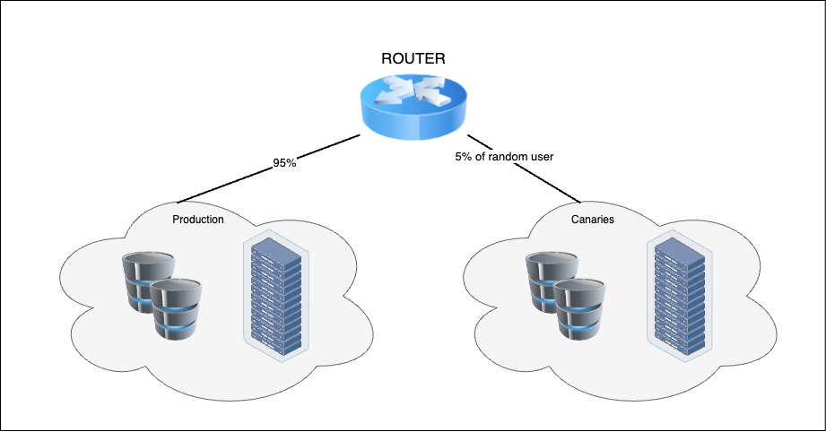

# Developer Tools (DVA-C02)

Bu başlık altında, siz geliştiriciler için AWS'deki geliştirici araçlarına bir giriş sağlamaktır. Bu araçlar şu şekilde listelenebilir:

-   [AWS Amplify](#aws-amplify),
-   [AWS Cloud9](#aws-cloud9),
-   [AWS CloudShell](#aws-cloudshell),
-   [AWS CodeCommit](#aws-codecommit),
-   [AWS CodeBuild](#aws-codebuild), 
-   [AWS CodeDeploy](#aws-codedeploy),
-   [AWS CodePipeline](#aws-codepipeline)
-   [AWS CodeStar](#aws-codestar),
-   [AWS X-Ray](#aws-x-ray)
 

## CI Nedir? (What is CI?)

Bu başlık altında, Sürekli Entagrasyon (Continuous Integration) konusunu ele alacağız.


Sürekli entegrasyon, insanlar ve yazılımın kendisi tarafından desteklenen bir uygulamadır. Bu uygulama, geliştiricilerin kod değişikliklerini sürekli olarak kaynak kontrolündeki mevcut kodla entegre etmelerini sağlar. Siz ve diğer dokuz kişinin birlikte bir kitap yazacağınız söylendiğini bir senaryo hayal edin. Bir konu belirlersiniz, kimin ne yazacağını tartışırsınız ve sonra yazmaya koyulursunuz. Sizce nihai hikayenin sorunsuz bir şekilde bir araya gelme olasılığı nedir? Açık konuşmak gerekirse bu ihtimal oldukça düşüktür.

Ancak, gün boyunca tüm yazarlar üzerinde çalıştıkları şeyleri paylaşırlarsa, herkes yazılarında küçük düzeltmeler yapabilir ve böylece her şey tutarlı kalır. Bu mükemmel bir benzetme olmayabilir, ama sürekli entegrasyonun geliştiriciler için çözmeye çalıştığı soruna oldukça yakın bir örnek olarak düşünülebilir.

Geliştiriciler kod değişikliklerini entegre etmek için ne kadar uzun süre beklerlerse, entegrasyon sorunlarıyla karşılaşma olasılıkları o kadar artar. Değişiklikleri entegre etmek için projenin sonuna kadar beklerlerse, bu yeniden çalışma gerektirecektir; bu da çok fazla ek çaba gerektirebilir.

Ancak, geliştiriciler kodlarını sürekli olarak entegre ederlerse, entegrasyon sorunlarını erken yakalayabilir ve ilerledikçe çözebilirler. Bu, kodun her zaman çalışır durumda bırakılmasını sağlamaya yardımcı olur. Kodu paylaşılan bir repository'e daha sık commit etmek bu sorunu nasıl çözer? Aslında çözmez. Sürekli entegrasyon sürecinin bir parçası, her şeyin doğru çalıştığını doğrulamak için her commit'i build etmek ve test etmektir.

Sürekli entegrasyonu değerli kılan şey, işte bu build etme ve test etme sürecidir. İş akışı şu şekilde düşünebiliriz: Bir geliştirici version control'dan en son kodu alır ve kendi bilgisayarında bazı değişiklikler yapar. Ardından çalışmalarını doğrulamak ve değişikliklerinin bir şeyleri bozmadığından emin olmak için unit test'leri yerel olarak çalıştırır. Tüm testler başarılı olduktan sonra, kodlarını version control'a geri commit edebilirler. Bu noktada, genellikle bir continuous integration server olan otomatik bir süreç bu değişiklikleri alır, projeyi build eder ve testleri çalıştırır. En azından unit test'leri çalıştıracaktır. Build'in sonucu ne olursa olsun, CI server geliştiricileri bilgilendirmelidir. Başarısız testler varsa, sorunu hemen çözebilirler. Bu testlerin her commit'te çalıştırılması, kodun production kalitesinde kod olarak doğrulanmaya bir adım daha yaklaştığını doğrulamanıza olanak tanır.

Kodun production'a dağıtılmaya hazır olmasından önce çalıştırılması gereken birçok başka test bulunur. Bazılarının sürekli entegrasyon sürecinin bir parçası olarak çalıştırılması önem arz eder, diğerleri ise sürekli teslim pipeline'ının bir parçası olacaktır. Linter'ları çalıştırmak ve sürekli entegrasyon sürecinden temel güvenlik denetimleri yapmak çok değerlidir.

Continuous integration server, geliştiricilerden gelen kodu test ettiğinde ve kod tüm testleri geçtiğinde, kodu sürekli teslim pipeline'ında kullanılabilecek şekilde paketlemelidir. Sürekli entegrasyon süreci, sürekli teslim sürecine geçmeden önce önemli bir ilk adımdır, çünkü sürekli teslim sunucusunun kullandığı kodun mümkün olduğunca iyi olmasını sağlamaya çalışır.

Sürekli entegrasyonun bir süreç olduğunu ve insanlar ve yazılım tarafından desteklendiğini tekrar vurgulamak faydalı olacaktır. Bir süreç olmasının nedeni, tüm geliştiricilerin kodlarını düzenli olarak entegre etmeyi kabul etmeleri gerektiğidir. Geliştiriciler kodlarını sürekli olarak entegre ediyorlarsa ancak o zaman sürekli entegrasyon olur. Tüm geliştiriciler bunu yapmazsa, o zaman sık entegrasyon veya ara sıra entegrasyon olur, ama sürekli entegrasyon olmaz.

### Geliştirme Ortamı Yaratmak (Creating a Development Environment)

Production'ı yansıtan bir geliştirme ortamına sahip olmanın neden hataları azaltmaya yardımcı olduğu konusuna daha yakından bakalım.

Çok sayıda araç, dil, framework ve platform olduğu için, bir geliştirme ortamı kurmanın birçok farklı yolu bulunur. Haliyle, geliştirme ortamı kurmanın yapmanın tek bir doğru yolu bulunmaz. Hedef, production'ı mümkün olduğunca iyi yansıtan yerel bir geliştirme ortamına sahip olmak olmalıdır. Bu konu önemlidir çünkü günümüzde hemen hemen her işletim sisteminde geliştirme yapabilirsiniz. Üç geliştiriciye sahip olduğunuz ve hepsi farklı yapılandırmalara sahip farklı işletim sistemleri kullandığı bir senaryoda, bir ortamda çalışan ama diğerlerinde çalışmayan bazı kodlarla karşılaşabilirsiniz. Bu sorunu çözmenin bir yolu, **Vagrant** ve **VirtualBox** gibi bir araç kullanmaktır. Vagrant, sanal makineler oluşturmanızı ve yönetmenize olanak tanıyan bir sanal makine yönetim aracıdır. VirtualBox ise bir sanallaştırma aracıdır, yani VM'ler oluşturmanıza ve çalıştırmanıza olanak tanır.

Vagrant'ı nasıl kullanacağımıza bir bakalım. Buradaki amacımız, bir Ubuntu Linux VM kurmak ve bir Python uygulaması çalıştırmak. İlk olarak, projeyi oluşturmak istediğimiz dizinimize geçeceğiz. Ardından `vagrant init` komutunu çalıştıracağız ve `ubuntu/trusty64` parametresini bu komuta ekleyeceğiz. Son haliyle, kullanmamız gereken komut `vagrant init ubuntu/trusty64` olmuş olur.  Bu komut, Vagrant'a temel işletim sistemi olarak ne kullanacağını söyler. 

Bu komut, Vagrantfile adında bir dosya oluşturmalıdır. Bu dosya, Vagrant'a hangi işletim sistemini istediğimizi ve üzerine hangi yazılımları kurmak istediğimizi söyler.

```ruby
# Example 1 - Vagrantfile
Vagrant.configure("2") do |config|
	# All Vagrant configuration is done here. The most common configuration
  # options are documented and commented below. For a complete reference,
  # please see the online documentation at vagrantup.com.

  # Every Vagrant virtual environment requires a box to build off of.
  # See box list
  #   http://www.vagrantbox.es/
  config.vm.box = "ubuntu/trusty64"
  
  config.vm.box_check_update = true
	
	# Create a forwarded port mapping which allows access to a specific port
  # within the machine from a port on the host machine. In the example below,
  # accessing "localhost:8080" will access port 80 on the guest machine.
  # config.vm.network "forwarded_port", guest: 80, host: 8080
  config.vm.network "forwarded_port", guest:80, host:8080
  config.vm.network "forwarded_port", guest:8080, host:1337
  config.vm.network "forwarded_port", guest:5000, host:5000


	# Share an additional folder to the guest VM. The first argument is
  # the path on the host to the actual folder. The second argument is
  # the path on the guest to mount the folder. And the optional third
  # argument is a set of non-required options.
  config.vm.synced_folder "./", "/var/www"

	config.vm.provider :virtualbox do |vb|
		vb.gui = false
		vb.memory = "2048"
	end

	config.vm.provision = "ansible" do |ansible|
		ansible.playbook = "ansible/playbook.yml"
	end
end
```

Yukarıda verilen örnek bir Vagrantfile dosyasına bir göz atalım. Vagrantfile bir Ruby dosyasıdır. Eğer Ruby sözdizimini biliyorsanız, bu size tanıdık gelecektir. Bilmiyorsanız da sorun değil çünkü çoğunlukla anlaşılabilir durumdadır. Gördüğünüz gibi, bu dosya varsayılan olarak çok iyi yorumlanmış durumdadır. Bu yorumlar, belirli bir bölümü anlamaya çalışırken size yardımcı olabilir. 

Şimdi dosyayı daha yakından inceleyelim. `Config.vm.box = "ubuntu/trusty64"`. Bu satır, Vagrant'a Ubuntu kullanıcısından trusty64 işletim sistemini kullanmak istediğimizi söyler. Temel olarak kullanabileceğiniz topluluk tarafından oluşturulmuş birçok farklı box türü bulunur.

Güvenlik konusunda hızlı bir not geçelim. Bu makine imajları paylaşılan topluluk imajlarıdır, bu yüzden bunları kullanırken örtük bir güven düzeyi olduğu söylenebilir. Ubuntu veya HashiCorp gibi güvenilir kaynaklardan gelen imajlara bağlı kalmak iyi olacaktır, ancak bu kaynakların bile güvenliğin garantisi değildir. Kendi imajlarınızı oluşturabilir ve Vagrantfile'ınızda bu imajlara URL belirtebilirsiniz ve isterseniz bunları topluluğa da yükleyebilirsiniz.

`config.vm.network "forwarded_port"` kullanılan satırlara bakalım. Burada, host ve guest işletim sistemimiz arasındaki port'ları eşleştiriyoruz. Daha net olması açısından; host, bilgisayarınızda çalıştırdığınız işletim sistemidir ve guest ise oluşturduğumuz VM'dir. 

Ayrıca bu alanda, paylaşılan klasörleri de eşleştirebiliriz. `config.vm.synced_folder` olduğu satıra bakalım. Bu, host işletim sisteminizde paylaşılan bir klasördeki bir dosyayı düzenlediğinizde, guest işletim sisteminin de bu değişiklikleri göreceği anlamına gelir. Bu, kurulumun önemli bir parçasıdır çünkü dosyaları host'unuzda düzenlemenize ve guest'te nasıl çalıştıklarını görmenize olanak tanır.

Vagrantfile'ımız hazır olduğuna göre, `vagrant up` komutuyla guest işletim sistemini başlatalım. Bu komut, Vagrant'a mevcut dizinde bir Vagrantfile aramasını söyleyecek ve bulursa, VM'mizi kurmak için onu kullanacaktır. Bulamazsa, bir üst dizine gidecek ve orada bir Vagrantfile arayacak ve en üst seviyeye ulaşana veya bir Vagrantfile bulana kadar bunu yapmaya devam edecektir. `vagrant up`komutu, özellikle ilk kez çalıştırıyorsanız, guest işletim sistemini indirmesi gerektiği için biraz zaman alabilir.

Şimdi tamamlandığına göre, bağlanabiliriz ve diğer herhangi bir işletim sistemi gibi kullanabiliriz. `vagrant ssh` komutunu çalıştırırsanız, SSH üzerinden Ubuntu VM'ye bağlanacaktır. Şimdi bağlandığımıza göre, istediğimiz işletim sistemine sahip olduğumuzu doğrulayalım. Bunu `lsb_release` komutuyla ve `-a` parametresini kullanarak yapabiliriz.

Burada istediğimiz işletim sisteminin komut satırında olduğumuzu görebilirsiniz. Daha önce bir Ubuntu işletim sistemi oluşturacağımızı ve bir Python uygulaması çalıştıracağımızı belirtmiştik. O halde uygulamayı ve nasıl kurulduğunu görelim. Unutmayın ki, bu Python uygulamasına sahip olmadığınız için Vagrantfile'ım ile sizinki arasındaki farklar burada belli olacaktır.

Ancak, bu araçları nasıl kullanacağınızı daha iyi anlamak için kendi uygulamanızı oluşturmaya çalışmak efektif bir yöntemdir. Django uygulamımı çalıştırmak için, Vagrantfile'ımızda eşleştirdiğimiz dizine (`cd /var/www/faceit/`) geçmem gerekiyor. Şimdi dizinleri değiştirdiğimize göre, geliştirme web sunucusunu başlatmak için `python manage.py runserver 0.0.0.0:5000` komutunu çalıştırmamız gerekiyor. Virtualenv veya hatta Django'yu manuel olarak kurmadan çalıştığını fark etmiş olabilirsiniz. Bunu bizim için arka planda yaptı, çünkü Vagrant'a nasıl yapılacağını söyledik. Vagrantfile'ımızda, Vagrant'a ansible `provisioner`'ı kullanmasını söyledik. Vagrant, VM'yi sağlamak için hangi aracı kullanmak istediğinizi belirtmenize olanak tanır.

Yani, production'da Chef, Ansible, Puppet veya Saltstack gibi bir araç ya da başka bir araç kullanıyorsanız, geliştirmede de aynı aracı kullanabilirsiniz. Bu, tüm yazılımların aynı sürümlerinin kullanılmasını sağlayarak production ve development gibi ortamlar arasındaki farkları daha da azaltmaya yardımcı olur.

Ansible gibi yapılandırma yönetimi araçları, bu başlıkta ele alacağımız kapsamın dışındadır. Ancak size bir ansible playbook'un neye benzediğini göstermek istiyorum. 

```yml
- hosts: all
  become: true
  tasks:
    - name: update apt cache
      apt: update_cache=yes
    - name: install required packages
      apt: name={{ item }} state=present
      with_items:
        - apache2
        - build-essential
        - python-pip
        - python2.7-dev
        - default-jre
        - default-jdk
        - git
    - name: virtualenv
      pip: name=virtualenv
    - name: app.py requirements
      pip: requirements=/var/www/requirements.txt virtualenv=/var/www/venv
    - name: install jenkins key
      apt_key: url=http://pkg.jenkins-ci.org/debian/jenkins-ci.org.key state=present
    - name: add jenkins source repo
      lineinfile: dest="/etc/apt/sources.list" line="deb http://pkg.jenkins-ci.org/debian binary/"
    - name: update cache
      apt: update_cache=yes name={{ item }} state=present
      with_items:
        - jenkins
    - name: apply venv to shell
      lineinfile: dest=/home/vagrant/.bashrc line="source /var/www/venv/bin/activate" state=present create=yes
```
Bu, başka bir işaretleme dili (markup language) olan bir yaml dosyasıdır. Buradaki dosya, kurulması gereken yazılımları listeler. Asıl önemli şeyler şeyler, tamamlanması gereken görevleri bulmaya başladığımız `tasks` satırından sonra gerçekleşiyor.

"- name" ile başlayan her satır bir görevdir. Bazıları yazılım yüklemek için apt-get görevleridir. Diğerleri ise PIP yükleyicileri gibi farklı görevleri içerir. PIP bir Python paket yöneticisidir. `name: install jenkins key` satırında, bu repo'nun ilerleyen bölümlerinde göreceğimiz bir CI sunucusu olan Jenkins'i yükler. `name: apply venv to shell` ile başlayan satırdaki görev ise, VM'ye SSH ile her bağlandığımda Python sanal ortamımı etkinleştiren kodun `bashrc` dosyasında var olduğundan emin olur.

Belirtmek faydalı olacaktır ki, bu sadece bir tutorial olduğu için yazılımların herhangi bir sürümünü sabitlemekten kaçındık; ancak ortamlarınızın farklı bağımlılıkların tam olarak aynı sürümlerini kullandığından emin olmak için sürümleri sabitlemelisiniz. Yani, `vagrant up`  komutunu kullandığımızda, Vagrant temel VM'mizi indirdi ve ardından uygulamamızı çalıştırmak için ihtiyaç duyduğu her şeyi yüklemek için ansible'ı kullandı.

Vagrant ile ilgili değineceğimiz son iki konu daha bulunur. Birincisi, VM'yi durdurma ve silme yeteneğidir. Bir VM'yi durdurmak için komut satırında `vagrant halt` yazabilirsiniz, bu komut VM'yi kapatacaktır, böylece daha sonra `vagrant up` komutuyla yeniden başlatabilirsiniz. Artık tamamen işiniz bittiğinde, `vagrant destroy` yazabilirsiniz ve bu komut ise, VM'yi silmek istediğinizden emin olup olmadığınızı soracaktır. Evet derseniz, VM'nizin o örneğini silecektir. 

Bu başlık altında anlatılanlar gerçekten CI sürecinin bir parçası olmadığını düşünebilirsiniz ki haksız da sayılmazsınız; ancak production'ı yansıtan bir ortamda geliştirme yapmak, çevresel farklılıklardan kaynaklanan hataları en aza indirgeyecektir.

### Sürüm Kontrolü (Version Control)

Bu başlık altında, Version Control Systems konusunu inceleyeceğiz, version control ayrıca source control ve revision control olarak da adlandırılır.

Peki, version control nedir ve neden önemsemelisiniz? Soyut düzeyde, version control bir şeyin ömrü boyunca geçirdiği değişiklikleri takip etmekle ilgilidir. Yazılım geliştirme bağlamında, version control bir veya daha fazla dosyanın zaman içindeki değişikliklerini takip etmekle ilgilidir. Buradaki dosya terimi hemen hemen her türlü dosyayı temsil edebilir. Sadece kaynak kod dosyaları olmak zorunda değil. Çoğu zaman dokümantasyon, konfigürasyon dosyaları ve hatta görsellerin version control altında olduğunu görebilirsiniz.

Version control, geliştiricilerin tek bir proje üzerinde işbirliği yapmasına ve projenin geçmişini takip etmesine olanak tanır. Bir geliştirici tarafından yapılan her değişiklik kaydedilir ve daha sonra erişilebilir. Ayrıca, herkes aynı kod tabanı üzerinde çalışabilir ve tüm dosyaların tam geçmişini görebilir.

Farklı Version Control System türleri bulunur ve her tür için farklı araçlar mevcuttur. Çoğunlukla Distributed Version Control Systems konusuna değineceğiz ve özellikle Git'ten bahsedeceğiz. Git'ten bahsetmemizin nedeni, günümüzde çok yaygın kullanılması ve bilmenin değerli olmasıdır.


Bahsettiğimiz gibi, farklı Version Control System türleri bulunur. Yıllar önce Local Version Control ile başladık. Kodda değişiklik yapmak isteyen herkesin kodun bulunduğu sunucuya bağlanması ve orada düzenlemesi gerekiyordu, sonra değişikliklerini o sunucudaki Version Control System'e kaydedebiliyorlardı. Çoğunlukla, bu tür Local Version Control günümüzde kullanılmıyor.


Sonrasında, client-server modeline geçtik, buna ayrıca centralized model de denir. Burada kod bir ana sunucuda bulunur ve geliştiriciler onu kendi bilgisayarlarına çeker yani pull eder. Sonra değişiklik yapabilir ve geri gönderebilirler. Bunu bir kütüphane gibi düşünün. SVN ve Team Foundation Version Control gibi araçlar Centralized Version Control'e örnektir. Bu model hala günümüzde yaygın olarak kullanılmaktadır. Bu model, sunucunun yalnızca belirli kullanıcıların kaynak koda erişmesine izin verecek şekilde yapılandırılmasına olanak tanır ve oldukça ayrıntılı erişim kontrolüne izin verir, bu da özellikle denetim ve uyumluluk nedenleriyle faydalı olabilir.


Daha önce de değindiğimiz gibi Distributed Version Control Systems'i kullanmaya başladık. Client-server modelinde, bir dosyanın belirli bir sürümünü görmek istediğinizde, bunu istemek için bir istemci aracı kullanırdınız ve sunucu, erişiminiz varsa, bunu size gönderirdi. Distributed model biraz farklıdır. Distributed'da, projenin tüm geçmişi yerel olarak elinizde bulunur. Bir repository'yi klonladığınızda, her şeye erişiminiz olur. Ayrıca bu modelde, kod tabanının tek bir merkezi versiyonuna ihtiyaç yoktur. Örneğin, değişikliklerinizi kendi ortamınızdan iş arkadaşınıza gönderebilir ve onlar da değişikliklerini size geri gönderebilir.

Şimdi bu tipik bir kullanım senaryosu değil, ancak Distributed Version Control Systems'in esnekliği sayesinde mümkündür. Tipik bir kullanım senaryosu, kanonik kaynak olarak kabul edilen şeyi içeren merkezi bir sunucuya sahip olmaktır ve bu şekilde kullanıldığında, biraz centralized model gibidir. Git ve Mercurial, Distributed Version Control Systems'e örnektir.

Şimdi version control için Git ve GitHub'ı gerçekten kullanmaya bir göz atalım. GitHub, ücretsiz public code repo'larına izin veren ve kaydolmak için kredi kartı gerektirmeyen, popüler bir hosted Git versiyonudur.

Başlamak için, GitHub web arayüzünü kullanarak bir repository oluşturabiliriz ve adını git_demo_app koyalım. Git'in yerel makinenizde kurulu olduğunu doğrulayarak devam edebilirsiniz. Bunu yapmak için `git --version`  komutunu kullanabiliriz.

Bu komutun, Git'in versiyonunu döndürmesi gerekiyor. Benim makinemde, 2.7.4 sürümünün kurulu olduğunu gösteriyor. Eğer sizde bu şekilde dönmezse, farklı bir sürümünüz kurulu olabilir veya bir hata alıyorsanız, belki de Git kurulu değildir.

Şimdi yerel bir proje oluşturma zamanı. Tercih ettiğiniz herhangi bir metin editörünü kullanın ve Python'da basit bir hello.world uygulaması oluşturun. Artık kodumuz oluştuğuna göre, değişiklikleri izlemeye başlayabilmem için bir Git repo'su başlatmamız gerekiyor. Bunu `git init` komutu ile yapabilirsiniz.

Şimdi, Git'e hangi dosyaları izleyeceğini söylemem gerekiyor. Bunun için `git add` komutunu kullanabiliriz. Tamam, şimdiye kadar yaptığımız şey yerel bir Git repo'su oluşturmak ve hello.py dosyasını izlenmek üzere eklemekti. Sonraki adımda, Git'e hello.py dosyasının şu anki halinin bir kopyasını kaydetmesini söyleyen commit işlemini gerçekleştirmemiz gerekiyor. Bunun için `git commit` komutunu `-m` flagı ile birlikte kullanırız ve bir mesaj ekleriz. Örnek kod şu şekildedir: `git commit -m "the message here"` .Bu noktadadan sonra, yerel repository'mizde hello.py dosyasının şu anki halinin bir kopyası bulunur. Ancak, bu sadece yerel makinede. Yerel repo'muza GitHub ile nasıl konuşacağını söylememiz gerekiyor. Bunun için `git remote` komutunu kullanarak GitHub remote URL'sini eklemeliyiz. Örnek kod olarak şuna benzer bir komut olacaktır: `git remote add origin {{YOUR_REPO_URL}} `


Artık repo'muz GitHub ile nasıl konuşacağını bildiğine göre, `git push` komutu ile kodu GitHub'a gönderebiliriz. Tamam, şimdi dosyayı gerçekten değiştirmeye bakalım. Metin editörüme geri dönelim ve kod dosyası içerisinde değişiklik yapıp kaydedelim. Şu anda `git status` komutunu kullanarak neyi değiştirdiğimizi görebiliriz. hello.py dosyamızın değiştiğini göstermeli ve `git diff` komutu ile nasıl değiştiğini görebiliriz. Tamam, bu değişikliği commit edelim. Nasıl yaptığımızı hatırlıyor olmalısınız `-m` flag'ini kullanarak bir mesaj ekliyorduk.

Şimdi `git log` komutu ile commit geçmişimize bakarsak, yaptığımız tüm değişiklikleri görebiliriz. `git log` komutunun, birçok formatlama seçeneği de dahil olmak üzere birçok seçeneği vardır. 

Şimdi yeni bir branch oluşturmayı ve ona değişiklikler yapmayı nasıl yapacağımızı görelim. Branch'lerin birçok kullanım alanı bulunur, bunlardan biri yeni özelliklerin ayrı bir branch'te geliştirilmesine izin veren yerel branch'ler oluşturabilmek ve daha sonra bunu ana hattımıza geri birleştirmektir. `git branch` komutunu kullanarak mevcut branch'lerin bir listesini görebiliriz. Yanında yıldız işareti olan, şu anda kullandığımızdır. 

Şimdi yeni bir branch oluşturmak ve checkout etmek için `git checkout` komutunu `-b` flagı ile kullanırız. Örneğin; `git checkout -b new_feature` . Bu komutun işe yaradığını tekrar `git branch` komutu ile doğrulayabiliriz. Şimdi, hello.py dosyamızda birkaç değişiklik yapıp commit edelim. Hadi master branch'imize geri dönelim ve ne olduğunu görelim. Master branch'ine geri dönmek için; `git checkout master` komutunu kullanırız.

hello.py dosyamıza baktığımızda, az önce yaptığım değişikliklerin olmadığını görüyoruz, çünkü onları farklı bir branch'te yaptık. Eğer yaptığımız bu değişikliklerden memnunsak, `git merge` komutu ile bu değişiklikleri feature branch'imizden master branch'imize birleştirebiliriz. Yani temelde komutumuz; `git merge new_feature` olacaktır. Şimdi hello.py'ye geri dönüp baktığımızda, feature branch'teki değişikliklerin artık master branch'te de var olduğunu göreceğiz.

Bu noktada, artık o feature branch'in kalmasına gerek yok, bu yüzden onu `git branch` komutunun `-D` flagı ile silebiliriz. Bu işlem için kullanılan komut ise şu şekilde olacaktır; `git branch -D new_feature`. Şimdi bu değişiklikleri GitHub'a push edebiliriz ve kodları GitHub'da görebileceğiz. Bu işlem için master branch'imizde iken `git push` komutunu çalıştırmalıyız. Hadi GitHub web arayüzüne geri dönelim, sayfayı yenileyelim ve ne olacağına bakalım. Uygulamamızın burada olduğunu ve yaptığımız tüm değişikliklerin geçmişini görebiliyoruz. 

### Test (Testing)

Birçok farklı test türü bulunur ve hepsinin ayrı ayrı kullanım senaryoları bulunur. Bu başlık altında, CI sürecinde yer alan bazı test türlerine değineceğiz. Bununla beraber testin neden önemli olduğu konusuna yakından göz atacağız. Öncelikle neden sorusuyla başlayalım.

Kariyerinizin belli bir noktasında, muhtemelen testi birkaç kez duymuş olabilirsiniz. Bununla beraber, bu süreç yukarı şu şekilde ilerler: "Evet, test harika, ama sıkı bir zaman sınırımız var, bu yüzden test yazmaya zamanımız yok."

Şimdi, eğer bir geliştiriciyseniz ve gerçekten o zaman sınırı altındaysanız, bu mantıklı bir düşünce şekli gibi görünebilir. Belki de proje küçükse, karmaşıklığı azsa ve kesintilerin gerçek bir etkisi yoksa, evet, bu durum geçerli olabilir.

Ancak proje ne kadar karmaşık olursa veya kod ne kadar kritik hale gelirse, test ihtiyacı da o kadar artar. Koddaki hatalar kesinti, keşif veya yeniden çalışma şeklinde zaman ve maddi kayba neden oluyorsa, kodunuzu test etmemek gibi bir lüksünüz olamaz. Örneğin, uçağın işletim sisteminin yeni güncellendiğini ve yapılan tek testin, kodu dağıtmadan yani deploy etmeden hemen önce geliştiricilerin dizüstü bilgisayarlarında yerel olarak yapıldığını bilseydiniz, o uçağa biner ve ülke çapında bir uçuş yapar mıydınız? Bir çoğunuzun bu soruya cevabı olumsuz olacaktır. Kesinlikle test edilmemiş kodla bir mekik yolculuğuna çıkmaz veya test edilmemiş kodla çalışan bir kendi kendine giden araba kullanmazdınız. Bu konuda, test edilmemiş kodu olan bir web sitesine kredi kartınızı bile girmek istemeyebilirsiniz. Çünkü hata ve güvenlik açığı oluşturmak gerçekten çok kolaydır.

Peki neden test etmeliyiz? Yararlı testler ne kadar erken çalıştırılırsa, sorunlar o kadar erken bulunur. En azından, continuous integration söz konusu olduğunda, **unit** ve **integration** testlerimizi çalıştırıyor olmalıyız. Ancak kod kalitesini artırmaya yardımcı olabilecek her şeyi de yeri gelmişken önerelim. Bununla beraber, linter'lar gibi toollar ile, kod kalitesi değerlendirebilirsiniz. Ayrıca güvenlik denetimi için statik kod analiz araçlarına da projenizde yer verebilirsiniz.

**Unit testler**, tek bir kod birimini test ettikleri için en granüler test düzeyidir. Sınıflarınızın, fonksiyonlarınızın ve metodlarınızın beklenildiği gibi davranıp davranmadığını belirlemekten sorumludurlar. Unit testlerin hızlı olması gerekir, böylece geliştiricilere anında geri bildirim sağlayabilirler. Bir geliştirici değişiklik yapmadan önce ve sonra unit testleri çalıştırırsa, yaptığı değişikliğin bir şeyin bozulmasına neden olup olmadığını bilecektir. Bununla, veritabanları, dosya sistemleri, ağ veya bu tür herhangi bir şeyi kontrol etmiş olursunuz. Bunun nedeni iki kısımlıdır. - 
- İlk olarak, testlerin çok hızlı çalışmasını sağlar. Testlerin çalışması birkaç dakika sürerse, sonunda geliştiriciler onları çalıştırmayı bırakacaktır. Geliştiricilerin sürekli olarak kod değişiklikleri yapabilmeleri ve bu değişikliklerin bir şeyi bozup bozmadığı konusunda anında geri bildirim alabilmeleri gerekir.

- İkinci neden, koddaki mantığın doğru çalışıp çalışmadığını belirlemeye çalışıyor olmamızdır. Yani bu test düzeyinde, harici kaynakların doğru çalıştığını varsayacağız. Projenin bu kısımları, daha yüksek bir seviyede test edilecektir. 

```python
from __future__ import unicode_literals

from django.db import models
from django.template.defaultfilters import slugify

from name_tools import canonicalize

class User(models.Model):
    full_name = models.CharField(max_length=70)
    first_name = models.CharField(max_length=70, default='')
    last_name = models.CharField(max_length=70, default='')

    def __unicode__(self):    # __unicode__ on Python 2
        return self.full_name

    def uniform_name(self):
        return canonicalize(self.full_name)

    def capitalize(self):
        return self.full_name.upper()

    def slug(self):
        return slugify(self.full_name)
```

Gerçek bir unit test örneğine bakalım. Önce, test etmek istediğimiz fonksiyonu kontrol edelim. Yukarıda verilen kodu inceleyerek bu işleme başlayabiliriz. Burada birkaç metod bulunduran bir  `User` sınıfımız bulunuyor. Bir kullanıcının adını normalize etmek için bir metodumuz bulunuyor. Biri adı büyük harfe çevirmek için ve bir diğeri de bir URL slug'ı oluşturmak için toplamda 3 farklı metoda sahibiz. Bu metodların beklediğimiz gibi davranıp davranmadığını doğrulamak için nasıl unit test yapacağımıza bakalım. 

```python
from django.test import TestCase
from .models import User

class HomeIntegrationTest(TestCase):
    pass

class UserUnitTest(TestCase):
    def setUp(self):
        self.user = User(full_name="john smith")

    def test_uniform_name(self):
        self.assertEqual(self.user.uniform_name(), "John Smith")

    def test_capitalized_name(self):
        self.assertEqual(self.user.capitalize(), "JOHN SMITH")

    def test_slug_name(self):
        self.assertEqual(self.user.slug(), "john-smith")
```

Bu örnekte, bir `UserUnitTest` ve üzerinde bazı test metodlarımız olduğunu görebilirsiniz. Setup metodu ile başlıyoruz. Burası, her testten önce kod çalıştırabileceğimiz ve ihtiyaç duyabileceğimiz her şeyi başlattığımızdan emin olabileceğimiz yerdir. Bu durumda, bir user değişkenini yeni bir user nesnesinin bir instance'ına atıyoruz. Sonra user sınıfındaki bazı metodların doğru çalıştığını doğrulamak için birkaç testimiz bulunur. Önce `uniform_name` metodunu test ediyoruz. Sonra `capitalize` ve son olarak `slug` metodunu test eden bir kodumuz bulunmaktadır. 

Bu seviyede test yapmak, bireysel fonksiyonların yapmaları gerekeni yaptıklarına dair bir güven seviyesi sağlar. Geliştiricilerin iyi unit testler oluşturmakta zorlanması yaygın bir durumdur. Genellikle bu durum, kodun unit test edilecek şekilde yazılmamış olmasından kaynaklanır. Eğer kodunuz sınıflarınızın içinde veritabanı bağlantıları gibi şeyleri doğrudan örneklendiriyorsa, o zaman dependence injection gibi yöntemleri kullanmak için bazı kod yeniden düzenlemeleri yapmanız gerekebilir. 

```c#
// Without Dependency Injection
class User
{
    private DatabaseConnection dbConn;

    public User()
    {
        dbConn = new DatabaseConnection("somedb", "user", "pass");
    }

    public bool IsActive(string name)
    {
        return dbConn.queryBool("SELECT IsActive FROM USER WHERE Name LIKE '%{0}%'", name);
    }
}
```
İşte C# dilinde bir örnek kod. Bu örnekte, `dbConn = new DatabaseConnection("somedb", "user", "pass");` satıra bakın. Bir veritabanı bağlantısı örneklendiriyoruz. Bu da kodumuzda o veritabanı için bir bağımlılık oluşturduğumuz anlamına geliyor. Bunun yerine, DI'yi yani dependency injection'ı kullanmalıyız. 

```c#
// Without Dependency Injection
class User
{
    private IDatabaseConnection dbConn;

    public User(IDatabaseConnection injectedDBConn)
    {
        dbConn = injectedDBConn;
    }

    public bool IsActive(string name)
    {
        return dbConn.queryBool("SELECT IsActive FROM USER WHERE Name LIKE '%{0}%'", name);
    }
}
```

İşte dependency injection ile bir örnek ve eğer  `private IDatabaseConnection dbConn;` satıra bakarsanız, sınıf yerine bir arayüz kullanıyoruz ve constructor şimdi bu arayüzü bir argüman olarak alıyor. Şimdi, arayüzlerimiz ve sınıflarımız arasındaki eşleştirmeyi otomatik olarak ele almak için istediğimiz herhangi bir inversion of control container'ını kullanabiliriz. Bunun aslında nasıl yardımcı olduğunu merak ediyor olabilirsiniz. Nedeni, kodunuzun artık veritabanı için bu hard coded bağımlılıkla bağlı olmamasıdır. Onun yerine, ne yapmak istediğimize bağlı olarak gerçek veya sahte bir versiyonla uygulayabileceğimiz bir arayüzümüz bulunur. Eğer bunu unit test etmek isterseniz, o arayüzü uyguladığı sürece veritabanı bağlantısının sahte bir versiyonunu kullanabilirsiniz. 

```python
from django.test import TestCase
from .models import User

class homeIntegrationTest(TestCase):
	def test_index(self):
		response = self.client.get('/')
		self.asserEqual(response.status_code, 200)

	def text_index_contains_text(self):
		response = self.client.get('/')
		self.assertTrue('coming soon' in response.content.lower()) 

```
Peki bileşenler arasındaki etkileşimi test etmek ve işlerin veritabanı gibi dış bir kaynakla nasıl çalıştığını görmek istersek ne olur? İşte burada integration testing devreye giriyor. Bir integration teste bakalım. Bu örnekte, web sitesinin ana sayfasını test ediyoruz. `test_index` metoduna bakarsanız, client nesnesinin get metodunu çağırdığını göreceksiniz, bu temelde sahte bir web tarayıcısıdır. Yani ana sayfamız olan forward slash rotasını çağırır ve 200 durum koduna sahip olduğumuzdan emin olmak için kontrol eder.

Eğer `text_index_contains_text` bakarsak, temel olarak aynı şeyi yapar, ancak belirli bir metnin döndürüldüğünden emin olur. Unit testler bu kodlardan çok farklıydı. Onlar daha granüler düzeye odaklandılar ve birimin mantığıyla ilgilendiler. Oysa bu integration testleri, uygulamamızın birden çok katmanı boyunca kod çalıştırıyor. Integration testlerin harici kaynaklarla etkileşime girmesine izin verildiği için, genellikle unit testlerden daha yavaş olurlar ve muhtemelen geliştiricilerin bunları yerel olarak çalıştırması için uygun değildir. Bu iki test türü, continuous integration için minimum öneridir. 

Bununla beraber, birkaç fonksiyonel olmayan testi de önerilir. Bunlardan ilki kod linter'lar olacaktır. Daha önce bahsetmiştik. Kod linter'ları kalite değerlendirme araçlarıdır ve bilinen sorunları tanımlayarak kod kalitesini artırmaya yardımcı olabilirler. İkincisi ise kod kapsama araçlarıdır (code coverage tools). Kod kapsama, testinizin kodunuzun ne kadarını test ettiğini kontrol eder. Kod kapsama araçlarından bahsediyoruz çünkü bunlar faydalı olabilir. Belki kod tabanınız yüzde 100 kapsama gerektiriyor ve belki bu sizin için yapılabilir ve faydalıdır. Ancak bu bir kural olmamalıdır. 

Önerilebilecek son test türü, kaynak kodu analiz araçlarıdır (source code analysis tools). Bu tür araçlar, bilinen güvenlik açıklarını kontrol edebilir ve güvenlik açığı olduğu bilinen bağımlılıkların kullanımını tanımlayabilir. Bu seviyedeki güvenlik testi, geliştiricilerin kod continuous delivery sürecinde daha kapsamlı güvenlik denetimlerine gitmeden önce çok düşük seviyedeki çıktıları almasını sağlar.

### Veritabanı Şeması Değişiklikleri (Database Schema Changes)

Bu başlık altında, veritabanı şema değişikliklerini ele almanın bazı genel yollarına ve bu değişiklikleri nasıl otomatikleştirebileceğimize yakından bakacağız. Eğer yapı ve testi otomatikleştirmeyi düşünüyorsanız, bu birçok uygulama için veritabanı değişikliklerini ele almanın bir yoluna ihtiyacınız olacağı anlamına gelir. Bu başlığı tamamladığınızda, şema migration'larının ortaya çıkardığı zorluk hakkında bir fikriniz olacak ve bu sorunlarla başa çıkmak için bazı yöntemler öğreneceksiniz.

Daha önce, ideal olarak unit testlerinizin gerçek bir veritabanına erişmeyeceğini ve bunun yerine sahte bir uygulamanın bir formunu kullanacağını belirtmiştik. Ancak, bu her zaman mümkün değildir. Bazen herhangi bir nedenle gerçek bir veritabanına ihtiyacınız olacaktır. Ek olarak, unit testler tipik olarak veritabanına erişmese de, güvenlik denetimleri gibi diğer testler erişebilir.

Temel olarak çözmeye çalıştığımız problem şudur: Bir uygulama için kod yazarken veya değiştirirken, çoğu zaman veritabanının bu kodu desteklemek için değişmesi gerekecektir. Bu, bir kullanıcının son giriş yaptığı tarih gibi bir şeyi saklamak için yeni bir sütun, belki yeni bir tablo, bir sütun yeniden adlandırma veya bu tür bir senaryo olabilir.

Veritabanı şemanızdaki değişikliklere bağlı olan kodda bir değişiklik yaptığınızda, bu değişiklikleri test edebilmeniz gerekir. Bu, test için kullanılan herhangi bir veritabanına şema değişikliklerini uygulayabilmeniz ve sonunda production için de uygulayabilmeniz gerektiği anlamına gelir. Bunu ele almanın farklı yolları bulunur. Genel olarak kullanılan yöntem, şema migration araçlarıyla bir ORM kullanmayı tercih etmektir. ORM, bir object-relational mapper'dır, yani veritabanınızı kodunuzdaki sınıflarla temsil etmenize olanak tanır. Bir ORM kullanarak, mantığınızı kodda tutabilir ve versiyonlayabilirsiniz. Ayrıca şema migration'larıyla da kodda tutarak aynı faydayı elde edersiniz.

Çoğu platform, şema değişikliklerini koda dönüştürmek için bir yöntem sunar. .NET için Entity Framework, Code First Migrations'a izin verir. Java için Hibernate ve Flyway'i kullanabilirsiniz. Ruby için, Rails kullanıyorsanız, Active Record'a yerleşik işlevselliğe sahipsiniz. Python için, Django kullanıyorsanız, ORM ve migration'lar yerleşiktir. Python kullanıyorsanız ama Django kullanmıyorsanız, SQLAlchemy ve Alembic'i kullanabilirsiniz. Şimdi, her dili gözden geçirmeyeceğiz. Daha ziyade, bu sadece çoğu modern programlama dilinin kodda şema migrasyonlarını ele almak için bir tür kütüphaneye sahip olduğunu belirtmek için değindiğimiz bir konudur.

Yani bir ORM ve şema migrasyonları iyi bir başlangıçtır, ancak sürekli teslim edebilmemizi ve bir şeyleri bozma riskini azaltmamızı sağlayacak bir stratejiyle eşleştirilmesi gerekir. Peki bu strateji neye benzer? İlk olarak, veritabanınız versiyonlanmalıdır. Daha önce bahsettiğimiz araçlar, hangi değişikliklerin zaten uygulandığını takip edecek bir tür migrations tablosu oluşturarak bunu sizin için halleder. Sonraki adım, her şema değişikliği kendi migrasyonu olmalıdır. Birkaç değişiklikle dolu bir migrasyon, migrasyon süreci sırasında sorunlar ortaya çıkarsa bunları izole etmeyi zorlaştırır.

Sonraki adım ise, değişiklikler yıkıcı olmamalıdır. Örnek olarak, sütunları yeniden adlandırmak yerine, yeni bir sütun ekleyin, eski sütundan gelen verilerle doldurun ve kodunuzun eski sütunu okumaya devam etmesini ancak her ikisine de yazmasını sağlayın. Veritabanı değişikliklerinin başarılı olduğunu ve verilerin başarıyla yazıldığını onayladıktan sonra, uygulamayı yeni sütunu kullanacak şekilde düzenleyebilirsiniz. Nihayetinde, her şey iyi göründükten sonra eski sütunu kaldırabilirsiniz.

Sonraki adım ise, yeni oluşturulan sütunların mantıklı varsayılanlar kullanmasını sağlamamız gerekiyor. Bununla kastettiğimiz, eğer zaten içinde veri olan mevcut bir tabloda yeni bir null olamayan sütununuz varsa, önce tüm mevcut kayıtlar için bir değer belirlediğinizden emin olmanız ve sonra onu null olamaz hale getirmeniz gerekir.

Bunu bu şekilde yaparak, migration süreci sırasında bir şeyler yanlış gitseydi, kodumuzu çalışır durumda tutabilirdik çünkü henüz hiçbir şeyi gerçekten kaldırmadık. Veritabanı değişikliklerinizi versiyon kontrolü altına aldığınızda, ileri ve geri gidebilirsiniz. İlerledikçe süreci iyileştirmenin yollarını görmeye başlayacaksınız. 

### Jenkins ile Sürekli Entegrasyon (Continuous Integration with Jenkins)

Bu başlık içerisinde, Jenkins kullanarak continuous integration sürecine detaylı bir şekilde bakacağız. GitHub'dan bazı kodları çekeceğiz (pull), ihtiyacımız olan bağımlılıkları kuracağız, bazı testler çalıştıracağız ve ardından build'in durumunu rapor edeceğiz. Continuous integration süreci oluşturabilecek birçok harika araç bulunur. Jenkins oldukça yaygın bir araç ve sektörde tercih edilen bir araçtır. 

Freestyle projelere ve pipeline projelerine bakacağız. Freestyle ile başlayacağız. Bu aşamada, bir Django uygulamasını build etmek ve test etmek için bir freestyle projemizin olduğu bir senaryo ile ilerleyeceğiz. Jenkins arayüzüne gittiğimizde, Job'ın dashboard'unda build geçmişini görebiliriz. Konfigürasyon sekmesine bakarsak ise, ilk olarak proje adımızı gösterecektir. Job'ların tutarlı olması için proje adlandırma konusunda bir standart belirlemelisiniz.

Ardından kaynak kodu repository'sine (source code repository) alanını göreceğiz. Bu doküman kapsamında Git kullandığımız ve bu public bir repo olduğu için herhangi bir kimlik bilgisi ayarlamamıza gerek kalmadı. Ancak, muhtemelen private olan kendi repository'leriniz için ayarlarda kimlik bilgilerini belirlemeniz gerekecektir. Sonra build tetikleyicileri (build triggers) alanı bulunur. Git'i her dakika değişiklikler için kontrol edeceğimiz bir kurgu kurabiliriz. Ancak burada bazı ekstra seçeneklerimiz de bulunur. Bir build'i uzaktan tetikleyebiliriz. Başka bir projeyi izleyebilir ve proje tamamlandığında build'i tetikleyebiliriz. GitHub post-commit hook'ları ile Git'in commit sonrası bir build tetiklemesini sağlayabiliriz. Tüm bunlara ek olarak, periyodik olarak herhangi bir değişiklik olup olmadığını kontrol edebiliriz.

Bu aşamada polling kullanacağız, ancak daha verimli olduğu için bir tür post-commit tetikleyicisi önerilir. Ancak bu da ek kurulum ve güvenlik gerektirdiğinden bu seçenekleri düşünmeniz gerekecektir. Ardından build environment seçeneklerimiz bulunur. Burada build öncesi work space'i temizleme ve build takılırsa işlemi sonlandırma seçeneklerini kullanabiliriz. Build öncesi work space'i temizleme seçeneği, temiz bir slate ile başladığımız için build konusunda daha yüksek bir güven sağlamamıza olanak tanır. Sonra build görevleri alanı bulunur. Bu proje için build shell script'ini çalıştırarak başladığımızı düşünelim. Bu bash script'in görevi virtual ENV'yi kurmak ve ihtiyacımız olan Python kütüphanelerini yüklemek. Ardından bekleyen veritabanı migration'larını çalıştırır ve testleri yapar.

Shell script'lerinin versiyon kontrolünde saklandığını ve projenin bir parçası olduğunu unutmayalım. Build script'lerini versiyon kontrolünde tutmak, continuous integration sunucumuzun bir **snowflake sunucu** haline gelmemesini sağlayacaktır. Snowflake sunucu terimi, temel olarak bir sunucunun çok benzersiz olduğu ve kolayca çoğaltılamadığı anlamına gelen bir terimdir. Şimdi, bu job'ı burada durdurup geliştiricilere durumu bildirebiliriz. Ancak, bu aşamada faydalı olabilecek bazı ek non-functional testler eklemenin mümkün olduğunu bilmenizi isterim. Yine, ne kadar faydalı test çalıştırırsanız ve ne kadar erken çalıştırırsanız, sorunları o kadar hızlı tespit edebileceksiniz.

Bu yüzden örneğin; temel bir OWASP Top 10 tarayıcısı ekleyebilirsiniz. Bu temel olarak bilinen az sayıda güvenlik açığı için bir tarama yapar. Unutmayın, bu daha önce de değindiğimiz gibi güvenlik ekibinizin yerini tutmaz, ancak otomatik taramalar bu sorunların bazılarını erken yakaladığınızdan emin olmanıza yardımcı olacaktır. Ayrıca kod kalitesini belirlememize yardımcı olabilecek bir Python linter da ekliyebilirsiniz. Burada çok fazla zaman almayan ve çalıştırılabilecek diğer faydalı kod düzeyindeki testler, kod tabanınızı geliştirmeye yardımcı olacaktır. Son olarak post build görevleri bulunur. Bu post build görevleri, genellikle raporları ve bildirimleri içerir. Buraya kadar değindiğimiz her şey, Jenkins'te temel bir freestyle job'dır.

Şimdi bir pipeline job'a bakalım. Pipeline job'ın dashboard'unun freestyle'dan farklı olduğunu düşünüyorsanız haklısınız. Jenkins kontrol paneline girdiğinizde, son birkaç build'in durumunu gösteren bu pipeline görünümü ile karşılanırsınız. Bu bir bakışta pipeline görünümü, görevlerinizi temsil etmenin güzel bir yoludur. Bize her adımın ne kadar sürdüğünü söyleyerek, herhangi bir darboğazın (bottle necks) nerede oluşmuş olabileceğini belirlememize olanak tanır. Konfigürasyon tabine baktığımızda ilk bakışta, freestyle projeye oldukça benzer görünecektir. Aynı genel bilgileri ve build tetikleyiciler alanı bulunur, ancak sonra bu sefer pipeline bölümünü göreceğiz. 

Bu özellik oldukça işlevseldir; çünkü bir kaynak kodu repository'si ve pipeline kodunuzu içeren dosyanın adını belirtmenize olanak tanır. Ayrıca, build tetiklendiğinde bu pipeline kodunu çalıştıracaktır. Pipeline kodunda job'larımızı tanımlamak için bir groovy DSL kullanabilirisiniz. Netlik olması için; Groovy Java sanal makinesinde çalışan bir dildir ve  DSL, Domain Specific Language'dir. Bu durum, Java, Python, C-Sharp vb. gibi daha genel amaçlı programlama dillerinin aksine, tek bir amaç için kullanılan bir dil olduğu anlamına gelir.

```groovy
node {
    stage 'Checkout'
    git url: 'https://github.com/fatihes1/devops_ci_demo.git'
    
    stage 'Build'
    workspace = pwd()
    sh "ls -asl"
    sh "chmod 755 ./build.sh && ./build.sh"
    
    stage 'Test'
    workspace = pwd()
    sh "chmod 755 ./test.sh && ./test.sh"
    
    stage 'Create OS Installer'
    def buildNumber = env.BUILD_NUMBER
    def buildOSPackage = "fpm -s dir -t deb -n faceit -v 0.${env.BUILD_NUMBER} -d \"python,python-dev,apache2\" ./fpm"
    sh buildOSPackage
    
    stage 'Copy Artifact to Repo'
    // A fake repo in this case, but you get the idea
    def copyCommand = "cp faceit_0.${env.BUILD_NUMBER}_amd64.deb /var/app"
    sh copyCommand
}

```

Bu dosyada farklı aşamaların tanımlandığını ve her aşamayı ele almak için bazı kodların olduğunu görebilirsiniz. Freestyle job'ımızda yaptığımız aynı build ve run görevleriyle başlıyoruz. Ardından uygulamamız için bir **Debian installer package** oluşturmak üzere **FPM** kullanıyoruz. İşlem tamamlandıktan sonra, installer'ımızı bir artifact repository'sine kopyalamak için bir komut çalıştırılır. Bu örnek dosyada sadece Linux copy komutunu kullanıyoruz, ancak herhangi bir şey kullanabilirsiniz. Dosyaları S3'te veya bir artifact repo'sunda saklayabilirsiniz. Bu, kaynak kodunuzun kullandığından farklı bir repository olacaktır. Kaynak kodu repository'lerini bu tür şeyler için kullanmak optimal değildir. 

Pipeline job'ları, geliştiricilerin ve operasyon ekiplerinin pipeline'ı kod olarak ele almasına ve kaynak kodunuzla birlikte saklamasına olanak tanır. Jenkins kullanıcı arayüzünü kullanmadan yeni bildirimler veya build adımları gibi şeyleri kolayca ekleyebilirler. 

Jenkins ile temel bir continuous integration sürecinin uygulanması temelde şu akışta işler: Geliştiriciler kodu Git gibi bir versiyon kontrol sistemine check eder ve continuous integration sunucusu bu değişiklikleri yakalar. Continuous integration sunucusu projeyi build etmeli, testleri çalıştırmalı ve durumu ekibe bildirmelidir.

Bir proje testleri geçtikten sonra artifact'lar oluşturulmalı ve kaydedilmelidir. Kod build edilip test edildiği için, bu yüklenebilir artifact'ın en azından ek test turlarının çalıştırılması için bir staging ortamına deploy edilecek yeterli kalitede olduğu gösterilmiştir. Bir staging sunucusuna deployment ve bu ek testler, continuous integration'ın bıraktığı yerden devam eden continuous delivery sürecinin bir parçası olacaktır.

### Sürekli Entegrasyon Özet (Summary of Continuous Integration)

Şimdiye kadar, CI hakkında çok derinlemesine değinmedik. Continuous integration'ı oluşturan ayrı ayrı parçalardan bahsettik, ancak CI'ın çözdüğü problem ve bunu nasıl çözdüğü konusunda detaya girmedik. Bunun nedeni, derinlemesine inmeden önce CI ile ilgili temel kavramlara aşina olmanın önemli olmasıdır. Şimdi tüm bilgileri göz önüne alarak derinlemesine CI sürecini inceleyeceğiz.

Bu başlık altında, CI'ın çözdüğü problemi ve bunu nasıl çözdüğünü göz atacağız. Yazılım geliştirdiğimizde, neredeyse her zaman bir deadline altına kalırız. Oluşturduğumuz yazılımı son kullanıcılara mümkün olduğunca hızlı bir şekilde teslim etmemiz gerekir. Bunu yapmanın bir yolu, projeleri küçük işlevsellik parçalarına bölmek ve farklı geliştiricilerin veya hatta farklı geliştirici ekiplerinin bu farklı parçaları oluşturmasını sağlamaktır. Yani, hızlı hareket etmek için işi yayarız. Bu son derece faydalı olabilir, ancak aynı zamanda bir problem de oluşturur çünkü şimdi tüm bu parçaları bir araya getirerek tamamlanmış bir yazılım oluşturmamız gerekiyor ve bu parçaları birleştirmek için ne kadar uzun süre beklersek, bu parçaların iyi bir şekilde uyuşmama olasılığı o kadar artar. Burada ortaya çıkabilecek birçok potansiyel problem bulunur ve şimdi bunlardan sadece birkaçına beraber, bakacağız.

En yaygın entegrasyon problemlerinden biri **merge conflict**'lerdir. Merge conflict'ler, iki kişi aynı dosyayı, her birinin yaptığı değişikliklerin diğerinin değişikliklerinin üzerine yazacağı şekilde düzenlediğinde ortaya çıkar. Yani iki geliştirici aynı dosyayı aynı anda düzenlerse, biri kodunu mainline'a merge edecek ve hiçbir şey değişmemiş gibi geliştirmeye devam edecek, ikincisi ise kodunu push etmeden önce conflict'i düzelttiğinden emin olması gerektiği için bununla uğraşmak zorunda kalacaktır, aksi takdirde build'i bozuk durumda olacaktır.

Bir diğer yaygın entegrasyon sorunu **dependency conflict**'lerdir. Bu, geliştiricilerin işlevselliklerini oluşturmak için bir projenin kullandığı bağımlılıklardan birinde değişiklik yapması ve bunun diğer geliştiriciler için sorun çıkarması anlamına gelir. Bu, bir geliştiricinin belki bir hatayı düzeltmek veya yeni bir işlevsellik kazanmak için bağımlı bir kütüphaneyi yükseltmesi gerektiğinde ve yeni sürümün diğer geliştiricilerin kodlarını dayandırdığı belirli şeyleri yapma şeklini değiştirmesi durumunda olabilir. Böylece kütüphaneyi yükselten geliştirici ihtiyaç duyduğu işlevselliği elde eder, ancak diğer geliştiricilerin beklediği mantığı bozar ve bu tür sorunları bulmak zordur, ancak iyi testler bu sorunları tespit etmekte yardımcı olacaktır.

Diğer bir sorun ise;  **logic conflict**'lerdir. Bu, dependency conflict'lere benzer. Bir geliştirici kodunun bir kısmını başka bir geliştiricinin koduna dayandırdığında ve o kod mantığı değiştirecek şekilde değiştirildiğinde, bu sadece test yaparak veya birisi hatayı görüp rapor ettiğinde yakalanacak sorunlara neden olabilir. Bir geliştiricinin kendi kodunu refactor etmesi nadir bir durum değildir. Belki daha verimli hale getirmeye veya kodu daha okunabilir hale getirmeye çalışıyordur, ya da başka bir nedenden dolayı, eğer mantığı değiştirecek şekilde değiştirirse, bu bazı alanların bozulmasına neden olabilir ve işte bu gibi sorunlar unit test'lerin yardımcı olduğu en net alandır. 

Sıradaki sorun, **build conflict**'lerdir. Bu sorun, birden fazla geliştirici işlerini merge ettiğinde ve her biri bireysel olarak çalıştığında, ancak projenin build edilemez durumda kalması durumunda olabilir. Bu durum, genellikle tam olarak doğru şekilde merge edilmemiş bir tür konfigürasyon dosyasından kaynaklanır.

Ortaya çıkabilecek başka farklı entegrasyon sorunları da olabilir. Ancak az önce değinilen konular, size potansiyel entegrasyon sorunlarından bazıları hakkında bir fikir verir. Değişiklikleri entegre etme arasında geçen süre ne kadar uzun olursa, sorun genellikle o kadar büyük olur. Bir geliştirici, çalışmalarını zaten değişmiş olan alanlara dayandırıyorsa ve bu değişiklikler entegre edilmediği için bilmiyorsa, bu daha sonra kodu refactor etmek için çok zaman harcanmasına neden olabilir. Ya da birkaç ekip bir dizi dosyayı düzenlemişse, birinin sonunda bunları mainline'a merge ederken tüm bu merge conflict'leri düzeltmek için zaman harcaması gerekir. Umarım problem açık ve anlaşılabilirdir. Çünkü tüm bu sorunlar, continuous integration'ın doğmasının nedeni tüm bunlardır.

Bununla birlikte, continuous integration'ın iyi çalışması için birkaç şeye ihtiyacı vardır ve bu şeylerden bazılarından halihazırda bahsettik.

İlk olarak, kodunuzun versiyon kontrolü altında olması gerekir. Kodunuz için merkezi bir repository olmadan küçük bir projede bile işbirliği yapmaya çalıştığınızı hayal edin. Geliştiriciler birbirlerinin değişikliklerinin üzerine yazacak, dosyalar eklenip kaldırılacak ve çalışmalar kaybolacaktı.

Versiyon kontrolü, merkezi bir repository'ye sahip olarak ve her dosyadaki her değişikliği izleyerek yardımcı olur. Böylece, bir şey silindiğinde ve gerçekten silinen alanlara ihtiyacınız olduğu ortaya çıktıysa, kolayca geri getirebilirsiniz. Ya da herkes için işleri bozan bir değişiklik olursa, o değişikliği geri alabilirsiniz. Ayrıca iki geliştirici aynı dosyayı değiştirirse, versiyon kontrolü onları merge conflict konusunda bilgilendirebilir, böylece hemen çözebilirler. Yani versiyon kontrolü çok önemlidir. Diğer bir gereksinim ise, yazılımımızı build etmek ve test etmek için otomatik bir yola ihtiyacımız vardır. Projenin build edileceğinden emin olmak önemlidir. Buradaki "build" terimi biraz bağlamsaldır. Üzerinde çalıştığınız projenin türüne bağlı olarak, kodu derlemek anlamına gelebilir veya tüm bağımlılıklarını yüklemek gibi anlamlara da gelebilir.  Ancak build sürecinin sonucu tamamen çalışabilir bir proje olmalıdır. 

Bununla beraber, build süreci önemli olduğu kadar, test süreci de önemlidir. Her commit'te unit test'leri çalıştırmak, logic conflict'leri ve bazı dependency conflict'leri azaltmaya yardımcı olur. Ayrıca, integration test'lerimizin hızına bağlı olarak, eğer yeterince hızlıysa her commit'te çalıştırılabilir veya bir tür düzenli programda çalıştırılabilir. Bu işlevsellik, integration test'leri ortaya çıkabilecek potansiyel sorunların çoğunu yakalamaya yardımcı olur, özellikle bileşenler arasındaki etkileşim sorunlarını. Örneğin, veritabanı API'nizde bir değişiklik olduysa ve kodunuzda sorunlara neden oluyorsa, bu testler ile yakalanacaktır.

Şimdi, az önce bahsettiğimiz continuous integration süreciniz için bu ön koşullara sahip olduğunuzda, yani versiyon kontrolü ve otomatik build ve test mekanizmaları, bunları bir continuous integration sunucusuna dahil edebiliriz. Önceki başlıklarda, Jenkins'e baktık, ancak harici birçok harika seçenek bulunur. Bazıları sizin için bile barındırılıyor, bu da build sürecine odaklanabileceğiniz ve kendi CI sunucunuzda güvensiz bir şekilde çalıştırmak zorunda kalmayacağınız anlamına gelir. Codeship ve CircleCI burada iki harika seçenektir ve ikisi de barındırılan CI platformlarıdır.

Temelde continuous integration, sadece kodunuzun sizin için build edilmesi ve test edilmesinden daha fazlasıdır. Amaç, mainline'daki kodun her zaman çalışabilir durumda olmasını sağlamaktır. Bu, CI sunucusu bir şeyin bozuk olduğunu bildirirse, yeni işler yapmak yerine sorunları düzeltmeye öncelik vermeniz gerektiği anlamına gelir. Bu her zaman kolay değildir. Sıkı bir deadline altında olmak ve bozuk bir build'i düzeltmek için zaman ayırmak gerçek işten alıkoyuyormuş gibi hissedebilir. Ancak, build bozuk olduğunda, tüm geliştiriciler kusurlu bir temelden geliştirmeye devam eder. Bu da daha büyük sorunlara yol açacaktır. Bu yüzden build'i çalışabilir durumda tutmanın öncelik olduğu kuralını unutmamamız gerekir.

## Sürekli Teslimat Nedir? (What is Continuous Delivery?)

Bu başlığa, Continuous delivery'yi tanımlayarak başlayalım. CD olarak kısaltılan continuous delivery, yazılımı istediğiniz zaman belirli bir ortama deploy edebilecek şekilde oluşturmanın bir yoludur. Özellikle, production'a deploy edebilmeniz ve ideal senaryoda bu işlemi tek bir komut veya bir düğmeye basarak bunu yapabilmeniz gerekir. Bu durum, istediğiniz yazılım versiyonunu seçebilmeniz gerektiği anlamına gelir. Bu versiyon genellikle tüm testleri geçen en son versiyon olacaktır. Sonrasında ise, deploy etmek istediğiniz ortamı seçersiniz, bir düğmeye basarsınız ve tüm kod deploy edilir.

Eğer gerçek anlamda karmaşık bir iş deploy ettiyseniz, bunun değerini zaten anlıyorsunuzdur. Eğer akşamları ve hafta sonları deployment yapıyorsanız, bu durum temelde deployment sürecinizde bir şeylerin yanlış olduğunun işaretidir. Ayrıca, eğer production'a yapılan bir deployment'ın bir şeyleri bozacağından endişeleniyorsanız, yine bir şeyler yanlıştır. Continuous delivery kurulumunda hiçbir şeyin asla bozulmayacağı söylenemezi; ancak bu istisna bir case olmalıdır.

Continuous Integration başlığında, CI'ın bir süreç olarak kod düzeyinde testlerden sorumlu olduğuna değinmiştik. Görevi, kodun çalışır durumda olmasını sağlamaktı. CI sunucunuzdan gelen kod her zaman çalışır durumda ise, continuous delivery sunucunuz bu kodu alabilir ve kendi sürecini başlatabilir. Continuous delivery, yazılımınızı production'ı yansıtan bir test ortamına deploy ederek başlamalıdır. Bu, küçültülmüş bir versiyon olabilir. Daha sonra otomatik **kabul testlerini (acceptance tests)** çalıştırmalıdır. Kabul testlerinizin görevi, yazılımınız için gereksinimlerin karşılandığından emin olmaktır. Otomatik kabul testleri, geliştiriciye görevlerini tamamladıklarında bunu bildirir. Ayrıca bir dizi regresyon testi olarak da hizmet ederler ve bu hizmet, sadece yeni kod değişikliklerinin mevcut işlevselliği bozmadığından emin olabilecekleri anlamına gelir.

Eğer kabul testleriniz başarısız olursa, süreç otomatik olarak durmalıdır. Geliştirici otomatik olarak bilgilendirilmeli ve bu sorunları çözmek için hemen birisi görevlendirilmelidir. Kabul testleri geçtiğinde, fonksiyonel olmayan otomatik testler çalıştırılabilir. Burada yük testi (load testing) yapılmasını önerilir. Ayrıca, kolay hedefleri seçen otomatik taramalarla daha derinlemesine güvenlik denetimleri yapılır. Geliştiriciler, operasyon ve güvenlik mühendisleri bu otomatik testler için bir test planı üzerinde işbirliği yapmalıdır.

Otomatik testleriniz geçtikten sonra, downstream ekipler yazılımı kendi seçtikleri bir test ortamına deploy edebilir ve kullanıcı kabul testi gibi gerekli manuel görevleri gerçekleştirebilir. Yazılımınız tüm manuel testleri geçtiğini varsayarsak, production'a deploy etmeye hazırsınız demektir.

Şimdi continuous delivery sürecini açıkladığımıza göre, ilk tanımıma geri dönelim. Şöyle demiştik: "Continuous delivery, yazılımı istediğiniz zaman belirli bir ortama deploy edebilecek şekilde oluşturmanın bir yoludur. Özellikle, production'a deploy edebilmeniz gerekir."

Tüm bunlar doğru olsa da, kısalık için tanımın bir kısmını atladık. Şimdi continuous delivery sürecinin nasıl gittiğini kavradıktan sonra, bunun sadece yazılım deploy etmekle ilgili olmadığını fark etmiş olabilirsiniz. Tüm bu test katmanlarıyla birlikte, temelde mümkün olan en yüksek kalitede yazılımı deploy etmekle ilgilidir. Bu test katmanları olmadan sadece production'a deployment'ı otomatikleştirmek, potansiyel olarak bozuk kodu kullanıcılara daha hızlı ulaştırmakla veya bir ortamı bir düğmeye basarak bozmakla sonuçlanacaktır.

Bozuk bir manuel süreci otomatikleştirmek size yanlış bir güvenlik hissi verecektir. Yazılımınızın her build'i bir release adayıdır. Ayrıca continuous integration ve continuous delivery sürecinizin görevi, bilinen sorunları test ederek o yazılımın yayınlanamaz olduğunu kanıtlamaya çalışmaktır. Bazen bir kod production'a kadar ulaşır ve bir soruna neden olabilir. Bu durumda, gelecekte bu sorunu kontrol etmek için testler eklemelisiniz ki bir daha olmasın.

Nihai hedefiniz, tanıdığınız en az teknik kişi tarafından bile yapılabilecek kadar sıkıcı ve öngörülebilir bir deployment süreci oluşturmaya çalışmak olmalıdır. Yazılıma bağlı olarak belki bu biraz fazla istemek olabilir, ama bu hedefe ulaşmaya çalışırsanız, genellikle çok daha basit deployment'lar yapmak mümkün olur.

Dolayısıyla, continuous delivery'nin revize edilmiş tanımı şudur: Continuous delivery, yazılımı istediğiniz zaman belirli bir ortama deploy edebilecek ve yalnızca en yüksek kaliteli versiyonları production'a deploy edebilecek şekilde oluşturmanın bir yoludur. Artık continuous delivery'nin ne olduğunu anladığımıza göre, neden değerli olduğundan bahsedelim.

Aşamalı testler ve istediğiniz zaman deploy etme yeteneği arasında, zaten açıkça çok değerli bir yapıdır. Ancak işte continuous delivery hakkında önemli birkaç durum daha bulunur.

- **İlk olarak, artan kalite (increased quality):** Testler her commit'te çalıştırıldığı için, testleri geçmeyen yazılımları filtreliyoruz ve bu da genel kaliteyi attırır.

- **Geliştirilmiş döngü süresi (improved cycle time):** Geliştiriciler özellikleri son kullanıcılara daha hızlı ulaştırabilirler.

- **Daha iyi kaynak yönetimi (better resource management):** Daha fazla ve farklı aşamalarda test yaptığımız için, genellikle pahalı bir kaynak olan insanların testlerimizi geçemeyecek build'ler üzerinde zaman harcamasını azaltıyoruz.

- **Azaltılmış deployment riski (reduced deployment risk):** Çünkü çok sıkıcı ve öngörülebilir bir süreç oluşturduk, daha manuel ve daha az sık yapılan bir deployment sürecinde bulunan risklerin çoğunu ortadan kaldırıyoruz.

- **Daha iyi müşteri geri bildirim döngüleri (better customer feedback loops):** Müşteri değişiklikleri daha hızlı aldığı için bu değişikliklere daha hızlı yanıt verebilir.

Şimdi, devam etmeden önce, continuous deployment hakkında birkaç konuya değinelim. Continuous deployment, continuous delivery'ye benzer, ancak yazılımınız tüm bu otomatik testlerden ve manuel test aşamalarından geçtiğinde, yazılımınız otomatik olarak production'a deploy edildiği senaryodur.

Peki, continuous delivery'ye nasıl başlarsınız? Continuous delivery süreci oluşturmanıza yardımcı olacak birçok harika araç bulunmaktadır. Uygulamanızın ne yaptığı, hangi dilde oluşturulduğu, kullandığınız framework'ler ve production'daki ortam gibi faktörler, continuous delivery sürecinizi nasıl uygulayacağınızı belirlemenize yardımcı olacaktır.

### Sürekli Teslimat için Kodlama (Coding for Continuous Delivery)

Daha önceki başlıklarda, Continuous Delivery'nin yazılımı her zaman deploy edilebilecek şekilde inşa etmenin bir yolu olduğundan bahsetmiştik. Bu, kodun bu sürekli deployment'ı desteklemesi gerektiği anlamına gelir. Her zaman deploy edilebilir olmayı sağlamak için, bizler geliştiriciler olarak kodumuzu buna uygun şekilde yazdığımızdan emin olmalıyız. Birçok potansiyel husus olsa da, biz üç tanesine odaklanacağız.

Bu konu kapsamında aşağıdakilerden bahsedeceğiz:

- Feature toggle'lar
- Inversion of control
- Defensive coding

**Feature toggle**'larla başlayalım. Uygulanması zaman alan bir feature'ınız varsa, tamamlanmamış durumda deploy edilebilir olmanın bir yoluna ihtiyaç duyacaktır. Optimal çözüm, kodu çok modüler ve artımlı bir şekilde geliştirmektir. Bunu yaparak, aslında herhangi bir ek teknik borç (technical debt) oluşturmazsınız.

Yeni işlevsellik için bu yöntem çok zor değildir. Ancak mevcut koda değişiklikler yapmamız gerektiğinde daha zor hale gelir. Özellikle yaptığımız değişiklikler birden fazla sprint dönemine yayıldığında bu durum daha da can sıkıcı hale gelebilir. Peki, birden fazla sprint'e yayılan feature'larla nasıl başa çıkarız? Feature toggle adı verilen bir teknik kullanabiliriz. Feature toggle'lar, kodunuzun belirli bir feature'ın etkin olup olmadığını kontrol etmesini ve etkinse kodun çalışmasına izin vermesini sağlayan bir yöntemdir.

Farklı senaryolar için farklı feature toggle türleri bulunur, ancak bu başlık **release toggle**'lara odaklanalım. Release toggle'lar, geliştiricilerin toggle'ın durumuna bağlı olarak kodu koşullu olarak çalıştırmasına olanak tanıyan bir yöntemdir. Bu, geliştiriciler olarak kodumuzu bir feature'ın etkin olup olmadığını kontrol edecek şekilde oluşturabileceğimiz anlamına gelir. Eğer etkinse kodu çalıştırabiliriz, değilse göz ardı edebiliriz. Bu, tamamlanmamış yeni feature'ların deploy edilmesine ve hiçbir şeyi bozmamasına olanak tanır.

```python
import features
from advancedsearch import AdvancedSearch

class Search(object):

    def __get_results(self, search_options):
        '''This is where the magic would happen...if this was implemented.'''
        pass

    def get_results(self, search_options):
        if features.AdvancedSearch.is_enabled:
            return AdvancedSearch.get_results(search_options)
        
        return __get_results(search_options)
```

Yukarıdaki kodda, `if features.AdvancedSearch.is_enabled:` satırında gelişmiş arama feature'ının etkin olup olmadığını kontrol ettiğimizi ve eğer öyleyse yeni gelişmiş aramanın sonuçlarını döndüreceğimizi gösteriyor. Eğer değilse, mevcut sürümle devam edecek. 

Ancak, her şeyi milyonlarca feature toggle ile sarmadan önce düşünmeniz gereken bir dezavantajı bulunur. Release toggle'lar kısa ömürlü olması ve süresiz kullanılmaması amaçlanmıştır. Bunlar, birden fazla sprint'e yayılan feature'lar oluştururken ana hatta kod deploy etmeye devam etmenizi sağlamak için kısa vadeli bir adımdır. Ayrıca bu, toggle'ların sonucu teknik borç olarak adlandırdığımız şeydir. Teknik borç (technical debt), geliştiricilerin kısa vadede zaman kazanmak için bir şeyi kolay yoldan yaptıkları, ancak daha sonra işleri doğru şekilde yeniden yapmak için daha fazla zaman harcamaları gereken bir kavramdır. Bununla beraber biriken teknik borç ne kadar çok olursa, bir proje üzerinde çalışmak zamanla o kadar zorlaşabilir. Dolayısıyla release toggle'ları kullanmak teknik borç oluşturur, çünkü feature tamamlandığında bunları daha sonra kaldırmamız gerekecektir. Ayrıca bu toggle'ların testleri nasıl etkilediğini de düşünmemiz gerekir, çünkü her toggle için test edilmesi gereken iki durum vardır ve her yeni toggle ile bu süreç büyür. Belirli bir noktada, iyi ölçeklenemez bir şey mekanizma haline gelir, bu yüzden bu release toggle'larını yalnızca gerektiğinde kullandığımızdan emin olmak için dikkatli olmalıyız.

Toggle'lar hakkında son bir not, eğer toggle'ları kullanacaksanız, tüm toggle'ların durumunu tanımlayabilen bir mekanizmanız olmalıdır. Yazılım hata ayıklama zaten yeterince zor olabilir, tüm bu gizli toggle'ları işin içine katmak gerçekten acı verici olabilir.

Sırada **inversion of control**'a bakalım ve neden kodumuzun continuous delivery'ye daha uygun hale gelmesine yardımcı olduğunu inceleyelim. Inversion of control, kodunuzun modülerliğini artırmak için bir mekanizmadır. Amacı, bir bileşeni aynı arayüzü paylaşan diğer bileşenlerle değiştirebilmenizi sağlamak, böylece ihtiyaç duyduğunuzda bileşenleri değiştirebilirsiniz. Kodunuz ne kadar modüler olursa, o kadar test edilebilir olur. Ayrıca, genellikle sadece değişen şeyleri test etmek daha kolay olur. Inversion of control'ün birçok farklı uygulaması vardır, ancak hepsi kodunuzu daha modüler hale getirerek size yardımcı olur.


IOC'ye (Inversion of Control'ün kısaltması) dependency injection pattern üzerinden genel bir bakış atalım. Dosya depolamayla ilgilenen bazı yazılım modüllerimiz olduğunu düşünelim. AWS için bir tane, Azure için bir tane, Google Cloud Storage için bir tane ve bir tane de In-Memory Storage bulunuyor. Bununla beraber, hepsi aynı generic file storage arayüzüne dayanarak oluşturulmuş. Bu, bunların herhangi bir zamanda değiştirilebilmesini sağlıyor. Ayrıca çekirdek uygulamamız bulunuyor ve uzak dosya depolamayı kullanabilmesi gerekiyor. Eğer bunu kullanmak için hard-coding yapsaydık veya hatta koşullu olarak bu depolama modüllerinden herhangi birini kullanabilecek şekilde yapsaydık, testi daha zor hale getirirdik.

Ancak, uygulamamıza sadece generic file storage interface'ini uygulayan bir modül beklemesi gerektiğini söylersek, ihtiyaç duyduğumuzda implementasyonu değiştirebiliriz. Bu, genişletilebilirlik açısından çok değerlidir çünkü aynı interface'i uyguldukları sürece dosya depolamayı yönetmek için yeni modüller oluşturabiliriz. Ve tüm bu modüller interface seviyesinde aynı şekilde davranması gerektiğinden, onları tek tip bir şekilde test edebiliriz. Bu aynı zamanda kodumuzun test edilebilir şekilde yazıldığından emin olmamızı sağlar. Gerçek bir modülü aynı interface'i kullanacak şekilde oluşturulmuş sahte bir versiyonla değiştirebildiğinizde unit test'ler makul ölçüde basit hale gelir. Dolayısıyla in-memory versiyonu kullanmak, oldukça hızlı bir şekilde unit test yapmamıza olanak tanır. Bu nedenle inversion of control, modüler kod yapmanın bir yoludur ve modüler kod üzerinde çalışmak ve test etmek daha kolaydır.

Pekala, son konu ise güvenli kodlama pratikleri olacak. Yazılım dünyasında güvenliğin geri planda kalması nadir değildir. Çoğu zaman, insanlar sistemleri tehlikeye girene kadar güvenlik hakkında düşünmek istemezler. Dolayısıyla güvenlik zaten göz ardı ediliyorsa, delivery sürecini hızlandırmak yardımcı olmayacaktır.

Bu kısımda, sadece OWASP top 10'dan birkaçına göz atacağız. OWASP, bilgi güvenliği uygulamalarını teşvik etmeye yardımcı olan kar amacı gütmeyen bir kuruluştur. 2013'te Top 10 Yazılım Güvenlik Açıkları (Software Vulnerabilities) listelerini güncellediler ve web sitelerine göre 2016 veya 2017 için aynısını yapmayı planlıyorlar.

İlk olarak **injection sorunları** kendisini gösterir. Injection sorunları farklı biçimler alabilir, ancak özü aynı kalır. Eğer kötü niyetli bir kullanıcı bir input alanına bazı kodlar veya komutlar enjekte edebilir ve kodunuzun bunu çalıştırmasını sağlayabilirse, olmaması gereken bir erişim elde etmeye bir adım daha yaklaşmış olur. Aşağıdaki kod bir SQL injection örneğidir:

```java
String query = "SELECT account_balance FROM user_data WHERE user_name = " request.getParameter("customerName");

try {
	Statement statement = connection.createStatement(. . .);
	ResultSet results = statement.executeQuery(query);
}
catch (Exception ex) {
	// error handling ...
}
```

Koda baktığınızda, SQL'in dinamik olarak oluşturulduğunu ve bir kullanıcıdan giriş kabul edip bunu SQL komutuna eklediğini görebilirsiniz. Sonuç olarak, burada beklemediğiniz bir SQL çalıştırılacak. 

```java
Orders.find_all "customer_id = 124 AND order_date = '#{@params['order_date']}'"
```

Bu kod satırı ise bir ORM injection'u temsil eder ve temelde bir önceki koda çok benzerdir. Bu örneğe baktığınızda, önceki SQL injection'a çok benzediğini görebilirsiniz. Bu, **rails all around**'a injection yapmanın bir örneğidir. Başka injection türleri de bulunur, ancak hepsi temelde oldukça benzerdir.

Eğer kodunuz güvenilmeyen kullanıcı girdisi kabul ediyorsa, bu girdi herhangi bir yerden gelebilir, bir URL parametresi, bir post-body, bir cookie değeri vb., o zaman bu girdiyi kötü niyetli olarak düşünmeniz gerekir. Eğer bir kullanıcı değeri herhangi bir şekilde manipüle edebiliyorsa, o değer kötü niyetli olarak kabul edilmeli ve girdiyi sanitize etmeniz gerekecektir. Bu durum, nasıl kullanacağınıza bağlı olarak farklı olacaktır. 

Listedeki bir sonraki madde, **zayıf authentication ve session yönetimi**'dir. Web geliştirme yapıyoruz ve stateless bir protokol olan HTTP protokolünü kullanıyorsunuz. Bu, kullanıcıların giriş yapabilmesini ve geri döndüklerinde hatırlanmasını istiyorsanız, bunu takip etmek için bir mekanizmaya ihtiyacınız olduğu anlamına gelir. Şimdi, mevcut hemen hemen her web framework'ü bunu bir tür session token ile halleder. Geçerli bir session token, kullanıcı adı ve şifre kadar iyidir. Bu yüzden geliştirici olarak bu token'ı kullanıcı adına korumanız gerekir. Bunun için, session token'larının HTTP only olarak ayarlanmasını sağlayarak başlayın. Bu, cookie'nin çalınabileceği bazı cross-site scripting saldırılarından koruyacaktır. Bunu hayata geçirmek, her web framework'ü için farklı bir ayar olacaktır, bu yüzden sizinkinde nasıl yapılacağını araştırmanız gerekecek. Sonraki adım ise, SSL kullanmaktır. Sadece giriş sayfasında değil, tüm sitede kullanılmalıdır. Eğer yapmazsanız, birisi ağda bunu arıyorsa token bulunabilir.

Son maddemiz **cross-site scripting**'dir. Bu, kötü niyetli bir kullanıcının tarayıcınızın kendi JavaScript'ini çalıştırmasını sağlayabildiği yerdir. Eğer uygulamanız güvenilmeyen kullanıcı girdisi alıyor ve bunu web sayfasının bir yerinde gösteriyorsa, bunun kötü niyetli olduğunu varsaymalısınız. 

Bir cross-site scripting saldırısının neye benzediğine dair bir senaryo örneği verelim. Bir metin kutusu olduğunu ve yapılacaklar öğemizi bir metin kutusuna yazdığımızda ve gönder'e tıkladığımızda, girdiğimiz sonuçları sayfaya döndürdüğü bir proje hayal edelim. Dolayısıyla metin kutusuna biraz markup eklersek, tarayıcının bunu gerçekten yürütmesini sağlayabiliriz. Bu markup örneğin şu şekilde olabilir: `<script>alert('Hello World')</script>`. Bu duruma karşı savunma, yine, tüm güvenilmeyen girdilerin kötü niyetli olduğunu varsaymaktır. Girdileri sanitize edinp ve çıktıları encode etmek uygun bir yöntem olabilir.

Ayrıca, güvenilmeyen, sanitize edilmemiş verileri veritabanınızda saklamaktan kaçının. Belki uygulamanız buna duyarlı değildir, ancak bu verilerin web tabanlı loglarda veya benzer araçlarda görüntülenebileceğini ve bazı yönetici panellerinde kod çalıştırırsa ve session token'ı kötü niyetli bir kullanıcının kullanması için gönderirse, bu durumun oldukça zararlı olabileceğini göz önünde bulundurmalısınız. 

### Sürekli Teslimat için Mimari (Architecting for Continuous Delivery)

Kaynak kod düzeyinde olduğu gibi, uygulama mimarisi düzeyindeki modülerlik de continuous delivery uygulamasını geliştirme yeteneğini artırmaya yardımcı olur. Bu başlık altında, monolith'leri ve microservice'leri inceleyeceğiz ve ikisini karşılaştıracağız.

Web uygulamalarının monolith olarak başlaması sık görünen bir olaydır, bu temel olarak yazılımınızı oluşturan tüm modüllerin tek bir uygulamada olduğu anlamına gelir. Bağlam açısından, bu, farklı servislerin farklı ayrık deploy edilebilir uygulamalara ayrıldığı microservices mimarisinin tam tersidir. Amazon bir monolith olarak başladı, Netflix ve Etsy de öyle. Bununla beraber, Amazon ve Netflix microservice'lere doğru ilerlerken, Etsy bir monolith olarak kalmaya devam ediyor.

Peki, fark nedir? Monolith, işini yapmak için gereken tüm modülleri içeren tekil bir uygulamadır. Bu, dış servislere ulaşamayacağı anlamına gelmez, sadece tüm mantığın aynı uygulamada olduğu ve genellikle bir bütün olarak deploy edildiği anlamına gelir.

Microservice'ler belirli bir amaca hizmet eden ayrık servislerdir ve microservice'ler API katmanında iletişim kurar, bu da onların o API'yi yeniden oluşturan başka bir yapıyla değiştirilmesine olanak tanır. Bu, önceki başlıkta dependency injection'ın yazılım modüllerinin paylaşılan interface'i uygulayan herhangi bir yapıyla değiştirilmesine nasıl izin verdiğine benzer şekildedir.

Yazılımı sık sık deploy etme konusuna gelince, bir monolith, test etme ve deploymentların çok zaman alıcı hale geldiği belirli bir noktaya kadar büyüyebilir. Elbette, bunlar otomatikleştirilmiştir, ancak yine de bir darboğaz haline gelebilirler. Continuous delivery daha yüksek kaliteli yazılım deploy etmekle ilgili olduğundan, burada da çıkarımlar bulunmaktadır. Bu aşamada, birinin diğerinden doğası gereği daha yüksek kalitede olduğunu öne süremeyiz.

Ancak, monolith'ler teknoloji kilitlenmesine neden olabilir, bu yüzden eski monolith'ler modern yazılım geliştirme için en iyi uygulamaları desteklemeyen bir teknoloji yığını üzerine kurulmuş olabilir ve genel olarak büyük kod tabanları, geliştiricilerin bir şeyi doğru şekilde yapmak yerine çalışır hale getirmenin daha kolay göründüğü noktaya gelme riskini taşır. Monolith'ler burada yalnız değillerdir. Microservice'ler aynı teknoloji yığını ile inşa edilmediğinden, iş için yanlış teknolojinin seçilmiş olması mümkündür. Ancak bu durumda, teoride refactoring daha basit olmalıdır.

Mantıklı soru şu olacaktır: Ne zaman monolith kullanmalısınız ve ne zaman microservice'ler mimarisi kullanmak daha mantıklı olur? Kısa cevap ise bu seçimin duruma bağlı olduğudur. Gerçekten tek bir doğru cevap bulunmaz.

Greenfield geliştirme için, ki bu temel olarak yeni bir proje anlamına gelen bir terimdir, insanlara bir monolith ile başlamaları önerilir. Eğer başlangıçta her şeyi kendi servisine ayırmaya çalışarak başlarsanız, nereden başlayacağınıza dair yeterince net bir resme sahip olamayabilirsiniz. Servis sınırlarınızı elinizden geldiğince tanımlamaya çalışacaksınız. Bir monolith ile başlamak, ilerledikçe bu geriye dönük bakışı kazanmanıza olanak tanır. İhtiyacınız olan şeyin daha net bir anlayışına sahip olduğunuzda değiştirileceğini bildiğiniz bir şeyi geliştirmekten korkmaz hale gelirsiniz.

Bir monolith çok büyüdüğünde, birçok farklı ekibin paralel olarak üzerinde çalışması daha zor hale gelir. Ayrıca inşa etmek ve test etmek zaman alabilir ve teknoloji kilitlenmesine neden olabilirler. Ancak, o noktaya kadar, geçerli bir seçenek olmaya devam edecektir.

Şimdi, halihazırda büyük bir monolith'iniz varsa veya brownfield geliştirme yapıyorsanız, ki bu mevcut bir uygulama etrafında veya üzerinde inşa etmek anlamına gelir, microservice'ler uygulanabilir hale gelmeye başlar. Uygulamayı, gereksinimlerini, kullanıcıların gereksinimlerini vb. anladıktan sonra, uygulamanın kendi servislerine refactor edilebilecek alanlarını belirlemeye başlayabilirsiniz. Kısaca, microservice olarak oluşturulması gereken yeni işlevselliği belirleyebilirsiniz. Bu süreç, kullanılan teknolojiyi yeniden düşünme fırsatı bulduğunuz yer olacaktır.

İşleri kendi teknoloji yığınlarına ayırmayı düşünürken, ayırmayı planladığınız belirli görev için doğru aracı seçebilirsiniz. Microservice'ler temel olarak dünyanın geri kalanıyla iyi kurulmuş bir API aracılığıyla etkileşime giren tek amaçlı uygulamalardır ve tek amaçlı oldukları için, en azından büyük bir monolith'e kıyasla daha küçük olmaya meyillidirler. Bu nedenle, geliştiriciler microservice üzerinde çalışmayı daha çok severler, çünkü monolith'in aksine, onları anlamak daha kolaydır. Bunun temel nedeni, microservice'leri bütünsel olarak gözden geçirebilir ve tüm kodu anlayabilirsiniz. Microservice'ler, aynı API'leri uygulayan sürece tüm bir işlevsellik birimini değiştirebileceğiniz için modüler yazılım geliştirmenin doğal bir uzantısıdır.

Ancak, izole oldukları ve API düzeyinde etkileşimde bulundukları için, aynı zamanda bir kara kutu haline de gelebilirler. Bir monolith ile, isteğinizi tüm yığın boyunca izlemek oldukça basit olma eğilimindedir ve uygulamanızın iç işleyişine görünürlük sağlamaya yardımcı olabilecek birçok harika araç bulunur. Eğer microservice'leri uygularsanız, aynı yeteneği koruduğunuzdan emin olmanız gerekir. İsteği tam yaşam döngüsü boyunca izleyemezseniz, sorunları belirleme ve çözme yeteneğiniz çok düşer ve kaçınılmaz olarak ortaya çıkacak hatalar olduğunda, en basitlerini bile düzeltmekte zorlanırsınız ve bu nedenle müşteri memnuniyetinde bir düşüş fark edebilirsiniz.

Microservice'leri uygulamaya başlayacaksanız, API uygulamasını dikkatle düşündüğünüzden emin olun. Çalışır duruma geldikten sonra, API'nize bağımlı olan diğer servisler için işleri bozan değişiklikler yaparken dikkatli olmanız gerekecek. Microservice'leri uygularken, kullanmayı planladığınız teknoloji yığınını düşünmeye vakit ayırmalısınız.

Mükemmel bir mimari yoktur. Herhangi bir anda sahip olduğumuz en iyi şey bile, teknoloji gelişmeye devam ettikçe uygun olmayabilir. Ancak, yapıları modüler ve izlenebilir bir şekilde inşa etmeye çalışırsanız, gelecekteki değişikliklere daha iyi uyum sağlayabilirsiniz. Yani, belirli bir boyutta, monolith'ler bir çeşit darboğaz haline gelir. Geliştirme yapmak ve test etmek daha uzun sürebilir. Bununla beraber, ekiplerin farklı bölümlerde yaptığı geliştirmeler, diğer ekipleri etkileyebilir.

Ancak, bu sınırlara ulaşana kadar, monolith'ler makul bir yoldur. Bu sınırlara ulaştığınızda, microservice'ler uygulamayı daha yönetilebilir bir servis setine ayırmaya yardımcı olabilir, böylece daha hızlı inşa etmenize, test etmenize ve deploy etmenize olanak tanır. 

Microservice'ler ve monolith'ler benzer, ancak aynı zamanda farklı şekillerde geliştirilir, deploy edilir ve işletilir. Continuous delivery planınızı düşünürken, uygulamanızın şu anda nerede olduğunu ve nereye gittiğini düşünmeniz gerekir.

### Değiştirilebilir ve Değiştirilemez Sunucular (Mutable vs. Immutable Servers)

Kodunuz tamamen serverless bir container'da çalışmıyorsa, kodunuzu çalıştırmak için sunuculara ihtiyacınız olacak, bu da sunucularınızı nasıl yöneteceğinizi düşünmeniz gerektiği anlamına gelir. Özellikle, yazılımınızı bunlar üzerinde çalıştırmayı nasıl yönettiğiniz ve yazılımınızdaki değişiklikleri nasıl ele aldığınız konusunda.

Yıllar önce, sunucular insanlar tarafından tek tek kurulur ve yapılandırılırdı, işletim sistemi yüklenir, gerekli olan herhangi bir yazılım çalıştırılır ve sonra değişiklikler manuel olarak yönetilirdi. Zamanla işler script haline getirilmeye başlandı. Bir otomasyon seviyesi eklendi, tekrarlayan görevler sıkıcı olabilir ve bu süreci script haline getirmek çok zaman kazandırır. Sonunda, configuration management araçları sunucu kurulumlarını yönetmenin ideal yolu haline geldi, configuration management mühendislerin sunucunun istenen durumunu belirtmelerine olanak tanıdı.

Chef, Ansible, Puppet ve SaltStack gibi araçlar bu görevi oldukça iyi yerine getirir. Bu araçlar, mühendislerin temel olarak kurulması gereken gereksinimleri ve bu gereksinimlerin sürümlerini kod olarak listelemelerine olanak tanır. Bu araçlarla, sunucu kurulumu ve yapılandırması artık mühendislerin manuel olarak ele almasını gerektirmez hale geldi ve bu araçlar endüstri genelinde bir tutarlılık düzeyi eklediği için rastgele scriptlerin yerini aldı.

Bu tür araçlarla, artık snowflake sunucular hakkında endişelenmemize gerek kalmadı. Snowflake terim benzersiz ve yeniden üretilmesi zor bir sunucu anlamına gelir ve bunun yerine sahip olduğumuz şey phoenix sunuculardır, yani bir sunucu ölürse yeniden doğabilir. Sunucuları istenildiği zaman yeniden oluşturabildiğimiz için atılabilir olarak ele alma yeteneğine sahip olmak bize büyük bir güç verir. Configuration management için bu kadar geniş bir araç yelpazesiyle, artık snowflake sunucularımız olmamalıdır.

Tüm sunucular phoenix sunucular olmalı ve yapılandırma scriptleri version control altında olmalıdır. Dolayısıyla, bir sunucuyu istediğimiz duruma getirme yeteneği iyiyse, çünkü bilinen çalışan bir yapılandırma üzerinden çalışıyoruz, o zaman immutable sunucular bu evrimin bir sonraki adımıdır.

Peki **immutable sunucularla** ne demek? Önce, mutable bir sunucunun ne olduğunu açıklayayım. **Mutable sunucular**, yapılandırması ve ayarları zamanla değişecek olan sunuculardır ve işletim sistemini veya yazılımınızı güncelliyorsanız, güvenlik duvarı kurallarını ayarlıyorsanız veya gerçekten herhangi bir değişiklik yapıyorsanız, o zaman bu mutable bir sunucudur. Bu da, immutable sunucuların ayarları değişmeyen bir sunucu olduğu anlamına gelir, sunucu sadece değiştirilir.

İki noktayı açıklığa kavuşturalım. İlk olarak, burada sunuculardan bahsettiğimizde gerçekten sanal örneklerden bahsediyoruz, fiziksel sunucuların atılabilir. İkincisi, bir sunucu bağlamında immutable terimi biraz yanlış bir terimdir, çünkü bellek ve log dosyaları gibi alanlar değişecektir, ancak terim, yapılandırma ayarlandıktan ve her şey yüklendikten sonra uygulanmak üzere tasarlanmıştır, başka hiçbir dış değişiklik yapılmayacaktır.

Yani bu iki temel sunucu modelimiz bulunmaktadır: mutable ve immutable. Mutable bir sunucu durumunda sunucuyu yapılandırmak için veya immutable bir sunucu durumunda temel bir sunucu imajını yapılandırmak için bir tür configuration management kullanıyorsanız, o zaman bu seçeneklerin her ikisi de uygulanabilir.

Her iki seçenek de sürdürülebilir bir şekilde deploy edilebilir, muhtemelen sadece biraz farklı araçlar gerektirecekler. Peki her birinin artıları ve eksileri nelerdir? Mutable ile başlayalım. Daha önce bahsettiğimiz gibi, sunucularınızın bilinen çalışan bir duruma kolayca yapılandırılabilmesi için bir tür configuration management kullanıyorsanız, o zaman mutable sunucular tamamen uygulanabilir. Aşağıda mutable sunucuların bazı artıları listelenmiştir:

- Configuration management'ı ele almak için harika araçlar bulunur.
- Sanal makine imajlarını yönetmenin ek yükünü istemeyen küçük projeler veya küçük ekipler için kullanışlı olabilir.
- Güvenlik patch'leri gibi süreçler için **Ad hoc** komutlar gerçekten oldukça basittir.
- Deployment'larla ilgili configuration management araçları için birçok iyi kaynak bulunabilir.
- Configuration management scriptlerinin version control altında olması, paylaşılan sahipliğe ve gerektiğinde scriptlerdeki değişiklikleri geri alma yeteneğine olanak tanır.

Elbette bu artıların yanında bazı eksileri de bulunmaktadır:

- Bir yükseltme veya deployment başarısız olduğunda, sunucu bozuk bir durumda kalabilir, bu durum da ya neyin yanlış gittiğini sorun gidermeye ya da bu instance'ları kapatıp önceki configuration management ayarlarına dayalı olarak oluşturmaya neden olur.
- Zamanla değişiklikler yaptığımız için, her deployment yaptığımızda bilinen çalışan bir yapılandırmayla başlamıyoruz.
- Yapılandırmamızı nasıl uyguladığımıza bağlı olarak, ölçeklendirme gibi şeyleri ele almak için configuration management aracımızı kullanmamız gerekebilir ve cloud platformumuza yerleşik olan bazı işlevselliği kaybedebiliriz.
- İşletim sistemindeki herhangi bir değişikliğin hiçbir şeyi bozmadığından emin olmak için ayrıca test edilmesi gerekir, bununla kastedilen şey, artık ihtiyaç duyulmayan bir işletim sistemi paketini kaldırmak gibi bir şey yaptıysak, önce bunu bir test ortamında denememiz gerekir, böylece production ortamımızda hiçbir şeyi bozmayacağından emin oluruz.

Şimdi, immutable sunuculara bakalım. Daha önce bahsettiğimiz gibi, immutable, configuration management'ın doğal evrimidir. Bir sunucu bilinen çalışan bir durumda olduğunda, onu snapshot'layabilir ve production'a hazır olarak düşünebiliriz. Bazı artılarını listelememiz gerekirse:

- Her deployment için sunucunun bilinen çalışan bir durumda olması bize daha yüksek bir güven düzeyi verir.
- Genellikle AWS ile auto scaling gibi cloud platformumuzda mevcut olan deployment ve ölçeklendirme özelliklerini kullanabiliriz.
- Bir sunucu imajı oluşturulduktan sonra, dışa doğru ölçeklendirme nispeten hızlı bir süreçtir.
- Değişiklikleri deploy etmeye çalışırsanız ve herhangi bir nedenle başarısız olursa, önceki sunucu imajlarını kullanır. Bununla beraber ad hoc komutlar çalıştırılmaması gerektiğinden, işletim sistemi değişikliklerinizin tam continuous delivery sürecinin başlatılmasını tetiklediğinden emin olursunuz, bu da işletim sistemi değişikliklerinizin test kapılarımız aracılığıyla test edilmesine olanak tanır. Yani, işletim sistemi düzeyindeki değişiklikler için ek bir test süreci gerekli değildir.

Bu artıların yanında immutable sunucuların da eksileri bulunur. Bu dezavantajları listelersek: 

- Temel bir işletim sistemini uygulamanızla birleştirdiğiniz ve buna dayalı bir sunucu imajı oluşturduğunuz için build süreleri daha uzundur. Baking süreci ayrıca saklamanız ve yönetmeniz gereken sunucu imajları oluşturur.

- İşletim sistemindeki herhangi bir değişiklik bir bake ve yeniden deploy gerektirir, ki bu yine daha fazla zaman alabilir.
- Temel imajımızı yapılandırmak için configuration management araçlarını kullanmanın yanı sıra, baking ve deployment'ı ele almak için ek araçlara ihtiyacımız olacaktır. Bu kendi başına bir sorun değildir; ancak gerçekten iyi bir neden olmadan yeni araçlar tanıtmak uygun bir yöntem olmayabilir.

Sonuç olarak, phoenix sunucular kullandığınız sürece her iki seçenek de uygulanabilir. Kodunuz ve işletim sisteminiz birlikte test edildiği ve sonra, bir kez çalıştığında, temel olarak shrink-wrap yapıldığı için immutable sunucu modelini kullanmak ön plana çıkabilir. Böylece her zaman aynı, iyi test edilmiş yapılandırmayı kullanırsınız. Bununla beraber yardımcı olacak birçok harika araç seçeneği bulunmaktadır. Bu imajları baking yaparak deployment sürecine başlangıçta biraz zaman ekler, ancak değişiklikleri yayına almak ve ölçeklendirmek oldukça kolaydır.

### Dağıtım Yöntemleri (Deployment Methods)

Bu başlık altında, deployment stratejilerine göz atacağız. Blue/green deployments ile başlayacağız. Buna bazen red-black da denir, ancak renkler önemli değildir. Bu isimler temelde, bir grup server'ı temsil eden yer tutuculardır.

**Blue-green deployment** stratejisi downtime'ı minimize ederek yeni sürümleri deploy etmeye yardımcı olur. Nasıl çalıştığı ise temelde şu şekildedir: Bu belirli bir cloud sağlayıcısına özgü bir strateji değildir. Bu pattern'i hemen hemen herhangi bir cloud platformuyla uygulayabilirsiniz. 


Green ve blue adında iki ortamınız bulunuyor. Bu ortamlardan hangisinin live olduğunu seçmek için, hangisine trafik göndereceğine bağlı olarak bir tür yönlendirme mekanizmanız da yerini almış durumda.

Diyelim ki şu anda green live ve en son değişikliklerinizi deploy etmek istiyorsunuz, o zaman en son build'i blue ortamına deploy edeceksiniz ve her şey iyi görünüyorsa, router'a trafiği green'den blue'ya geçirmesini söyleyebilirsiniz. Bu senaryo, her zaman iki production ortamının çalıştığı anlamına gelmez, çünkü tüm server'larınız zaten phoenix server'lar olmalıdır. İkinci ortamı ne zaman gerekirse o zaman oluşturabilmelisiniz. Daha sonra deployment tamamlandıktan ve her şey iyi görünüyorsa, o ortamı kaldırabilirsiniz. Sonuçta, en kötü senaryoda, ortamları önceki versiyonla hazır hale getirebilir ve router'ın trafiği oraya göndermesini sağlayabilirsiniz. Yani, blue-green bir düğmeye basarak ortamları değiştirmenizi sağlar ve bir şeyler ters giderse, o düğmeye tekrar basarak süreci sıfırlayabilirsiniz.

Özetlemek gerekirse, blue-green'de iki ortamınız var ve bir düğmeye basarak trafiği onlara yönlendirebilirsiniz. Şimdi blue-green'in nasıl çalıştığını öğrendiğimize göre, canary deployments adı verilen bir stratejiye bakalım.

**Canary deployments**, yazılımınızın en son versiyonunu bir production ortamına deploy ettiğiniz ve bir router'ın seçilen bir grup kullanıcıyı ona yönlendirmesini sağladığınız, daha fazla yaygınlaştırma veya tamamen kaldırma kararını vermeden önce nasıl davrandığını görebildiğiniz bir yöntemdir.

Canary deployments adını, kömür madencilerinin kanaryaları madenlere götürme uygulamasından alır. Kanaryalar, karbon monoksit gibi zehirli gazların etkilerine daha duyarlı oldukları için madenciler için erken uyarı sistemi görevi görürler. Kanarya mutlu ve sağlıklıyken, madenciler karbon monoksit zehirlenmesi riski altında değildi. Ancak, karbon monoksit gazları mevcutsa, kanarya bu etkilere yenik düşer ve ne yazık ki ölürdü. Bu durumda, madencileri tehlikeye karşı uyarırdı. Bu ne kadar üzücü olsa da, bu küçük kahramanlar tehdidi erken tespit eder ve potansiyel olarak birçok hayat kurtarırdı.



Adını aldığı uygulama gibi, bu deployment stili de sorunları erken tespit etmekle ilgilidir. Canary deployments, uygulamanın küçük sayıda kullanıcıya yayılmasını gerektirir. Bununla beraber, bu kullanıcı grubunu siz seçersiniz. Rastgele bir örnekleme olabilir veya belirli bir grup olabilir. Ancak, nasıl bölerseniz bölün, küçük bir grupla başlarsınız. Ardından herhangi bir sorun olup olmadığını kontrol ederek kullanımı izlersiniz. Sonuçta, bu yöntemin doğası gereği bir erken uyarı sistemi olması gerekmektedir.

Ortamınızı izlerseniz, temel çizginin metriklerini kanaryaların metrikleriyle karşılaştırma sürecini otomatikleştirebilir ve kanaryaların nasıl performans gösterdiğine dair temel bir puan alabilirsiniz. Belirlediğiniz eşiğe göre puan yeterince yüksekse, her şey iyi görünüyor demektir. Dolayısıyla, her şey yolunda gidiyorsa, kademeli olarak yaygınlaştırmayı artırmayı veya sadece o versiyonu tamamen deploy etmeyi seçebilirsiniz. Diğer yandan işler iyi gitmiyorsa, o zaman bu canary server'ları o ortamdan kaldırabilir veya trafiği sadece production ortamınıza geri yönlendirebilirsiniz.

### Sürekli Teslimat Araçları (Continuous Delivery Tools)

Continuous delivery söz konusu olduğunda, birçok tartışma hemen destekleyici yazılım ve tooling seçeneklerine kayar. Continuous delivery'nin ne olduğu ve neden yararlı olduğu, ayrıca onu desteklemek için nelerin gerektiği hakkında konuştuktan sonra, artık bazı araçları gözden geçirme zamanı geldi.

Bazı continuous delivery / automation server'lar ile incelemeye başlayalım.

- **Jenkins:** Jenkins açık kaynaklı bir automation server'dır. Yakın zamanda 2.4 versiyonunu yayınladı ve çok sayıda plugin'i bulunur. Sektörde CI/CD server'lar için tercih edilen bir araç haline gelmiştir.

- **Travis CI:** Travis, çok temiz ve kullanımı kolay bir arayüze sahip bir CI/CD server'dır ve ayrıca kod yazmaya odaklanmanızı ve bir build server kurmakla uğraşmamanızı sağlayan hosted bir versiyonu bulunur. Bu hosted versiyon açık kaynaklı projeler için de ücretsizdir. Yani bir sonraki GitHub tabanlı projeniz için deneyebilirsiniz.

- **GoCD:** GoCD başka bir açık kaynaklı continuous delivery server'dır ve çok sezgisel bir pipeline görünümüne sahiptir. Kısa bir süre kullandıktan sonra, kullanmakta çok rahat hissetmeye başlayabilirsiniz.

- **TeamCity:** TeamCity, sınırlı sayıda build için ücretsiz versiyonu olan tescilli bir CI/CD server'dır. TeamCity'nin içinde olgunlaşmış çok fazla işlevselliği bulunur ve hem Windows hem de Linux'ta çalışır.

Bu kapsamlı bir liste değildir. Benzer birçok araç bulunur. Bazıları iyi destekleniyor, diğerleri daha az ve bir automation server seçerken, bir tür plugin'ler aracılığıyla genişletilebilecek bir araç arayın. Projeniz büyüdükçe, otomasyon görevleriniz de büyüyecek ve automation server'larınızı çok hızlı bir şekilde aşmak istemezsiniz. Bu yüzden plugin'ler oluşturabilmek, herhangi bir değişikliği desteklemeye yardımcı olacaktır.

Tüm bu seçenekler, birden fazla agent kurmanıza izin verir, böylece build'leri birden fazla işletim sisteminde veya mimaride çalıştırabilir veya sadece test çalıştırmanızı paralelleştirebilirsiniz.

Şimdi de bazı configuration management araçlarına bakalım.

Configuration management, server'larınızı ve altyapınızı betiklenebilir bir şekilde yönetme yeteneği sunar.

- **Ansible:** Ansible, Linux tabanlı görevler için oldukça iyi bir tool'dur. Görevlerinizi bir YAML playbook'unda tanımlıyorsunuz ve server'larınızı yönetmek için bu playbook'ları birleştirip çalıştırıyorsunuz. Ayrıca, güvenlik açıkları gibi şeyleri yamalamak veya yazılımı güncellemek için bir dizi server üzerinde ad-hoc komutlar da çalıştırabilirsiniz. Yönettiği server'larda Python'ın yüklü olmasını gerektiriyor, ki bu çoğunlukla Linux sistemlerinde mevcuttur.

- **Chef:** Chef, Ruby tabanlı bir araçtır. Mühendislerin görevlerini tam bir programlama diliyle betiklemelerine izin veren bir Ruby DSL kullanıyor. Çoğu zaman, kod yazma konusunda çok deneyimi olmayanlara göre geliştiriciler için daha kolay bir görevdir. Chef çok uzun zamandır sektörde yerini almış ve etrafında çok büyük bir topluluğu bulunur. Bu yüzden dokümantasyon ve örnekler bulmak oldukça kolay oluyor.

- **Puppet:** Pupet, server'ınızın veya bu konuda altyapınızın istenen durumunu belirtmenize ve Puppet'a her şeyin istenen durumla eşleştiğinden emin olmasını söylemenize olanak tanıyan bir araçtır. Puppet'ın kendi dili bulunur. Ruby veya Python gibi dillerden biraz farklıdır. Sözdizimi daha çok bir konfigürasyon dosyasına benzer ve geliştirici olmayanların alıp çalıştırması daha kolay olabilir.

- **PowerShell DSC:** Windows tarafındaysanız, kesinlikle yukarıda bahsedilen araçları kullanabilirsiniz, ancak Microsoft'un kendi desired state configuration aracını da kullanabilirsiniz. Şimdi, Komut satırında bir Windows ortamını yönetmek için zengin bir araç seti sunuyor ve PowerShell DSC bunu bir adım öteye taşıyor. Ayrıca Linux server'larına da uygulanabilir.

Daha önce de belirttiğimiz gibi, daha birçok harika araç bulunur. Bir configuration management aracı seçerken, ihtiyaçlarınızı ve araçları dikkatlice gözden geçirdiğinizden emin olun. Bunlardan birini öğrenmek için çok zaman harcayıp sonra sizin için doğru olmadığını öğrenmek maliyetli olabilir. Örneğin, eğer bir Ruby geliştirme ekibiyseniz, o zaman Chef sizin için iyi bir seçim olabilir çünkü gerektiğinde genişletmek oldukça kolay olacaktır çünkü bu beceriler zaten ekibinizde mevcuttur.

Şimdi, immutable server'ları kullanmayı seçerseniz yardımcı olacak birkaç araca bakalım.

- **Packer :** Bu, HashiCorp tarafından geliştirilen harika bir araçtır. Tek bir konfigürasyondan farklı makine imajları oluşturmanıza olanak tanır. Yani, bir imaja dayalı bir server'ın snapshot'ını oluşturabilecek, en son yazılımınızla provision edebilecek ve sonra bu imajı Amazon AMI veya Azure VM'ler gibi farklı bir formatta kaydedebileceksiniz.

- **Spinnaker:** Netflix tarafından açık kaynak haline getirilen bir araçtır. Jenkins dahil olmak üzere farklı şekillerde build'leri tetiklemenize olanak tanır ve sonra temel makine imajınızı alır ve yazılımınızı ona yükler. Bu süreç için, işletim sisteminin paket yöneticisinin kullanımını varsayar ve o imajı oluşturup cloud sağlayıcınıza kaydeder. Daha sonra cloud sağlayıcınızdan, farklı ortamlara deploy etmenize olanak tanır.

Immutable server'lardan bahsettiğimiz için, container'lardan bahsetmek de doğal olacaktır; çünkü temelde container'lar immutable server'ların başka bir formu olarak düşünülebilir. Container'ların kullanımı, "benim makinemde çalışıyor" ifadesini biraz daha az öfke uyandırıcı hale getirir çünkü geliştirme ortamı ve production ortamı aynı olmalıdır.

Birkaç container seçeneğinden bahsedelim.

- **LXC:** LXC, işletim sistemi düzeyinde sanallaştırma ile kendi süreç ve ağ alanına sahip sanal bir ortam sağlar. Yıllardır kullanılır ve eskiden olduğundan çok daha güvenli bir ortam haline gelmiştir. Temel olarak, aynı kerneli paylaşan birden fazla sanal Linux ortamına sahip olmanıza olanak tanır.

- **Docker:** Teknoloji dünyasında birinin Docker hakkında konuşmadığı bir gün geçirebileceğinizden emin değilim. Geliştiricilerin bir container'da build yapmalarına ve sonra container'ı kodlarıyla birlikte paketleyip bir Docker repo'suna göndermelerine ve sonra aynı container'ı production'a deploy etmelerine olanak tanıyacak şekilde tasarlanmıştır.

- **Rocket: ** Bu ilginç bir araç çünkü Docker'a benzer bir yapısı vardır, ancak Docker'ın etrafındaki güvenlik endişelerini gidermeyi amaçlamaktadır. Core OS Linux ekibi tarafından oluşturuldu, sürdürülüyor ve oldukça hızlı bir şekilde gelişiyor gibi görünüyor.

## AWS Amplify


AWS Amplify, AWS üzerinde full-stack uygulama geliştirme için bir dizi araç ve hizmet sunar, AWS hizmetlerini kullanan ve iOS, Android, React Native veya web üzerinde çalışan uygulamaları yapılandırmanıza, deploy etmenize ve barındırmanıza olanak tanır.

Amplify'ın araçları, uygulamanızın backend'ini oluşturmanıza yardımcı olmak için kütüphaneler, kullanıcı arayüzü bileşenleri ve bir komut satırı arayüzü (CLI) içeren açık kaynaklı bir framework'ü içerir. Hatta kimlik doğrulama, analitik, çevrimdışı veri ve push bildirimleri için yerleşik destek içerir.

Amplify, görsel bir tasarım deneyimi sunan ve Amplify CLI ile çalışan Amplify Studio'yu içerir. Ayrıca, full-stack CI/CD desteği ile web uygulamalarınızı ve statik web sitelerinizi barındırmak için tam yönetilen bir hizmet içerir.

AWS Amplify tarafından sunulan diğer bazı özellikler şu şekilde listelenebilir:

-   React, Angular ve Vue dahil olmak üzere birden fazla framework ve kütüphane için destek,
-   Tasarım prototiplerini React koduna aktarmanıza olanak tanıyan Figma entegrasyonu,
-   Uygulamalarınızı gerçek iOS ve Android cihazlarında ve farklı web tarayıcılarında test etmenize olanak tanıyan AWS Device Farm ile entegrasyon.

## AWS Cloud9


Bu başlık altında, bulut tabanlı bir IDE olan AWS Cloud9 hizmetini inceleyeceğiz. IDE'lere yani entegre geliştirme ortamlarına aşina değilseniz, bu basitçe kodunuzu yazmanıza ve hata ayıklamanıza olanak tanıyan bir uygulamadır.

Daha önce IDE'lerle çalıştıysanız, Visual Studio veya Eclipse gibi doğrudan yerel masaüstünüze kurduğunuz bazı IDE seçeneklerine zaten aşina olabilirsiniz, ancak Cloud9 biraz farklıdır çünkü kendi internet tarayıcınız içinden erişilebilir. Dört ana tarayıcıyı destekler: Mozilla Firefox, Google Chrome, Microsoft Edge ve macOS için Apple Safari.

Bu, desteklenen tarayıcılardan birine erişiminiz ve internet bağlantınız olduğu sürece herhangi bir konumdan kaynak kodu yazıp hata ayıklayabileceğiniz anlamına gelir. Yani artık kod yazmak için dizüstü veya masaüstü bilgisayarınıza bağlı kalmak zorunda değilsiniz.

Cloud9 ile anlamanız gereken sadece iki ana kavram bulunur:

1.  Ortam (The environment),
2.  IDE'nin kendisi.

Önce ortamdan bahsedelim. Cloud9'u kullandığınızda, ilk olarak bir geliştirme ortamı oluşturmanız istenecektir. Bu, IDE'niz için bir depolama ve hesaplama katmanı görevi gören bir sunucudur. Projeniz için dosyalarınızı ve kodunuzu depolayabilir, ayrıca projeleriniz için gereken tüm araçları çalıştırabilir. Bununla beraber bir repository'yi ortamınıza klonlayabilirsiniz.

IDE'niz bu ortama bağlıdır. IDE'nizle çalıştığınız her zaman, Cloud9 bu ortamı arka planda çalıştıracaktır. İki ana geliştirme ortamı türü vardır: EC2 tabanlı ve SSH.

EC2 tabanlı ortamları AWS managed seçenek olarak düşünebilirsiniz. AWS esasen tüm zor işi sizin için yapacaktır: instance'ın oluşturulması ve yaşam döngüsünün yönetilmesi, ayrıca AWS CLI'nin kurulması ve Git, JavaScript, PHP, Python, Docker gibi yaygın olarak kullanılan diğer araçların kurulması gibi bazı yönetim işleri. Ancak, ara sıra sistem güncellemelerini kurmanız ve kendi yedeklemelerinizi yapmanız gerektiği için tamamen yönetilen bir seçenek değildir.

SSH seçeneği, IDE'nize bağlamak isteyebileceğiniz mevcut bir sunucunuz veya instance'ınız olabileceği kendi kendine yönetilen seçenektir. Bu instance'ı kendiniz oluşturmalı, yönetmeli, durdurmalı ve silmelisiniz, ayrıca ihtiyacınız olan ek paketleri indirmeli, kurmalı ve yapılandırmalısınız. EC2 tabanlı ortam AWS Toolkit, gelişmiş Java desteği ve Git kullanmak için görsel bir arayüz sunan Git Panel'i destekler.

IDE'nizin bir sunucuya bağlı olmasının faydası, yerel masaüstü gücünüzü ve IDE'nizi birbirinden ayırmasıdır. IDE'nizin performansını artırmak için her zaman instance'ın boyutunu artırabilirsiniz.

Ortamınızı oluşturduktan sonra, IDE'ye erişebileceksiniz. IDE, yerel masaüstüne kurulu bir IDE'nin çoğu işlevselliğine sahiptir, yani bir kod düzenleyici, projeniz için dosyaları yönetmek için bir bölüm, bir terminal ve bir hata ayıklayıcı içerir.

Terminal size tam erişim sağlar, alttaki instance'a veya sunucunun kendisine SSH ile bağlanmışsınız gibi herhangi bir komutu gerçekleştirmenize olanak tanır. Cloud9 IDE'si içinden anında terminal erişimine sahip olmak, özellikle AWS CLI zaten yüklenmiş ve geçici kimlik bilgileri kullanılabilir olduğunda, hızlı ve üretken olur, yani Cloud9 IDE içindeki AWS CLI aracılığıyla herhangi bir AWS hizmetine sorgular ve güncellemeler yapabilirsiniz.

AWS Cloud9 ayrıca temalar, klavye bağlantıları ve birden fazla imleç ayarlamanıza olanak tanır. Ayrıca sözdizimi vurgulama ve popüler dillerin çoğu için kod ipuçları, linting ve kod tamamlama sunar.

Tüm bunlarla beaber belki de en büyük özelliklerden biri, gerçek zamanlı peer programlamasının desteklenmesidir. Cloud9 ortamınızı diğer ekip üyeleriyle paylaşabilir ve erişimlerini salt okunur veya okuma/yazma izinleriyle kontrol edebilirsiniz. Okuma/yazma erişimi verirseniz, bir kullanıcı katılabilir ve siz ve diğer ekip üyelerinin de düzenlediği aynı anda dosyanızı güncelleyebilir.

Ek olarak, siz ve ekip üyelerinizin düzenlemeleri ve güncellemeleri tartışmanıza olanak tanımak için doğrudan IDE içinde bir grup sohbeti özelliği sağlanır. IDE'nize kimin erişebileceği IAM aracılığıyla kontrol edilir.

AWS Cloud9, birçok AWS hizmetiyle doğrudan entegrasyon özellikleri sağlar ve özellikle AWS Lambda gibi sunucusuz hizmetlerle entegrasyonda öne çıkar. AWS Lambda kullanarak sunucusuz uygulamalar oluşturuyorsanız, Cloud9 fonksiyonlarınızı doğrudan IDE'nin içinde kodlamak, hata ayıklamak ve deploy etmek için kullanılabilir. Ek olarak, Cloud9 lambda fonksiyonlarınızı düzenlemenize ve yerel olarak hata ayıklamanıza olanak tanır, bu da üretkenliği artırır. Bu, gerekli deployment döngülerinin sayısını azaltır ve geliştirme sürecini hızlandırır.

Ayrıca, dosya revizyon geçmişini kullanarak belirli bir dosyaya yapılan tüm güncellemeleri görüntüleyebilir ve yönetebilirsiniz. Bu, bir dosya için zaman içinde yapılan düzenlemeleri geri oynatmanıza ve hatta belirli bir revizyona geri dönmenize olanak tanır. Sadece kod düzenleyici aracılığıyla yapılan değişiklikleri izler, terminal, git veya başka bir yöntem aracılığıyla yapılan değişiklikleri izlemez.

Son olarak, fiyatlandırma hakkında konuşalım. Buradaki büyük kazanç, Cloud9 için herhangi bir ek maliyet olmamasıdır. Burada ek ile ne demek istiyorum? Peki, Cloud9'un arka planda sunucular kullandığını biliyoruz. Yani EC2 tabanlı ortamı seçerseniz, Cloud9'un kendisi için herhangi bir ek ücret ödemezsiniz, ancak **EC2 ve EBS** ücretlerini ödemeniz gerekecektir.

SSH tabanlı bir geliştirme ortamı kullanırsanız, yine Cloud9 için bir ücret ödemezsiniz, sadece onu destekleyen **mevcut sunucu için ücretleri ödemeniz** gerekir.

## AWS CloudShell


AWS CloudShell, AWS Management Console içinden AWS CLI'lere ve diğer araçlara güvenli, önceden kimliği doğrulanmış erişim sağlayan tarayıcı tabanlı bir Linux shell deneyimidir. CloudShell, geliştiricilerin ve yöneticilerin önce yerel bir geliştirme ortamı kurmalarına gerek kalmadan AWS servisleriyle etkileşime geçmelerini kolaylaştırır.

CloudShell içinde güvenlik, şu anda AWS konsoluna giriş yapmış olan kullanıcının kimlik bilgilerine dayalı olarak önceden yapılandırılmıştır.

AWS konsolundan CloudShell'e erişmek için, üst gezinme çubuğundaki CloudShell simgesine tıklamanız yeterlidir. Bu simge, CloudShell'in şu anda desteklendiği herhangi bir bölgede görünecektir. CloudShell'in önceden yapılandırılmış ortamı, AWS CLI'nin yanı sıra Elastic Beanstalk, ECS ve AWS Serverless Application Model veya SAM için CLI'leri içerir. Ayrıca, kullanıcılar Python ve Node.js gibi yaygın olarak kullanılan çeşitli komut satırı araçlarına erişebilirler. Bununla beraber, ana dizininizde 1 GB'a kadar kalıcı depolama alanıyla, varsayılan olarak dahil edilmeyen ihtiyaç duyabileceğiniz ek araçları da kurabilir ve bunlar yeni bir CloudShell oturumu başlattığınızda her zaman orada olacaktır.

Özetlemek gerekirse, CloudShell, geliştiricilerin ve yöneticilerin şu anda oturum açmış kullanıcı olarak AWS servisleriyle etkileşime geçmelerine ve yerel bir geliştirme ortamı kurmaya gerek kalmadan AWS CLI ve diğer araçlara erişmelerine olanak tanıyan kullanışlı ve güçlü bir araçtır. 

## AWS CodeCommit


Eğer kod yazmak veya bakımını yapmakla zaman geçirdiyseniz, muhtemelen Git repository'leri ile zaten tanışıksınızdır. Bunlar, birden fazla geliştiricinin birbirlerinin kodlarının üzerine yazmadan aynı kod tabanları üzerinde çalışmasını sağlar ve bir şeyler ters giderse geliştiricilerin kodlarını iyi bir duruma geri döndürmelerine olanak tanıyan versiyonlama sağlar. Bu git repository'leri, Github, GitLab, Bitbucket ve bugünün yıldızı olan AWS CodeCommit gibi kaynak kontrol servislerinde barındırılır.

AWS CodeCommit, tam yönetilen git tabanlı bir kaynak kontrol servisidir. Herhangi bir CI/CD pipeline'ına bakarsanız, genellikle kod değişikliklerinizi commit ettiğiniz bir servis ile başlar. Bu, AWS CodeCommit'in genellikle CI/CD kurulumlarındaki başlangıç noktası olduğu anlamına gelir. CodeCommit ile kodunuzu push etmek, CI/CD pipeline'ınızın bir build işlemi gibi diğer adımlarını tetikleyebilir. Bu, CodeCommit'in AWS CodeBuild, AWS CodeDeploy ve AWS CodePipeline ile iyi entegre olduğu anlamına gelir.

CodeCommit, altyapı seviyesinden servis işlevselliğine kadar basit olacak şekilde tasarlanmıştır. Altyapı perspektifinden bakıldığında, bu servis tam yönetilen ve sunucusuz olup, sağlamanız, ölçeklendirmeniz veya yama yapmanız gereken sunucular ve kurmanız ve bakımını yapmanız gereken sunucu yazılımı yoktur. Servis işlevselliği perspektifinden bakıldığında, git tabanlı bir kaynak kontrol sisteminden bekleyeceğiniz tüm özelliklerle tasarlanmıştır.

Örneğin, CodeCommit `git push`, `git pull`, `git add`, `git commit` gibi tüm tanıdık git komutlarını destekler. Ayrıca, repository'ler, commit'ler, branch'ler ve pull request'ler gibi terimler kullanarak diğer popüler kaynak kontrol sistemleriyle aynı terminolojiyi takip eder.

Bir repository oluşturduğunuzda, ihtiyacınız olan tek önemli gereksinim yeni repository'ye bir isim vermektir. Bundan sonra, terminalinizi veya bir git client'ı kullanarak repository'ye bağlanmaya başlayabilirsiniz.

Bir repository'ye bağlanmanın üç yolu vardır: HTTPS, SSH veya HTTPS (GRC) aracılığıyla.

İlk seçenek olan HTTPS, 443 portunu kullanır ve genellikle iki nedenden dolayı faydalıdır:

1. Repository'nize her yerden erişmenin basit bir yolunu sağlar

2. HTTPS, hemen hemen tüm güvenlik duvarlarında açık olan bir porttur.

HTTPS bağlantı seçeneğiyle, IAM kullanıcınızın CodeCommit'e erişmek için uygun kimlik bilgilerine sahip olduğundan emin olmanız gerekecektir; bunun için AWS CodeCommit yönetilen politikasını doğrudan kullanıcıya veya içinde bulundukları gruba ekleyerek. Buradan, IAM kullanıcınız için git kimlik bilgileri oluşturmanız gerekecek. IAM konsolunda bir HTTPS git kimlik bilgisi oluşturabilirsiniz; bu size repository'ye bağlanmak için kullanacağınız otomatik olarak oluşturulmuş bir kullanıcı adı ve şifre kombinasyonu sağlayacaktır.

İkinci seçenek olan SSH, 22 portunu kullanır. SSH her zaman iletişim için açık bir port değildir ve HTTPS'den kadar erişilebilir değildir. Ancak, güvenlik açısından bakıldığında, bu organizasyonunuz için bir artı olabilir. SSH ile, bir public-private anahtar çifti oluşturmanız ve ardından public anahtarı IAM kullanıcınıza yüklemeniz gerekecektir. Buradan, yerel SSH yapılandırmanızı private anahtar dosyanız ve IAM kullanıcı SSH anahtar kimliğinizle düzenlemeniz gerekecektir. Sonra repository'yi klonlayabilirsiniz.

Son olarak, federated kimlik bilgileri gibi geçici kimlik bilgileri kullanıyorsanız veya bir Kimlik Sağlayıcı'dan (Identity Provider) kimlik bilgileri kullanıyorsanız, önerilen bağlantı yöntemi HTTPS (GRC) kullanmaktır; bu, git-remote-codecommit anlamına gelir.

Bu yöntemle, Python'u kurmanız gerekecektir. Ayrıca CodeCommit repository'sine uygun IAM izinlerine sahip olmanız gerekir. Buradan, pip kullanarak git-remote-codecommit'i kuracak ve ardından repo'yu klonlayacaksınız.

Güvenlik perspektifinden bakıldığında, CodeCommit repository verilerinizi varsayılan olarak transit ve durağan halde şifreler. Ayrıca IAM ile entegre olur. CodeCommit repository'sine kimlik doğrulamalı erişim yalnızca bir IAM kullanıcı hesabı kullanılarak yönetilmekle kalmaz, aynı zamanda IAM, repository'lerinize ayrıntılı kimlik tabanlı erişim sağlamak için de kullanılır.

Son olarak, bu servisin fiyatlandırması repository'lerinizin aktif kullanıcı sayısına dayanmaktadır. Her aktif kullanıcı için, o ay için 10 GB-aylık depolama ve 2.000 Git isteği tahsisatı alırsınız. Ek kullanıma ihtiyacınız olursa, GB/ay başına 0,06$ ve Git isteği başına 0,001$ ücretlendirilirsiniz.

### Bildirimleri Tetiklemeleri ve Onay Kuralı Şablonları (Triggers Notifications and Approval Rule Templates)

AWS CodeCommit ortamında bir olay yani event gerçekleştiğinde, iki şey yapabilirsiniz:

1.  Olay hakkında bilgilendirilebilirsiniz,
2.  Bir action alabilirsiniz,

Bunu yapmak için bildirimler, tetikleyiciler ve onay kuralı şablonlarını kullanabilirsiniz. Bu seçeneklerin her birini ve kullanım durumlarını inceleyelim.

İlk seçenek, CodeCommit'teki yerleşik repository bildirim işlevselliğidir (embedded repository notification functionality). Repository'nizi oluşturduktan ve bağlandıktan sonra, yeni commit'ler, durum değişiklikleri, bir pull request'in birleştirilmesi gibi herhangi bir olay hakkında bilgilendirilmeyi seçebilirsiniz.

AWS Chatbot aracılığıyla bilgilendirilebilir, Slack veya diğer sohbet kanalları üzerinden bildirimler alabilirsiniz. Alternatif olarak, SNS topic üzerinden bildirim alabilirsiniz; bu da e-posta adreslerine, telefon numaralarına, AWS Lambda, Amazon SQS, Kinesis Firehose veya uygulama uç noktalarına bildirim göndermenizi sağlar.

Ardından, bu bildirimlerin olayla ilgili temel ayrıntıları mı yoksa tam ayrıntıları mı içereceğini seçebilirsiniz. Örneğin, bir commit üzerindeki bir yorum hakkında bilgilendirilmeyi seçerseniz, tam ayrıntılı bir bildirim, yorumun içeriğini, varsa yanıtları veya yorum dizilerini, satır numarasını ve yorumun yapıldığı kod satırını gösterecektir.

Temel ayrıntılar yorumun içeriğini, satır numarasını, kod satırını veya yorum dizilerini içermeyecektir. Sadece olayı gösterecektir.

Repository tetikleyicileri (repository triggers) ile repository olaylarına dayalı olarak harekete geçebilirsiniz. Örneğin, bir branch veya tag oluşturursanız, bir branch veya tag silerseniz, mevcut bir branch'e push yaparsanız veya tüm repository olayları için bir SNS bildirimi veya bir Lambda fonksiyonu başlatabilirsiniz.

Repository tetikleyicileri ve repository bildirimleri arasında birkaç temel fark vardır:

1.  Tetikleyicilerle, doğrudan bir Lambda fonksiyonunu kolayca tetikleyebilirsiniz.
2.  Tetikleyiciler, repository olaylarını değerlendirmek için CloudWatch Events kurallarını kullanmaz.
3.  Yapabilecekleri konusunda nispeten sınırlıdırlar ve çoğunlukla yalnızca branch veya tag olaylarına dayalı olarak tetiklenebilirler. 

Olayları tetiklerken daha fazla işlevsellik arıyorsanız, CodeCommit'in Amazon EventBridge ile de entegre olduğunu belirtmekte fayda var. EventBridge'i ayarlamak repository tetikleyicilerinden biraz daha karmaşıktır, ancak daha fazla işlevsellik sağlayabilir. Örneğin, EventBridge ile sadece branch veya tag olaylarına değil, daha fazlasına dayalı olarak eylemleri tetikleyebilirsiniz.

Ayrıca diğer AWS servisleriyle iyi entegre edilmiştir. Diyelim ki repository'nizde bir commit gerçekleştiğinde CodePipeline içinde oluşturulan bir pipeline'ı yürütmek istiyorsunuz. EventBridge ile bu olay odaklı iş akışını kolayca kurabilirsiniz.

CodeCommit repository'sinde harekete geçmenin son yolu onay kuralı şablonları (approval rule templates) aracılığıyladır. Onay kuralı şablonları, pull request'leriniz için onay gerektirdiğinizde faydalıdır. Örneğin, değişiklikler birleştirilmeden önce bir kıdemli geliştiricinin bunları incelemesi gerekiyorsa. Onay kuralı şablonlarıyla, onayı belirli bir repository ile ilişkilendirebilirsiniz. Buradan, kaç onay gerektiğini ve hangi IAM kullanıcılarının veya rollerinin pull request'i onaylayacağını belirleyebilirsiniz. Ayrıca, örneğin kıdemli geliştiricinin yalnızca ana branch'e birleştirilmeden önce pull request'leri onaylaması gerekiyorsa, branch'e göre filtreleme yapabilirsiniz.


## AWS CodeBuild


AWS CodeBuild, tam yönetilen bir build servisidir. Kaynak kodunuzu derlemek, unit testleri çalıştırmak ve sonunda dağıtılabilecek bir artifact oluşturmak için tasarlanmıştır. Tam yönetilen bir servis olduğu için, kendi build sunucularınızı sağlamanız, ölçeklendirmeniz veya bakımını yapmanız gerekmeden AWS tüm bunları yapar.

AWS CodeBuild genellikle diğer AWS veya harici kod araçlarıyla CI/CD pipeline'larında kullanılır. Örneğin, CodeCommit, CodeBuild ve CodeDeploy gibi servisleri bir araya getirmek için CodePipeline'ı kullanabilirsiniz. Bu servisler birlikte kullanıldığında, bir CodeCommit repository'sine yapılan commit'ler, CodeBuild'in başlamasını ve build artifact'larını oluşturmasını tetikleyebilir.

CodeBuild'in üç temel kavramı vardır: bir CodeBuild projesi (CodeBuild project), bir build ortamı (build environment) ve bir buildspec dosyası. Servis konsolunda, ilk olarak bir CodeBuild projesi oluşturacaksınız. Bu proje, build'inizi gerçekleştirmek için gereken tüm bilgileri belirttiğiniz yerdir. Kaynak kodunuzu nereden alacağınızı belirteceksiniz. Amazon S3'te mi yoksa AWS CodeCommit, Github, Github Enterprise veya BitBucket gibi servislerdeki bir repository'de mi saklandığını belirteceksiniz.

Ardından CodeBuild'in ortamınızı nasıl oluşturmasını istediğinizi belirteceksiniz. Build ortamları, build'inizi yönetmek ve yürütmek için gereken her şeyi içeren Docker container'larıdır. Kaynak kodunuzun derlenmesi, unit testlerinizin çalıştırılması ve dağıtılabilir bir paket oluşturulması işlemlerinin gerçekten gerçekleştiği yer burasıdır. Yönetilen bir Docker image'ı kullanmayı veya gereken build, yazılım araçlarıyla önceden yüklenmiş ve yapılandırılmış özel bir Docker image'ı oluşturmayı seçebilirsiniz.

Yönetilen Docker image'ı Amazon Linux 2 ve Ubuntu workload'larını destekler. Bölgenize bağlı olarak, İrlanda, Oregon, Kuzey Virginia veya Ohio Bölgelerini kullanıyorsanız, Windows Server Core 2019 tabanlı bir image kullanma seçeneğiniz de vardır. Bu image'ların her biri Java, .NET core, Ruby, Python, Go, NodeJS, Android gibi çeşitli runtime'ları destekler.

Kendi özel Docker image'ınızı kullanmak istiyorsanız, ARM, Linux, Linux GPU ve Windows 2019 kullanan image'ları desteklerler. Ancak, seçtiğiniz bölgeye bağlı olarak bu seçenekler farklılık gösterebilir.

Kendi özel image'ınızı kullanmak için, bu image'ı Amazon Elastic Container Registry'ye veya Docker Hub Registry gibi harici bir registry'ye yüklemeniz gerekecektir. Repository'yi belirttikten sonra, CodeBuild image'ı registry'den alacak ve build ortamınızı başlatmak için kullanacaktır.

Build ortamınız bir build'i yürütmek için ihtiyacınız olan her şeyi içerdiği gibi, CodeBuild'e kodunuzu nasıl oluşturacağını da söylemeniz gerekir. Bunu yapmanın iki ana yolu vardır: build komutlarını doğrudan CodeBuild'de yazarak veya bir buildspec dosyası kullanarak.

Komutlarınızı doğrudan eklemek, özellikle sadece birkaç komut çalıştıracaksanız, build'inizi çalıştırmanın çok hızlı ve basit bir yoludur. Ancak, artifact'ınızı oluşturmak için daha karmaşık komutlar gerektiren daha kapsamlı bir build süreciniz varsa, bunun yerine bir buildspec dosyası kullanmak isteyeceksiniz.

Buildspec dosyaları, build'inizin farklı aşamalarında hangi komutların çalıştırılacağını belirtmenizi sağlayan YAML tabanlı dosyalardır; örneğin kurulum aşaması, ön build, build ve build sonrası.

Örneğin, dağıtılabilir bir Java artifact'ı oluşturmak istiyorsanız, build aşaması sırasında Apache Maven'ı kurmak için `mvn install` komutunu çalıştırmak isteyebilirsiniz. Bu komutları kullanarak CodeBuild, girdi olarak verilen Java'yı `.jar` uzantılı bir çıktı artifact dosyasına dönüştürecek ve ardından bunu bir S3 bucket'ına yükleyecektir.

Buildspec kullanmanın avantajı, bu YAML dosyasını herhangi bir kod parçası gibi kaynak kontrolü üzerinden yönetebilmenizdir, bu da buildspec'teki değişiklikleri zaman içinde daha iyi korumanızı ve takip etmenizi sağlar.

CodeBuild projesi kodun nereden alınacağını, yürütme ortamının nasıl oluşturulacağını, buildspec'ten gelen uygun talimatlarla build'in nasıl tamamlanacağını bilir, dolayısıyla ihtiyaç duyduğu son büyük parça çıktı artifact'ının nereye konulacağıdır.

Bir build projesi tamamlandığında, build artifact'larınızı bir S3 bucket'ında saklama seçeneğiniz vardır. Bunu yaparak, build'lerinizi yönetmek için S3 bucket tetikleyicileri gibi yerel S3 kontrollerinden yararlanabilirsiniz. Bu tetikleyiciler, build'iniz yüklendiğinde diğer eylemleri tetiklemenizi sağlayacaktır. Örneğin, çıktınız S3'e yerleştirildiğinde, bir tür eylem gerçekleştirmesi için bir Lambda fonksiyonunu başlatabilirsiniz.

S3, şu an için desteklenen tek çıktı repository'sidir. Ancak, buildspec kullanmak, çıktı artifact'larınızı nereye göndereceğiniz konusunda biraz daha esneklik sağlar. Örneğin, CodeBuild'in bir kullanım durumu docker container'ları oluşturmaktır. Buildspec'inizde, build sonrası aşaması sırasında bir ECR repository'sine `docker push` komutunu çalıştırmayı belirtebilir, böylece oluşturulan image'ı S3'ten ayrı bir konuma çıktı olarak verebilirsiniz.

CodeBuild'de build'inizi başlattığınızda, durumunu izleyebilirsiniz. CodeBuild ayrıca, build'inizin durumundaki değişiklikleri tespit edebilmenizi ve bunlara tepki verebilmenizi sağlamak için CloudWatch'a olaylar yayınlar.

Özetlemek gerekirse, build ortamını oluşturmak için gereken docker image'ını, kodunuzu oluşturmak için talimatlar sağlayan buildspec dosyasını ve çıktınız için isteğe bağlı depolamayı belirten bir CodeBuild projesi oluşturursunuz. 

### Buildspec File

Buildspec dosyasını biraz daha ayrıntılı inceleyelim. CodeBuild'in buildspec dosyanızı düzgün bir şekilde kullanabilmesi için, öncelikle dosyayı buildspec.yml olarak adlandırmanız ve ardından kaynak kodunuzun kök dizinine yerleştirmeniz gerekir. Bu, CodeBuild servisinin talimatlarınızı bulmasını sağlar. Ancak isterseniz dosyanın adını ve konumunu geçersiz kılabilirsiniz.

```yml
version:
run-as: Linux-user-name
env:
proxy:
batch:
phases:
reports:
artifacts:
cache:
```

Buildspec dokuz farklı bölümden oluşur:

- İlk bölüm, buildspec'in versiyonunu belirttiğiniz yerdir. AWS şu anda 0.2'yi yani en son versiyonu kullanmanızı önermektedir. Bu, gerekli bir bölümdür, yani mevcut versiyonu belirtmeniz gerekir.

- İkinci bölüm "Run-as"tır ve yalnızca Linux kullanıcıları için geçerlidir. Burada, CodeBuild'in dosyadaki tüm komutları çalıştırmak için kullanacağı bir Linux kullanıcısını belirtirsiniz. Bu bilgiyi daha sonra her build aşaması için ayrı ayrı belirtmeyi seçebilirsiniz.

- Ardından, özel ortam değişkenleri tanımlamanıza olanak tanıyan env bölümü gelir. Bu bölümde ayrıca Systems Manager Parameter Store ve Secrets Manager'dan değerleri almayı seçebilirsiniz.

- Sonra, build'inizi bir proxy sunucusunda çalıştırmayı seçerseniz ek ayarlar sağlayan proxy bölümü vardır. Örneğin, sunucunun CloudWatch logları oluşturup oluşturmayacağını seçebileceğiniz bir ayar vardır.

- Bir sonraki bölüm, Batch bölümüdür. Bu bölümde, build'lerinizi toplu işleme alma konusunda talimatlar belirtebilirsiniz. Örneğin, bir veya daha fazla build görevi başarısız olursa toplu build'inizin davranışını belirtebilirsiniz.

- Ardından muhtemelen en önemli bölüm olan aşamalar (phases) bölümü gelir. Bu da gerekli bir bölümdür. Burada build'iniz için komutları belirtirsiniz. Bu bölümde dört ana build aşaması vardır: `install`, `pre-build`, `build` ve `post-build`. Bu aşamaların her biri için komutlar belirtebilirsiniz. Ayrıca, Linux kullanıyorsanız, run-as'ı da belirtebilir ve bu komutları yürütmek için uygun izinlere sahip bir kullanıcı sağlayabilirsiniz.

- Bir sonraki bölüm reports alanıdır. CodeBuild'de fonksiyonel veya entegrasyon testleri çalıştırırsanız, test raporları oluşturabilir ve geçiş sayısı, geçiş oranı yüzdesi ve testlerin süresi gibi bilgileri görebilirsiniz. Buildspec'te isteğe bağlı olarak bir rapor grubu oluşturmayı ve CodeBuild'in ham test verilerini nerede bulabileceğini belirtmeyi seçebilirsiniz.

- Artifacts bölümü, CodeBuild'in çıktı artifact'ını nerede bulabileceğini ve bunu Amazon S3'te depolamak için nasıl hazırlayabileceğini belirttiğiniz bölümdür.

- Son olarak, cache bölümü vardır. CodeBuild içeriğinizi önbelleğe almanıza olanak tanır. Bu, build'den build'e sık sık değişmeyecek bağımlılıklar gibi dosyalar için faydalıdır. Bu içeriği her seferinde yeniden indirmek yerine önbellekten çekerek build sürenizi azaltmanıza olanak tanır. Build host'unda yerel olarak kullanılabilen bir yerel önbellek veya Amazon S3'ü seçebilirsiniz. Buildspec'te, önbelleğe alınacak dosyaların yollarını belirtirsiniz.

```yml
version: 0.2

phases:
  pre_build:
    commands:
      - echo Logging in to Amazon ECR...
      - aws ecr get-login-password --region $AWS_DEFAULT_REGION | docker login --username AWS --password-stdin $AWS_ACCOUNT_ID.dkr.ecr.$AWS_DEFAULT_REGION.amazonaws.com
  build:
    commands:
      - echo Build started on `date`
      - echo Building the Docker image...
      - docker build -t $IMAGE_REPO_NAME:$IMAGE_TAG .
      - docker tag $IMAGE_REPO_NAME:$IMAGE_TAG $AWS_ACCOUNT_ID.dkr.ecr.$AWS_DEFAULT_REGION.amazonaws.com/$IMAGE_REPO_NAME:$IMAGE_TAG
  post_build:
    commands:
      - echo Build completed on `date`
      - echo Pushing the Docker image...
      - docker push $AWS_ACCOUNT_ID.dkr.ecr.$AWS_DEFAULT_REGION.amazonaws.com/$IMAGE_REPO_NAME:$IMAGE_TAG
```

CodeBuild'e bir Docker image'ı derleme talimatı veren yukarıdaki buildspec dosyası örneğine bakalım. Bu örnekte, buildspec dosyası 0.2 versiyonu ile başlar. Ardından üç build aşaması vardır: `pre-build`, `build` ve `post-build`. Buildspec'in isteğe bağlı bölümlerinden hiçbirini içermediğine dikkat edin,  yalnızca iki gerekli bölümü kullanır: version ve phases.

Pre-build aşamasında iki komut çalıştırır: hata ayıklama için faydalı olan bir `echo` ifadesi ve ardından `aws ecr get-login-password` komutunu çalıştırır. Bu, ECR repository'sine erişebilmesi için ECR'ye giriş yapar.

Build aşamasında, iki `echo` komutu çalıştırır, ardından image üzerinde `docker build` komutunu çalıştırır. Bu komut, Dockerfile'dan image'ı oluşturur. Son olarak, image'ı açıklayıcı bilgilerle etiketlemeye yardımcı olan `docker tag` komutunu çalıştırır.

Post-build aşamasında, yine iki `echo` komutu çalıştırır, ardından yeni oluşturulan image'ı ECR repository'sine push etmek için docker push komutunu kullanır.

Bu buildspec dosyasıyla aynı dizinde bir `Dockerfile`'ın var olduğu varsayılarak, CodeBuild, Dockerfile içindeki talimatlara göre gerekli Docker image'ını oluşturacaktır.

## AWS CodeDeploy


Diyelim ki bir CI/CD pipeline'ınız var. Bir repository'ye kod commit ediyorsunuz ve sonra bu kodu bir build artifact oluşturmak için kullanıyorsunuz. Peki sonra ne olur? Şimdi, build artifact'ınızı ortamınıza deploy etmeniz gerekiyor.

İşte bu noktada AWS CodeDeploy gibi bir deployment servisi devreye girer. AWS CodeDeploy, uygulama değişikliklerini zahmetsiz ve hızlı bir şekilde yapmak için tasarlanmıştır. Bu görevleri otomatikleştirir, böylece uygulama güncellemelerinin karmaşıklığını manuel olarak ele almak zorunda kalmazsınız. Bu, yeni özelliklerin mevcut sistemin downtime'ı olmadan mümkün olan en kısa sürede son kullanıcılarınıza sunulması anlamına gelir.

CodeDeploy terminolojisini anlamak, servisin kendisini anlamanıza yardımcı olacaktır. CodeDeploy'da üç anahtar terim vardır: Application, Deployment Group ve Deployment.

CodeDeploy'u kullandığınızda, ilk yapacağınız şey bir application oluşturmaktır. Bir application oluşturduğunuzda, seçmeniz gereken tek şey kodunuzu hangi platforma deploy edeceğinizdir. Üç seçeneğiniz vardır:

- EC2/On-premises
- Lambda
- ECS

Buradan sonra, deployment group oluşturacaksınız. 

- EC2/on-premises'e deploy ederseniz, bir deployment group sadece kodunuzu deploy etmeyi seçtiğiniz bir sunucu grubudur. Bunu, AWS tag'leri veya tag grupları aracılığıyla bireysel EC2 instance'larını ekleyerek, AWS tag'leri veya tag grupları aracılığıyla on-premises sunucuları ekleyerek veya bir Auto Scaling group belirleyerek yapabilirsiniz.

- ECS'ye deploy ederseniz, deployment group'unuz uygulamanızı deploy etmek istediğiniz ECS cluster'dan, ayrıca load balancer ve target group'lardan oluşacaktır. 

- Lambda'ya deploy ederseniz, hangi Lambda function'ına deploy edeceğinizi seçmezsiniz, ancak deployment configuration gibi deployment'ınız için diğer ayarları seçersiniz.

Seçtiğiniz platform ne olursa olsun deployment configuration'ı belirtmeniz gerekir.

Deployment configuration, instance'larınızın veya sunucularınızın kaçının aynı anda güncelleneceği açısından deployment'ınızın hızını nasıl kontrol ettiğinizdir. Ya da bir Lambda function söz konusu olduğunda, trafiğin eski Lambda function'dan yeni Lambda function'a nasıl aşamalı olarak yönlendirileceğidir.

Deployment configuration seçenekleri, seçtiğiniz platforma göre farklılık gösterir. Örneğin, Lambda ve ECS platformları Canary, Linear ve AllAtOnce deployment'larını destekler. EC2/On-premises platformu OneAtATime, HalfAtATime ve AllAtOnce'ı destekler. EC2 platformu için ayrıca deployment türünü de belirtmeniz gerekecektir, kodunuzu mevcut instance'lara in-place olarak mı deploy etmek istiyorsunuz yoksa en son sürümle ayrı bir ortam oluşturmak için blue/green stratejisini mi kullanmak istiyorsunuz.

Bazı deployment configuration seçeneklerinden bahsedelim.

- Örneğin, AllAtOnce deployment, tüm platformların yararlanabileceği tek configuration'dır. Bu deployment configuration'ı, uygulamayı deployment group'taki mümkün olduğunca çok instance'a veya container'a deploy etmeye çalışır. Lambda söz konusu olduğunda, tüm trafiği eski Lambda function'dan yeni Lambda function'a kaydırır.

- Öte yandan, Canary Deployment'lar biraz daha güvenlidir; çünkü yeni function veya container'a küçük bir miktar trafik yönlendirmenizi sağlar. Yeni function veya container'ın güvenli olduğunu test edip doğruladıktan sonra, tüm trafiği yeni container veya function'a yönlendirirsiniz.

- Linear deployment, Canary'ye benzerdir; ancak kodunuzu deploy etmek için daha da fazla güvenlik sağlar. Aynı şekilde başlar: yeni function veya container'a küçük bir miktar trafik yönlendirirsiniz. Sonra, belirli bir süre sonra, diyelim ki her on dakikada bir, yeni function veya container'a trafik miktarını küçük bir yüzde, diyelim ki %10 artırırsınız, ta ki sonunda %100 trafiğe ulaşana kadar.

CodeDeploy, kullanabileceğiniz önceden ayarlanmış configuration'lar sunar - örneğin `CodeDeploy.LambdaCanary10Percent10Minutes` gibi. Bu configuration'ı seçerseniz, bir canary deployment kullanır ve trafiğin %10'unu yeni Lambda function'ınıza kaydırır. Ardından, kalan %90'lık trafik 10 dakika sonra deploy edilir. Ancak, kendi özel configuration'larınızı oluşturmak isterseniz, bunu da yapabilirsiniz.

Kodunuzu deploy etmek için EC2/on-premises kullanıyorsanız, sadece hangi sunuculara deploy edeceğinizi seçmek yeterli değildir. Bu sunucuların her birinin ayrıca CodeDeploy servisi ile iletişim kurmak için belirli bir yazılıma ihtiyacı vardır. Bu yazılıma **CodeDeploy Agent** denir.

Agent'ı Ubuntu, Amazon Linux, Red Hat Enterprise Linux ve Windows işletim sistemleri için bir yazılım paketi olarak yüklemek için AWS Command Line veya AWS Systems Manager'ı kullanabilirsiniz.

Sunucularınızda agent yüklü değilse, deployment'larınız çalışmayacaktır. Neyse ki, Lambda veya ECS platformuna yapılan deployment'lar için bunu düşünmenize gerek yoktur; çünkü agent gerekli değildir.

Agent, instance'larınıza yüklendikten sonra, 443 numaralı portta HTTPS protokolü üzerinden giden bağlantılar kullanarak CodeDeploy servisi ile iletişim kurar ve kod deployment güncellemeleri için polling yapar. Agent'ın davranışının yerel bir configuration dosyası aracılığıyla kontrol edilebileceğini unutmayın.

Bir application ve bir deployment group oluşturduktan ve CodeDeploy agent'ı yükledikten sonra, artık bir deployment oluşturabilirsiniz. Bir deployment oluşturduğunuzda, deployment group'ta seçtiğiniz bilgileri kullanacaktır; ancak ek olarak bir bilgi daha belirtmeniz gerekir: bu da revision'ınızdır.

Revision'ınız, deployment group'unuza deploy edilecek ve yüklenecek yazılım paketini veya kodu temsil eder. Bu, deploy etmek istediğiniz paketlenmiş kaynak kodunuzdur. Bu kod paketinin içinde ayrıca appspec dosyası adı verilen bir dosya oluşturmanız gerekir. Bu temelde, CodeDeploy'a kodunuzu nasıl deploy edeceğini söyleyen bir JSON veya YAML dosyasıdır.

Deployment'ı oluşturduktan sonra, CodeDeploy kodunuzu seçtiğiniz platforma deploy edecektir. Bu başlık altında bahsedilecek son şey, CodeDeploy'un ayrıca ortamınızdaki değişiklikleri size bildirmek için CloudWatch ve SNS ile entegrasyonlarının olmasıdır. Örneğin, CodeDeploy, bir instance veya deployment'ın durumundaki değişiklikleri algılamanızı ve bunlara tepki vermenizi sağlamak için CloudWatch'a olaylar yayınlar.

Ayrıca CodeDeploy deployment group trigger'larını da kullanabilirsiniz. Trigger'larla, deployment olay mesajlarını almak için bir SNS topic'i kaydedebilirsiniz. Daha sonra topic'e abone olabilir ve gerekli downstream işlemleri gerçekleştirebilirsiniz.

### EC2 için AppSpec Dosyası (AppSpec File for the EC2)

AWS CodeBuild'in buildspec dosyalarını script'leri çalıştırmak ve build'inizi yönetmek için kullandığı gibi, AWS CodeDeploy de **appspec** dosyalarını script'leri çalıştırmak ve deployment'ınızı yönetmek için kullanır.

Appspec dosyası, CodeDeploy'a deployment'ınızı nasıl yürüteceğini söyleyen bir JSON veya YAML dosyasıdır. Deployment'ınızı daha fazla özelleştirmenize olanak tanır. Dosyalar, her platform türü için farklı değerlere sahiptir.

EC2/on-premises platformu için bir Appspec dosyasına bakalım.

```yml
version: 0.0
os: linux
files:
	- source: /index.html
	  destination: /var/www/html
hooks:
	BeforeInstall:
		- location: install_dependencies.sh
		  timeout: 300
		  runas: root
		- location: start_server.sh
		  timout: 300
		  runas: root
	ApplicationStop:
		- location: stop_server.sh
		  timout: 300
		  runas: root
```

EC2 ve on-premises platformları için appspec dosyası beş ana bölüme ayrılmıştır: version, os, files, permissions ve hooks. Ancak yukarıdaki örndek dosyada bu bölümlerden yalnızca dördü kullanılmıştır. Her birinden sırayla bahsedelim.

- İlk bölüm versiyondur. Bu, AWS'nin sizin için belirlediği appspec dosyasının versiyonudur. İzin verilen tek değer 0.0'dır.

- İkinci bölüm, deploy ettiğiniz instance'ın işletim sistemini belirttiğiniz os bölümüdür. Burada sadece iki seçenek bulunur: Amazon Linux, Ubuntu veya Red Hat Enterprise Linux kullanan instance'lar için Windows veya Linux. Bu appspec dosyası örneğinde, os'un linux olduğunu görebilirsiniz.

- Ardından, deployment sürecinin `BeforeInstall`, `Install`, `AfterInstall`, `AllowTestTraffic`, `AfterAllowTestTraffic`, `BeforeAllowTraffic`, `AllowTraffic` ve `AfterAllowTraffic` gibi farklı aşamalarında script'leri çalıştırmanıza olanak tanıyan hooks bölümünden bahsedelim. Bu örnek appspec dosyasında, iki ana aşama olduğunu görebilirsiniz: `BeforeInstall` ve `ApplicationStop`. BeforeInstall aşamasında, `install_dependencies.sh` adlı bir dosyadaki bir script'i çalıştırır. Bu dosyada, bir apache web sunucusu yüklemek için bir komut çalıştırdığını görebilirsiniz. Ayrıca `BeforeInstall` aşamasında, `start_server.sh` adlı başka bir script çalıştırır. Bu script'te, apache web sunucusunu başlatır. Arından `ApplicationStop` aşamasında, `stop_server` script'ini çalıştırır. Bu dosyaya bakarsak, çalışıyorsa apache web sunucusunu durdurur. Her aşamadaki tüm script'ler root kullanıcı olarak çalışır.

Appspec dosyasının bir sonraki bölümüne geçelim: files bölümü. Bu, hangi dosyaların instance'a kopyalanması gerektiğini belirtir. Örneğin, `index.html` dosyası instance'daki `/var/www/html/` dizinine kopyalanır. Bu dosyaların instance'a kopyalanması için belirli izinlere ihtiyacı varsa, permissions bölümünde dosyalara hangi izinlerin uygulanması gerektiğini belirtebilirsiniz.

### Lambda için AppSpec Dosyası (AppSpec File for the Lambda)

Bu başlık altında, iki appspec dosyasına bakacağız: biri Lambda platformu için, diğeri ECS platformu için.

```yml
version: 0.0
resources:
	- myLambdaFunction:
	  Type: AWS::Lambda::Function
	  Properties:
	    Name: "myLambdaFunction"
		Alias: "myLambdaFunctionAlias"
		CurrentVersion: "1"
		TargetVersion: "2"
hooks:
	- BeforeAllowTraffic:
	  "LambdaFunctionToValidateBeforeTrafficShift"
	- AfterAllowTraffic:
	  "LambdaFunctionToValidateAfterTrafficShift"
```

Yukarıdaki dosya Lambda appspec dosyasıdır. Lambda appspec dosyalarının üç bölümü vardır: version, resources ve hooks. Version bölümü EC2 appspec dosyasıyla aynıdır, AWS bunu sizin için belirler ve 0.0 olarak kalır. Hooks bölümü de kavramsal olarak EC2 appspec dosyasındakiyle aynıdır, ancak her aşamada dosyalarda bulunan script'leri çalıştırmak yerine, her aşamada Lambda function'ları çalıştırırsınız. Bu durumda, trafiği yönlendirmeden önce deployment'ı doğrulamak için bir Lambda function çalıştırıyor. Ayrıca AfterAllowTraffic aşamasında, trafik yönlendirmesinin çalıştığından ve kodunuzun başarıyla deploy edildiğinden emin olmak için bir Lambda function çalıştırıyor.

Lambdaya özgü olan yeni olan bölüm resources bölümüdür. Burada hangi Lambda function'ına ve versiyonuna trafiğinizi yönlendireceğinizi belirtirsiniz. Bu örnekte, MyLambdaFunction'ın 1. versiyonundan aynı function'ın 2. versiyonuna geçiş yapıyor. Lambda appspec dosyasının ana amacı, hangi Lambda function versiyonunun deploy edileceğini ve deployment'ı doğrulamak için hangi Lambda function'larının kullanılacağını belirlemektir.

```yml
version: 0.0
resources:
	- TargetService:
		Type: AWS::ECS::Function
		Properties:
			TaskDefinition:
				"arn:aws:ecs:us-east-1:1112222233334444:task-defination/my-task-defination-family-name:1"
			LoadBalancerInfo:
				ContainerName: "SampleApplicationName"
				ContainerPort: 80
            # Optional properties
			PlatformVersion: "LATEST"
			NetworkConfiguration:
				AwsvpcConfiguration:
					Subnets: ["subnet-1234abcd", "subnet-5678abcd"]
					SecurityGroups: ["sg-12345678"]
					AssignPublicIp: "ENABLED"	
```

Bir ECS appspec dosyasında, aynı üç bölüme sahip olması açısından Lambda dosyasına çok benzer: version, resources ve hooks.

Bu örnekte, hem version hem de hooks bölümü Lambda appspec dosyasıyla aynıdır. En büyük değişiklik resources bölümündedir. Bunun nedeni, ECS appspec dosyasının ana amacının task definition dosyanızı ve load balancer'ınızın deployment'ınıza trafiği yönlendireceği container ve port'u belirtmek olmasıdır.

Bu nedenle resources bölümünde, task definition'ınızı, load balancer'ı, container ve port'u, ayrıca network configuration gibi isteğe bağlı ayarlamaları belirtirsiniz.

## AWS CodePipeline


Bu başlık altında, AWS CodePipeline'a kısa bir giriş yapacağız ve yazılımınızın kaynak kodundan yürütülebilir ve deploy edilebilir sürümlere teslimatını düzenlemek için nasıl kullanılabileceğini göstereceğiz. AWS CodePipeline'ın bir CI/CD kurulumunda nerede konuşlandığını göstereceğiz. 

AWS CodePipeline, kodunuzun build, test ve deployment işlemlerini otomatikleştirmek için kullanılan, tam yönetilen bir continuous delivery sistemidir. CodePipeline, CodePipeline tarafından düzenlenen ve içerilen üst düzey adımları anlamanızı sağlayan görselleştirme araçları sunar. CodePipeline konsolu, herhangi bir sürümün mevcut durumunu ve genel pipeline'ın başarılı olup olmadığını veya belki başarısız bir test tarafından engellenip engellenmediğini görmenizi sağlar.

AWS CodePipeline'ın birçok harika özelliği vardır. Bunlardan bazıları build, test ve release aşamalarının otomasyonu, manuel onaylar, pipeline geçmişi raporları ve pipeline durum görselleştirmeleri yapabilme yeteneğini içerir.

AWS CodePipeline, CICD kurulumunuzdaki çeşitli aşamaları düzenlemek için kullanılır. Bunu, pipeline kavramını kullanarak yapar. AWS CodePipeline, CodeCommit, CodeBuild ve CodeDeploy gibi diğer AWS geliştirme servislerine sorunsuz entegrasyon sağlar. Örnek olarak, AWS CodePipeline, en son code commit'i alan, bir build aşamasından geçiren, ardından bir test aşamasından geçiren, sonra sürümü staging'e deploy eden ve ardından sürümü production'a push etmek için manuel bir onay sürecini takip eden bir pipeline oluşturmak için kullanılabilir.

CodePipeline ile otomatik build ve release süreçleri kurmanın nasıl yapıldığını anlamak, birkaç kavramı anlamayı gerektirir. Şimdi bunları ele alalım.

Bir pipeline, bir veya birden çok **stage** kullanılarak oluşturulur. Her stage'in kendisi bir veya birden çok action'a sahip olabilir. Bir stage içindeki action'lar paralel veya sıralı olarak çalışır. Stage'ler arasında bir transition vardır.

CodePipeline'ın altı **action type**'ı vardır. Bunlar, belirli bir sıra olmaksızın, **approval**, **source**, **build**, **test**, **deploy** ve **invoke**'tur. Şimdi bunların her birini ele alalım.

- **Approval:** Approval action, manuel bir onay adımı eklemek için kullanılır. Bu, yazılım sürümünüzün production'a deploy edilmeden önce birisi tarafından test edilmesini sağlamak istediğinizde kullanışlıdır.

- **Source:** Source action, kaynak kodun konumunu belirtmek için kullanılır. Bu action type, örneğin, kaynağı bir CodeCommit repository'sinden veya bir GitHub repository'sinden çekmek için yapılandırılabilir.

- **Build:** Build action, build sürecini belirtmek için kullanılır. Örneğin, kaynak kodun nasıl derleneceği. Bu action type, örneğin, build aşamasını şu build sağlayıcılarından herhangi birini kullanarak gerçekleştirmek üzere yapılandırılabilir: AWS CodeBuild, Jenkins veya Solano CI.

- **Test:** Test action, test sürecini belirtmek için kullanılır. Örneğin, sürümün deployment öncesi nasıl test edileceği. Bu action type, örneğin, test aşamasını şu test sağlayıcılarından herhangi birini kullanarak gerçekleştirmek üzere yapılandırılabilir: AWS CodeBuild, Jenkins, BlazeMeter, Ghost Inspector ve birkaç diğeri.

- **Deploy:** Deploy action, deployment sürecini belirtmek için kullanılır. Örneğin, sürümün nasıl deploy edileceği. Bu action type, örneğin, deployment aşamasını şu deployment sağlayıcılarından herhangi birini kullanarak gerçekleştirmek üzere yapılandırılabilir: ECS, CodeDeploy, CloudFormation veya Elastic Beanstalk.

- **Invoke:** Invoke action, pipeline içinden doğrudan çağrılabilen özel lambda function'ları uygulamanıza izin vererek daha fazla entegrasyon seçeneği ve esneklik sağlamak için kullanılır.

Yeni bir AWS CodePipeline build ve release süreci kurmak için adımlar oldukça basittir. AWS CodePipeline konsolu, pipeline'larınızı oluşturmak için güzel bir sihirbaz destekli yaklaşım sunmaktadır. Pipeline oluşturma sihirbazından geçmenin sonucu, her biri bir action ile yapılandırılmış üç aşamalı bir pipeline olacaktır: bir **source stage**, **build stage** ve **staging stage**.


AWS CodePipeline içindeki entegrasyon seçenekleri oldukça fazladır. Yazılım projeleri her türlü şekil ve boyutta olabilir. Bununla beraber farklı metodolojiler tarafından yönetilebilir. Bunu göz önünde bulundurarak, CodePipeline ve birçok entegrasyon seçeneği, projeniz için işe yarayan mükemmel bir build ve release süreci oluşturmanız için size esneklik sağlar. Hangi seçeneklerin mevcut olduğunu ele alalım.

Daha önce değindiğimiz gibi, CodePipeline altı action type'ı destekler: source, build, test, invoke, approve ve deploy. Bu action type'larının her biri, seçtiğiniz sistem veya servise çağrı yapmanıza olanak tanıyan bir dizi farklı seçeneğe sahiptir. Özellikle, invoke action, bazı özel aktiviteleri gerçekleştirebilecek özel bir **lambda function**'ı çağırmanıza olanak tanır.

Ardından, AWS CodePipeline **CloudWatch Events**'i destekler. Pipeline'larınız içindeki durum değişikliklerini tespit etmek ve bunlara tepki vermek için CloudWatch Events'i kullanabilirsiniz. Bu yetenek, build ve release süreciniz içinde başka bir özelliği gerçekleştirebilecek lambda function'larını başlatabilecek topic'lere bildirimler modellemenize olanak tanır.

CodePipeline içinde oluşturulan pipeline'lar, varsayılan olarak **CodeCommit**'te yeni bir commit tespit edildiğinde otomatik olarak başlatılmak üzere **Amazon CloudWatch Events**'i kullanacak şekilde yapılandırılmıştır. Alternatif olarak, bu davranış, **CodePipeline**'ın bunun yerine kaynak repository'nizde yapılan değişiklikler için periyodik olarak polling yaptığı bir polling mekanizması ile değiştirilebilir.

## AWS CodeStar


AWS'nin geliştirme servislerinin her birini manuel olarak tutarlı bir CI/CD iş akışına entegre etmek, çeşitli entegrasyon seçenekleri ve gerekli güvenlik izinleri göz önüne alındığında hem zaman alıcı hem de zorlu olabilir. Bu başlık altında, AWS CodeStar'ın tam bir CI/CD iş akışı oluşturmanın zorluğunu nasıl ortadan kaldırdığını göstereceğiz.

AWS CodeStar'ı kullanarak, önceden oluşturulmuş CI/CD iş akışı şablonlarından hızlıca başlatabilirsiniz. AWS CodeStar'ı kullanarak, yazılım geliştirme projenizin özelliklerine uyan bir CI/CD iş akışını hızlıca oluşturabileceğinizi göreceksiniz. İster yük dengeli bir EC2 instance havuzunda çalışmak üzere tasarlanmış Java tabanlı bir uygulama olsun, ister Lambda'ya deploy edilen node tabanlı bir JS web servisi olsun CI/CD akışını hızlıca oluşturmak oldukça kolaydır. Gereksinim ne olursa olsun, AWS CodeStar CI/CD iş akışınızı dakikalar içinde başlatmanıza yardımcı olabilir.

AWS CodeStar, bir CI/CD araç zinciri kurma ve oluşturma son kullanıcı sürecini basitleştirme/kolaylaştırma ihtiyacından doğmuştur. CodeCommit, CodeBuild ve CodePipeline gibi AWS'nin geliştirici odaklı araçlarından veya diğer üçüncü taraf araçlardan oluşur. AWS CodeStar ile, dakikalar içinde tamamen çalışan bir CI/CD araç zincirine sahip olabilirsiniz. CodeStar sadece CI/CD araç zincirinin sağlanması ve yapılandırılmasını halletmekle kalmayacak, aynı zamanda build ve deploy iş akışınızın birleştirilmiş tek bir görünümünü de size uygun şekilde sağlayacaktır. CodeStar'ı kullanmanın nihai sonucu, enerjinizi yeni ürün özellikleri oluşturmaya ve bunları müşteri tabanınıza daha hızlı göndermeye odaklayabilmeniz olacaktır.

Daha önce de değindiğimiz gibi, CodeStar, çalışan bir CI/CD araç zinciri kurmanıza yardımcı olmaya ve bunun yapılandırmasını halletmeye odaklanır. Bunun dışında, CodeStar ayrıca birkaç diğer yararlı özellik sunar: önceden yapılandırılmış CI/CD iş akışı şablonları, dashboard görselleştirme, takım üyeliği yönetimi, sorun ve ticker izleme entegrasyonu vb.

AWS CodeStar, bu dosyadaki önceki servislerin her birinin üzerinde ve genelinde yer alır. Bunu yaparken, sadece eksiksiz CI/CD iş akışı veya araç zinciri için her bir bireysel servisi sağlama ve yapılandırma işlevini sağlamakla kalmaz, aynı zamanda CI/CD iş akışınızı oluşturan aşamalara tek bir pencerellik veya sistem genelinde bir bakış sağlar.

CodeStar, projeler sağlamak için kullanılır. Bir proje, size amaca uygun bir CI/CD iş akışı sağlamak için bir araya getirilmiş AWS servislerini temsil eder. Yeni bir CodeStar projesi için oluşturma süreci AWS konsolunda gerçekleştirilir ve adım adım bir sihirbaz destekli şekilde yürütülür. Başlangıç olarak, önceden yapılandırılmış proje şablonları listesinden bir proje türü seçersiniz. Bu nedenle, örneğin AWS Lambda'da barındırılan go tabanlı bir web uygulaması geliştirmek için bir CI/CD iş akışına ihtiyacınız varsa, ilgili proje şablonunu seçer ve devam edersiniz. Alternatif olarak, EC2'ye deploy edilen express tabanlı bir web uygulaması oluşturmak için bir CI/CD iş akışı kurma gereksiniminiz olabilir. O zaman da ilgili proje şablonunu seçer ve devam edersiniz.

CodeStar, yazılım projenizin özelliklerini ayarlayabileceğiniz uygun bir filtreleme gezinme sistemi sağlar. Örneğin, yazılım projemizin bir web uygulaması olduğunu ve Java'da geliştirildiğini belirtmeyi seçersek; CodeStar, seçebileceğiniz eşleşen proje şablonlarını filtreler.

Perde arkasında, CodeStar tüm gerekli AWS servislerini ve kaynaklarını oluşturmak için **CloudFormation**'ı kullanır. CloudFormation servisi, kaynakların oluşturulmasını gerçekleştirmek için CodeStar servisi tarafından çağrılır. Ancak bu gerçekleşmeden önce, yönetici ayrıcalıklarına sahip bir IAM kullanıcısı, AWS CodeStar Service Role adlı yeni bir IAM servis rolünün bir kerelik oluşturulmasına izin vermelidir. Bu IAM servis rolü CodeStar servisi tarafından üstlenilebilir ve bu yapıldığında, gerekli CI/CD AWS kaynaklarını sizin adınıza oluşturma izinleri verir.

CodeStar, yazılım projeniz ve CI/CD iş akışınız için bir proje yönetimi dashboard görünümü sağlar. Dashboard görünümü, ortamınıza çeşitli bakış açıları için tile'lar ekleyip kaldırılarak özelleştirilebilir. 


Yukarıda gösterilen örnek özelleştirilmiş dashboard aşağıdaki tile'lardan oluşur:

- **Commit history:** Bu tile, kullanılan repository için commit geçmişini gösterir.

- **Continuous deployment:** Bu tile, herhangi bir commit'ten sonra tetiklenen pipeline'ı temsil eder. Pipeline görünümü, herhangi bir aşama geçişinden sonra otomatik olarak kendini günceller.

- **Application activity:** Bu tile, deploy edilmiş ve çalışan uygulama için CloudWatch CPU kullanım metriklerini sağlar.

- **Application endpoint:** Bu tile, uygulamanın endpoint'ini tarayıcınızda açacak tıklanabilir bir URL sağlar ve deploy edilen uygulamayı test etmenize olanak tanır.

CodeStar projenizi kurarken, kaynak kodunuzu oluşturmak ve düzenlemek için kullanacağınız IDE'yi seçersiniz. AWS CodeStar, Cloud9, Eclipse, Visual Studio ve komut satırı için yerleşik destek sunar. CodeStar seçilen proje şablonunu başlattığında, seçilen kaynak kontrol sistemini örnek kaynak koduyla önceden doldurur. IDE'niz olarak Cloud9'u yapılandırdıysanız, CodeStar ayrıca repository'nin git clone işlemini de halledecektir, böylece Cloud9 başlatıldıktan sonra başlamaya hazır olursunuz. Kaynak kodda düzenlemeler yapıldıktan sonra, Cloud9 IDE'sine gömülü dash terminalinden gerekli git komutlarını (`pull`, `push`) basitçe gerçekleştirebilirsiniz. Bunu yapmak, CodePipeline'da barındırılan yapılandırılmış downstream pipeline'ı tetikleyecektir.

CodeStar dashboard'unda Code sekmesine tıklamak sizi doğrudan mevcut CodeStar projesi için oluşturulan code commit repository'sine götürür. Build sekmesine tıklamak sizi doğrudan mevcut CodeStar projesi için oluşturulan build ayarlarının code build konsoluna götürür. Deploy sekmesine tıklamak sizi doğrudan mevcut CodeStar projesi için deployment ayarlarının code deploy konsoluna götürür. Ayrıca aynı şekilde, Pipeline sekmesine tıklamak sizi doğrudan mevcut CodeStar projesi için oluşturulan pipeline'ı gösteren code pipeline konsoluna götürür.

CodeStar, projenizde bir kullanıcı ekibi kurmanıza ve yapılandırmanıza olanak tanır. Bir CodeStar proje ekibi bir veya birden çok kullanıcıdan oluşur. Ekipler, diğer kullanıcılara projenize rol tabanlı erişim vermenizi sağlar. CodeStar projenize eklenecek her kullanıcının atanmış bir IAM kullanıcı hesabı olmalıdır. Proje ekibine eklenirken, kullanıcıya bir proje rolü atanır. CodeStar şu anda üç farklı proje rolüne sahiptir: **owner**, **contributor** ve **viewer**. Bu roller arasındaki farklara bakalım.

CodeStar proje dashboard'unu ve durumunu görüntüleme yeteneği her üç rol tarafından paylaşılır. **Owner** rolü en üst düzey roldür ve bir CodeStar projesi içinde **en fazla ayrıcalığa** sahiptir. Owner rolü atanan herhangi bir kullanıcı CodeStar proje kaynaklarını ekleyebilir/kaldırabilir ve erişebilir. Ayrıca CodeStar proje üyelerini ekleyebilir ve kaldırabilirler. Ayrıca, sahip oldukları CodeStar projesini silebilirler.

**Contributor** rolü, önceki rolle aynıdır, ancak ekip üyelerini ekleme/kaldırma ayrıcalığı ve projeyi silme ayrıcalığı yoktur. **Viewer rolü**, CodeStar içindeki en az ayrıcalıklı roldür ve sadece CodeStar proje dashboard'unu ve durumunu görüntüleme yeteneğine sahiptir.


Üstteki şemada üç CodeStar ekip rolü arasındaki farklılıkları görebiliriz.

Son olarak, AWS CodeStar uzantılar için destek sağlar. Uzantılar, üçüncü taraf tarafından barındırılan verileri CodeStar proje dashboard'unuza entegre etmek için kullanılabilir.

## AWS X-Ray


AWS X-Ray ile, ölçekli olarak çalışan dağıtık sistemler arasında operasyonel içgörüler elde edebilirsiniz. AWS X-Ray, isteklerin farklı servis temas noktalarından geçerken izlerini sağlayarak, dağıtılmış uygulamalarınızın yolları ve performansı hakkında görünürlük sağlar. Sadece isteğin performansını izlemek için değil, aynı zamanda darboğazları ve hataları tanımlamak için de kullanılabilir. X-Ray, bir uygulamayı bileşenlerine ayırmanıza olanak tanıyan yönetilen bir servistir. Şimdi AWS X-Ray'in sağladığı bazı hızlı özellikleri inceleyelim. 
- Yüksek oranda dağıtılmış uygulamalar içindeki karmaşık ve detaylı servis ilişkilerini görselleştirmenize olanak tanır. 
- Ölçekli olarak mesaj yollarını ve çağrı yığınlarını izleyebilirsiniz. 
- Performans darboğazlarını ve kritik noktaları bulmanıza olanak tanıyan gruplama ve filtreleme özelliklerini destekler. 
- Son olarak, servis istisnalarını ve hatalarını derinlemesine incelemenize ve tam olarak belirlemenize olanak tanır.

<div align="center">


</div>


AWS X-Ray'in bir ortamda nasıl dağıtıldığı ve yapılandırıldığı ile telemetri veya iz verilerinin nasıl toplandığı ve AWS X-Ray servisine nasıl yayınlandığı konusunda daha derinlemesine bakalım. Yukarıdaki diyagramdan görebileceğiniz gibi, mesaj iz verileri uygulamanızın içinden ve mesajın aktığı diğer her uygulama servisinden toplanır. Uygulama kodunuzun uygun AWS X-Ray SDK ile donatılması gerekir. Bu işlem, iz veri çıkarımını ve korelasyonunu uygular. İlgili iz verileri gruplandırılır ve internet üzerinden toplanma ve analiz için AWS X-Ray servisine yayınlanır. Buradan itibaren, toplanan telemetriyi AWS X-Ray servis konsolunda görüntüleyerek ve gezinerek görselleştirmeye başlayabilirsiniz.

<div align="center">


</div>

AWS X-Ray servisi aşağıdaki temel bileşenlerden oluşur:

- **X-Ray SDK:** AWS X-Ray SDK, uygulama kodunuzu donatmak için kullanılır.

- **X-Ray daemon:** AWS X-Ray daemon, tüm yerel iz verilerini toplar ve bilgileri gruplandırır ve periyodik olarak internet üzerinden AWS X-Ray servisine gönderir. Daemon varsayılan olarak UDP bağlantıları için port 2000'i dinler.
 
- **X-Ray API:** AWS X-Ray servisinin, AWS X-Ray daemon'dan gelen toplanan telemetriyi almak için kullanılan bir API uç noktası vardır.

- **Diğer istemciler:** AWS X-Ray servisi, AWS SDK, AWS CLI veya üçüncü taraf sağlayıcıların sunduğu diğer istemciler kullanılarak entegre edilebilir.

- **X-Ray console:** AWS X-Ray servis konsolu, tüm görselleştirme sihirinin bir araya geldiği yerdir. AWS X-Ray servis konsoluna giriş yapabilir ve toplanan tüm izlerinizde gezinebilirsiniz.

AWS X-Ray, belirli servislere veya sorunlara inmenize olanak tanıyan iz verileriyle uygulamanız tarafından kullanılan servislerin bir haritasını oluşturur. Bu, uygulamanızdaki servisler arasındaki bağlantıların bir görünümünü ve her servis için ortalama gecikme ve hata oranları dahil toplanmış verileri sağlar. Servis haritası içinde, her düğümün sağlığı başarılı çağrıların hatalara ve arızalara oranının renklendirmesiyle temsil edilir. Yeşil başarılı çağrıları, kırmızı sunucu hatalarını, sarı istemci hatalarını ve mor throttling hatalarını temsil eder.

AWS X-Ray konsolundaki iz listesi, URL, yanıt kodu veya iz özetindeki diğer verilerle izleri bulmak için kullanılır. İz penceresi (trace window), dağıtılmış uygulamanızda çalışırken tüm aktiviteyi analiz etmenize olanak tanır. Uygulamanızda algılanan performans sorunlarını araştırmaya başlamak için iyi bir yerdir.

AWS X-Ray şu anda aşağıdaki üç SDK'yı desteklemektedir. Her biri ayrı ayrı ilgili çevrimiçi paket yönetimi repolarından edinilebilir: Java (Maven'dan), Node.js (npm'den) ve .NET (NuGet'ten). AWS'nin zaman içinde daha yeni dile özgü X-Ray SDK'ları sunması beklenmektedir.

<div align="center">


</div>

AWS X-Ray SDK'yı uygulamanıza implement etmek, gelen ve giden istekleri toplamanıza ve izlemenize olanak tanır. Veri noktaları, verileri gruplandıran ve periyodik olarak AWS X-Ray servisine ileten yerel X-Ray daemon'a iletilir. Örneğin, yukarıdaki Node.js uygulaması Node.js X-Ray SDK ile donatılmıştır. Kalın yazılmış dört satır, gerçek X-Ray donatımını göstermektedir. İlk kalın satır X-Ray SDK'yı içe aktarır. İkinci kalın satır örnekleme toplama kural setlerini yapılandırır. Üçüncü kalın satır X-Ray'e diğer servislere yapılan tüm downstream HTTPS çağrılarını kontrol etmesini söyler. Dördüncü satır X-Ray'e "calculator" adlı yeni bir segment açmasını söyler. Bir sonraki bölümde segmentler hakkında daha fazla bilgi öğreneceğiz.

Yani, sadece dört satır kodla Node.js uygulamamıza eklemiş olduk ve bu X-Ray'in veri toplamaya başlaması için yeterli olacaktır. Bu işlem, çok hafif bir işlemdir ve çok hızlı bir şekilde entegre etmenize olanak tanır.

<div align="center">


</div>

AWS X-Ray daemon, UDP Port 2000'de trafiği dinleyen bir uygulamadır. Ham segment verilerini toplar, gruplandırır ve periyodik olarak AWS X-Ray API'sine iletir. Varsayılan olarak, X-Ray daemon port 2000'i dinler ancak bu yeniden yapılandırılabilir. Güvenlik açısından, X-Ray daemon'un izleme verilerini AWS X-Ray API'sine yayınlamak için yetkilendirme yapmak üzere izinlerle kurulması gerekir. X-Ray daemon'un çalışma zamanında kullandığı kimlik bilgileri, daemon bir EC2 örneğine dağıtıldığında bir IAM rolü sağlanarak veya daemon EC2 dışı bir ortamda dağıtıldığında AWS erişim anahtarı kimliği ve AWS gizli erişim anahtarı için ortam değişkenleri ayarlanarak oluşturulabilir.

AWS X-Ray daemon şu anda Linux, OSX ve Windows işletim sistemleri için mevcuttur. AWS X-Ray'i kullanarak uygulamalarınızı donatmada ve filtreleme yoluyla uygulamalarınızı izleme ve sorun giderme yeteneğinizi optimize etmede akıcı hale gelmek, AWS X-Ray'in kullandığı temel kavramların iyi anlaşılmasını gerektirir. Şimdi bu kavramların her birini kısaca tek tek ele alacağız.

- **Segmentler (Segments)**, tek bir servise karşılık gelen izin bölümleridir. 
- **Alt Segmentler (Subsehments)**, bir servis içindeki uzak çağrılar veya yerel bilgisayar bölümleridir. 
- **İzler (Traces)**, bir isteğin uygulamanız boyunca geçtiği uçtan uca yolu kapsar. 
- **Filtreler (Filters)**, bir servis haritası veya iz görüntülemek için filtre ifadelerini kullanır. Filtreleme, ayrıntılı inceleme yapmanıza ve ilgi alanlarını tam olarak belirlemenize olanak tanır. 
- **Açıklamalar (Annotations)**, isteğe bağlı olarak bir ize eklenebilir. Açıklamalar, konsol içinde filtrelemeyi desteklemek için indekslenir. 
- **Metadata** da isteğe bağlı olarak bir ize eklenebilir. Ancak açıklamaların aksine, bunlar indekslenmez. 
- **İstisnalar (Exceptions)** Uygulamanızda çalışma zamanında meydana gelen istisnalar kaydedilir ve izler içinde yakalanır ve AWS X-Ray konsolunu kullanırken danışmak üzere kullanılabilir.

**Segmentler**, AWS X-Ray servisinin izleri toplama ve oluşturma şeklinin merkezindedir. Segmentler bir araya getirilerek izleri oluşturur. Uygulamanız, yaptığı iş hakkındaki verileri segmentler şeklinde gönderir. Bir segment, kaynak adını, istek ve yanıt ayrıntılarını ve yapılan iş hakkında ayrıntıları sağlar. Örneğin, uygulamanıza bir HTTP isteği geldiğinde, aşağıdaki segment verileri kaydedilebilir:

-   Host: Host adı, takma ad ve/veya IP adresi dahil.
-   İstek: HTTP yöntemi, istemci adresi, yol ve/veya user agent dahil.
-   Yanıt: Durum ve içerik dahil.
-   Yapılan iş: Başlangıç ve bitiş zamanları ve çağrılan diğer alt segmentler dahil.

**Subsegmentler**, çağıran servisin bakış açısından downstream çağrıları kaydetmek için kullanılır. X-Ray, segment göndermeyen downstream servisleri tanımlamak ve servis grafiğinde bunlar için ilgi oluşturmak için subsegmentleri kullanır.

İzlemenizin, uygulamanızdan geçen isteklerin temsili bir örneğini sağlarken hala verimli kalmasını sağlamak için, AWS X-Ray iz verilerinin toplanma hızını yöneten bir örnekleme oranını yapılandırmanıza ve özelleştirmenize olanak tanır. Bunu yapma yeteneği, uygulamanızın performanslı kalmasını ve maliyet etkin bir deneyim yaşamanızı sağlamak için sağlanmıştır. Burada verilen örnekte, iki servise özgü kural ve bir varsayılan kural yapılandırdığımızı görebilirsiniz:

-   Kural 1: Varsayılan örnekleme kuralını, belirtilen yola her saniye ilk isteği ve ek isteklerin %25'ini izleyen bir kuralla geçersiz kılar.
-   Kural 2: Varsayılan örnekleme kuralını, belirtilen yola her saniye ilk isteği ve ek isteklerin %50'sini izleyen bir kuralla geçersiz kılar.
-   Varsayılan kural: Kalan tüm parçalara uygulanır, her saniye ilk isteği ve ek isteklerin %10'unu izler.

**İzler**, benzersiz bir iz kimliği kullanılarak segmentlerin ilişkilendirilmesiyle oluşturulur. Bir X-Ray izi, aynı ortak iz kimliğini paylaşan bir dizi aşamalı veri noktasıdır. Örneğin, bir istemci uygulamanıza yeni bir istek başlattığında, istek benzersiz bir iz kimliği ile etiketlenir. Servis, uygulamanızdaki diğer servislere doğru ilerledikçe, servisler aynı benzersiz iz kimliğini kullanarak istek hakkındaki bilgileri X-Ray'e iletir.

AWS X-Ray servis konsolundaki iz görünümü, aynı iz içinde yapılan her çağrı için bir zaman çizelgesi görünümü ve hiyerarşi sağlar. Zaman çizelgesi görünümündeki her istek, yanıt kodları ve gecikme matrisi gibi ayrıntılar sağlar. Herhangi bir bireysel kuralı seçebilir ve o öğe için daha ayrıntılı özelliklere inebilirsiniz.

**Açıklamalar (Annotations)**, iz verilerinize daha fazla iş anlamı katmak için kullanılır. X-Ray SDK'sındaki uygun yöntemi çağırarak açıklamalar eklersiniz. Açıklamalar, filtre ifadeleriyle kullanım için indekslenen basit anahtar-değer çiftleridir. Filtre ifadelerini gelecek bölümde ele alacağız. Konsolda izleri gruplandırmak için kullanmak istediğiniz ekstra iş verilerini kaydetmek için açıklamaları kullanın.

**Metadata**, açıklamalar gibi, iz verilerinize daha fazla iş anlamı katmak için kullanılır. X-Ray SDK'sındaki uygun yöntemi çağırarak metadata eklersiniz. Metadata, nesneler ve listeler dahil herhangi bir türde değere sahip anahtar-değer çiftleridir, ancak açıklamaların aksine indekslenmez. İzde saklamak istediğiniz ancak izleri aramak için kullanmanız gerekmeyen verileri kaydetmek için metadata kullanın.

AWS X-Ray'i kullanmanın gerçek gücü, toplanan izleri **filtrelemeye** başladığınızda ortaya çıkar. AWS X-Ray, dağıtılmış uygulamanızdaki kritik noktaları hızlıca gezinmenize ve belirlemenize olanak tanır. Filtre ifadeleri, önemsiz şeyleri filtrelemenize olarak tanıyarak uygulamanızın sorunlu alanlarına hızlı ve doğru bir şekilde inmenize olanak tanır. Filtre ifadeleri, daha önce sunulan özel açıklamalar da dahil olmak üzere toplanan iz verilerinin çeşitli özelliklerine karşı filtreleme yapan arama kriterleri belirtmenize olanak tanır.

```
1. responsetime > 1
2. service("CALCULATOR") { fault = true OR responsetime > 1.5}
3. service("CALCULATOR") { fault = true } AND annotation.calcid = "1234"

```
Yukarıda örnek filtre söz dizimleri şu şekilde açıklanabilir:

-   İlk filtre ifadesi, yanıt süresi bir saniyeden fazla olan istekleri bulur.
-   İkinci filtre ifadesi, calculator servisine bir hata veya 1.5 saniyenin üzerinde gecikme içeren bir çağrı içeren istekleri bulur.
-   Üçüncü filtre ifadesi, calculator servisine bir hata içeren bir çağrı içeren ve bir veya daha fazla segmentin 1234 değerine sahip calcid adlı bir açıklaması olan istekleri bulur.

AWS X-Ray, AWS X-Ray servis konsolunda hızlıca çağrılabilen filtre ifadesi sözdizimi sağlar. Bu, kendi filtre ifadelerinizi oluştururken size rehberlik etmek için danışılabilir. Slayttaki gibi, özel filtre ifadeleriniz iz penceresinin üst kısmındaki filtre ifadesi giriş alanında sağlanır. Eşleşen sonuçlar alt sonuç bölmesinde görüntülenir.

Şimdi AWS X-Ray'in tam olarak işlevsel olması için gereken AWS güvenlikle ilgili yapılandırmayı hızlıca gözden geçireceğiz:

1.  İlk güvenlik gereksinimi, X-Ray daemon'a toplu iz kayıt verilerini X-Ray servisine göndermesi için yetki vermek üzere uygun IAM izinlerini sağlamaktır. Bu, aşağıdaki AWS X-Ray API uç noktalarına erişim yetkisi vererek yapılır:
    -   `xray:PutTraceSegments`
    -   `xray:PutTelemetryRecords` 
2.  İkinci güvenlik gereksinimi, AWS X-Ray servis konsoluna toplanan iz verilerini okuması ve filtrelemesi için yetki vermek üzere uygun IAM izinlerini sağlamaktır. Bu, aşağıdaki AWS X-Ray API uç noktalarına erişim yetkisi vererek yapılır:
    -   `BatchGetTraces`
    -   `GetServiceGraph`
    -   `GetTraceGraph`
    -   `GetTraceSummaries` 

AWS X-Ray servisi için fiyatlandırma konusuna gelince, bu konu oldukça basittir:

Öncelikle, aşağıdakilere izin veren sürekli bir ücretsiz katman vardır:

-   Her ay kaydedilen ilk 100.000 iz yani trace ücretsizdir.
-   Her ay alınan veya taranan ilk bir milyon iz trace ücretsizdir.

İkinci olarak, ücretsiz katman eşikleri aşıldıktan sonra aşağıdaki oranlarda gerçek maliyet üzerinden hesaplama yapılır:

-   Kaydedilen izler: Kaydedilen bir milyon iz başına 5 dolar.
-   Alınan veya taranan izler: Alınan veya taranan bir milyon iz başına 0,50 dolar.

Son olarak, X-Ray veri işlemeyle ilgili zamanlama konusunda birkaç maddeye daha değinelim.
-   X-Ray'e gönderilen iz verileri genellikle servis tarafından alındıktan sonra 30 saniye içinde alınabilir ve filtrelenebilir.
-   X-Ray, son 30 günün iz verilerini saklar. Bu, 30 gün geriye giden iz verilerini sorgulamanıza olanak tanır.


